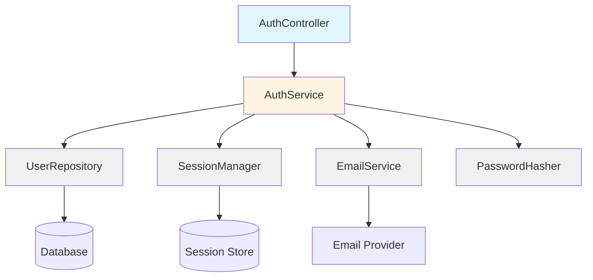

# Draft Section Skill - Examples

This document provides concrete examples of using the draft-section skill to write content for the Agentic Coding Book.

---

## Example 1: Draft Single Section File (Part 1 - Introduction)

### Invocation

**User**: "Draft book/part1-foundations/01-renaissance-developer/01-introduction.md"

### Process

1. **Read section file**:
   ```bash
   Read book/part1-foundations/01-renaissance-developer/01-introduction.md
   ```

2. **Extract placeholder guidance from file**:
   - Frontmatter shows: `section: 1`, `chapter_title: "The Renaissance Developer"`
   - Placeholder content: *"Hook the reader with a relatable scenario or problem. Establish why this topic matters for agentic coding. 3-5 paragraphs max - this is just the intro, detailed concepts come in later sections. Open with the traditional software career path - go deep in one area (backend, frontend, DevOps, etc.). Explain why this made sense when coding was the bottleneck. Then introduce the problem: when AI agents can handle implementation, what value does deep specialization in coding provide? Hook: 'You've spent years becoming an expert React developer. Now Claude can write React better than you. What's your role?'"*

3. **Apply Part 1 strategy**: First-principles teaching
   - Hook with relatable problem
   - Build understanding progressively
   - Accessible to vibecoders

4. **Draft content and write to file** (example output):

```markdown
---
title: "Introduction: The Specialist's Dilemma"
chapter_title: "The Renaissance Developer"
part: 1
chapter: 1
section: 1
version: "0.1"
date: "2026-01-28"
status: "draft"
author: "Brian Childress"
tags: ["renaissance-developer", "mindset", "foundations"]
related: []
requirements: ["REQ-C001"]
abstract: |
  Introduces the challenge facing specialized developers in the AI era and
  sets up the need for Renaissance Developer thinking.
---

You've spent five years becoming an expert React developer. You know the framework inside and out—hooks, context, performance optimization, the works. You can debug the gnarliest state management issues and architect scalable component hierarchies in your sleep. You're valuable because you're deep.

But something changed in 2024.

You ask Claude Code to "build a React component for user authentication with social login," and it generates production-ready code in 30 seconds. Code that would have taken you an hour. Code that's clean, well-structured, and follows best practices. Sometimes it's better than what you would have written.

So what's your role now?

This is the specialist's dilemma: **when AI agents can handle implementation, deep specialization in coding becomes less valuable**. The bottleneck in software development is shifting from "writing code" to "knowing what to build and why." The Renaissance Developer recognizes this shift and adapts accordingly.

### Why Specialization Made Sense

For the past two decades, the software industry rewarded depth. Companies needed backend experts who could optimize database queries, frontend specialists who mastered browser quirks, DevOps engineers who understood infrastructure at scale. This made perfect sense when:

- **Coding was the bottleneck**: Writing and debugging code consumed most project time
- **Tools were primitive**: No AI assistance, minimal automation, steep learning curves
- **Teams were siloed**: Backend, frontend, design, and product were separate departments
- **Time-to-market was measured in months or years**: Speed wasn't the primary competitive advantage

In that world, being a 10x engineer meant writing code 10x faster, knowing your domain 10x deeper, debugging 10x more efficiently. Specialization delivered real value.

But the world changed.

### The New Reality

Today, AI agents can:
- Generate boilerplate code instantly
- Implement APIs from specifications in minutes
- Write tests automatically
- Refactor codebases while maintaining behavior
- Translate designs into working UIs

What used to take a specialized engineer hours or days now takes minutes. **The bottleneck is no longer coding—it's knowing what to code**.

This creates a paradox for specialists: your expertise in *how to code* is increasingly commoditized, while your expertise in *what to build* becomes more valuable. But traditional specialization focused on the former, not the latter.

**The question isn't "can you write React better than Claude?"** (you probably can't, and that's fine). **The question is "can you decide what to build, architect the system, and validate that the AI-generated code actually solves the right problem?"**

This is where the Renaissance Developer emerges.
```

5. **Generate diagram** (if needed):
   - For this section, a diagram showing the shift from "coding as bottleneck" to "decisions as bottleneck" would be helpful
   - Invoke mermaid-diagrams skill

6. **Validate quality**:
   - ✓ Addresses placeholder guidance completely
   - ✓ Hooks reader with relatable scenario (React developer)
   - ✓ Establishes problem (AI commoditizes coding)
   - ✓ Builds to core question (what's your value?)
   - ✓ Accessible tone, no jargon
   - ✓ Flows to next section naturally

7. **Update file**: Replace placeholder with drafted content

### Output

```
✓ Drafted: book/part1-foundations/01-renaissance-developer.md - Introduction
  - Words: 425
  - Diagrams: 0 (could add bottleneck shift diagram)
  - Code examples: 0 (not needed for intro)
  - Cross-references: 0 (opening section)
  - Quality: Passed validation
  - Status: Ready for user review

Next section to draft: "The Renaissance Developer Model"
Proceed? (y/n)
```

---

## Example 2: Draft Multiple Sections (Part 2 - Workflow)

### Invocation

**User**: "Draft 'The Process' and 'Working with Claude Code' sections for book/part2-playbook/04-requirements-writing.md"

### Process

1. **Read scaffold** to identify both sections
2. **Apply Part 2 strategy**: Practical workflow
3. **Draft first section** - "The Process":

```markdown
## The Process

Writing requirements in EARS notation is a systematic process that transforms your product brief into testable, unambiguous specifications. This section walks through the step-by-step workflow.

### Step 1: Extract Features from Product Brief

Start with your product brief's "In-Scope" section. Each feature becomes a cluster of related requirements.

**What to do**:
- Review the brief's feature list
- Group related features (e.g., all authentication-related features)
- Identify distinct capabilities within each feature
- Create a requirements checklist per feature

**What good looks like**:
- Every in-scope feature has corresponding requirements
- Features are broken into testable capabilities
- No ambiguous or vague feature descriptions
- Clear boundaries between features

**Example**:
From brief.md feature "User Authentication":
- User registration with email verification
- Login with email/password
- Social login (Google, GitHub)
- Password reset flow
- Session management

This becomes 15-20 specific requirements in EARS notation.

### Step 2: Choose EARS Form for Each Requirement

EARS provides five forms. Select the right one for each requirement:

| Form | When to Use | Pattern |
|------|-------------|---------|
| **Ubiquitous** | Always active, core functionality | `The system shall [capability]` |
| **Event-driven** | Triggered by specific event | `WHEN [trigger] the system shall [response]` |
| **State-driven** | Active in specific state | `WHILE [state] the system shall [capability]` |
| **Optional** | Feature-flagged or configurable | `WHERE [condition] the system shall [capability]` |
| **Conditional** | If-then logic | `IF [condition] THEN [actor] shall [response]` |

**What to do**:
- Read the capability description
- Identify if it's always active, event-triggered, state-dependent, optional, or conditional
- Match to appropriate EARS form
- Write requirement in that form

**What good looks like**:
- EARS form accurately reflects requirement nature
- No forced fits (e.g., using WHEN for non-event requirements)
- Consistent form usage across similar requirements
- Easy to read and understand

### Step 3: Write Requirements in EARS Format

For each capability, write a precise, testable requirement:

**What to do**:
- Use the selected EARS form
- Be specific (no "user-friendly" or "fast")
- Make it testable (observable, measurable)
- Keep it atomic (one capability per requirement)
- Use consistent terminology

**What good looks like**:
- **Specific**: "The system shall validate email format per RFC 5322"
  - Not: "The system shall validate email addresses"
- **Testable**: "WHEN user submits invalid password THEN the system shall display error message within 200ms"
  - Not: "WHEN user submits invalid password THEN the system shall respond quickly"
- **Atomic**: Split "User shall log in and see dashboard" into two requirements
- **Consistent**: Use same terms throughout (e.g., "user" not "customer" in one req, "user" in another)

**Example Requirements**:

```
REQ-AUTH-001: The system shall validate email addresses per RFC 5322 format.

REQ-AUTH-002: WHEN user submits registration form with valid data
              THEN the system shall create account and send verification email within 5 seconds.

REQ-AUTH-003: WHEN user submits registration form with existing email
              THEN the system shall display "Email already registered" error message.

REQ-AUTH-004: WHILE user account is unverified
              THEN the system shall prevent login and display verification reminder.

REQ-AUTH-005: WHERE social login is enabled
              THEN the system shall provide "Login with Google" and "Login with GitHub" buttons.

REQ-AUTH-006: IF user enters incorrect password 5 times
              THEN the system shall lock account for 15 minutes.
```

### Step 4: Add Traceability

Link each requirement back to the product brief:

**What to do**:
- Add comment or metadata linking requirement to brief section
- Group requirements by feature from brief
- Create traceability matrix (optional)

**What good looks like**:
```
# User Authentication (brief.md Section 4.2)

REQ-AUTH-001: The system shall validate email addresses per RFC 5322 format.
  Traces to: brief.md - "Email/password authentication"

REQ-AUTH-002: WHEN user submits registration form with valid data
              THEN the system shall create account and send verification email within 5 seconds.
  Traces to: brief.md - "User registration with email verification"
```

### Step 5: Review for Completeness

Validate your requirements:

**What to do**:
- Check every brief feature has requirements
- Verify no ambiguous or untestable requirements
- Confirm EARS forms are used correctly
- Review with stakeholders

**What good looks like**:
- 100% feature coverage from brief
- All requirements testable
- No "TBD" or placeholder requirements
- Stakeholder sign-off on requirements
```

4. **Draft second section** - "Working with Claude Code":

```markdown
## Working with Claude Code

Claude Code can significantly accelerate requirements writing. Here's how to collaborate effectively.

### Best Prompts

Use these prompts to get high-quality EARS requirements:

**Extract requirements from brief**:
```
Read brief.md Section 4 (Key Features). For the "User Authentication"
feature, generate 15-20 requirements in EARS notation. Use appropriate
EARS forms (ubiquitous, event-driven, state-driven, optional, conditional).
Make each requirement specific, testable, and atomic.
```

**Convert existing requirements to EARS**:
```
I have these informal requirements:
- Users can sign up
- Users can log in
- Users can reset password if forgotten

Convert these to proper EARS notation, expanding into specific, testable
requirements. Add error cases and edge cases.
```

**Review requirements for quality**:
```
Review these EARS requirements and check:
1. Are they using the correct EARS form?
2. Are they specific and testable?
3. Are they atomic (one capability per requirement)?
4. Are there missing edge cases or error scenarios?

[paste requirements here]
```

**Generate test cases from requirements**:
```
For REQ-AUTH-002, generate test cases that verify this requirement.
Include happy path, error cases, and boundary conditions.
```

### Tips for Effective Collaboration

- **Start with examples**: Give Claude 2-3 good EARS requirements as examples before asking it to generate more
- **Be specific about context**: Provide the product brief section being translated
- **Request iteration**: Ask Claude to review and improve its own output
- **Validate traceability**: Check that Claude correctly links requirements to brief
- **Use Claude for edge cases**: Ask "What edge cases am I missing for this requirement?"
- **Refine language**: Have Claude tighten vague or ambiguous phrasing

### Common Pitfalls with AI-Generated Requirements

**Pitfall 1: Too generic**
- **Bad**: `The system shall handle errors gracefully`
- **Fix**: Ask Claude to specify which errors, what "gracefully" means, how to test

**Pitfall 2: Wrong EARS form**
- **Bad**: `WHEN user logs in the system shall allow access` (ubiquitous, not event)
- **Fix**: Review EARS forms with Claude, provide correction examples

**Pitfall 3: Not atomic**
- **Bad**: `The system shall authenticate users and log their sessions`
- **Fix**: Split into separate requirements for authentication and logging

**Pitfall 4: Not testable**
- **Bad**: `The system shall provide good user experience`
- **Fix**: Ask Claude to make it measurable (e.g., response time, error rates)

**How to avoid**: Review every AI-generated requirement against the EARS rules. Don't trust blindly—validate each one.
```

5. **Validate quality** for both sections
6. **Update file** with both sections

### Output

```
✓ Drafted: book/part2-playbook/04-requirements-writing.md - The Process
  - Words: 680
  - Diagrams: 0 (table used instead for EARS forms)
  - Code examples: 6 EARS requirements examples
  - Cross-references: 1 (to brief.md)
  - Quality: Passed validation

✓ Drafted: book/part2-playbook/04-requirements-writing.md - Working with Claude Code
  - Words: 520
  - Diagrams: 0
  - Code examples: 4 prompts, 4 pitfall examples
  - Cross-references: 0
  - Quality: Passed validation

Remaining sections in this chapter:
- Deliverables
- Example
- Common Questions
- Next Steps

Continue drafting? (y/n)
```

---

## Example 3: Draft with Diagram Generation (Part 3 - Pattern)

### Invocation

**User**: "Draft the 'The Solution' and 'Example' sections for book/part3-patterns-tools/architecture/component-decomposition.md. Include architecture diagrams."

### Process

1. **Read scaffold** and placeholder guidance
2. **Apply Part 3 strategy**: Pattern documentation
3. **Draft 'The Solution' section**:

```markdown
## The Solution

Component decomposition for agentic development follows a digestibility-first approach: organize code into components that fit comfortably within AI context windows while maintaining clear boundaries and responsibilities.

### How It Works

The key insight is that **AI agents work best with components that are:**
- **Self-contained**: Clear inputs, outputs, and dependencies
- **Right-sized**: 100-300 lines of code per file (fits in ~3-5k tokens)
- **Single-purpose**: One primary responsibility per component
- **Well-documented**: Interface contracts and behavior clearly specified

This isn't just good for AI—it's good for humans too. The same constraints that help AI agents understand code help developers reason about systems.

### Core Principles

**1. Optimize for Context Windows**

AI models have context limits (typically 200k tokens, but effective context is smaller). Keep components small enough to:
- Fit entire component in one prompt
- Include related components for context
- Leave room for instructions and output

**Rule of thumb**: 100-300 lines per file, 5-10 files per module

**2. Maximize Interface Clarity**

AI agents (and humans) understand systems through interfaces. Make them explicit:

```typescript
// Good: Clear interface with types and documentation
interface UserRepository {
  /**
   * Finds user by email address
   * @throws UserNotFoundError if no user with given email exists
   */
  findByEmail(email: string): Promise<User>

  /**
   * Creates new user account
   * @throws DuplicateEmailError if email already registered
   */
  create(userData: CreateUserInput): Promise<User>
}
```

```typescript
// Bad: Implicit interface, unclear contracts
class UserDB {
  async get(q) { /* ... */ }
  async save(u) { /* ... */ }
}
```

**3. Enforce Boundary Contracts**

Use language features to enforce component boundaries:
- **TypeScript interfaces** for API contracts
- **OpenAPI specs** for REST endpoints
- **AsyncAPI specs** for event contracts
- **JSON Schema** for data validation

These specifications serve dual purposes:
1. AI agents can implement to the spec
2. Automated validation ensures correctness

**4. Separate Concerns Explicitly**

Don't mix responsibilities within components. Split into:
- **Data access**: Database queries, external APIs
- **Business logic**: Domain rules, transformations
- **Presentation**: UI, formatting, serialization
- **Infrastructure**: Auth, logging, error handling

Each layer should be independently understandable and testable.

### Implementation Steps

**Step 1: Identify Bounded Contexts**

Map your system into distinct domains (à la Domain-Driven Design):
- Authentication
- User management
- Content management
- Notifications
- Billing

Each context becomes a top-level module.

**Step 2: Decompose Contexts into Components**

Within each context, identify components:
- **Repository**: Data access
- **Service**: Business logic
- **Controller**: API handlers
- **Model**: Data structures
- **Validator**: Input validation

**Step 3: Define Interfaces**

For each component, define:
- Public interface (what consumers see)
- Input/output types
- Error cases
- Side effects

**Step 4: Size Check**

Review component sizes:
- Any file > 300 lines? Split it
- Any file with multiple responsibilities? Separate concerns
- Any circular dependencies? Refactor

**Step 5: Document Contracts**

Add:
- Interface documentation (JSDoc, docstrings)
- OpenAPI specs for APIs
- README per module explaining purpose and usage
```

4. **Generate architecture diagram** using mermaid-diagrams skill:

```markdown
## Example

Let's apply component decomposition to a user authentication system.

### Before: Monolithic Auth Module

```typescript
// auth.ts (450 lines - too large, too many responsibilities)
class Auth {
  async login(email, password) {
    // 1. Validate input
    // 2. Query database
    // 3. Check password
    // 4. Create session
    // 5. Send analytics event
    // 6. Log activity
    // 7. Return token
  }

  async register(email, password, name) {
    // 1. Validate input
    // 2. Check if email exists
    // 3. Hash password
    // 4. Create user
    // 5. Send verification email
    // 6. Create session
    // 7. Send welcome email
    // 8. Log activity
  }

  async resetPassword(email) {
    // ... another 50 lines
  }

  // ... 10 more methods, 300+ more lines
}
```

**Problems**:
- 450 lines exceeds AI context comfort zone
- Multiple responsibilities mixed together
- Hard to test individual pieces
- Unclear what can be reused where

### After: Decomposed Components



*Figure 3.1: Decomposed authentication system. Each box is a separate component with clear responsibilities.*

**Component 1: AuthController** (80 lines)
```typescript
// auth.controller.ts - HTTP request handling only
export class AuthController {
  constructor(private authService: AuthService) {}

  async login(req: Request, res: Response) {
    try {
      const { email, password } = req.body
      const session = await this.authService.login(email, password)
      res.json({ token: session.token })
    } catch (error) {
      res.status(401).json({ error: error.message })
    }
  }
}
```

**Component 2: AuthService** (120 lines)
```typescript
// auth.service.ts - Business logic only
export class AuthService {
  constructor(
    private userRepo: UserRepository,
    private sessionMgr: SessionManager,
    private emailSvc: EmailService,
    private hasher: PasswordHasher
  ) {}

  async login(email: string, password: string): Promise<Session> {
    const user = await this.userRepo.findByEmail(email)
    if (!user) throw new AuthError('Invalid credentials')

    const valid = await this.hasher.verify(password, user.passwordHash)
    if (!valid) throw new AuthError('Invalid credentials')

    return await this.sessionMgr.create(user.id)
  }

  async register(input: RegisterInput): Promise<Session> {
    const existing = await this.userRepo.findByEmail(input.email)
    if (existing) throw new AuthError('Email already registered')

    const passwordHash = await this.hasher.hash(input.password)
    const user = await this.userRepo.create({
      email: input.email,
      name: input.name,
      passwordHash
    })

    await this.emailSvc.sendVerification(user.email)
    return await this.sessionMgr.create(user.id)
  }
}
```

**Component 3: UserRepository** (100 lines)
```typescript
// user.repository.ts - Data access only
export class UserRepository {
  constructor(private db: Database) {}

  async findByEmail(email: string): Promise<User | null> {
    const row = await this.db.query(
      'SELECT * FROM users WHERE email = $1',
      [email]
    )
    return row ? this.mapToUser(row) : null
  }

  async create(input: CreateUserInput): Promise<User> {
    const row = await this.db.query(
      'INSERT INTO users (email, name, password_hash) VALUES ($1, $2, $3) RETURNING *',
      [input.email, input.name, input.passwordHash]
    )
    return this.mapToUser(row)
  }
}
```

**Component 4: SessionManager** (90 lines)
**Component 5: EmailService** (110 lines)
**Component 6: PasswordHasher** (60 lines)

### Benefits of Decomposition

**For AI Agents**:
- ✅ Each component fits in prompt with room for instructions
- ✅ Clear interfaces make generation straightforward
- ✅ Easy to request changes ("modify UserRepository to add findById method")
- ✅ Components can be tested in isolation

**For Humans**:
- ✅ Easy to understand each piece
- ✅ Clear responsibilities, no surprises
- ✅ Simple to test and mock
- ✅ Refactoring is safer with small components

**For System**:
- ✅ Better testability (can mock dependencies)
- ✅ Better reusability (EmailService used elsewhere)
- ✅ Better maintainability (change one component, not all)
- ✅ Better scalability (can optimize hot components individually)

### What Changed

| Before | After |
|--------|-------|
| 1 file, 450 lines | 6 files, average 95 lines each |
| Everything in one class | Clear separation of concerns |
| Hard to test (mocking DB and email in one test) | Easy to test (mock dependencies) |
| Unclear what depends on what | Explicit dependencies via constructor |
| AI struggles with context size | AI handles each component easily |
```

5. **Validate quality** and update file

### Output

```
✓ Drafted: book/part3-patterns-tools/architecture/component-decomposition.md - The Solution
  - Words: 710
  - Diagrams: 0 (to be added in Example section)
  - Code examples: 2 (good vs bad interface)
  - Cross-references: 0
  - Quality: Passed validation

✓ Drafted: book/part3-patterns-tools/architecture/component-decomposition.md - Example
  - Words: 890
  - Diagrams: 1 (component architecture via mermaid-diagrams skill)
  - Code examples: 4 (before/after, 4 decomposed components)
  - Cross-references: 0
  - Quality: Passed validation

Diagram generated:
- Type: Component diagram (graph TD)
- Components: 9 (Controller, Service, Repositories, External services)
- Saved to: diagrams/part3/component-decomposition-auth.mmd

Continue to next section? (y/n)
```

---

## Example 4: Draft Remaining Sections (Batch Mode)

### Invocation

**User**: "Draft all remaining sections in book/part1-foundations/02-what-is-agentic-coding.md"

### Process

1. **Read scaffold** to identify incomplete sections
2. **Found remaining sections**:
   - Key Concepts (has placeholder)
   - Practical Application (has placeholder)
   - Common Pitfalls (has placeholder)
   - Summary (has placeholder)
   - Further Reading (has placeholder)

3. **Propose batch approach**:

```
Found 5 sections to draft. I'll draft them in this order:
1. Key Concepts (core content)
2. Practical Application (examples)
3. Common Pitfalls (warnings)
4. Summary (recap)
5. Further Reading (links)

I'll pause after sections 1-2 for your review before continuing to 3-5.

Proceed? (y/n)
```

4. **Draft first batch** (sections 1-2)
5. **Pause and report**:

```
✓ Drafted sections 1-2:

Section 1: Key Concepts
- Words: 780
- Diagrams: 1 (agentic coding landscape)
- Code examples: 0
- Defined: AI pair programming, autonomous agents, AI code review, NL→code, AI debugging

Section 2: Practical Application
- Words: 620
- Diagrams: 0
- Code examples: 3 (Claude Code prompts)
- Showed: Using Claude Code for feature implementation

Ready for your review. Continue to sections 3-5? (y/n)
```

6. **User reviews and approves**
7. **Draft second batch** (sections 3-5)
8. **Final report**:

```
✓ Drafted sections 3-5:

Section 3: Common Pitfalls
- Words: 540
- 4 pitfalls identified with solutions

Section 4: Summary
- Words: 120
- 5 key takeaways

Section 5: Further Reading
- Words: 80
- Cross-references: 3 (to Ch 1, Ch 3, Ch 5)
- External: 2 resources

✅ Chapter complete: book/part1-foundations/02-what-is-agentic-coding.md
Total words: ~2,400
Total diagrams: 1
Total code examples: 3
Status: Ready for final review and polish
```

---

## Example 5: Iterative Refinement

### Invocation

**User**: "The 'Example' section in book/part2-playbook/03-brainstorm-to-brief.md is too abstract. Rewrite it with a concrete walkthrough using actual content from planning/brainstorm.md and planning/brief.md"

### Process

1. **Read current content** to understand what needs improvement
2. **Read source files**:
   - `/home/testa/agentic-coding-book/planning/brainstorm.md`
   - `/home/testa/agentic-coding-book/planning/brief.md`

3. **Identify concrete examples** from actual project
4. **Rewrite section** with specific content:

```markdown
## Example: Agentic Coding Book Brief

Let's walk through how this book's product brief was created from brainstorming.

### Starting Point: Brainstorm Insights

From `planning/brainstorm.md`, key insights:

**Target Audience Question**:
> Q: Who is this book for?
> A: Two extremes - "vibecoders" (people who can barely code but want to ship) and CTOs (experienced leaders who need to understand the strategic shift). The book must be accessible to beginners yet valuable to experts.

**Scope Question**:
> Q: Should this cover specific tools or be tool-agnostic?
> A: Focus on Claude Code as the primary tool (what we know best), but make principles transferable. We're opinionated about workflows, not dogmatic about tools.

**Format Question**:
> Q: Digital only or also print?
> A: Start with free digital (GitHub Pages + PDF), consider print-on-demand if successful. Optimize for web first.

### Transformation to Brief

These insights became structured sections in `planning/brief.md`:

**Vision** (from brainstorm's "why this matters"):
```
To transform how software products are built by teaching developers to leverage
AI as a force multiplier, enabling solo developers and small teams to ship
products previously requiring large engineering organizations.
```

**Target Users** (from audience question):
```
1. Vibecoders: People with product ideas and minimal coding skills who want to
   ship complete products using AI assistance

2. CTOs and Engineering Leaders: Experienced technologists who need to understand
   and lead the shift to agentic development workflows
```

**In-Scope** (from scope and format questions):
```
1. Complete 6-week workflow from idea to production
2. Claude Code-specific guidance and best practices
3. First principles of agentic coding architecture
4. Concrete patterns and reusable tools
5. Complete example: building a real product
6. Free digital distribution (web + PDF)
```

**Out-of-Scope** (from constraints discussion):
```
1. Deep dives into other AI coding tools (mention, but not main focus)
2. AI/ML fundamentals or model training (we're users, not builders)
3. Physical book optimization (optimize for web/PDF first)
4. Certification or formal curriculum (it's a practitioner's guide, not a course)
```

### What Changed from Brainstorm to Brief

**Brainstorm** was exploratory:
- 47 questions asked and answered
- Multiple approaches considered
- Tradeoffs discussed
- Uncertainties captured

**Brief** was decisive:
- Clear vision statement (1 paragraph)
- Specific target users (2 personas)
- Concrete scope boundaries (5 in-scope, 4 out-of-scope)
- Success metrics defined (engagement, GitHub stars, time-to-MVP)

The brainstorm gave us the raw material. The brief gave us the filter and focus.

### Lessons from This Process

**Lesson 1: Don't skip brainstorming**
We initially tried to write the brief directly. It was vague and unfocused. The brainstorm forced us to think through edge cases and tradeoffs.

**Lesson 2: Brainstorm != Brief**
The brainstorm had 47 Q&A pairs (5000 words). The brief had 1500 words. Condensing forced prioritization.

**Lesson 3: Use Claude to synthesize**
We used Claude Code to help condense brainstorm insights into brief sections:

```
Read planning/brainstorm.md Section 2 (Target Audience discussion).
Synthesize into a "Target Users" section for the product brief.
Format: 2-3 user personas with specific characteristics and needs.
```

Claude drafted the personas, we refined them. 10 minutes instead of 2 hours.

**Lesson 4: The brief is a commitment**
Once written, the brief guided all downstream decisions. Requirements, design, and implementation all traced back to it. A good brief makes everything else easier.
```

5. **Replace existing content** with improved version
6. **Validate** against requirements

### Output

```
✓ Refined: book/part2-playbook/03-brainstorm-to-brief.md - Example
  - Changes: Replaced abstract example with concrete walkthrough
  - Added: Actual content from planning/brainstorm.md and planning/brief.md
  - Words: 720 (was 320)
  - Code examples: 1 (Claude Code prompt)
  - Cross-references: 2 (to actual planning files)
  - Quality: Much improved - concrete and actionable

Status: Section rewritten and ready for review
```

---

## Example 6: Draft with Code Formatting (Part 3)

### Invocation

**User**: "Draft the 'Example' section for book/part3-patterns-tools/specifications/json-schema-validation.md. Include code examples with proper formatting (≤80 chars wide)."

### Draft Output

```markdown
## Example

Let's create JSON Schema validation for a user registration API.

### The Requirement

```
REQ-API-001: WHEN user submits registration data
              THEN system shall validate email format, password strength,
              and required fields before account creation
```

### Schema Design

**Input Schema** (`schemas/register-user-input.json`):

```json
{
  "$schema": "http://json-schema.org/draft-07/schema#",
  "type": "object",
  "required": ["email", "password", "name"],
  "properties": {
    "email": {
      "type": "string",
      "format": "email",
      "description": "User email address for account"
    },
    "password": {
      "type": "string",
      "minLength": 12,
      "maxLength": 128,
      "pattern": "^(?=.*[a-z])(?=.*[A-Z])(?=.*\\d).*$",
      "description": "Password (12-128 chars, mixed case + digit)"
    },
    "name": {
      "type": "string",
      "minLength": 1,
      "maxLength": 100,
      "description": "User display name"
    },
    "phoneNumber": {
      "type": "string",
      "pattern": "^\\+?[1-9]\\d{1,14}$",
      "description": "Optional phone (E.164 format)"
    }
  },
  "additionalProperties": false
}
```

**Output Schema** (`schemas/user-response.json`):

```json
{
  "$schema": "http://json-schema.org/draft-07/schema#",
  "type": "object",
  "required": ["id", "email", "name", "createdAt"],
  "properties": {
    "id": {
      "type": "string",
      "format": "uuid",
      "description": "Unique user identifier"
    },
    "email": {
      "type": "string",
      "format": "email"
    },
    "name": {
      "type": "string"
    },
    "phoneNumber": {
      "type": "string"
    },
    "createdAt": {
      "type": "string",
      "format": "date-time",
      "description": "Account creation timestamp (ISO 8601)"
    }
  },
  "additionalProperties": false
}
```

### Implementation (TypeScript)

```typescript
import Ajv from 'ajv'
import addFormats from 'ajv-formats'

// Initialize validator with format support
const ajv = new Ajv({ allErrors: true })
addFormats(ajv)

// Load schemas
const inputSchema = require('./schemas/register-user-input.json')
const outputSchema = require('./schemas/user-response.json')

// Compile validators (do once, reuse many times)
const validateInput = ajv.compile(inputSchema)
const validateOutput = ajv.compile(outputSchema)

// Validation middleware for Express
export function validateRegistrationInput(
  req: Request,
  res: Response,
  next: NextFunction
) {
  const valid = validateInput(req.body)

  if (!valid) {
    // Format errors for user-friendly response
    const errors = validateInput.errors!.map(err => ({
      field: err.instancePath.slice(1), // Remove leading '/'
      message: err.message,
      value: err.data
    }))

    return res.status(400).json({
      error: 'Validation failed',
      details: errors
    })
  }

  next() // Validation passed, continue to handler
}

// Usage in route
router.post('/register',
  validateRegistrationInput,  // Schema validation first
  async (req, res) => {
    // By this point, we know req.body is valid
    const user = await createUser(req.body)

    // Validate response before sending (paranoid mode)
    const valid = validateOutput(user)
    if (!valid) {
      console.error('Invalid response:', validateOutput.errors)
      return res.status(500).json({ error: 'Server error' })
    }

    res.status(201).json(user)
  }
)
```

*Listing 3.4: JSON Schema validation in Express API*

### Test Cases

```typescript
import { validateRegistrationInput } from './validators'

describe('Registration Input Validation', () => {
  test('accepts valid input', () => {
    const valid = validateInput({
      email: 'user@example.com',
      password: 'SecurePass123',
      name: 'John Doe'
    })
    expect(valid).toBe(true)
  })

  test('rejects invalid email', () => {
    const valid = validateInput({
      email: 'not-an-email',  // Invalid format
      password: 'SecurePass123',
      name: 'John Doe'
    })
    expect(valid).toBe(false)
    expect(validateInput.errors).toContainEqual(
      expect.objectContaining({
        instancePath: '/email',
        keyword: 'format'
      })
    )
  })

  test('rejects weak password', () => {
    const valid = validateInput({
      email: 'user@example.com',
      password: 'weak',  // Too short, no uppercase/digit
      name: 'John Doe'
    })
    expect(valid).toBe(false)
  })

  test('allows optional phone number', () => {
    const valid = validateInput({
      email: 'user@example.com',
      password: 'SecurePass123',
      name: 'John Doe'
      // phoneNumber omitted - that's ok, it's optional
    })
    expect(valid).toBe(true)
  })

  test('rejects extra properties', () => {
    const valid = validateInput({
      email: 'user@example.com',
      password: 'SecurePass123',
      name: 'John Doe',
      favoriteColor: 'blue'  // Not allowed
    })
    expect(valid).toBe(false)
  })
})
```

*Listing 3.5: Test cases validating JSON Schema enforcement*

### Benefits Demonstrated

**Type Safety**: Schema enforces structure without TypeScript
**Self-Documenting**: Schema describes valid input/output
**Reusable**: Same schema for validation, docs, testing
**AI-Friendly**: Clear contract for AI agents to implement

### How This Helps AI Agents

When you give Claude Code the schema:

```
Implement user registration API matching this schema:
[include register-user-input.json]

Handle these validation errors:
- Invalid email format
- Weak password (< 12 chars, missing uppercase/digit)
- Missing required fields
```

Claude generates code that:
1. Uses the schema for validation
2. Handles specified error cases
3. Returns responses matching output schema
4. Includes tests verifying schema compliance

The schema acts as a precise specification Claude can implement.
```

### Quality Check

- ✅ Code formatted ≤80 chars wide
- ✅ JSON examples valid and properly indented
- ✅ TypeScript examples syntactically correct
- ✅ Descriptive comments included
- ✅ Test cases demonstrate schema usage
- ✅ Connects to "How This Helps AI Agents"

---

## Tips for Using This Skill

1. **Draft incrementally** - one or two sections, review, then continue
2. **Let placeholders guide you** - they tell you exactly what to write
3. **Match the part strategy** - teaching vs workflow vs pattern vs narrative
4. **Use diagrams sparingly** - only when they enhance understanding
5. **Show, don't tell** - concrete examples over abstract explanations
6. **Cross-reference generously** - connect concepts across chapters
7. **Format for print** - 80-char code width, readable paragraphs
8. **Review before proceeding** - catch issues early before compounding

---

## Common Patterns

### Pattern 1: Draft → Review → Refine → Continue

```
1. Draft 1-2 sections
2. User reviews
3. Refine if needed
4. Continue to next sections
```

### Pattern 2: Batch Section Drafting

```
1. Identify remaining sections
2. Group by logical clusters
3. Draft cluster 1, pause for review
4. Draft cluster 2, pause for review
5. Continue until complete
```

### Pattern 3: Diagram-First Drafting

```
1. Generate diagram for section
2. Write content that explains diagram
3. Reference diagram in text
4. Validate diagram enhances understanding
```

---

For more details on the skill workflow, see [SKILL.md](SKILL.md).
