# Mermaid Diagram Examples

## Flowchart: User Authentication Flow

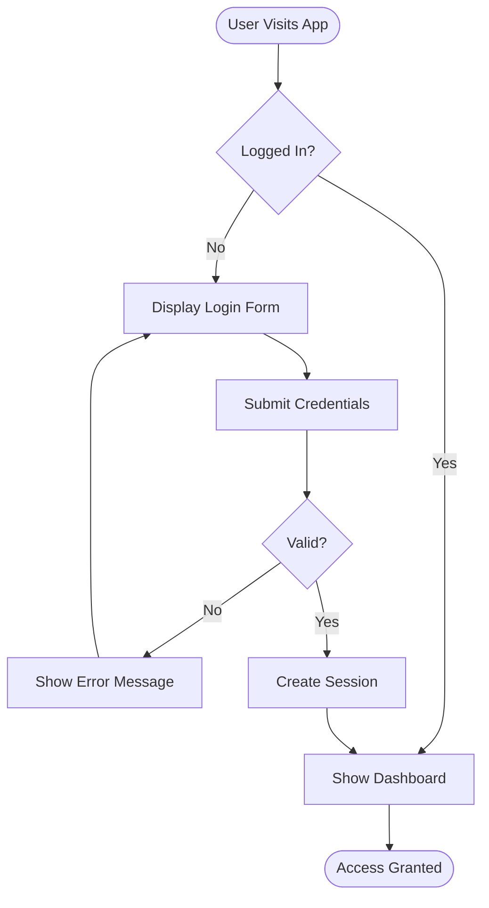

## Flowchart: Order Processing System

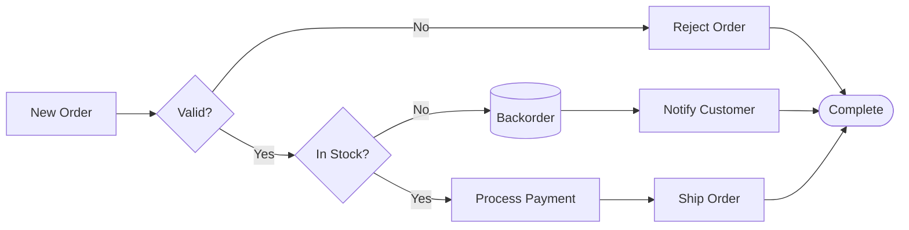

## Sequence Diagram: Payment Processing

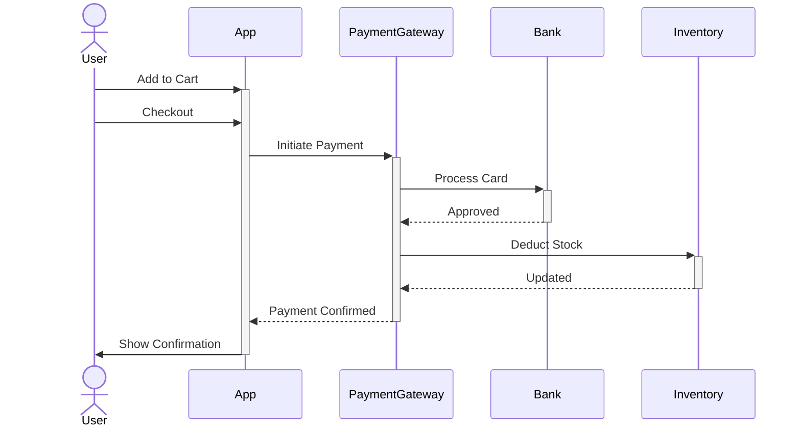

## Sequence Diagram: API Request Flow

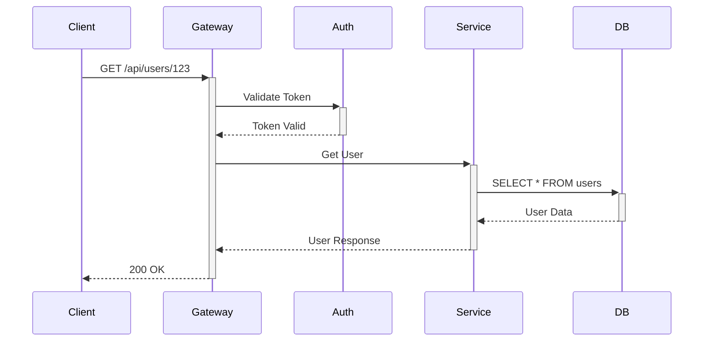

## Class Diagram: E-commerce System

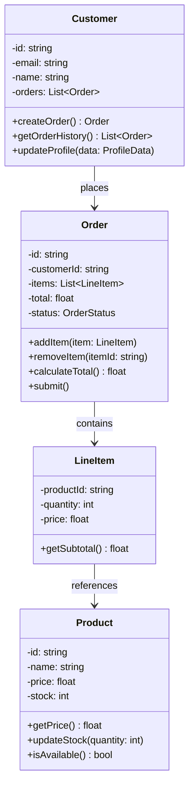

## Class Diagram: Inheritance Example

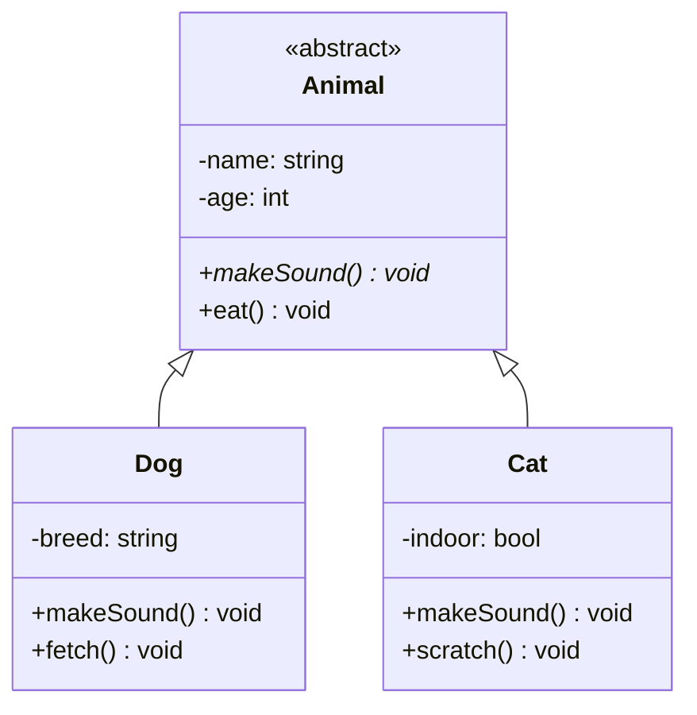

## Entity Relationship Diagram: E-commerce Database

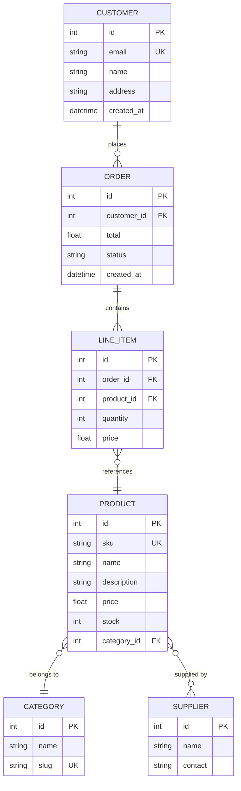

## State Diagram: Order Lifecycle

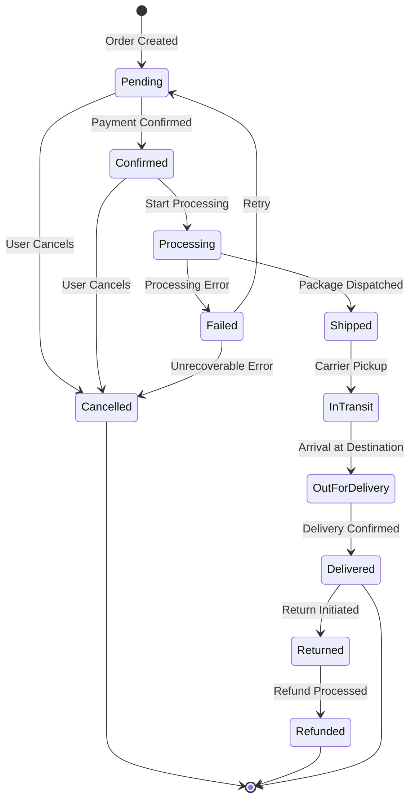

## State Diagram: User Session

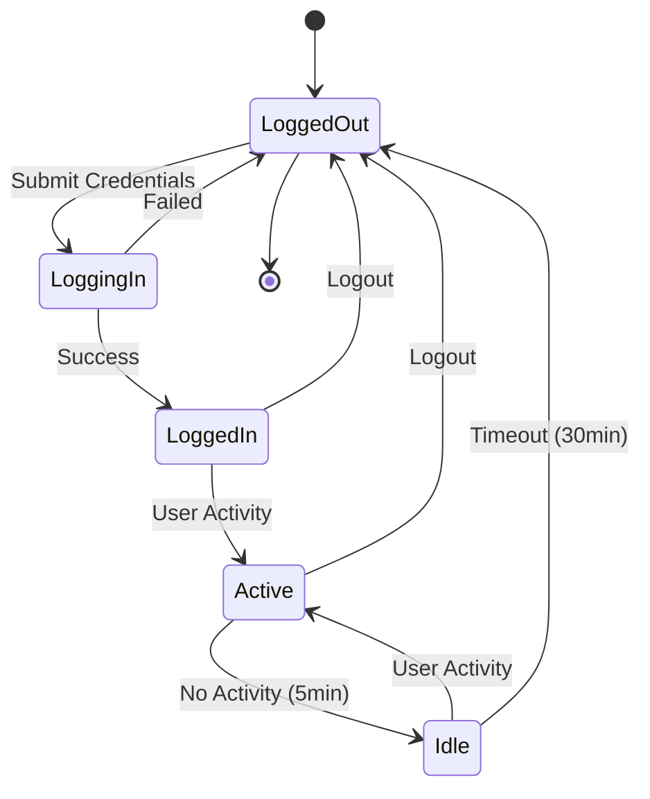

## Gantt Chart: Software Project Timeline

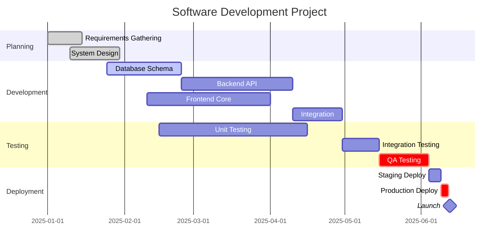

## Gantt Chart: Sprint Planning

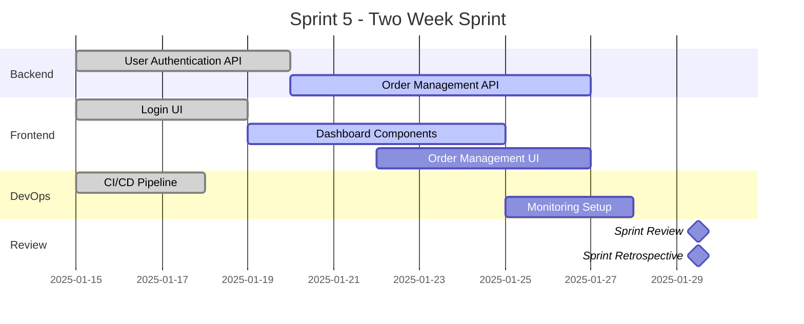

## Pie Chart: System Resource Usage

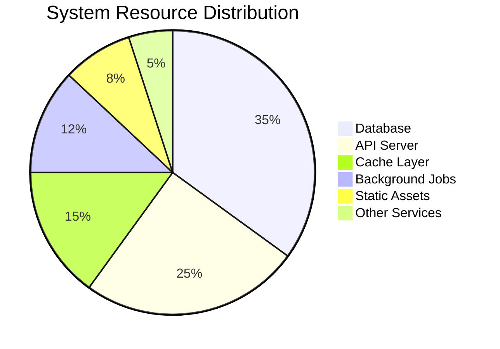

## Component Diagram: Microservices Architecture

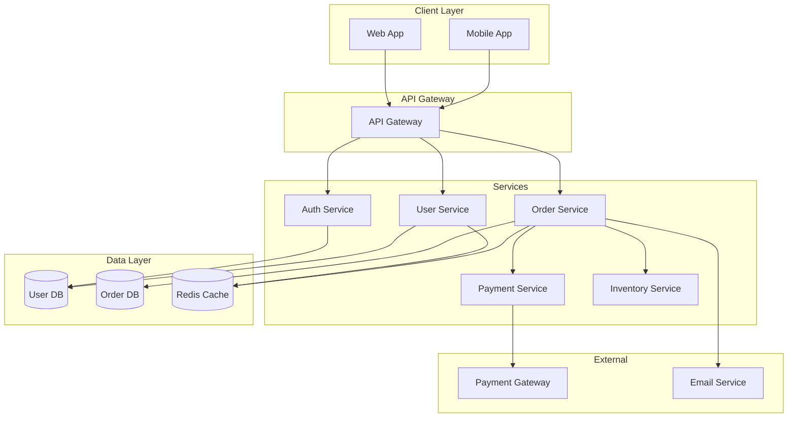

## User Journey: Online Shopping

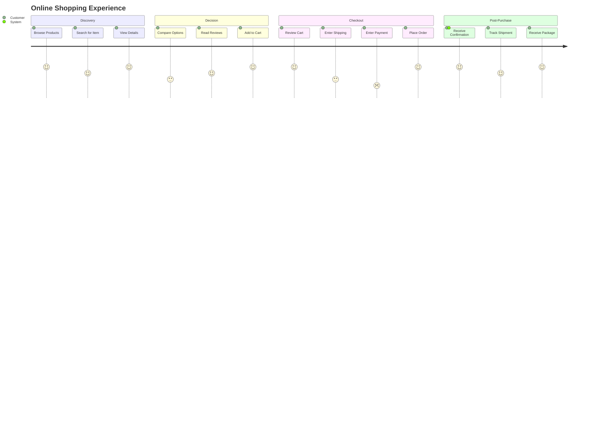

## Git Workflow

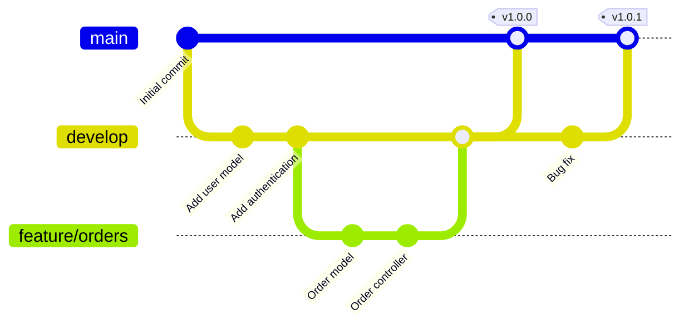

## Network Diagram: System Architecture

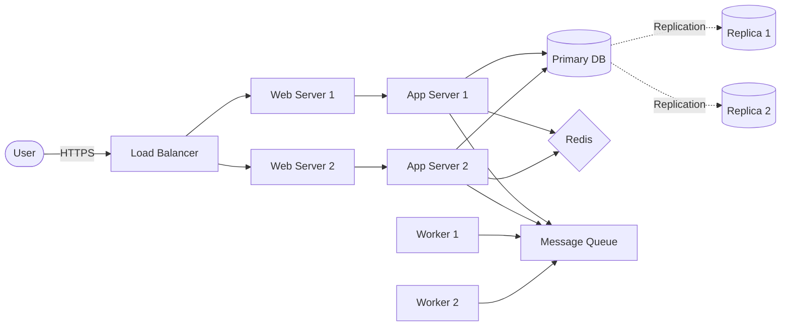
