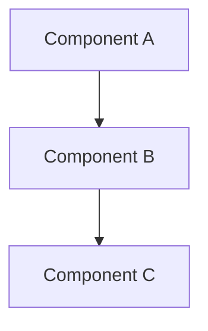

# Scaffold Chapter Skill - Examples

This document provides concrete examples of using the scaffold-chapter skill for the Agentic Coding Book project.

---

## Example 1: Single Chapter Scaffold (Part 1) - CUSTOMIZED

### Invocation

**User**: "Use the scaffold-chapter skill to create book/part1-foundations/01-renaissance-developer.md"

### Process

1. **Read context files**:
   - `/home/testa/agentic-coding-book/planning/design.md` (Section 3.1)
   - `/home/testa/agentic-coding-book/planning/brief.md`
   - `/home/testa/agentic-coding-book/planning/requirements.md`

2. **Parse file path**:
   - Path: `book/part1-foundations/01-renaissance-developer.md`
   - Part: 1 (from `part1-foundations`)
   - Chapter: 1 (from `01-`)
   - Title: "The Renaissance Developer" (from `renaissance-developer`)

3. **Generate frontmatter**:
   - Tags: `["renaissance-developer", "mindset", "foundations"]`
   - Related: `["part1-foundations/02-what-is-agentic-coding.md", "part2-playbook/01-idea-to-vision.md"]`
   - Requirements: `["REQ-C001", "REQ-C002"]` (Renaissance Developer concept)

4. **Select template**: Part 1 (First Principles Teaching)

5. **Customize for chapter topic**: This is a mindset/concept chapter, so:
   - Replace generic "Key Concepts" subsections with actual Renaissance Developer concepts
   - Add specific section for "The Five Competency Domains"
   - Include "What Changes, What Doesn't" comparison section
   - Make practical example about building a feature independently
   - Customize pitfalls to address common mindset traps

### Output (Customized)

```markdown
---
title: "The Renaissance Developer"
part: 1
chapter: 1
version: "0.1"
date: "2025-12-24"
status: "draft"
author: "Author Name"
tags: ["renaissance-developer", "mindset", "foundations"]
related:
  - part1-foundations/02-what-is-agentic-coding.md
  - part2-playbook/01-idea-to-vision.md
requirements:
  - REQ-C001
  - REQ-C002
abstract: |
  [Placeholder: Introduces the Renaissance Developer concept - the shift from deep
  specialization to broad competency across product, design, architecture, and business,
  enabled by AI agents handling implementation details.]
---

## Introduction: The Specialist's Dilemma

[Placeholder: Open with the traditional software career path - go deep in one area
(backend, frontend, DevOps, etc.). Explain why this made sense when coding was the bottleneck.
Then introduce the problem: when AI agents can handle implementation, what value does
deep specialization in coding provide? Hook: "You've spent years becoming an expert
React developer. Now Claude can write React better than you. What's your role?"]

## The Renaissance Developer Model

[Placeholder: Define the core concept - a polymath who is "good enough at everything"
to ship complete products. Not a 10x engineer, but a 1x product builder. Explain the
difference between depth (expert-level coding) vs breadth (product thinking + design +
architecture + business + technical literacy). Use the historical Renaissance person
analogy - Leonardo da Vinci wasn't the best painter OR sculptor OR engineer, but could
do all three well enough to create masterpieces.]

### From Code Executor to Product Orchestrator

[Placeholder: Explain the mindset shift - you're no longer writing most code yourself,
you're orchestrating AI agents to implement your vision. Your value is in the thinking:
What should we build? How should it work? Why these tradeoffs? Your job is product
strategy, architectural decisions, and quality judgment, not implementation.]

### The Five Competency Domains

[Placeholder: Break down the skill areas Renaissance Developers need. Not mastery,
but "good enough" literacy:]

#### 1. Product Thinking

[Placeholder: Understanding user needs, defining MVPs, prioritization frameworks,
knowing what to build and what to cut. You don't need an MBA, but you need to think
like a founder.]

#### 2. Systems Architecture

[Placeholder: High-level system design, component boundaries, data flow, API contracts.
You don't need to optimize algorithms, but you need to know when to use a queue vs
a cron job vs real-time websockets.]

#### 3. Design Sensibility

[Placeholder: UI/UX fundamentals, information architecture, understanding what makes
interfaces intuitive. You don't need to be a designer, but you need to recognize good
UX and communicate clearly with AI about what you want.]

#### 4. Technical Literacy

[Placeholder: Enough coding knowledge to read/review/debug AI-generated code, understand
technical tradeoffs, and guide AI agents effectively. You don't need to memorize APIs,
but you need to know what's possible and what's a bad idea.]

#### 5. Strategic Judgment

[Placeholder: When to ship vs iterate, technical debt tradeoffs, security/performance
considerations, knowing what "good enough" means for your context. This comes from
experience, not from AI.]

## What Changes, What Doesn't

[Placeholder: Create a comparison showing what AI handles vs what you still own.
Include specific examples like: AI writes boilerplate, you decide architecture; AI
implements specs, you write specs; AI suggests solutions, you make tradeoff decisions.]

## The "Good Enough at Everything" Principle

[Placeholder: Explain this isn't about being mediocre - it's about optimal allocation
of learning effort. Depth in coding has diminishing returns when AI handles implementation.
Breadth across domains has compounding returns because it enables independent product
shipping. Use concrete example: knowing 80% of React + 80% of design + 80% of system
architecture is more valuable than knowing 100% of React when you have AI agents.]

## Practical Example: Building a Feature Alone

[Placeholder: Walk through a concrete scenario - "Add user authentication to an app."
Compare Traditional Specialist Approach (5 people, 5 days) vs Renaissance Developer
with AI (1 person, 1 day). Show the difference isn't just speed - it's agency and ownership.]

## Common Pitfalls

[Placeholder: Address specific mistakes people make when transitioning:]

- **Pitfall 1: Trying to be an expert at everything**: You don't need mastery, you need
  literacy. Depth takes years; breadth takes weeks of focused learning per domain.

- **Pitfall 2: Abandoning technical skills entirely**: "Good enough" technical literacy
  is still essential. You can't orchestrate what you don't understand at a basic level.

- **Pitfall 3: Feeling like an impostor**: "I'm not a real designer/architect/PM" -
  correct, and that's the point. You're a builder who knows enough of each discipline
  to ship products.

- **Pitfall 4: Trusting AI blindly**: Renaissance Developers need judgment to validate
  AI output. "Move fast" doesn't mean "ship without review."

## Summary

[Placeholder: Key takeaways]

- The Renaissance Developer is a polymath who is "good enough at everything" to ship
  complete products independently, orchestrating AI agents for implementation
- Core competencies: Product thinking, systems architecture, design sensibility,
  technical literacy, strategic judgment
- Value shifts from coding mastery to product vision, architectural decisions, and
  quality validation
- This is enabled by AI handling implementation, modern tooling, and markets rewarding speed

## Further Reading

[Placeholder: Related chapters and external resources]

- [Chapter 2: What is Agentic Coding?](./02-what-is-agentic-coding.md)
- [Chapter 5: The New Bottlenecks](./05-new-bottlenecks.md)
- External: "Range: Why Generalists Triumph in a Specialized World" by David Epstein
```

### Confirmation

```
✓ Scaffolded: book/part1-foundations/01-renaissance-developer.md
  - Part: 1, Chapter: 1
  - Title: "The Renaissance Developer"
  - Tags: ["renaissance-developer", "mindset", "foundations"]
  - Section template: Part 1 (First Principles Teaching) - CUSTOMIZED
  - Customizations: Specific section names, targeted placeholders, comparison sections
  - Status: Ready for content drafting
```

---

## Example 1b: Generic vs Customized Comparison

**❌ BAD (Generic Template - Don't do this)**:

```markdown
### [Concept 1 Name]

[Placeholder: Explanation, definition, importance]

### [Concept 2 Name]

[Placeholder: Explanation, definition, importance]
```

This is lazy scaffolding. The section names tell you nothing, and the placeholder guidance is generic and unhelpful.

**✅ GOOD (Customized for Chapter - Do this)**:

```markdown
### From Code Executor to Product Orchestrator

[Placeholder: Explain the mindset shift - you're no longer writing most code yourself,
you're orchestrating AI agents to implement your vision. Your value is in the thinking:
What should we build? How should it work? Why these tradeoffs? Your job is product
strategy, architectural decisions, and quality judgment, not implementation.]

### The Five Competency Domains

[Placeholder: Break down the skill areas Renaissance Developers need. Not mastery,
but "good enough" literacy:]

#### 1. Product Thinking
#### 2. Systems Architecture
#### 3. Design Sensibility
#### 4. Technical Literacy
#### 5. Strategic Judgment
```

This is thoughtful scaffolding. The section names are specific and meaningful. The placeholder guidance gives clear direction about what content belongs here. The structure reflects the actual chapter topic.

**Key Differences**:
- Generic uses `[Concept 1 Name]` → Customized uses actual concept name
- Generic says "explain the concept" → Customized explains *which* concept and *how* to explain it
- Generic is one-size-fits-all → Customized reflects chapter-specific content needs

---

## Example 2: Single Chapter Scaffold (Part 2 - Playbook)

### Invocation

**User**: "Scaffold book/part2-playbook/03-brainstorm-to-brief.md"

### Output

```markdown
---
title: "From Brainstorm to Product Brief"
part: 2
chapter: 3
version: "0.1"
date: "2025-12-24"
status: "draft"
author: "Author Name"
tags: ["playbook", "workflow", "product-brief", "brainstorming"]
related:
  - part2-playbook/02-understanding-phase.md
  - part2-playbook/04-requirements-writing.md
  - part1-foundations/05-new-bottlenecks.md
requirements:
  - REQ-C008
  - REQ-C009
abstract: |
  [Placeholder: 2-3 sentence summary of this chapter's content
  for search and navigation purposes. To be written during drafting.]
---

## Overview

[Placeholder: What is this workflow step? Where does it fit in the 6-week journey?]

## Prerequisites

[Placeholder: What must be completed before this step?]

- [Prerequisite 1]
- [Prerequisite 2]

## The Process

[Placeholder: Step-by-step workflow for this phase]

### Step 1: [Action Name]

[Placeholder: Detailed explanation of this step]

**What to do**:
- [Action item 1]
- [Action item 2]

**What good looks like**:
- [Success criterion 1]
- [Success criterion 2]

### Step 2: [Action Name]

[Placeholder: Continue for each step in the workflow]

## Working with Claude Code

[Placeholder: How to use AI agents effectively for this workflow step]

**Best prompts**:
```
[Example prompt 1]
```

```
[Example prompt 2]
```

**Tips**:
- [Tip 1 for effective AI collaboration]
- [Tip 2 for effective AI collaboration]

## Deliverables

[Placeholder: What artifacts are produced in this step?]

- [Deliverable 1] - [Description]
- [Deliverable 2] - [Description]

## Example

[Placeholder: Complete walkthrough of this workflow step for a sample project]

## Common Questions

[Placeholder: FAQ for this workflow step]

**Q: [Question 1]**
A: [Answer 1]

**Q: [Question 2]**
A: [Answer 2]

## Next Steps

[Placeholder: What comes after this workflow step?]

See [Next Chapter Name](./next-chapter.md) for the next phase.
```

---

## Example 3: Single Chapter Scaffold (Part 3 - Pattern)

### Invocation

**User**: "Scaffold book/part3-patterns-tools/specifications/ears-notation.md"

### Output

```markdown
---
title: "EARS Notation for Requirements"
part: 3
chapter: 1
version: "0.1"
date: "2025-12-24"
status: "draft"
author: "Author Name"
tags: ["patterns", "specifications", "ears", "requirements", "reference"]
related:
  - part2-playbook/04-requirements-writing.md
  - part3-patterns-tools/specifications/openapi-spec.md
  - part3-patterns-tools/specifications/json-schema.md
requirements:
  - REQ-C015
  - REQ-C016
  - REQ-C022
abstract: |
  [Placeholder: 2-3 sentence summary of this chapter's content
  for search and navigation purposes. To be written during drafting.]
---

## Overview

[Placeholder: One-paragraph summary of this pattern/tool]

**Pattern Category**: Specification

## The Problem

[Placeholder: What problem does this pattern solve?
When do you encounter this issue in agentic coding?]

### Symptoms

[Placeholder: How do you know you need this pattern?]

- [Symptom 1]
- [Symptom 2]
- [Symptom 3]

## The Solution

[Placeholder: Detailed explanation of the pattern/tool]

### How It Works

[Placeholder: Mechanics and principles]

### Implementation

[Placeholder: Step-by-step guide to implementing this pattern]

**Step 1**: [Action]
**Step 2**: [Action]
**Step 3**: [Action]

## Example

[Placeholder: Concrete example with code/diagrams]

```markdown
[Code example demonstrating the pattern]
```

[Placeholder: Mermaid diagram showing the pattern visually]



*Figure X.X: [Diagram description]*

## When to Use

[Placeholder: Situations where this pattern is appropriate]

**Use this pattern when**:
- [Scenario 1]
- [Scenario 2]
- [Scenario 3]

## When NOT to Use

[Placeholder: Situations where this pattern is inappropriate or overkill]

**Avoid this pattern when**:
- [Scenario 1]
- [Scenario 2]
- [Scenario 3]

## Related Patterns

[Placeholder: Cross-references to complementary or alternative patterns]

- **[Pattern Name 1]**: [Relationship]
- **[Pattern Name 2]**: [Relationship]
- **[Pattern Name 3]**: [Relationship]

## Checklist

[Placeholder: Quick reference for implementing this pattern]

- [ ] [Implementation step 1]
- [ ] [Implementation step 2]
- [ ] [Implementation step 3]
- [ ] [Validation step 1]
- [ ] [Validation step 2]

## Further Reading

[Placeholder: External resources, official docs, related chapters]

- [Resource 1]
- [Resource 2]
```

---

## Example 4: Single Chapter Scaffold (Part 4 - Example)

### Invocation

**User**: "Scaffold book/part4-example/05-implementing-mvp.md"

### Output

```markdown
---
title: "Implementing the MVP"
part: 4
chapter: 5
version: "0.1"
date: "2025-12-24"
status: "draft"
author: "Author Name"
tags: ["example", "narrative", "implementation", "mvp", "walkthrough"]
related:
  - part2-playbook/06-implementation-planning.md
  - part2-playbook/07-testing-strategy.md
  - part4-example/04-design-decisions.md
  - part4-example/06-iteration-one.md
requirements:
  - REQ-C027
  - REQ-C028
  - REQ-C029
abstract: |
  [Placeholder: 2-3 sentence summary of this chapter's content
  for search and navigation purposes. To be written during drafting.]
---

## Where We Are

[Placeholder: Summary of project state at this point in the example]

**Timeline**: Week 3, Day 15 of the 6-week journey

**Completed**:
- [Completed milestone 1]
- [Completed milestone 2]

**Next up**:
- [Next goal]

## The Challenge

[Placeholder: What challenge or task is being tackled in this chapter?]

## The Approach

[Placeholder: How we tackle this challenge using the playbook patterns]

### Planning

[Placeholder: Thinking through the approach]

### Execution

[Placeholder: Step-by-step execution with Claude Code]

**Prompt to Claude**:
```
[Actual prompt used]
```

**Claude's response**:
[Summary of what Claude generated/suggested]

**Iteration**:
[How we refined Claude's output]

### Validation

[Placeholder: How we validated the result]

## Code Highlights

[Placeholder: Show key code snippets with explanation]

```javascript
[Meaningful code example from this phase]
```

*Listing 5.1: [Code description]*

## Lessons Learned

[Placeholder: What insights emerged from this phase?]

- **Lesson 1**: [Insight and why it matters]
- **Lesson 2**: [Insight and why it matters]
- **Lesson 3**: [Insight and why it matters]

## What's Next

[Placeholder: Tease the next chapter's challenge]

In the next chapter, we'll tackle [next challenge]...
```

---

## Example 5: Batch Scaffold (Part 1 - All Chapters)

### Invocation

**User**: "Scaffold all Part 1 chapters:
- book/part1-foundations/01-renaissance-developer.md
- book/part1-foundations/02-what-is-agentic-coding.md
- book/part1-foundations/03-architecture-principles.md
- book/part1-foundations/04-digestible-interfaces.md
- book/part1-foundations/05-new-bottlenecks.md"

### Process

The skill processes all 5 chapters sequentially, using shared context from design.md, brief.md, and requirements.md.

### Output

```
Reading context files...
✓ Read design.md (Section 3.1)
✓ Read brief.md
✓ Read requirements.md

Scaffolding Part 1 chapters...

✓ Scaffolded: book/part1-foundations/01-renaissance-developer.md
  - Part: 1, Chapter: 1
  - Title: "The Renaissance Developer"
  - Tags: ["renaissance-developer", "mindset", "foundations"]

✓ Scaffolded: book/part1-foundations/02-what-is-agentic-coding.md
  - Part: 1, Chapter: 2
  - Title: "What is Agentic Coding?"
  - Tags: ["agentic-coding", "definitions", "foundations"]

✓ Scaffolded: book/part1-foundations/03-architecture-principles.md
  - Part: 1, Chapter: 3
  - Title: "Architecture Principles for Agentic Development"
  - Tags: ["architecture", "principles", "foundations"]

✓ Scaffolded: book/part1-foundations/04-digestible-interfaces.md
  - Part: 1, Chapter: 4
  - Title: "Why Digestible Interfaces Matter"
  - Tags: ["interfaces", "design", "foundations"]

✓ Scaffolded: book/part1-foundations/05-new-bottlenecks.md
  - Part: 1, Chapter: 5
  - Title: "The New Bottlenecks"
  - Tags: ["bottlenecks", "workflow", "foundations"]

Part 1 scaffolding complete: 5 chapters
Context usage: ~12.5k tokens
Time: ~8 minutes
Status: Ready for content drafting
```

---

## Example 6: Batch Scaffold (Selected Chapters from Part 2)

### Invocation

**User**: "Scaffold these Part 2 chapters:
- book/part2-playbook/03-brainstorm-to-brief.md
- book/part2-playbook/04-requirements-writing.md
- book/part2-playbook/05-technical-design.md"

### Output

```
✓ Scaffolded: book/part2-playbook/03-brainstorm-to-brief.md
  - Part: 2, Chapter: 3
  - Title: "From Brainstorm to Product Brief"
  - Tags: ["playbook", "workflow", "product-brief", "brainstorming"]

✓ Scaffolded: book/part2-playbook/04-requirements-writing.md
  - Part: 2, Chapter: 4
  - Title: "Writing Requirements with EARS"
  - Tags: ["playbook", "specifications", "ears", "requirements"]

✓ Scaffolded: book/part2-playbook/05-technical-design.md
  - Part: 2, Chapter: 5
  - Title: "Technical Design and Architecture"
  - Tags: ["playbook", "architecture", "design", "specifications"]

Batch complete: 3 chapters
Context usage: ~10k tokens
Time: ~5 minutes
```

---

## Example 7: Full Book Scaffold (All 50 Chapters)

### Invocation

**User**: "Scaffold all chapters for the entire book (Parts 1-4)"

### Process

The skill processes chapters in batches by part:
- **Batch 1**: Part 1 (5 chapters)
- **Batch 2**: Part 2 - Batch 1 (5 chapters)
- **Batch 3**: Part 2 - Batch 2 (6 chapters)
- **Batch 4**: Part 3 - Architecture (4 chapters)
- **Batch 5**: Part 3 - Specifications (5 chapters)
- **Batch 6**: Part 3 - Testing (4 chapters)
- **Batch 7**: Part 3 - Toolchain (5 chapters)
- **Batch 8**: Part 4 - Batch 1 (5 chapters)
- **Batch 9**: Part 4 - Batch 2 (5 chapters)
- **Batch 10**: Preface, Glossary, Conclusion (3 files)

### Output Summary

```
=== FULL BOOK SCAFFOLDING ===

Part 1: Foundations
✓ 01-renaissance-developer.md
✓ 02-what-is-agentic-coding.md
✓ 03-architecture-principles.md
✓ 04-digestible-interfaces.md
✓ 05-new-bottlenecks.md
Subtotal: 5 chapters

Part 2: Playbook
✓ 01-idea-to-vision.md
✓ 02-understanding-phase.md
✓ 03-brainstorm-to-brief.md
✓ 04-requirements-writing.md
✓ 05-technical-design.md
✓ 06-implementation-planning.md
✓ 07-testing-strategy.md
✓ 08-deployment-pipeline.md
✓ 09-going-live.md
✓ 10-post-mvp-iterations.md
✓ 11-managing-ai-agents.md
Subtotal: 11 chapters

Part 3: Patterns & Tools
Architecture:
✓ clean-boundaries.md
✓ event-driven-patterns.md
✓ api-first-design.md
✓ database-patterns.md

Specifications:
✓ ears-notation.md
✓ openapi-spec.md
✓ asyncapi-spec.md
✓ json-schema.md
✓ interface-contracts.md

Testing:
✓ testing-ai-code.md
✓ unit-testing-patterns.md
✓ integration-testing.md
✓ e2e-testing.md

Toolchain:
✓ json-schema-deep-dive.md
✓ openapi-deep-dive.md
✓ asyncapi-deep-dive.md
✓ mcp-servers.md
✓ claude-code-skills.md

Workflows:
✓ git-workflows.md
✓ ci-cd-patterns.md
✓ environment-management.md
Subtotal: 21 chapters

Part 4: Complete Example
✓ 01-the-idea.md
✓ 02-brainstorming-session.md
✓ 03-writing-the-brief.md
✓ 04-design-decisions.md
✓ 05-implementing-mvp.md
✓ 06-iteration-one.md
✓ 07-iteration-two.md
✓ 08-production-prep.md
✓ 09-launch-day.md
✓ 10-post-launch-retrospective.md
Subtotal: 10 chapters

Additional Files:
✓ preface.md
✓ glossary.md
✓ conclusion.md
Subtotal: 3 files

=== SUMMARY ===
Total chapters scaffolded: 50
Total context usage: ~130k tokens (across 10 batches)
Total time: ~110 minutes (~2 hours)
Average per chapter: ~2.2 minutes

Status: All scaffolds ready for content drafting
Next step: Use draft-section skill to write content
```

---

## Example 8: Scaffolding with Manual Refinement

### Invocation

**User**: "Scaffold book/part3-patterns-tools/specifications/ears-notation.md, but use these custom tags: ['specifications', 'ears', 'requirements', 'clarity'] and add REQ-C015, REQ-C016, REQ-C022 as requirements"

### Process

The skill generates the scaffold with auto-inferred metadata, then the user can manually refine:

1. Skill generates initial scaffold with suggested tags
2. User reviews and provides custom preferences
3. Skill updates scaffold with user preferences

### Output

```markdown
---
title: "EARS Notation for Requirements"
part: 3
chapter: 1
version: "0.1"
date: "2025-12-24"
status: "draft"
author: "Author Name"
tags: ["specifications", "ears", "requirements", "clarity"]  # User-specified
related:
  - part2-playbook/04-requirements-writing.md
  - part3-patterns-tools/specifications/openapi-spec.md
requirements:
  - REQ-C015  # User-specified
  - REQ-C016  # User-specified
  - REQ-C022  # User-specified
abstract: |
  [Placeholder: 2-3 sentence summary of this chapter's content
  for search and navigation purposes. To be written during drafting.]
---

[... rest of scaffold ...]
```

---

## Example 9: Verification After Scaffolding

### Invocation

**User**: "After scaffolding Part 1, verify all frontmatter is valid"

### Process

Run validation checks on scaffolded chapters:

```bash
# Frontmatter validation script
node scripts/validate-frontmatter.js book/part1-foundations/*.md
```

### Expected Output

```
Validating frontmatter...

✓ book/part1-foundations/01-renaissance-developer.md
  - All required fields present
  - Part/chapter numbers valid
  - Tags follow conventions
  - YAML syntax valid

✓ book/part1-foundations/02-what-is-agentic-coding.md
  - All required fields present
  - Part/chapter numbers valid
  - Tags follow conventions
  - YAML syntax valid

[... similar for chapters 3-5 ...]

Validation complete: 5/5 chapters passed
```

---

## Tips for Using This Skill

1. **Start with single chapters** to verify the output meets your needs
2. **Batch by part** for efficiency (shared context, consistent structure)
3. **Review scaffolds before drafting** - refine tags, related chapters, and requirements
4. **Use scaffolds as blueprints** - they're starting points, not final content
5. **Iterate on placeholders** - replace generic placeholders with specific guidance
6. **Validate early** - run frontmatter validation after scaffolding
7. **Combine with draft-section skill** - scaffold first, then draft content incrementally

---

## Common Patterns

### Pattern 1: Scaffold → Review → Refine → Draft

```
1. Scaffold chapter(s)
2. Review auto-generated metadata (tags, related, requirements)
3. Manually refine as needed
4. Run validation
5. Proceed to draft-section skill for content
```

### Pattern 2: Batch Scaffold by Part

```
1. Scaffold all Part 1 chapters
2. Review Part 1 scaffolds together for consistency
3. Repeat for Parts 2-4
4. Global review of all scaffolds
5. Begin drafting in priority order
```

### Pattern 3: Iterative Scaffolding

```
1. Scaffold high-priority chapters first (e.g., Part 1 + Part 2 MVP chapters)
2. Draft content for high-priority chapters
3. Scaffold remaining chapters as priorities evolve
4. Draft remaining content
```

---

## Troubleshooting

### Issue: Tags seem generic or incorrect

**Solution**: Review `brief.md` Section 3 (Key Features) for topic areas, manually refine tags to match chapter focus

### Issue: Related chapters not relevant

**Solution**: Review table of contents and manually curate related chapters based on workflow dependencies and concept relationships

### Issue: Requirements mapping unclear

**Solution**: Review `requirements.md` by category (REQ-C for content, REQ-S for structure, etc.), select requirements that apply to chapter topic

### Issue: Section structure doesn't fit chapter topic

**Solution**: Use the base template for the part, then customize section headings to fit the specific chapter's content needs

---

For more details on the skill workflow, see [SKILL.md](SKILL.md).
