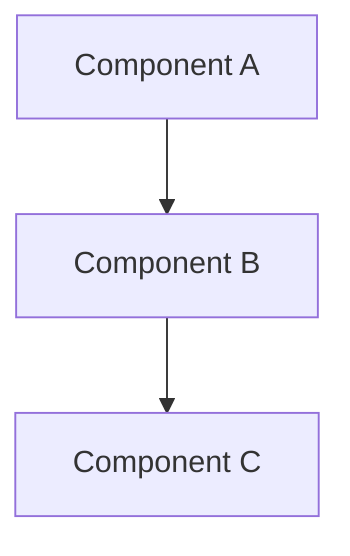

# Chapter Scaffold Generator

## Overview

This skill generates complete chapter scaffolds for the Agentic Coding Book, including:
- **Chapter directory** with individual section files (one file per section)
- **Section-level YAML frontmatter** with auto-suggested metadata (tags, related chapters, requirements)
- **Section structure** tailored to the part type (Foundations, Playbook, Patterns, Example)
- **Placeholder guidance** to accelerate content drafting

**Key Benefits**:
- **Section-level files**: Each section is a separate file (~5-10 KB) for easier management
- **Batch mode**: Scaffold all 50 chapters in ~2 hours
- **Context efficient**: ~6.5k tokens per scaffold, ~12.5k for 5 scaffolds
- **Auto-inference**: Part/chapter/section numbers from file paths
- **Smart suggestions**: Tags, related chapters, and requirements based on content area
- **Quality foundation**: Ensures consistent structure across all chapters
- **Parallel work**: Multiple sections can be drafted simultaneously without merge conflicts

## Critical Principle: Customize, Don't Template

**⚠️ IMPORTANT**: This skill is NOT about applying generic templates. It's about creating thoughtful, chapter-specific scaffolds that reflect what each chapter actually needs to teach.

**Bad scaffolding**: Generic section names like `[Concept 1]`, `[Step 1]`, `[Principle Name]`
**Good scaffolding**: Specific section names like `From Code Executor to Product Orchestrator`, `The Five Competency Domains`, `Writing Requirements with EARS`

See Example 1b in EXAMPLES.md for a detailed comparison.

## When to Use This Skill

Invoke this skill when you need to:
- Create new chapter scaffolds before content drafting
- Batch-generate scaffolds for multiple chapters at once
- Establish consistent frontmatter and section structure
- Prepare chapters for the draft-section skill (content writing phase)

**Prerequisites**:
- `design.md` (Section 3.1 for frontmatter schema)
- `brief.md` (for tag/topic suggestions)
- `requirements.md` (for requirement traceability)
- Chapter file path(s) to scaffold

## Workflow

### Step 1: Read Context

Before scaffolding, read the necessary context files:
- [ ] Read `/home/testa/agentic-coding-book/planning/design.md` (Section 3.1)
- [ ] Read `/home/testa/agentic-coding-book/planning/brief.md`
- [ ] Read `/home/testa/agentic-coding-book/planning/requirements.md`

**Why**: These files contain the frontmatter schema, topic areas for tag suggestions, and requirements for traceability.

### Step 2: Parse File Path(s)

For each chapter to scaffold, extract metadata from the directory path:

**Path Pattern**: `book/<part-directory>/<chapter-directory>/`

**Examples**:
- `book/part1-foundations/01-renaissance-developer/` → Part 1, Chapter 1
- `book/part2-playbook/03-brainstorm-to-brief/` → Part 2, Chapter 3
- `book/part3-patterns-tools/architecture/01-clean-boundaries/` → Part 3 (subdirectory)
- `book/part4-example/10-launch-day/` → Part 4, Chapter 10

**Auto-inference**:
- **Part number**: Extract from directory name (`part1` → 1, `part2` → 2, etc.)
- **Chapter number**: Extract from directory name prefix (`01-` → 1, `03-` → 3, etc.)
- **Chapter title**: Derive from directory name (e.g., `renaissance-developer` → "The Renaissance Developer")

### Step 3: Generate Frontmatter for Each Section

Create complete YAML frontmatter for each section file following this schema:

```yaml
---
title: "Section Title"                   # Section-specific title
chapter_title: "Chapter Title"           # Chapter context (from directory name)
part: 1                                  # Auto-inferred from directory
chapter: 3                               # Auto-inferred from directory name
section: 1                               # Section number (1-based)
version: "0.1"                           # Start at 0.1 (draft)
date: "YYYY-MM-DD"                       # Current date
status: "draft"                          # Always start as "draft"
author: "Brian Childress"                # Default author
tags: ["tag1", "tag2", "tag3"]          # Auto-suggested based on content area
related: []                              # Auto-suggested related sections (optional)
requirements: []                         # Auto-suggested requirements (optional)
abstract: |
  [Placeholder: 1-2 sentence summary of this section's content
  for search and navigation purposes. To be written during drafting.]
---
```

**Section-specific fields**:
- `title`: Section-specific title (e.g., "Introduction: The Specialist's Dilemma")
- `chapter_title`: The chapter title for context (e.g., "The Renaissance Developer")
- `section`: Integer section number (1, 2, 3, etc.) for ordering within chapter

#### Tag Suggestion Strategy

**Part 1 (Foundations)**: `["foundations", "mindset", "principles"]` + topic-specific
- Ch 1: `["renaissance-developer", "mindset", "foundations"]`
- Ch 2: `["agentic-coding", "definitions", "foundations"]`
- Ch 3: `["architecture", "principles", "foundations"]`
- Ch 4: `["interfaces", "design", "foundations"]`
- Ch 5: `["bottlenecks", "workflow", "foundations"]`

**Part 2 (Playbook)**: `["playbook", "workflow", "process"]` + phase-specific
- Requirements/design chapters: `["specifications", "ears", "openapi"]`
- Testing chapters: `["testing", "validation", "quality"]`
- Deployment chapters: `["deployment", "environments", "production"]`

**Part 3 (Patterns & Tools)**: `["patterns", "reference"]` + category-specific
- Architecture: `["architecture", "patterns", "design"]`
- Specifications: `["specifications", "ears", "openapi", "asyncapi"]`
- Testing: `["testing", "patterns", "validation"]`
- Toolchain: `["tools", "json-schema", "mcp", "skills"]`

**Part 4 (Example)**: `["example", "narrative", "walkthrough"]` + phase-specific
- Early chapters: `["mvp", "planning", "example"]`
- Middle chapters: `["implementation", "iteration", "example"]`
- Late chapters: `["production", "launch", "example"]`

#### Related Chapters Suggestion Strategy

Suggest 2-4 related chapters based on:
- **Sequential flow**: Previous/next chapters in the workflow
- **Cross-references**: Related patterns or concepts from other parts
- **Prerequisites**: Foundational concepts needed to understand this chapter

**Examples**:
- `part2-playbook/04-requirements-writing.md` → related to `part3-patterns-tools/specifications/ears-notation.md`
- `part4-example/05-implementing-mvp.md` → related to `part2-playbook/06-implementation-planning.md`
- `part1-foundations/03-architecture-principles.md` → related to `part3-patterns-tools/architecture/` chapters

#### Requirements Suggestion Strategy

Suggest relevant requirements from `requirements.md` based on chapter topic:
- **Content requirements**: REQ-C001-C050 (what the book teaches)
- **Structural requirements**: REQ-S001-S011 (organization, navigation)
- **Technical requirements**: REQ-T001-T021 (tooling, authoring, deployment)
- **Quality requirements**: REQ-Q001-Q013 (accuracy, clarity, examples)
- **Non-functional requirements**: REQ-N001-N025 (accessibility, performance)
- **Publishing requirements**: REQ-P001-P012 (license, distribution, feedback)

**Examples**:
- Architecture chapter → `REQ-C011, REQ-C012, REQ-C013` (architecture patterns)
- Testing chapter → `REQ-C019, REQ-C020, REQ-C021` (testing strategies)
- EARS notation chapter → `REQ-C015, REQ-C016` (specification writing)

### Step 4: Determine Section Structure and Create Files

Select the appropriate section structure for the part, then **customize it** based on the specific chapter topic.

**CRITICAL**: Don't just use generic templates. Think about what this specific chapter needs to teach based on:
- The chapter title (e.g., "Renaissance Developer" vs "Architecture Principles")
- The topic area from brief.md
- The requirements this chapter addresses

**Process**:
1. Select base section structure for the part (see templates below)
2. Replace generic section names with specific, meaningful names
3. For each section, create a separate `.md` file in the chapter directory
4. Each file gets its own frontmatter with appropriate section number
5. Customize placeholder guidance to reflect actual section content

**File naming convention**: `<section-number>-<section-slug>.md`
- Section numbers: 01, 02, 03, ... (zero-padded for sorting)
- Section slug: kebab-case version of section title

**Example files**:
- `01-introduction.md` - Introduction section
- `02-renaissance-developer-model.md` - The Renaissance Developer Model section
- `03-what-changes-what-doesnt.md` - What Changes, What Doesn't section
- `09-summary.md` - Summary section
- `10-further-reading.md` - Further Reading section

---

**Customization Guide by Chapter Type**:

**For mindset/concept chapters** (e.g., "Renaissance Developer", "What is Agentic Coding"):
- Replace "Key Concepts" subsections with actual concepts from the chapter topic
- Add specific examples that illustrate the mindset shift
- Include comparison sections (old way vs new way, before vs after)

**For principles chapters** (e.g., "Architecture Principles", "Design Patterns"):
- List the actual principles as main sections, not generic "Principle 1, 2, 3"
- For each principle: explanation, why it matters, how to apply it, what breaks if you ignore it
- Include decision trees or when-to-use guidance

**For workflow chapters** (e.g., "Brainstorm to Brief", "Requirements Writing"):
- Name the actual steps in the workflow, not "Step 1, Step 2"
- Include specific deliverables, acceptance criteria, and tools for each step
- Add "Working with Claude Code" section with actual prompts for that phase

**For pattern chapters** (e.g., "EARS Notation", "Clean Boundaries"):
- Use the pattern name in section headings
- Include real code examples, not placeholder syntax
- Add specific "When to Use" vs "When NOT to Use" scenarios

**For example chapters** (Part 4):
- Use actual project decisions, not generic placeholders
- Include real prompts used with Claude
- Show actual code snippets and their evolution through iteration

---

**Base section structure by part number:**

#### Part 1: Foundations (First Principles Teaching)

Typical chapter structure (8-10 sections):
1. **Introduction** - Hook and context
2. **Key Concept 1** - First major concept (custom name)
3. **Key Concept 2** - Second major concept (custom name)
4. **Key Concept 3** - Third major concept (optional, custom name)
5. **What Changes, What Doesn't** - Comparison/evolution section (optional)
6. **Practical Application** - Real-world examples
7. **Common Pitfalls** - Mistakes to avoid
8. **Why This Matters** - Broader significance (optional)
9. **Summary** - Key takeaways
10. **Further Reading** - Related resources

**Section 1: Introduction** (01-introduction.md)
```markdown
[Placeholder: Hook the reader with a relatable scenario or problem.
Establish why this topic matters for agentic coding.
3-5 paragraphs max - this is just the intro, detailed concepts come in later sections.]

**In this chapter, we'll explore**:
- [Key topic 1]
- [Key topic 2]
- [Key topic 3]
```

**Sections 2-4: Key Concepts** (e.g., 02-renaissance-model.md, 03-mindset-shift.md)
```markdown
[Placeholder: Deep dive into this specific concept.
Define it clearly, explain why it matters, show how it applies to agentic coding.
Use examples, analogies, and concrete scenarios.
~3-5 pages per concept section.]

**Key characteristics**:
- [Characteristic 1]
- [Characteristic 2]
- [Characteristic 3]

[Additional subsections as needed for this concept]
```

**Section 6: Practical Application** (e.g., 06-practical-example.md)
```markdown
[Placeholder: Show how to apply the concepts from previous sections in real scenarios.
Include concrete examples with AI agents.
Walk through at least one complete example step-by-step.]

## Example: [Scenario Name]

[Placeholder: Complete walkthrough demonstrating the concepts in action]
```

**Section 7: Common Pitfalls** (e.g., 07-common-pitfalls.md)
```markdown
[Placeholder: What mistakes do people make when applying these concepts?
How to recognize and avoid them?
Based on real experiences and common misunderstandings.]

- **Pitfall 1: [Name]** - [Description and how to avoid]
- **Pitfall 2: [Name]** - [Description and how to avoid]
- **Pitfall 3: [Name]** - [Description and how to avoid]
```

**Section 9: Summary** (09-summary.md)
```markdown
[Placeholder: Synthesize the key takeaways from this chapter in 3-5 bullet points.
Each should be actionable or memorable.]

- [Takeaway 1]
- [Takeaway 2]
- [Takeaway 3]
```

**Section 10: Further Reading** (10-further-reading.md)
```markdown
[Placeholder: Related chapters and external resources for deeper learning]

**Related Chapters**:
- [Related chapter 1 from this book]
- [Related chapter 2 from this book]

**External Resources**:
- [Book/article title and link]
- [Book/article title and link]
```

#### Part 2: Playbook (Practical Workflows)

Typical chapter structure (8-10 sections):
1. **Overview** - What this phase is and where it fits
2. **Prerequisites** - What must be done first
3. **The Process** - Step-by-step workflow
4. **Working with Claude Code** - AI collaboration guidance
5. **Deliverables** - What you produce in this phase
6. **Example** - Complete walkthrough
7. **Common Questions** - FAQ
8. **Next Steps** - What comes after

**Section 1: Overview** (01-overview.md)
```markdown
[Placeholder: What is this workflow step?
Where does it fit in the 6-week journey?
Why is it important?
2-3 paragraphs establishing context.]

**In this phase, you will**:
- [Objective 1]
- [Objective 2]
- [Objective 3]
```

**Section 2: Prerequisites** (02-prerequisites.md)
```markdown
[Placeholder: What must be completed before starting this phase?
What knowledge, artifacts, or decisions are needed?]

**Required inputs**:
- [Prerequisite 1] - [Why it's needed]
- [Prerequisite 2] - [Why it's needed]

**Optional but helpful**:
- [Nice-to-have 1]
```

**Section 3: The Process** (03-the-process.md)
```markdown
[Placeholder: Step-by-step workflow for this phase.
Break down the work into concrete, actionable steps.
For each step: what to do, how to do it, what good looks like.]

## Step 1: [Action Name]

[Placeholder: Detailed explanation of this step]

**What to do**:
- [Action item 1]
- [Action item 2]

**What good looks like**:
- [Success criterion 1]
- [Success criterion 2]

## Step 2: [Action Name]

[Placeholder: Continue for each step in the workflow]

[Continue for all steps in this phase]
```

**Section 4: Working with Claude Code** (04-working-with-claude.md)
```markdown
[Placeholder: How to use AI agents effectively for this workflow phase.
Concrete prompts, tips, and collaboration patterns.]

## Best Prompts

**Prompt 1: [Purpose]**
```
[Example prompt 1]
```

**Prompt 2: [Purpose]**
```
[Example prompt 2]
```

## Tips for Effective Collaboration

- [Tip 1 for effective AI use in this phase]
- [Tip 2 for effective AI use in this phase]
- [Tip 3 for effective AI use in this phase]
```

**Section 5: Deliverables** (05-deliverables.md)
```markdown
[Placeholder: What artifacts are produced in this phase?
What do they contain? What format? What makes them good?]

- **[Deliverable 1]** - [Description, format, quality criteria]
- **[Deliverable 2]** - [Description, format, quality criteria]
```

**Section 6: Example** (06-example.md)
```markdown
[Placeholder: Complete walkthrough of this workflow phase for a sample project.
Show actual artifacts, decisions, and iterations.]

[Full example demonstrating the process]
```

**Section 7: Common Questions** (07-common-questions.md)
```markdown
[Placeholder: FAQ for this workflow phase based on common struggles and uncertainties]

**Q: [Question 1]**

A: [Answer 1]

**Q: [Question 2]**

A: [Answer 2]

**Q: [Question 3]**

A: [Answer 3]
```

**Section 8: Next Steps** (08-next-steps.md)
```markdown
[Placeholder: What comes after this workflow phase?
How does it connect to the next chapter?]

With [deliverables from this phase] complete, you're ready to move on to [next phase].

In the next chapter, we'll cover [next topic]...

See [Next Chapter Title](../NN-next-chapter/01-overview.md) to continue.
```

#### Part 3: Patterns & Tools (Pattern Documentation)

Typical chapter structure (8-10 sections):
1. **Overview** - Pattern summary and category
2. **The Problem** - What problem this solves
3. **The Solution** - How the pattern works
4. **Implementation** - Step-by-step guide
5. **Example** - Concrete code/diagram example
6. **When to Use** - Appropriate scenarios
7. **When NOT to Use** - Inappropriate scenarios
8. **Related Patterns** - Cross-references
9. **Checklist** - Quick reference
10. **Further Reading** - Resources

**Section 1: Overview** (01-overview.md)
```markdown
[Placeholder: One-paragraph summary of this pattern/tool.
What is it? Why does it exist? Who needs it?]

**Pattern Category**: [Architecture/Interface/Testing/Specification/Toolchain/Workflow]

**At a glance**:
- **Problem**: [One-sentence problem statement]
- **Solution**: [One-sentence solution statement]
- **When to use**: [One-sentence use case]
```

**Section 2: The Problem** (02-the-problem.md)
```markdown
[Placeholder: What problem does this pattern solve?
When do you encounter this issue in agentic coding?
What happens if you don't use this pattern?]

## Symptoms

You need this pattern when you see:

- [Symptom 1]
- [Symptom 2]
- [Symptom 3]

## Why It Matters

[Explain the consequences of not addressing this problem]
```

**Section 3: The Solution** (03-the-solution.md)
```markdown
[Placeholder: Detailed explanation of the pattern/tool.
How does it solve the problem?
What are the key principles behind it?]

## How It Works

[Placeholder: Mechanics and principles - explain the core idea]

## Key Components

- **[Component 1]**: [Role and responsibility]
- **[Component 2]**: [Role and responsibility]
- **[Component 3]**: [Role and responsibility]
```

**Section 4: Implementation** (04-implementation.md)
```markdown
[Placeholder: Step-by-step guide to implementing this pattern.
Concrete, actionable steps anyone can follow.]

## Step 1: [Action]

[Detailed explanation of first step]

## Step 2: [Action]

[Detailed explanation of second step]

## Step 3: [Action]

[Detailed explanation of third step]

[Continue for all implementation steps]
```

**Section 5: Example** (05-example.md)
```markdown
[Placeholder: Concrete example with code and/or diagrams.
Show the pattern in action with real code or visual representation.]

## Code Example

```[language]
[Code example demonstrating the pattern]
```

*Listing X.X: [Code description]*

## Visual Representation



*Figure X.X: [Diagram description]*
```

**Section 6: When to Use** (06-when-to-use.md)
```markdown
[Placeholder: Situations where this pattern is appropriate and beneficial]

**Use this pattern when**:
- [Scenario 1 with explanation]
- [Scenario 2 with explanation]
- [Scenario 3 with explanation]
```

**Section 7: When NOT to Use** (07-when-not-to-use.md)
```markdown
[Placeholder: Situations where this pattern is inappropriate, overkill, or harmful]

**Avoid this pattern when**:
- [Scenario 1 with explanation]
- [Scenario 2 with explanation]
- [Scenario 3 with explanation]

## Alternatives

If this pattern doesn't fit, consider:
- [Alternative pattern 1]
- [Alternative pattern 2]
```

**Section 8: Related Patterns** (08-related-patterns.md)
```markdown
[Placeholder: Cross-references to complementary, alternative, or prerequisite patterns]

- **[Pattern Name 1]**: [Relationship - complements/extends/alternative to this pattern]
- **[Pattern Name 2]**: [Relationship]
- **[Pattern Name 3]**: [Relationship]
```

**Section 9: Checklist** (09-checklist.md)
```markdown
[Placeholder: Quick reference for implementing and validating this pattern]

## Implementation Checklist

- [ ] [Implementation step 1]
- [ ] [Implementation step 2]
- [ ] [Implementation step 3]

## Validation Checklist

- [ ] [Validation criterion 1]
- [ ] [Validation criterion 2]
- [ ] [Validation criterion 3]
```

**Section 10: Further Reading** (10-further-reading.md)
```markdown
[Placeholder: External resources, official documentation, and related book chapters]

**Related Chapters**:
- [Related chapter from this book]

**External Resources**:
- [Official documentation link]
- [Book/article title and link]
- [Tool/library link]
```

#### Part 4: Example (Complete Project Narrative)

Typical chapter structure (6-8 sections):
1. **Where We Are** - Project status and timeline
2. **The Challenge** - What we're tackling in this chapter
3. **The Approach** - Strategy using playbook patterns
4. **Execution** - Step-by-step work with Claude
5. **Code Highlights** - Key implementation snippets
6. **Lessons Learned** - Insights from this phase
7. **What's Next** - Transition to next chapter

**Section 1: Where We Are** (01-where-we-are.md)
```markdown
[Placeholder: Summary of project state at this point in the example.
What have we accomplished? Where are we in the timeline?]

**Timeline**: [Week X, Day Y] of the 6-week journey

**Completed so far**:
- [Completed milestone 1]
- [Completed milestone 2]
- [Completed milestone 3]

**Current focus**:
- [What we're working on in this chapter]
```

**Section 2: The Challenge** (02-the-challenge.md)
```markdown
[Placeholder: What specific challenge or task is being tackled in this chapter?
Why is it important? What makes it interesting or difficult?]

**Key questions we need to answer**:
- [Question 1]
- [Question 2]
- [Question 3]
```

**Section 3: The Approach** (03-the-approach.md)
```markdown
[Placeholder: How we tackle this challenge using patterns from the playbook.
Reference specific chapters/patterns from Parts 1-3.]

## Planning

[Placeholder: Thinking through the approach before coding]

## Strategy

We'll apply these patterns:
- **[Pattern from Part 3]**: [Why we're using it]
- **[Workflow from Part 2]**: [How it guides us]
- **[Principle from Part 1]**: [How it shapes our decisions]
```

**Section 4: Execution** (04-execution.md)
```markdown
[Placeholder: Step-by-step execution with Claude Code.
Show actual prompts, Claude's responses, and iterations.]

## Step 1: [Action]

**Prompt to Claude**:
```
[Actual prompt used]
```

**Claude's response**:
[Summary of what Claude generated/suggested]

**Our iteration**:
[How we refined Claude's output]

## Step 2: [Action]

[Continue for all execution steps]

## Validation

[How we validated the result]
```

**Section 5: Code Highlights** (05-code-highlights.md)
```markdown
[Placeholder: Show key code snippets with detailed explanation.
Focus on interesting decisions, tradeoffs, or patterns in action.]

## [Feature/Component Name]

```[language]
[Meaningful code example from this phase]
```

*Listing X.X: [Code description and why it matters]*

[Explanation of the code and what it demonstrates]
```

**Section 6: Lessons Learned** (06-lessons-learned.md)
```markdown
[Placeholder: What insights emerged from this phase?
What worked well? What surprised us? What would we do differently?]

- **Lesson 1: [Title]** - [Insight and why it matters for agentic coding]
- **Lesson 2: [Title]** - [Insight and why it matters]
- **Lesson 3: [Title]** - [Insight and why it matters]
```

**Section 7: What's Next** (07-whats-next.md)
```markdown
[Placeholder: Transition to the next chapter.
What challenge comes next? How does this chapter's work set us up for it?]

With [accomplishment from this chapter] complete, we're ready to tackle [next challenge].

In the next chapter, we'll [next chapter's focus]...
```

### Step 5: Create Chapter Directory

Create the chapter directory if it doesn't exist:
- Use `Bash` tool with `mkdir -p` command
- Path format: `book/<part-dir>/<chapter-dir>/`

Example:
```bash
mkdir -p book/part1-foundations/01-renaissance-developer/
```

### Step 6: Write Section Files

For each section in the chapter structure:

1. **Generate section frontmatter** (Step 3 schema) with:
   - `section`: Integer section number (1, 2, 3, ...)
   - `title`: Section-specific title
   - `chapter_title`: Chapter title for context

2. **Generate section content** from the appropriate template part

3. **Combine frontmatter + content**:
```markdown
---
[YAML frontmatter with section metadata]
---

[Section content with placeholders]
```

4. **Write file** with naming convention `<NN>-<section-slug>.md`:
   - Use `Write` tool with path: `book/<part-dir>/<chapter-dir>/<NN>-<section-slug>.md`
   - Confirm successful creation

5. **Repeat** for all sections in the chapter

### Step 7: Batch Mode (Optional)

When scaffolding multiple chapters:
1. Process chapters sequentially
2. Keep context under 25k tokens total
3. Group by part for efficiency (shared context)
4. Report progress after each chapter scaffold
5. For each chapter: create directory + all section files

**Batch output**:
```
Scaffolded Part 1, Chapter 1:
✓ Created directory: book/part1-foundations/01-renaissance-developer/
✓ 01-introduction.md
✓ 02-renaissance-developer-model.md
✓ 03-what-changes-what-doesnt.md
✓ 04-good-enough-principle.md
✓ 05-mindset-shift.md
✓ 06-practical-example.md
✓ 07-common-pitfalls.md
✓ 08-why-this-matters.md
✓ 09-summary.md
✓ 10-further-reading.md

Scaffolded Part 1, Chapter 2:
✓ Created directory: book/part1-foundations/02-what-is-agentic-coding/
✓ 01-introduction.md
✓ 02-defining-agentic-coding.md
...
```

## Validation Checklist

Before finalizing scaffolds, verify:

### Directory Structure Validation
- [ ] Chapter directory created in correct part directory
- [ ] Directory name follows `NN-chapter-slug` format
- [ ] All section files created within chapter directory

### Frontmatter Validation (per section file)
- [ ] All required fields present (title, chapter_title, part, chapter, section, version, date, status, author)
- [ ] Part number matches directory (1-4)
- [ ] Chapter number matches directory name
- [ ] Section number is unique and sequential (1, 2, 3, ...)
- [ ] `chapter_title` matches chapter directory name
- [ ] Tags are relevant and follow conventions
- [ ] Related sections/chapters exist and are correctly referenced
- [ ] Requirements exist in requirements.md
- [ ] Abstract is placeholder (to be filled during drafting)

### Section File Validation
- [ ] Correct section structure for part type
- [ ] Filename follows `NN-section-slug.md` format
- [ ] Section numbers are sequential starting from 01
- [ ] Placeholders are clear and actionable
- [ ] No lorem ipsum or meaningless filler
- [ ] Mermaid diagram placeholders where appropriate

### File Quality Validation
- [ ] Files written to correct paths
- [ ] Markdown syntax is valid
- [ ] YAML frontmatter is properly formatted
- [ ] No trailing whitespace or formatting issues

## Best Practices

1. **Auto-infer aggressively**: Reduce manual input by deriving metadata from file paths
2. **Smart defaults**: Use sensible defaults (version 0.1, status "draft", current date)
3. **Placeholder clarity**: Make placeholders actionable guides, not generic filler
4. **Batch efficiency**: Process multiple chapters in one session when possible
5. **Consistent formatting**: Maintain identical structure across chapters of same part
6. **Leave room for refinement**: Scaffolds are starting points, not final content

## Common Issues and Solutions

| Issue | Solution |
|-------|----------|
| Unclear chapter number from filename | Default to sequence order, flag for manual review |
| Unknown appropriate tags | Use part-level defaults, add TODO comment |
| No obvious related chapters | Leave empty array, populate during drafting |
| Ambiguous requirements mapping | Suggest broad category requirements, refine later |
| Part number ambiguous (subdirectories) | Extract from top-level directory only |

## Example Invocations

### Single Chapter

**User**: "Scaffold book/part1-foundations/01-renaissance-developer/"

**Expected Output**:
- Chapter directory created
- 8-10 section files created with proper frontmatter
- Each section has placeholder content following Part 1 template

### Batch (Part)

**User**: "Scaffold all Part 1 chapters"

**Expected Output**:
- 5 chapter directories created (01-05)
- Each with 8-10 section files
- Consistent structure across all chapters in the part

### Batch (Multiple Parts)

**User**: "Scaffold all chapters for the book"

**Expected Output**:
- All ~50 chapter directories created across 4 parts
- Each with appropriate section files for that part type
- Frontmatter auto-generated with part-specific conventions

## Integration with Other Skills

**Upstream** (before scaffolding):
- Review `design.md`, `brief.md`, `requirements.md` for context

**Downstream** (after scaffolding):
- **draft-section skill**: Draft individual section files (simplified workflow)
- **mermaid-diagrams skill**: Generate diagrams referenced in section placeholders
- Manual editing and refinement of section files

**Parallel**:
- CI/CD validation scripts (frontmatter, links, markdown lint)

## Performance Targets

- **Single chapter scaffold** (10 sections): < 3 minutes, ~8k tokens
- **Batch (5 chapters)**: < 15 minutes, ~20k tokens
- **Full book (50 chapters, ~500 sections)**: < 3 hours, multiple batches

## Output Format

For each scaffolded chapter, confirm:

```
✓ Scaffolded: book/part1-foundations/01-renaissance-developer/
  - Part: 1, Chapter: 1
  - Chapter Title: "The Renaissance Developer"
  - Sections created: 10 files (01-introduction.md through 10-further-reading.md)
  - Tags: ["renaissance-developer", "mindset", "foundations"]
  - Section template: Part 1 (First Principles Teaching)
  - Status: Ready for content drafting with draft-section skill
```

## Notes

- This skill focuses on **structure**, not **content**
- Content drafting is handled by the separate `draft-section` skill
- Scaffolds serve as blueprints and placeholders
- User should review and refine scaffolds before drafting content
- Scaffolds ensure consistency across the entire book
