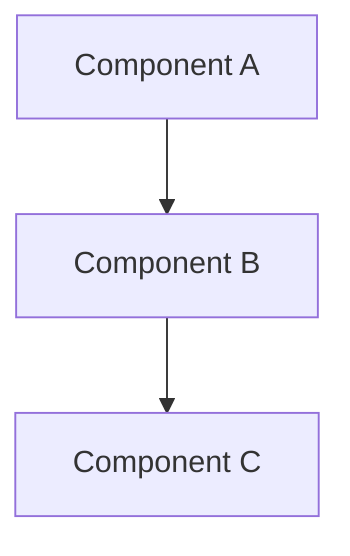

# Chapter Scaffold Generator

## Overview

This skill generates complete chapter scaffolds for the Agentic Coding Book, including:
- **YAML frontmatter** with auto-suggested metadata (tags, related chapters, requirements)
- **Section structure** tailored to the part type (Foundations, Playbook, Patterns, Example)
- **Placeholder guidance** to accelerate content drafting

**Key Benefits**:
- **Batch mode**: Scaffold all 50 chapters in ~2 hours
- **Context efficient**: ~6.5k tokens per scaffold, ~12.5k for 5 scaffolds
- **Auto-inference**: Part/chapter numbers from file paths
- **Smart suggestions**: Tags, related chapters, and requirements based on content area
- **Quality foundation**: Ensures consistent structure across all chapters

## Critical Principle: Customize, Don't Template

**⚠️ IMPORTANT**: This skill is NOT about applying generic templates. It's about creating thoughtful, chapter-specific scaffolds that reflect what each chapter actually needs to teach.

**Bad scaffolding**: Generic section names like `[Concept 1]`, `[Step 1]`, `[Principle Name]`
**Good scaffolding**: Specific section names like `From Code Executor to Product Orchestrator`, `The Five Competency Domains`, `Writing Requirements with EARS`

See Example 1b in EXAMPLES.md for a detailed comparison.

## When to Use This Skill

Invoke this skill when you need to:
- Create new chapter scaffolds before content drafting
- Batch-generate scaffolds for multiple chapters at once
- Establish consistent frontmatter and section structure
- Prepare chapters for the draft-section skill (content writing phase)

**Prerequisites**:
- `design.md` (Section 3.1 for frontmatter schema)
- `brief.md` (for tag/topic suggestions)
- `requirements.md` (for requirement traceability)
- Chapter file path(s) to scaffold

## Workflow

### Step 1: Read Context

Before scaffolding, read the necessary context files:
- [ ] Read `/home/testa/agentic-coding-book/planning/design.md` (Section 3.1)
- [ ] Read `/home/testa/agentic-coding-book/planning/brief.md`
- [ ] Read `/home/testa/agentic-coding-book/planning/requirements.md`

**Why**: These files contain the frontmatter schema, topic areas for tag suggestions, and requirements for traceability.

### Step 2: Parse File Path(s)

For each chapter to scaffold, extract metadata from the file path:

**Path Pattern**: `book/<part-directory>/<chapter-file>.md`

**Examples**:
- `book/part1-foundations/01-renaissance-developer.md` → Part 1, Chapter 1
- `book/part2-playbook/03-brainstorm-to-brief.md` → Part 2, Chapter 3
- `book/part3-patterns-tools/architecture/clean-boundaries.md` → Part 3 (subdirectory)
- `book/part4-example/10-launch-day.md` → Part 4, Chapter 10

**Auto-inference**:
- **Part number**: Extract from directory name (`part1` → 1, `part2` → 2, etc.)
- **Chapter number**: Extract from filename prefix (`01-` → 1, `03-` → 3, etc.)
- **Title**: Derive from filename (e.g., `renaissance-developer` → "The Renaissance Developer")

### Step 3: Generate Frontmatter

Create complete YAML frontmatter following this schema:

```yaml
---
title: "Chapter Title"                  # Derived from filename, user can refine
part: 1                                  # Auto-inferred from directory
chapter: 3                               # Auto-inferred from filename
version: "0.1"                           # Start at 0.1 (draft)
date: "YYYY-MM-DD"                       # Current date
status: "draft"                          # Always start as "draft"
author: "Author Name"                    # Use placeholder or known author
tags: ["tag1", "tag2", "tag3"]          # Auto-suggested based on content area
related: []                              # Auto-suggested related chapters (optional)
requirements: []                         # Auto-suggested requirements (optional)
abstract: |
  [Placeholder: 2-3 sentence summary of this chapter's content
  for search and navigation purposes. To be written during drafting.]
---
```

#### Tag Suggestion Strategy

**Part 1 (Foundations)**: `["foundations", "mindset", "principles"]` + topic-specific
- Ch 1: `["renaissance-developer", "mindset", "foundations"]`
- Ch 2: `["agentic-coding", "definitions", "foundations"]`
- Ch 3: `["architecture", "principles", "foundations"]`
- Ch 4: `["interfaces", "design", "foundations"]`
- Ch 5: `["bottlenecks", "workflow", "foundations"]`

**Part 2 (Playbook)**: `["playbook", "workflow", "process"]` + phase-specific
- Requirements/design chapters: `["specifications", "ears", "openapi"]`
- Testing chapters: `["testing", "validation", "quality"]`
- Deployment chapters: `["deployment", "environments", "production"]`

**Part 3 (Patterns & Tools)**: `["patterns", "reference"]` + category-specific
- Architecture: `["architecture", "patterns", "design"]`
- Specifications: `["specifications", "ears", "openapi", "asyncapi"]`
- Testing: `["testing", "patterns", "validation"]`
- Toolchain: `["tools", "json-schema", "mcp", "skills"]`

**Part 4 (Example)**: `["example", "narrative", "walkthrough"]` + phase-specific
- Early chapters: `["mvp", "planning", "example"]`
- Middle chapters: `["implementation", "iteration", "example"]`
- Late chapters: `["production", "launch", "example"]`

#### Related Chapters Suggestion Strategy

Suggest 2-4 related chapters based on:
- **Sequential flow**: Previous/next chapters in the workflow
- **Cross-references**: Related patterns or concepts from other parts
- **Prerequisites**: Foundational concepts needed to understand this chapter

**Examples**:
- `part2-playbook/04-requirements-writing.md` → related to `part3-patterns-tools/specifications/ears-notation.md`
- `part4-example/05-implementing-mvp.md` → related to `part2-playbook/06-implementation-planning.md`
- `part1-foundations/03-architecture-principles.md` → related to `part3-patterns-tools/architecture/` chapters

#### Requirements Suggestion Strategy

Suggest relevant requirements from `requirements.md` based on chapter topic:
- **Content requirements**: REQ-C001-C050 (what the book teaches)
- **Structural requirements**: REQ-S001-S011 (organization, navigation)
- **Technical requirements**: REQ-T001-T021 (tooling, authoring, deployment)
- **Quality requirements**: REQ-Q001-Q013 (accuracy, clarity, examples)
- **Non-functional requirements**: REQ-N001-N025 (accessibility, performance)
- **Publishing requirements**: REQ-P001-P012 (license, distribution, feedback)

**Examples**:
- Architecture chapter → `REQ-C011, REQ-C012, REQ-C013` (architecture patterns)
- Testing chapter → `REQ-C019, REQ-C020, REQ-C021` (testing strategies)
- EARS notation chapter → `REQ-C015, REQ-C016` (specification writing)

### Step 4: Generate Section Structure

Select the appropriate base template for the part, then **customize it** based on the specific chapter topic.

**CRITICAL**: Don't just use generic templates. Think about what this specific chapter needs to teach based on:
- The chapter title (e.g., "Renaissance Developer" vs "Architecture Principles")
- The topic area from brief.md
- The requirements this chapter addresses

**Process**:
1. Select base template for the part (see templates below)
2. Replace generic section names with specific, meaningful names
3. Customize placeholder guidance to reflect actual chapter content
4. Add/remove/reorder sections as needed for the topic

**Example customization**:
- Generic: `### [Concept 1 Name]`
- Specific: `### From Code Executor to Product Orchestrator`

- Generic: `[Placeholder: Explanation, definition, importance]`
- Specific: `[Placeholder: Explain the mindset shift - you're no longer writing most code yourself, you're orchestrating AI agents to implement your vision. Your value is in the thinking: What should we build? How should it work? Why these tradeoffs?]`

---

**Customization Guide by Chapter Type**:

**For mindset/concept chapters** (e.g., "Renaissance Developer", "What is Agentic Coding"):
- Replace "Key Concepts" subsections with actual concepts from the chapter topic
- Add specific examples that illustrate the mindset shift
- Include comparison sections (old way vs new way, before vs after)

**For principles chapters** (e.g., "Architecture Principles", "Design Patterns"):
- List the actual principles as main sections, not generic "Principle 1, 2, 3"
- For each principle: explanation, why it matters, how to apply it, what breaks if you ignore it
- Include decision trees or when-to-use guidance

**For workflow chapters** (e.g., "Brainstorm to Brief", "Requirements Writing"):
- Name the actual steps in the workflow, not "Step 1, Step 2"
- Include specific deliverables, acceptance criteria, and tools for each step
- Add "Working with Claude Code" section with actual prompts for that phase

**For pattern chapters** (e.g., "EARS Notation", "Clean Boundaries"):
- Use the pattern name in section headings
- Include real code examples, not placeholder syntax
- Add specific "When to Use" vs "When NOT to Use" scenarios

**For example chapters** (Part 4):
- Use actual project decisions, not generic placeholders
- Include real prompts used with Claude
- Show actual code snippets and their evolution through iteration

---

**Base templates by part number:**

#### Part 1: Foundations (First Principles Teaching)

```markdown
## Introduction

[Placeholder: Hook the reader with a relatable scenario or problem.
Establish why this topic matters for agentic coding.]

## Key Concepts

[Placeholder: Define core concepts and terminology.
Use clear explanations accessible to vibecoders.]

### [Concept 1 Name]

[Placeholder: Explanation, definition, importance]

### [Concept 2 Name]

[Placeholder: Explanation, definition, importance]

## Practical Application

[Placeholder: Show how to apply these concepts in real scenarios.
Include concrete examples with AI agents.]

### Example: [Scenario Name]

[Placeholder: Walk through a practical example step-by-step]

## Common Pitfalls

[Placeholder: What mistakes do people make? How to avoid them?]

- **Pitfall 1**: [Description and how to avoid]
- **Pitfall 2**: [Description and how to avoid]
- **Pitfall 3**: [Description and how to avoid]

## Summary

[Placeholder: Key takeaways in 3-5 bullet points]

- [Takeaway 1]
- [Takeaway 2]
- [Takeaway 3]

## Further Reading

[Placeholder: Related chapters and external resources]

- [Related chapter 1]
- [Related chapter 2]
- [External resource with link]
```

#### Part 2: Playbook (Practical Workflows)

```markdown
## Overview

[Placeholder: What is this workflow step? Where does it fit in the 6-week journey?]

## Prerequisites

[Placeholder: What must be completed before this step?]

- [Prerequisite 1]
- [Prerequisite 2]

## The Process

[Placeholder: Step-by-step workflow for this phase]

### Step 1: [Action Name]

[Placeholder: Detailed explanation of this step]

**What to do**:
- [Action item 1]
- [Action item 2]

**What good looks like**:
- [Success criterion 1]
- [Success criterion 2]

### Step 2: [Action Name]

[Placeholder: Continue for each step in the workflow]

## Working with Claude Code

[Placeholder: How to use AI agents effectively for this workflow step]

**Best prompts**:
```
[Example prompt 1]
```

```
[Example prompt 2]
```

**Tips**:
- [Tip 1 for effective AI collaboration]
- [Tip 2 for effective AI collaboration]

## Deliverables

[Placeholder: What artifacts are produced in this step?]

- [Deliverable 1] - [Description]
- [Deliverable 2] - [Description]

## Example

[Placeholder: Complete walkthrough of this workflow step for a sample project]

## Common Questions

[Placeholder: FAQ for this workflow step]

**Q: [Question 1]**
A: [Answer 1]

**Q: [Question 2]**
A: [Answer 2]

## Next Steps

[Placeholder: What comes after this workflow step?]

See [Next Chapter Name](./next-chapter.md) for the next phase.
```

#### Part 3: Patterns & Tools (Pattern Documentation)

```markdown
## Overview

[Placeholder: One-paragraph summary of this pattern/tool]

**Pattern Category**: [Architecture/Interface/Testing/Specification/Toolchain/Workflow]

## The Problem

[Placeholder: What problem does this pattern solve?
When do you encounter this issue in agentic coding?]

### Symptoms

[Placeholder: How do you know you need this pattern?]

- [Symptom 1]
- [Symptom 2]
- [Symptom 3]

## The Solution

[Placeholder: Detailed explanation of the pattern/tool]

### How It Works

[Placeholder: Mechanics and principles]

### Implementation

[Placeholder: Step-by-step guide to implementing this pattern]

**Step 1**: [Action]
**Step 2**: [Action]
**Step 3**: [Action]

## Example

[Placeholder: Concrete example with code/diagrams]

```[language]
[Code example demonstrating the pattern]
```

[Placeholder: Mermaid diagram showing the pattern visually]



*Figure X.X: [Diagram description]*

## When to Use

[Placeholder: Situations where this pattern is appropriate]

**Use this pattern when**:
- [Scenario 1]
- [Scenario 2]
- [Scenario 3]

## When NOT to Use

[Placeholder: Situations where this pattern is inappropriate or overkill]

**Avoid this pattern when**:
- [Scenario 1]
- [Scenario 2]
- [Scenario 3]

## Related Patterns

[Placeholder: Cross-references to complementary or alternative patterns]

- **[Pattern Name 1]**: [Relationship]
- **[Pattern Name 2]**: [Relationship]
- **[Pattern Name 3]**: [Relationship]

## Checklist

[Placeholder: Quick reference for implementing this pattern]

- [ ] [Implementation step 1]
- [ ] [Implementation step 2]
- [ ] [Implementation step 3]
- [ ] [Validation step 1]
- [ ] [Validation step 2]

## Further Reading

[Placeholder: External resources, official docs, related chapters]

- [Resource 1]
- [Resource 2]
```

#### Part 4: Example (Complete Project Narrative)

```markdown
## Where We Are

[Placeholder: Summary of project state at this point in the example]

**Timeline**: [Week X, Day Y] of the 6-week journey

**Completed**:
- [Completed milestone 1]
- [Completed milestone 2]

**Next up**:
- [Next goal]

## The Challenge

[Placeholder: What challenge or task is being tackled in this chapter?]

## The Approach

[Placeholder: How we tackle this challenge using the playbook patterns]

### Planning

[Placeholder: Thinking through the approach]

### Execution

[Placeholder: Step-by-step execution with Claude Code]

**Prompt to Claude**:
```
[Actual prompt used]
```

**Claude's response**:
[Summary of what Claude generated/suggested]

**Iteration**:
[How we refined Claude's output]

### Validation

[Placeholder: How we validated the result]

## Code Highlights

[Placeholder: Show key code snippets with explanation]

```[language]
[Meaningful code example from this phase]
```

*Listing X.X: [Code description]*

## Lessons Learned

[Placeholder: What insights emerged from this phase?]

- **Lesson 1**: [Insight and why it matters]
- **Lesson 2**: [Insight and why it matters]
- **Lesson 3**: [Insight and why it matters]

## What's Next

[Placeholder: Tease the next chapter's challenge]

In the next chapter, we'll tackle [next challenge]...
```

### Step 5: Combine and Output

Combine frontmatter + section structure into a complete scaffold:

```markdown
---
[YAML frontmatter from Step 3]
---

[Section structure from Step 4]
```

### Step 6: Write File

Write the scaffold to the specified file path:
- Use the `Write` tool with the complete file path
- Confirm successful creation

### Step 7: Batch Mode (Optional)

When scaffolding multiple chapters:
1. Process chapters sequentially
2. Keep context under 25k tokens total
3. Group by part for efficiency (shared context)
4. Report progress after each batch of 5 chapters

**Batch output**:
```
Scaffolded Part 1:
✓ 01-renaissance-developer.md
✓ 02-what-is-agentic-coding.md
✓ 03-architecture-principles.md
✓ 04-digestible-interfaces.md
✓ 05-new-bottlenecks.md

Scaffolded Part 2 (batch 1):
✓ 01-idea-to-vision.md
✓ 02-understanding-phase.md
✓ 03-brainstorm-to-brief.md
...
```

## Validation Checklist

Before finalizing scaffolds, verify:

### Frontmatter Validation
- [ ] All required fields present (title, part, chapter, version, date, status, author)
- [ ] Part number matches directory (1-4)
- [ ] Chapter number matches filename
- [ ] Tags are relevant and follow conventions
- [ ] Related chapters exist and are correctly referenced
- [ ] Requirements exist in requirements.md
- [ ] Abstract is placeholder (to be filled during drafting)

### Section Structure Validation
- [ ] Correct template for part type
- [ ] All section headings present
- [ ] Placeholders are clear and actionable
- [ ] No lorem ipsum or meaningless filler
- [ ] Mermaid diagram placeholders where appropriate

### File Validation
- [ ] File written to correct path
- [ ] Markdown syntax is valid
- [ ] YAML frontmatter is properly formatted
- [ ] No trailing whitespace or formatting issues

## Best Practices

1. **Auto-infer aggressively**: Reduce manual input by deriving metadata from file paths
2. **Smart defaults**: Use sensible defaults (version 0.1, status "draft", current date)
3. **Placeholder clarity**: Make placeholders actionable guides, not generic filler
4. **Batch efficiency**: Process multiple chapters in one session when possible
5. **Consistent formatting**: Maintain identical structure across chapters of same part
6. **Leave room for refinement**: Scaffolds are starting points, not final content

## Common Issues and Solutions

| Issue | Solution |
|-------|----------|
| Unclear chapter number from filename | Default to sequence order, flag for manual review |
| Unknown appropriate tags | Use part-level defaults, add TODO comment |
| No obvious related chapters | Leave empty array, populate during drafting |
| Ambiguous requirements mapping | Suggest broad category requirements, refine later |
| Part number ambiguous (subdirectories) | Extract from top-level directory only |

## Example Invocations

### Single Chapter

**User**: "Scaffold book/part1-foundations/01-renaissance-developer.md"

**Expected Output**: Complete scaffold with auto-inferred metadata and Part 1 template

### Batch (Part)

**User**: "Scaffold all Part 1 chapters"

**Expected Output**: 5 scaffolds for Part 1 (01-05) with consistent structure

### Batch (Multiple Parts)

**User**: "Scaffold all chapters for the book"

**Expected Output**: All ~50 chapter scaffolds organized by part

## Integration with Other Skills

**Upstream** (before scaffolding):
- Review `design.md`, `brief.md`, `requirements.md` for context

**Downstream** (after scaffolding):
- **draft-section skill**: Use scaffolds as input for content drafting
- **mermaid-diagrams skill**: Generate diagrams referenced in scaffolds
- Manual editing and refinement of scaffolds

**Parallel**:
- CI/CD validation scripts (frontmatter, links, markdown lint)

## Performance Targets

- **Single scaffold**: < 2 minutes, ~6.5k tokens
- **Batch (5 chapters)**: < 10 minutes, ~12.5k tokens
- **Full book (50 chapters)**: < 2 hours, multiple batches

## Output Format

For each scaffolded chapter, confirm:

```
✓ Scaffolded: book/part1-foundations/01-renaissance-developer.md
  - Part: 1, Chapter: 1
  - Title: "The Renaissance Developer"
  - Tags: ["renaissance-developer", "mindset", "foundations"]
  - Section template: Part 1 (First Principles Teaching)
  - Status: Ready for content drafting
```

## Notes

- This skill focuses on **structure**, not **content**
- Content drafting is handled by the separate `draft-section` skill
- Scaffolds serve as blueprints and placeholders
- User should review and refine scaffolds before drafting content
- Scaffolds ensure consistency across the entire book
