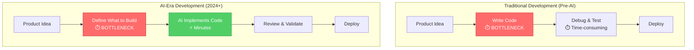

You've spent five years becoming an expert React developer. You know the framework inside and out—hooks, context, performance optimization, the works. You can debug the gnarliest state management issues and architect scalable component hierarchies in your sleep. You're valuable because you're deep.

But something changed in 2024.

You ask Claude Code to "build a React component for user authentication with social login," and it generates production-ready code in 30 seconds. Code that would have taken you an hour. Code that's clean, well-structured, and follows best practices. Sometimes it's better than what you would have written.

So what's your role now?

This is the specialist's dilemma: **when AI agents can handle implementation, deep specialization in coding becomes less valuable**. The bottleneck in software development is shifting from "writing code" to "knowing what to build and why." The Renaissance Developer recognizes this shift and adapts accordingly.

### Why Specialization Made Sense

For the past two decades, the software industry rewarded depth. Companies needed backend experts who could optimize database queries, frontend specialists who mastered browser quirks, DevOps engineers who understood infrastructure at scale. This made perfect sense when:

- **Coding was the bottleneck**: Writing and debugging code consumed most project time
- **Tools were primitive**: No AI assistance, minimal automation, steep learning curves
- **Teams were siloed**: Backend, frontend, design, and product were separate departments
- **Time-to-market was measured in months or years**: Speed wasn't the primary competitive advantage

In that world, being a 10x engineer meant writing code 10x faster, knowing your domain 10x deeper, debugging 10x more efficiently. Specialization delivered real value.

But the world changed.

### The New Reality

Today, AI agents can:

- Generate boilerplate code instantly
- Implement APIs from specifications in minutes
- Write tests automatically
- Refactor codebases while maintaining behavior
- Translate designs into working UIs
- Debug issues by analyzing stack traces and suggesting fixes

What used to take a specialized engineer hours or days now takes minutes. **The bottleneck is no longer coding—it's knowing what to code**.

*Figure 1.1: The bottleneck has shifted from implementation to decision-making. In the AI era, coding happens in minutes while strategic thinking remains the constraint.*

This creates a paradox for specialists: your expertise in *how to code* is increasingly commoditized, while your expertise in *what to build* becomes more valuable. But traditional specialization focused on the former, not the latter.

**The question isn't "can you write React better than Claude?"** (you probably can't, and that's fine). **The question is "can you decide what to build, architect the system, and validate that the AI-generated code actually solves the right problem?"**

This is where the Renaissance Developer emerges—not as someone who codes less, but as someone who *builds* more by orchestrating AI agents to handle implementation while you focus on the thinking that AI can't (yet) do: product vision, architectural decisions, user experience, and strategic tradeoffs.

The rest of this chapter introduces the Renaissance Developer model and explains how to thrive in this new paradigm.
