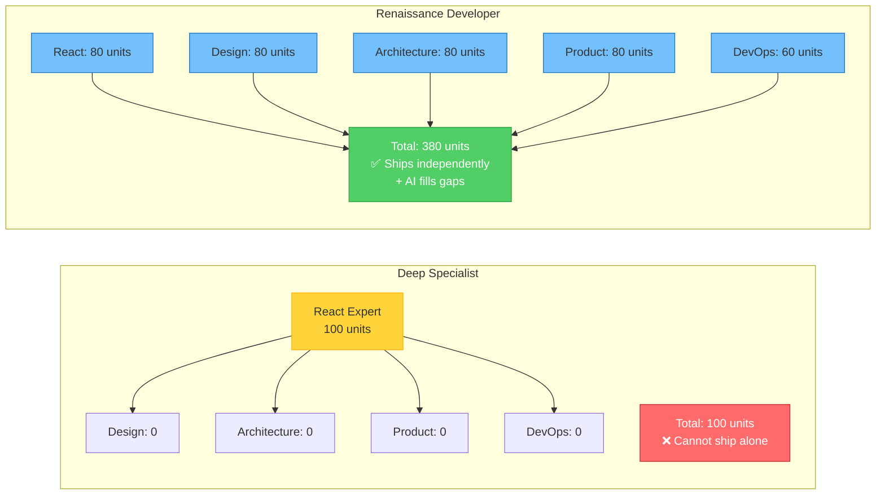
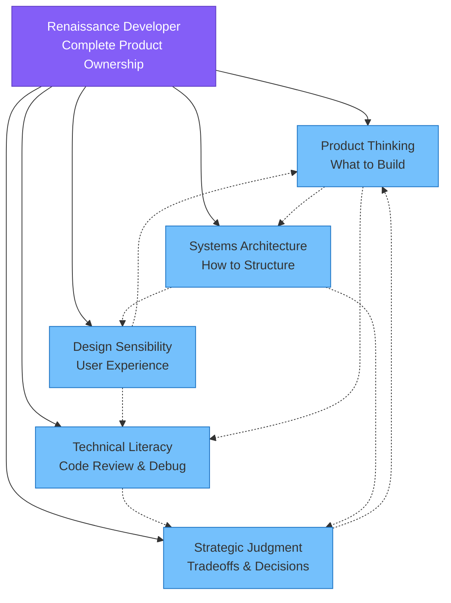

The Renaissance Developer is a modern polymath—someone who is "good enough at everything" to ship complete products independently. Not a 10x engineer who codes faster, but a **1x product builder** who can take an idea from conception to production without waiting for a team of specialists.

Think of Leonardo da Vinci. He wasn't the greatest painter of his era, nor the greatest sculptor, nor the greatest engineer. But he was good enough at all three—plus anatomy, mathematics, and architecture—to create works that specialists alone couldn't achieve. The *Vitruvian Man* required understanding of art, human anatomy, mathematics, and classical philosophy. No single specialist could have created it.

The Renaissance Developer works the same way. You don't need to be the world's best frontend developer, designer, product manager, and DevOps engineer. You need to be **competent enough in each discipline** to make good decisions and validate AI-generated output. The combination of breadth plus AI assistance creates something specialists can't: **complete product ownership**.

### Depth vs. Breadth in the AI Era

Traditional career advice said "go deep." Master one domain. Become the expert everyone consults. This made sense when:

- Coding was manual and error-prone (expertise prevented bugs)
- Complex problems required deep knowledge (no AI to consult)
- Career value came from being irreplaceable (the "only person who understands the payment system")

But **depth has diminishing returns when AI handles implementation**. Knowing every React optimization pattern is less valuable when Claude generates performant React code automatically. Going from 90% React knowledge to 100% might take years of study but provides minimal additional value when AI fills the gaps.

**Breadth has compounding returns in the AI era**. Knowing 80% of React + 80% of system design + 80% of UX + 80% of product strategy lets you:

- Design complete systems (not just implement a piece)
- Evaluate tradeoffs across disciplines (performance vs. UX vs. development speed)
- Communicate effectively with AI (clear specifications require cross-domain understanding)
- Ship independently (no waiting for specialists to be available)

The math is striking: **Deep specialist** might have 100 units of expertise in one area. **Renaissance Developer** has 80 units across five areas = 400 total units of applicable knowledge. Even if you discount for lack of mastery, the breadth advantage is overwhelming when AI can fill depth gaps on demand.

*Figure 1.2: Breadth (80% across 5 domains = 380 units) beats depth (100% in 1 domain = 100 units) when combined with AI assistance. The Renaissance Developer can ship complete products independently.*

### From Code Executor to Product Orchestrator

The fundamental mindset shift: **you're no longer writing most code yourself—you're orchestrating AI agents to implement your vision**.

**Code Executor mindset** (traditional):

- "How do I implement this feature?"
- Value = coding speed + code quality
- Time spent: 80% implementation, 20% planning
- Success = feature works as specified

**Product Orchestrator mindset** (Renaissance Developer):

- "What should we build and why?"
- Value = decision quality + vision clarity + validation thoroughness
- Time spent: 60% planning/specifying, 30% reviewing/validating AI output, 10% manual coding
- Success = product solves user problem effectively

Your job transforms from execution to **thinking**:

- **What to build**: Which features matter? What's the MVP? What can wait?
- **How it should work**: What's the architecture? Where are the boundaries? What are the contracts?
- **Why these tradeoffs**: Fast vs. correct? Simple vs. scalable? Ship now vs. build it right?

AI handles the "how to code it." You handle everything AI can't: understanding users, making strategic decisions, judging quality, and knowing when "good enough" is actually good enough.

### The Five Competency Domains

Renaissance Developers need "good enough" literacy across five domains. Not mastery—literacy. Enough to make informed decisions and validate AI output.

*Figure 1.3: The five competency domains are interconnected—decisions in one domain inform others. You need 70-80% competency in each, not mastery, to ship complete products with AI assistance.*

#### 1. Product Thinking

**What it is**: Understanding user needs, defining MVPs, prioritization frameworks, knowing what to build and what to cut.

**You don't need**: An MBA, formal product management training, years shipping products

**You do need**:

- Ability to interview users and extract real needs (not just feature requests)
- Framework for prioritizing features (MoSCoW, RICE, or even just "must-have vs. nice-to-have")
- Sense of scope—what's realistic for an MVP vs. what requires a full v1.0
- Understanding of metrics that matter (engagement, retention, conversion, not vanity metrics)

**Practical example**: When building a task management app, product thinking tells you:

- MVP must have: create tasks, mark complete, basic list view
- Can wait: tags, due dates, collaboration, mobile app
- Not needed: AI task prediction, calendar integration, team analytics

Without this domain, you'll either build too little (MVP doesn't work) or too much (never ship). AI can't tell you what users actually need—only you can.

#### 2. Systems Architecture

**What it is**: High-level system design, component boundaries, data flow, API contracts, understanding when to use which architectural patterns.

**You don't need**: Ability to optimize algorithms, deep knowledge of computer science theory, experience scaling to millions of users

**You do need**:

- Understanding of common patterns (REST APIs, event-driven, client-server, microservices)
- Ability to break systems into components with clear responsibilities
- Knowledge of when to use a database vs. cache vs. message queue
- Sense of what "good architecture" looks like (components are testable, boundaries are clear, changes are localized)

**Practical example**: For a user authentication system, architecture thinking tells you:

- Separate auth logic from business logic (bounded context)
- Use JWT tokens for stateless sessions (vs. server-side sessions)
- Hash passwords with bcrypt (not MD5, not plain text)
- Rate-limit login attempts (security vs. usability tradeoff)

Without this domain, you'll ask AI to build systems that are hard to maintain, difficult to test, or architecturally fragile. AI can implement any architecture you specify—but it can't tell you which architecture is right for your context.

#### 3. Design Sensibility

**What it is**: UI/UX fundamentals, information architecture, understanding what makes interfaces intuitive, visual hierarchy, interaction patterns.

**You don't need**: Figma mastery, graphic design skills, ability to create pixel-perfect mockups, knowledge of design systems

**You do need**:

- Recognition of good vs. bad UX (you know it when you see it)
- Understanding of common UI patterns (forms, navigation, feedback, error states)
- Ability to sketch wireframes (even rough ones)
- Knowledge of accessibility basics (keyboard navigation, screen readers, color contrast)

**Practical example**: Designing a login form, design sensibility tells you:

- Put "Forgot password?" link next to password field (where users need it)
- Show password strength in real-time (immediate feedback)
- Auto-focus email field on page load (reduce friction)
- Display clear error messages ("Email not found" not "Error 401")
- Use visible labels, not just placeholders (accessibility)

Without this domain, you'll build functional-but-frustrating interfaces. AI can generate UI code, but it needs your direction on what makes a good user experience in your specific context.

#### 4. Technical Literacy

**What it is**: Enough coding knowledge to read/review/debug AI-generated code, understand technical tradeoffs, and guide AI agents effectively.

**You don't need**: Ability to write code from scratch, memorization of APIs and syntax, deep expertise in any specific language or framework

**You do need**:

- Ability to read code and understand what it does
- Recognition of code smells (giant functions, unclear names, tight coupling)
- Understanding of testing concepts (unit, integration, e2e tests)
- Knowledge of what's possible vs. impossible with current tech
- Familiarity with common bugs (null checks, off-by-one errors, race conditions)

**Practical example**: Reviewing AI-generated authentication code, technical literacy helps you spot:

- Password comparison using `==` instead of secure comparison (timing attack vulnerability)
- Missing input validation (SQL injection risk)
- Hardcoded secrets in code (should be environment variables)
- No rate limiting on login attempts (brute force vulnerability)
- Missing test coverage for error cases

Without this domain, you can't validate AI output. You'll ship code with subtle bugs, security vulnerabilities, or design issues that work on the surface but fail in production.

#### 5. Strategic Judgment

**What it is**: Knowing when to ship vs. iterate, technical debt tradeoffs, security/performance considerations, understanding what "good enough" means for your context.

**You don't need**: Years of battle scars, experience with massive-scale systems, formal training in risk management

**You do need**:

- Framework for evaluating "done enough" vs. "needs more work"
- Understanding of risk levels (MVP can skip analytics, but can't skip auth)
- Sense of what corners can be cut safely (UI polish) vs. dangerously (security)
- Ability to prioritize based on impact and effort
- Recognition of when to refactor vs. when to ship with technical debt

**Practical example**: Deciding whether to ship an MVP, strategic judgment tells you:

- OK to skip: Polish animations, comprehensive analytics, social sharing, mobile optimization
- Not OK to skip: User authentication, data validation, error handling, basic security
- Technical debt acceptable: Hardcoded configs (easy to fix later)
- Technical debt dangerous: No database indexes (users will notice slowness at scale)

Without this domain, you'll either ship too early (broken, insecure products) or too late (perfect products that never launch). AI can't make these judgment calls—they require context, experience, and understanding of your specific situation.

---

**The power of the Renaissance Developer model**: You don't need to master all five domains. You need **70-80% competency in each**, plus the ability to use AI to fill gaps. This combination lets you ship complete products that would traditionally require a team of specialists.
