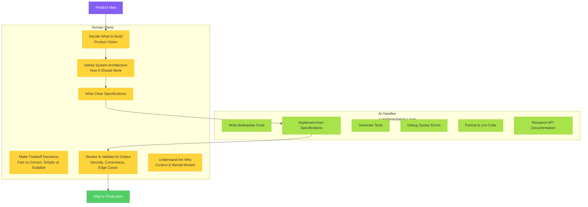

Understanding what AI handles versus what you still own is crucial for thriving as a Renaissance Developer. This isn't about AI replacing you—it's about AI elevating your work from mechanical execution to strategic thinking.

Think of it like the shift from horse-drawn carriages to automobiles. The car didn't eliminate the need for drivers—it eliminated the need to personally provide horsepower. Your job became steering, navigation, and deciding where to go rather than physically moving the vehicle. Agentic coding creates a similar transformation in software development.

### What AI Handles Now

AI agents excel at mechanical, well-defined tasks that have clear inputs and expected outputs. These are capabilities that used to consume 60-80% of a developer's time:

**Writing boilerplate code**: Need a REST API endpoint with standard CRUD operations? Need a React component with form validation? Need database models with relationships? AI generates these in seconds. The patterns are well-established, the structure is predictable, and the implementation is straightforward once you know what you want.

**Implementing specifications into code**: When you provide a clear spec—"build a user authentication system with JWT tokens, bcrypt password hashing, and rate limiting"—AI can translate that specification into working code. The clearer your spec, the better the implementation. This is why Part 2 of this book focuses heavily on spec-driven development.

**Writing tests**: AI can generate comprehensive test suites from your code, including unit tests, integration tests, and even edge case coverage. Tell it "write tests for this authentication function covering success, invalid credentials, rate limiting, and token expiration," and it produces thorough test coverage.

**Debugging syntax errors**: Mismatched brackets, typos in variable names, incorrect imports, type mismatches—AI catches these instantly. What used to interrupt your flow and require careful inspection now gets fixed automatically or flagged immediately with suggested corrections.

**Researching API documentation**: Instead of context-switching to read documentation for a library you're using, you ask Claude "how do I use bcrypt to hash passwords?" and get a working example with explanation. The knowledge is instant and contextual.

**Code formatting and style**: Proper indentation, consistent naming conventions, linting rule compliance—AI handles all of this automatically. Your code emerges clean and consistent without you thinking about it.

These capabilities represent what used to be the bulk of "coding work." If you've been a developer for more than a few years, you probably remember spending entire afternoons debugging a subtle syntax error or reading documentation to understand an API. AI eliminates this friction entirely.

### What You Still Own

The strategic, high-judgment work remains firmly in your domain. These are the capabilities that define product success and require human context, creativity, and wisdom:

**Deciding what to build** (product vision): Which features matter for your users? What's the MVP versus v1.0 versus nice-to-have? What problem are you actually solving? AI can implement any feature you describe, but it can't tell you whether that feature is worth building. Only you can understand your users, market, and business context well enough to make this call.

**Defining how it should work** (architecture): Should this be a monolith or microservices? REST or GraphQL? SQL or NoSQL? Where are the component boundaries? What are the API contracts? AI can implement any architecture you specify, but choosing the right architecture for your scale, team, and constraints requires judgment AI doesn't have.

**Writing clear specifications**: The quality of AI output is directly proportional to the clarity of your specifications. Vague instructions produce vague code. Precise specs—using patterns like EARS notation, OpenAPI schemas, or detailed requirements—produce excellent implementations. Your ability to think clearly and communicate precisely determines success.

**Making tradeoff decisions**: Every software decision involves tradeoffs. Fast vs. correct? Simple vs. scalable? Ship now vs. build it right? Optimize for developer experience or runtime performance? These decisions require understanding your specific context: team size, timeline, user expectations, business constraints. AI can explain the tradeoffs, but you must choose.

**Reviewing and validating AI output**: AI-generated code works most of the time, but "most of the time" isn't good enough for production. You need to review for correctness (does it actually solve the problem?), security (are there vulnerabilities?), maintainability (will this be painful to change later?), and edge cases (what happens when inputs are unexpected?). This requires technical literacy and judgment.

**Understanding the "why" behind choices**: When something breaks in production, or when you need to make a change six months later, understanding *why* the system was designed this way is crucial. AI can explain its implementation choices, but you need to maintain the mental model of your system's architecture, the decisions that shaped it, and the context that makes those decisions make sense.

### The Division of Labor

A useful mental model: **AI is your implementation team, you are the CTO**.

*Figure 1.4: AI excels at mechanical, well-defined tasks (green) while humans own strategic, high-judgment work (yellow). The workflow shows how they collaborate: humans provide vision and specs, AI implements, humans validate.*

A good CTO doesn't write much code, but they:

- Set the technical vision and architecture
- Make build-vs.-buy decisions
- Review designs for scalability and maintainability
- Ensure security and quality standards are met
- Communicate technical decisions to stakeholders
- Understand tradeoffs and guide priorities

This is exactly what you do as a Renaissance Developer working with AI agents. You provide vision, architecture, and judgment. AI provides implementation speed and execution consistency.

The work doesn't get easier—it gets different. You're no longer grinding through syntax and debugging. You're thinking deeply about product strategy, system design, and user needs. This is more cognitively demanding but also more impactful and rewarding.

**The key insight**: What AI handles are tasks that scale with time (more code = more hours). What you own are tasks that scale with judgment (better decisions = exponentially better outcomes). You're trading linear work for exponential impact.
