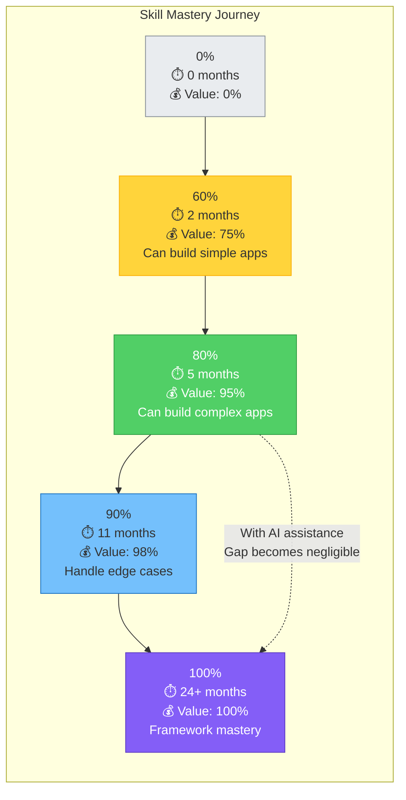

"Good enough at everything" sounds like settling for mediocrity. It's not. It's strategic optimization for maximum impact in the AI era.

The phrase isn't about lowering your standards—it's about **allocating learning effort where it creates the most value**. When AI can fill knowledge gaps on demand, the calculus of skill development fundamentally changes.

### The Law of Diminishing Returns on Depth

Consider learning React (or any technical skill). Your knowledge journey might look like this:

- **0% → 60%**: Learn basics, build simple apps. **Time**: 2 months. **Value**: Huge—you can now build things.
- **60% → 80%**: Learn hooks, context, performance optimization. **Time**: 3 months. **Value**: Significant—you can build complex apps.
- **80% → 90%**: Learn advanced patterns, edge cases, framework internals. **Time**: 6 months. **Value**: Moderate—you can handle rare scenarios.
- **90% → 100%**: Master every API, contribute to React core, understand implementation details. **Time**: 2+ years. **Value**: Minimal—you gain prestige and consulting opportunities, but rarely use this knowledge day-to-day.

The first 80% takes maybe 5 months and unlocks 95% of the practical value. The final 20% of knowledge takes years and provides minimal additional capability for product building.

Now consider what happens when you add AI to the equation:

**Without AI**: The 90%+ expert can handle edge cases and complex scenarios that the 80% developer struggles with. Depth has clear value.

**With AI**: The 80% developer asks Claude "how do I handle this edge case with React Suspense and concurrent rendering?" and gets expert guidance instantly. The gap between 80% knowledge and 100% knowledge becomes negligible because AI fills it on demand.

**The insight**: That final 20% of React mastery takes years to acquire but provides almost no additional value when you have AI assistance. Those years are better spent gaining 80% competency in other domains.

*Figure 1.5: The first 80% of knowledge (5 months) provides 95% of practical value. The final 20% takes 19+ months but adds only 5% value. With AI, the 80→100% gap becomes negligible, making deep specialization inefficient.*

### The Compounding Returns of Breadth

Now consider the alternative: spreading that same learning time across multiple domains.

Imagine you invest one year of focused learning:

**Depth approach**:

- React: 100%
- Design: 0%
- System architecture: 0%
- Product strategy: 0%
- DevOps: 0%

**Breadth approach**:

- React: 80%
- Design: 80%
- System architecture: 80%
- Product strategy: 80%
- DevOps: 0% (not needed for MVP, AI can guide you)

With the depth approach, you can build excellent React components—but you need a designer, architect, product manager, and DevOps engineer to ship a complete product. You're **dependent on others** for every step beyond React implementation.

With the breadth approach, you can:

- Design the UI yourself (80% design knowledge)
- Architect the system yourself (80% architecture knowledge)
- Prioritize features yourself (80% product knowledge)
- Implement it all with AI assistance (80% React + AI fills gaps)
- Deploy it yourself (ask AI for help with DevOps)

**You can ship independently**. The breadth approach doesn't make you weaker—it makes you **complete**.

### The Math of Value Creation

Let's quantify this. Assume each domain has 100 units of potential knowledge, and value comes from completing full products (not individual tasks):

**Deep specialist**:

- React: 100 units
- Design: 0 units
- Architecture: 0 units
- Product: 0 units
- Total knowledge: 100 units
- **Products you can ship alone**: 0

**Renaissance Developer**:

- React: 80 units
- Design: 80 units
- Architecture: 80 units
- Product: 80 units
- Total knowledge: 320 units
- **Products you can ship alone**: Many

The Renaissance Developer has 3.2x more applicable knowledge and infinitely more shipping capability. Even if we heavily discount breadth (say, 80% knowledge is only worth 60% for purposes of value), you still come out ahead: 240 discounted units and independent shipping capability vs. 100 units and dependency on a team.

### AI Makes "Good Enough" Actually Good

Here's the crucial point: **"good enough" with AI assistance often exceeds "expert" without AI**.

Example: You have 80% design knowledge. You sketch a wireframe that's decent but not great. You ask Claude, "Review this login form design for UX issues." Claude identifies:

- Password field should have a visibility toggle
- Forgot password link should be more prominent
- Error messages need to be more specific
- Form should use semantic HTML for accessibility

Your 80% design knowledge plus AI review produces a result that rivals what a professional designer might create. Your "good enough" became genuinely good.

This pattern repeats across domains:

- 80% architecture knowledge + AI code review = solid, maintainable architecture
- 80% React knowledge + AI implementation = clean, performant components
- 80% product thinking + AI analysis = well-scoped, user-focused MVPs

**The principle**: When AI can elevate "good enough" to "genuinely good," investing years to go from 80% to 100% in one domain provides almost no additional value. Those years are better spent becoming "good enough" in more domains.

### What "Good Enough" Actually Means

Let's be precise about what we mean by "good enough at everything":

**Good enough means**:

- You understand core concepts and can explain them clearly
- You recognize good vs. bad when you see it
- You can make informed decisions in this domain
- You can review and validate AI output in this area
- You can learn more on demand when needed

**Good enough does NOT mean**:

- You can do everything experts do
- You never need to consult documentation or AI
- You won't make mistakes
- You can handle every edge case from memory

Think of it like speaking a language. "Good enough" means conversational fluency—you can communicate effectively, understand most conversations, and look up words you don't know. You don't need to be a literary scholar who's memorized the entire dictionary.

### The Strategic Allocation of Learning Effort

Given finite time and energy, the Renaissance Developer makes a strategic choice:

**Traditional path**: Spend 5-10 years becoming a deep expert in one domain. Remain dependent on others for shipping complete products.

**Renaissance path**: Spend 1-2 years becoming "good enough" across five domains. Gain the ability to ship complete products independently with AI assistance.

The Renaissance path isn't easier—it requires discipline to stop at "good enough" when you could go deeper. Many developers find it psychologically difficult to remain at 80% knowledge instead of pushing to mastery. But the payoff is enormous: **you gain agency**.

You're no longer waiting for the designer to be available, or for the architect to make a decision, or for the product manager to write a spec. You can make informed decisions across all these domains yourself, ship faster, and iterate based on real user feedback rather than theoretical planning.

This is why "good enough at everything" is actually the ambitious path—it optimizes for impact, not expertise.
