Let's make this concrete with a real scenario: you need to add user authentication to an existing web application. This is a common, non-trivial feature that touches multiple domains: backend logic, frontend UI, security, user experience, and deployment.

Here's how this plays out in two different approaches.

### Traditional Specialist Approach

In a traditional team with specialists, this feature requires coordination across multiple people:

#### Day 1: Planning and Design

- **Product Manager** (2 hours): Writes user stories and acceptance criteria. "As a user, I want to log in so I can access my account." Schedules meetings with design and engineering.
- **Designer** (6 hours): Creates mockups for login form, signup flow, password reset. Iterates on feedback. Hands off to engineering.

#### Day 2-3: Backend Implementation

- **Backend Developer** (12 hours): Implements authentication API endpoints (POST /login, POST /signup, POST /reset-password). Sets up JWT token generation. Adds bcrypt password hashing. Implements rate limiting. Writes integration tests. Reviews edge cases.

#### Day 4: Frontend Implementation

- **Frontend Developer** (6 hours): Builds login and signup forms in React. Wires up API calls. Handles form validation. Adds error state handling. Implements token storage and auth state management.

#### Day 4-5: DevOps and QA

- **DevOps Engineer** (3 hours): Sets up environment variables for JWT secrets. Configures deployment pipeline. Sets up monitoring for auth endpoints.
- **QA Engineer** (4 hours): Tests happy path, error cases, edge cases. Files bugs. Re-tests fixes.

**Coordination overhead**: Multiple handoffs, status meetings, Slack threads, context switching.

**Total Timeline**: 5 days (assuming everyone is available and responsive)
**Total People**: 5 specialists
**Total Person-Hours**: ~33 hours
**Bottleneck**: Availability and coordination

```mermaid
gantt
    title Feature Implementation: User Authentication
    dateFormat X
    axisFormat %Hh

    section Traditional Team (5 days)
    PM writes specs :done, t1, 0, 2
    Designer creates mockups :done, t2, 2, 8
    Backend API dev :done, t3, 8, 20
    Frontend dev :done, t4, 20, 26
    DevOps setup :done, t5, 26, 29
    QA testing :done, t6, 29, 33

    section Renaissance Dev (1 day)
    Product brief :active, r1, 0, 1
    UI wireframe :active, r2, 1, 2
    Technical spec :active, r3, 2, 3
    AI implementation :active, r4, 3, 5
    Review & validate :active, r5, 5, 6
    Deploy & test :active, r6, 6, 7
```



*Figure 1.6: Traditional approach requires 33 person-hours across 5 specialists over 5 days with coordination overhead. Renaissance Developer completes the same feature in 7 hours solo in 1 day with full context and no handoffs.*

### Renaissance Developer with AI Approach

You, as a Renaissance Developer with AI assistance, handle this feature yourself:

#### Morning (9 AM - 12 PM): Planning and Specification

**Hour 1: Product Brief** (9-10 AM)

You write a quick product brief defining the "what" and "why":

- **Goal**: Secure user authentication for returning users
- **MVP scope**: Email/password login and signup only (no OAuth, no magic links yet)
- **Success criteria**: Users can create accounts, log in, and access protected routes
- **Out of scope**: Password strength requirements, two-factor auth, social login

**Hour 2: UI Wireframe** (10-11 AM)

You sketch a simple wireframe (paper or Excalidraw):

- Login form: email, password, "Forgot password?" link, submit button
- Signup form: email, password, confirm password, submit
- Error states: "Invalid credentials," "Email already exists," "Password too weak"

You're not a designer, but your 80% design knowledge tells you: keep it simple, make error messages clear, use standard patterns users recognize.

**Hour 3: Technical Specification** (11 AM-12 PM)

You write a clear spec in EARS notation (see Part 3 for details):

```text
AUTH-001: WHEN a user submits valid credentials, the system shall
generate a JWT token and return it with a 200 status.

AUTH-002: WHEN a user submits invalid credentials, the system shall
return a 401 error with message "Invalid email or password."

AUTH-003: The system shall hash all passwords using bcrypt with
salt rounds = 12.

AUTH-004: The system shall rate-limit login attempts to 5 per
15-minute window per IP address.

AUTH-005: WHEN a user signs up with an email that already exists,
the system shall return a 409 error.
```

You also specify the API contract:

```yaml
POST /api/auth/login
Request: { email: string, password: string }
Response: { token: string, user: { id, email } }
```

#### Afternoon (1 PM - 5 PM): Implementation and Deployment

**Hours 4-5: AI Implementation** (1-3 PM)

You ask Claude Code:

> "Implement a user authentication system based on this spec: [paste spec]. Use Express.js for backend, React for frontend, JWT for tokens, bcrypt for password hashing, and include rate limiting. Implement login, signup, and password reset endpoints. Include comprehensive tests."

Claude generates:

- Backend: Express routes, middleware, JWT generation, bcrypt hashing, rate limiting with express-rate-limit
- Frontend: Login and signup components with form validation and error handling
- Tests: Unit tests for auth logic, integration tests for API endpoints
- Database: User model with proper schema

**You review the code** (this is critical—not just accepting it blindly):

- Check that passwords are hashed, not stored in plain text ✓
- Verify JWT secret comes from environment variable, not hardcoded ✓
- Confirm rate limiting is actually applied to login endpoint ✓
- Review error messages—make sure they don't leak information (e.g., "Invalid credentials" not "User not found") ✓
- Check tests cover edge cases: empty fields, SQL injection attempts, duplicate emails ✓

You find one issue: Claude used `==` for password comparison instead of bcrypt.compare(). You ask Claude to fix it. Fixed in 30 seconds.

**Hour 6: Deploy and Validate** (3-4 PM)

You deploy to staging:

- Set environment variables for JWT secret
- Run database migrations
- Deploy via your CI/CD pipeline (you set this up previously, or use Vercel/Railway/Render for instant deploys)

You manually test:

- Create account ✓
- Log in ✓
- Try invalid password → get appropriate error ✓
- Try duplicate email signup → get appropriate error ✓
- Verify rate limiting works (try 6 login attempts rapidly) ✓
- Check that protected routes require auth token ✓

Everything works. Feature is done.

**Total Timeline**: 1 day (7 hours of focused work)
**Total People**: 1 (you)
**Total Person-Hours**: 7 hours
**Bottleneck**: None—you control the entire flow

### What's Different?

The difference isn't just that the Renaissance Developer approach is faster (though it is—7 hours vs. 33 hours). The real differences are:

**Agency**: You don't wait for anyone. No "blocked waiting for design mockups" or "waiting for backend API to be ready." You make decisions and move forward immediately.

**Context**: You maintain full context throughout. In the traditional approach, context gets lost in handoffs. The designer doesn't know why the PM chose certain requirements. The frontend dev doesn't know why the backend chose JWT over sessions. You know the "why" behind every decision because you made all of them.

**Iteration speed**: Found a UX issue during testing? You fix it immediately—no filing a ticket, no waiting for the designer to update mockups, no scheduling a meeting. You see it, you fix it, you validate it.

**Ownership**: This is your feature end-to-end. When something breaks in production, you understand the entire stack and can debug it. When a user requests a change, you can evaluate feasibility instantly across all layers.

**Quality control**: You're reviewing AI output with your 80% knowledge across all domains. You catch the security issue (password comparison bug) because you understand both security basics and code review. In the traditional approach, this might slip through if specialists aren't communicating well.

### The Catch: What You Still Need

This approach isn't magic. It requires:

1. **Sufficient knowledge**: Your 80% understanding of auth, APIs, frontend, security, and deployment makes this possible. If you had 0% knowledge, you couldn't review AI output effectively.

2. **Clear thinking**: Your spec was precise. Vague instructions to AI produce vague results.

3. **Judgment**: You decided what was MVP (email/password) vs. what could wait (OAuth, 2FA). Bad judgment means building the wrong thing fast.

4. **Validation**: You didn't blindly ship AI-generated code. You reviewed, tested, and caught issues.

This is why Renaissance Developer is a real skill set, not just "let AI do everything." The speed and agency come from combining AI implementation with human judgment across multiple domains.

### Scaling This Approach

One feature in 7 hours is nice. But the real power emerges when you apply this to an entire product. Instead of coordinating a team of 5-10 specialists for months, you can ship an MVP in weeks:

- Week 1: Product brief, requirements, architecture
- Week 2-3: Core features (auth, data models, basic UI)
- Week 4: Integration and testing
- Week 5-6: Polish and deployment

Same pattern: you orchestrate AI across all domains, maintain context, iterate rapidly, and ship complete products independently.

This is the Renaissance Developer in action—not just faster coding, but fundamentally different agency and ownership of the entire product.
