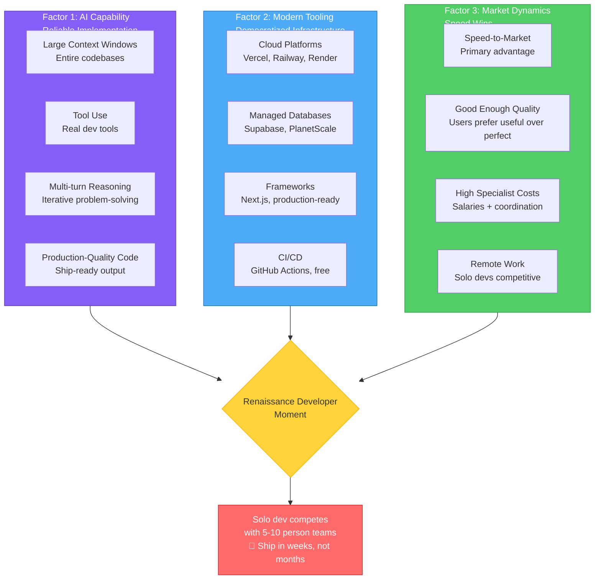

The Renaissance Developer model isn't just interesting in theory—it's suddenly *possible* in practice. Five years ago, this chapter would have been aspirational fantasy. Today, it's a practical playbook. Three factors converged in the past few years to make this shift real.

### Factor 1: AI Agents Can Handle Implementation Reliably

The breakthrough isn't that AI can write code—tools like GitHub Copilot have done that since 2021. The breakthrough is that **AI can now handle entire feature implementation end-to-end with minimal supervision**.

**What changed in 2024-2025**:

- **Context windows exploded**: Claude can now hold entire codebases in context. You can say "here's my backend API, here's my frontend components, add authentication end-to-end" and it understands how all the pieces fit together.
- **Tool use became reliable**: AI agents can now use actual development tools—running tests, checking linters, deploying code, reading error logs. They're not just generating text that looks like code; they're functioning as developers.
- **Multi-turn reasoning improved**: AI can now iterate on implementations. "This test is failing" → AI investigates → "The bug is in the validation logic" → AI fixes it → "Tests pass." This iterative problem-solving was barely possible in 2023.
- **Code quality crossed the threshold**: AI-generated code is now good enough to ship to production with review. It's not perfect, but it's comparable to junior/mid-level developer output, which is sufficient when you're reviewing it with your breadth of knowledge.

**The result**: You can now genuinely build production-ready features by writing specifications and reviewing AI implementations. This wasn't feasible five years ago when code generation was primitive and unreliable.

### Factor 2: Modern Tooling Is Radically More Accessible

Even if you could orchestrate development, you'd still need to deploy infrastructure, manage databases, configure CI/CD, handle scaling, and monitor production systems. This used to require DevOps specialists and significant capital.

**What changed in the past 5 years**:

**Cloud platforms democratized infrastructure**:

- Vercel, Netlify, Railway, Render: Deploy a full-stack app in minutes with zero DevOps configuration
- Supabase, PlanetScale, Neon: Production-grade PostgreSQL databases with automatic backups, point-in-time recovery, and scaling—no DBA required
- Cloudflare, Fastly: CDN and edge computing that "just works"

**Frameworks became production-ready out of the box**:

- Next.js, Remix, SvelteKit: Server-side rendering, API routes, optimized builds, deployment integration—all configured by default
- Tailwind CSS: Professional-looking UIs without design expertise
- tRPC, GraphQL codegen: Type-safe APIs without manual boilerplate

**Development tooling got dramatically better**:

- GitHub Actions, GitLab CI: Free CI/CD that runs tests and deploys automatically
- Sentry, LogRocket: Error tracking and monitoring with 10-minute setup
- Stripe, Auth0: Complex functionality (payments, auth) as drop-in services

**The result**: The gap between "I have an idea" and "I have a deployed, production-ready product" has shrunk from months of infrastructure work to hours of configuration. A solo developer can now access the same tools that used to require an entire DevOps team.

### Factor 3: Markets Reward Speed Over Perfection

The competitive landscape shifted in ways that favor Renaissance Developers over specialist teams:

**Speed-to-market became the primary advantage**:

- Software markets are more competitive than ever. If you spend 6 months building the perfect product, someone else ships a "good enough" version in 6 weeks and captures the market.
- Users expect rapid iteration. The "ship and improve" model beats "plan perfectly then ship."
- Funding dynamics changed: investors want to see shipped products and real user feedback, not polished plans.

**"Good enough" quality is actually good enough**:

- Users tolerate imperfect MVPs if the core value proposition works. They'd rather have a useful product with rough edges than wait for perfection.
- Technical debt in MVPs is manageable because you can iterate quickly. Ship with hardcoded configs, validate the idea, then refactor when it matters.
- Modern tools are resilient: managed databases don't go down, CDNs handle traffic spikes, monitoring tools catch errors. Your "good enough" architecture is more robust than "perfect" architecture from 2015.

**The cost of specialist teams increased**:

- Hiring engineers, designers, PMs, and DevOps engineers is expensive (salaries + benefits + overhead)
- Coordination overhead scales poorly: 5-person teams aren't 5x faster than solo developers; they're often slower due to communication overhead
- Remote work made hiring easier but also made small teams more competitive with large ones

**The result**: A Renaissance Developer who ships an MVP in 6 weeks often beats a 10-person specialist team that ships a polished product in 6 months. The market rewards the former.

### The Convergence Creates a Window

*Figure 1.7: Three independent trends converged in 2024-2025: AI agents can reliably implement features (purple), modern tooling democratized infrastructure (blue), and markets reward speed over perfection (green). Together (yellow), they enable solo developers to compete with traditional teams (red).*

These three factors don't just add up—they multiply:

- **AI makes you 5-10x faster at implementation**
- **Modern tooling makes deployment and infrastructure 10x easier**
- **Market dynamics reward shipping 5x faster**

The result: **A solo Renaissance Developer can now compete with 5-10 person specialist teams** on speed, while maintaining acceptable quality for MVPs and early-stage products.

This creates a unique window of opportunity:

**For founders**: You can validate product ideas without raising funding or hiring a team. Build, ship, get real user feedback, then decide whether to scale.

**For developers**: You can ship complete products independently, building a portfolio of real products instead of just implementing features for others.

**For small teams**: 2-3 Renaissance Developers can move faster than a traditional 10-person team with specialists, because coordination is minimal and context is shared.

**For established companies**: Teams can prototype new ideas rapidly without pulling specialists off existing projects.

### This Wasn't Possible Before

**Five years ago (2020)**:

- AI code generation was primitive (GitHub Copilot didn't exist)
- Cloud platforms existed but weren't as polished or affordable
- Markets valued "enterprise-grade" perfection over rapid iteration
- Solo developers could build simple apps but not complete products

**Today (2025)**:

- AI agents can implement full features end-to-end
- Deployment is trivial and infrastructure is commoditized
- Markets reward speed and iteration over perfection
- Solo developers can build and ship production-grade products

**This is the Renaissance moment**: The tools, economics, and market conditions aligned to make broad competency plus AI assistance more valuable than deep specialization. This window might not last forever (though it probably will for years), but it's here now.

### What This Chapter Set Up

This chapter explained **what** the Renaissance Developer is:

- A modern polymath who is "good enough at everything" to ship complete products
- Someone who orchestrates AI and tools rather than implementing everything manually
- A builder who optimizes for impact and agency over craft and specialization

The rest of this book teaches **how** to become one:

- **Part 1 (Foundations)**: The mental models and principles
- **Part 2 (The Playbook)**: The 6-week workflow from idea to production
- **Part 3 (Patterns & Tools)**: The specific techniques and technologies
- **Part 4 (Example)**: A complete real-world demonstration

If you've read this far and thought "this sounds interesting but impossible," understand: it's not only possible, it's already happening. Developers are shipping complete products solo in weeks. Small teams are moving faster than large companies. The Renaissance Developer isn't the future—it's the present.

The question isn't whether this shift is happening. The question is: will you adapt to it, or resist it?

The next chapter dives into what agentic coding actually means and how it works in practice.
