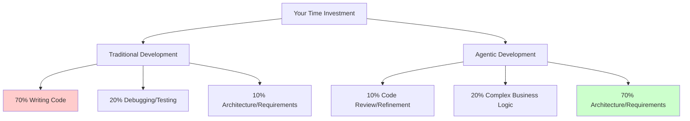
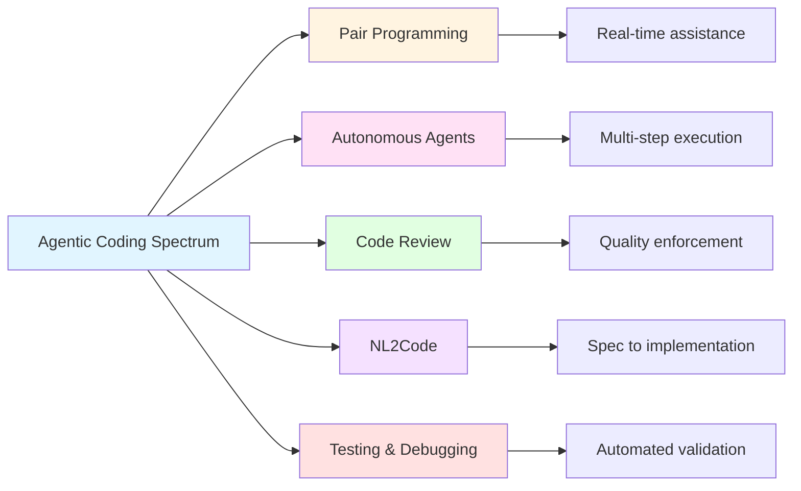
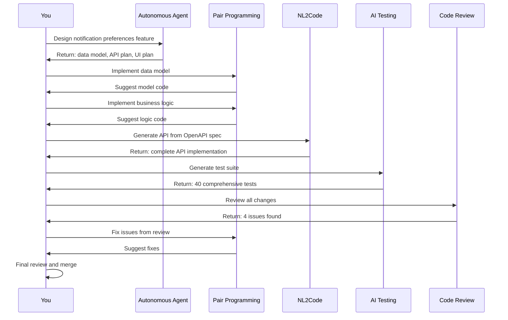

# What is Agentic Coding?

## Introduction

Picture yourself building a REST API. It's 2020. You spend the morning setting up your project structure, configuring dependencies, and writing boilerplate code for route handlers. By lunch, you've implemented two endpoints. The afternoon goes to error handling, input validation, and writing tests. By evening, you have a working but incomplete API. Eight hours for four endpoints.

Now imagine it's 2026. You spend 30 minutes writing an OpenAPI specification that describes exactly what your API should do. You hand that spec to an AI agent. Five minutes later, you have a complete server scaffold with all routes, validation, error handling, and basic tests. You spend the next two hours implementing the actual business logic—the parts that require your product knowledge and judgment. You review the AI's work, iterate on a few details, and by mid-afternoon you have a production-ready API with comprehensive test coverage. Three hours total.

That's the difference agentic coding makes. The mechanical work—the boilerplate, the repetitive patterns, the tedious testing—happens in minutes instead of hours. Your time shifts from typing code to thinking about architecture, validating requirements, and making product decisions.

But here's what most people miss: agentic coding isn't just about one tool like GitHub Copilot or Claude Code. It's a complete ecosystem of AI-powered capabilities that work together throughout the development lifecycle. Understanding this full spectrum is crucial because each category of tools excels at different tasks, and knowing when to use which tool determines how effective you'll be.

## Defining Agentic Coding

**Agentic Coding** is the practice of using AI agents as active partners in software development, handling tasks ranging from code generation to testing and deployment, while humans focus on product vision, architecture, and strategic judgment.

The term "agentic" emphasizes that these aren't just passive autocomplete tools—they're agents with capabilities to plan, execute multi-step tasks, and make decisions within the guardrails you provide. You're not just getting smarter text completion; you're gaining collaborators that can understand context, follow specifications, and produce working implementations.

### The Core Shift

The fundamental change in agentic coding is this: **you shift from code executor to product orchestrator**.

In traditional development, your day looks like this:

- 70% typing code
- 20% debugging and testing
- 10% thinking about architecture and requirements

In agentic development, the ratios flip:

- 10% reviewing and refining AI-generated code
- 20% implementing complex business logic that requires your expertise
- 70% thinking about what to build, how it should work, and why certain tradeoffs matter

The AI agents handle the mechanical implementation details—the parts where you're following established patterns and converting specifications into code. You handle the parts that require judgment, domain knowledge, and strategic thinking.

This creates a profound shift in where value comes from. As a traditional developer, your value was partly in your ability to quickly and accurately translate requirements into working code. As an agentic developer, your value is almost entirely in your ability to:

- **Define clear requirements** - What should this system do? What are the edge cases?
- **Make architectural decisions** - How should components interact? What are the tradeoffs?
- **Validate implementations** - Does this code actually meet the requirements? Is it secure? Maintainable?
- **Think strategically** - Should we build this feature at all? Is this the right tradeoff for our users?

The speedup is remarkable—development accelerates 5-10x in practice. But this creates new bottlenecks. When coding no longer takes all your time, requirements clarity and product decisions become the critical path. We'll explore these new bottlenecks in depth in Chapter 5: New Bottlenecks (coming soon).



*Figure 2.1: Time allocation shift in agentic coding. The mechanical work (code writing, debugging) shrinks dramatically while strategic work (architecture, requirements) expands to fill your time. Your value shifts from execution speed to thinking quality.*

## The Spectrum of Agentic Coding

Agentic coding isn't one tool or technique—it's five complementary categories that work together throughout the development lifecycle. Think of them as different tools in your workshop: each excels at specific tasks, and mastery comes from knowing when to reach for which one.



*Figure 2.2: The five categories of agentic coding tools. Each serves a different role in the development workflow, from real-time pair programming assistance to automated testing and quality validation.*

### AI Pair Programming Tools

AI pair programming tools work alongside you in real-time as you write code, like having an exceptionally knowledgeable colleague looking over your shoulder—but one that never gets tired, never judges your questions, and has instant recall of millions of code patterns.

**What they do:**

These tools integrate directly into your development environment (VS Code, JetBrains, Vim, etc.) and provide:

- **Context-aware autocomplete** - They analyze your current file, related files, and even your entire codebase to suggest completions that fit your patterns and style.

- **Function and block generation** - When you start writing a function signature, they can generate the entire implementation based on the function name, parameters, and surrounding context.

- **Code explanation** - Select any code and ask "What does this do?" or "Why would someone write it this way?" Great for understanding unfamiliar codebases.

- **Error diagnosis** - When you hit a compiler error or test failure, they can explain what went wrong and suggest fixes.

- **Technical Q&A** - Ask questions like "How do I handle authentication in Express.js?" or "What's the difference between useEffect and useLayoutEffect?" without leaving your editor.

**Examples** (focusing on capabilities, not specific versions):

- **Claude Code** - The tool used to write this book. Excels at understanding large codebases, following project-specific patterns, and explaining complex concepts.
- **GitHub Copilot** - One of the first mainstream AI pair programming tools, known for strong autocomplete across many languages.
- **Cursor** - An AI-first code editor with deep integration for multi-file edits and codebase understanding.
- **Codeium** - Free alternative with good performance and enterprise features.

The landscape evolves rapidly, with new tools emerging regularly. The key capabilities remain consistent: real-time assistance, context awareness, and integration into your development flow.

**When to use:**

Day-to-day development when you're actively writing or reviewing code. These tools shine when:

- Implementing known patterns (CRUD operations, validation logic, API endpoints)
- Working in unfamiliar languages or frameworks
- Writing tests (they're particularly good at generating test cases)
- Refactoring code (they can suggest improvements while maintaining functionality)

**Strengths:**

The power of pair programming tools comes from their context awareness. They read your entire codebase, understand your naming conventions, recognize your architectural patterns, and adapt suggestions accordingly. They learn your style and follow it. This makes them far more useful than generic code snippets from Stack Overflow—their suggestions actually fit your project.

**Limitations:**

They're conversational partners, not autonomous executors. You're still driving—deciding what to build, how to architect it, and whether their suggestions are correct. They can't understand your product requirements or make strategic technical decisions. They're junior developers with excellent recall but limited judgment.

### Autonomous Agents

Autonomous agents represent a step up in independence. While pair programming tools respond to your immediate actions, autonomous agents can plan and execute multi-step tasks with minimal guidance. Give them a goal and acceptance criteria, and they'll figure out the steps to get there.

**What they do:**

- **Plan and execute complex tasks** - You describe what you want ("Refactor the authentication module to use JWT tokens instead of sessions") and they break it down into steps, execute each one, and handle dependencies between them.

- **Make architectural decisions within guardrails** - They choose between valid implementation approaches based on your codebase patterns and stated preferences.

- **Handle multi-file refactoring** - Changes that touch dozens of files (renaming a core concept, restructuring a module, updating API contracts) happen systematically with tracked dependencies.

- **Implement features from high-level descriptions** - Describe a feature in product terms ("Add pagination to the user list with prev/next buttons and page size selector") and get a complete implementation including UI, API changes, and tests.

- **Run tests and fix failures autonomously** - They can execute your test suite, analyze failures, hypothesize about root causes, apply fixes, and rerun tests until they pass.

**Examples:**

- **ChatGPT with Code Interpreter** - Can write, execute, and debug code in a sandboxed environment, handling multi-step data analysis or script development.
- **AutoGPT and similar frameworks** - Designed specifically for autonomous task completion with planning and execution loops.
- **Agent-based coding platforms** - Emerging tools that orchestrate multiple specialized agents to handle different aspects of a task.
- **Multi-agent systems** - Experimental setups where different agents handle frontend, backend, testing, and documentation in parallel.

**When to use:**

Well-defined tasks where you can specify acceptance criteria clearly:

- Large refactorings with clear before/after states
- Feature implementation where requirements are specific
- Technical debt cleanup (updating dependencies, modernizing patterns)
- Migration tasks (database schema changes, API versioning)

**Strengths:**

Autonomous agents excel at tedious, multi-step work that would take you hours of mechanical effort. They don't get bored, don't cut corners, and handle repetitive tasks with perfect consistency. They're particularly valuable for work where the "what" is clear but the "how" involves many small, interconnected steps.

**Limitations:**

They need clear goals and acceptance criteria. Ambiguous requirements lead to implementations that technically work but miss your intent. They also can't make strategic product decisions—they won't tell you "this feature shouldn't be built" or "here's a better approach to the underlying problem." They execute plans; you must provide the strategy.

### AI-Assisted Code Review

AI code review tools act as tireless reviewers that analyze every line of code for quality, security, and best practices. They catch issues humans miss—especially on that 500th line of a long PR when attention starts to drift.

**What they do:**

- **Review pull requests automatically** - Every PR gets analyzed before human reviewers see it, catching low-level issues so humans can focus on architecture and logic.

- **Identify bugs and security vulnerabilities** - Find SQL injection risks, XSS vulnerabilities, authentication bypasses, race conditions, and other issues through static and dynamic analysis.

- **Suggest improvements and refactorings** - Point out code smells, overly complex functions, duplicated logic, and opportunities for simplification.

- **Check adherence to style guides and patterns** - Enforce team conventions, naming standards, architectural patterns, and project-specific rules.

- **Flag technical debt** - Identify accumulating complexity, growing dependencies, test coverage gaps, and maintenance burdens.

**Examples:**

- **AI-powered GitHub PR reviewers** - Bots that comment on PRs with suggestions, similar to how a colleague would review your code.
- **SonarQube with AI features** - Enterprise-grade code quality and security analysis with machine learning enhancements.
- **CodeClimate with ML** - Automated maintainability scoring and technical debt tracking.
- **Custom review bots** - Teams building their own reviewers tuned to project-specific patterns and requirements.

**When to use:**

- **Before merging code** - Catch issues before they reach production
- **During PR review** - Supplement human review with automated analysis
- **Continuous quality monitoring** - Track code quality trends over time
- **Learning and training** - Help team members learn best practices through automated feedback

**Strengths:**

AI reviewers are consistent, thorough, and never fatigued. They check every line with the same rigor whether it's the first file or the fiftieth. They remember all your project's rules and patterns without fail. They catch subtle security issues that even experienced developers might miss. And they're available instantly—no waiting for reviewers to free up time.

**Limitations:**

They can't judge product fit or strategic technical decisions. They won't tell you "this feature adds unnecessary complexity" or "this abstraction isn't worth the maintenance burden." They enforce rules but don't create wisdom. Human reviewers still own the high-level feedback about architecture, user experience, and strategic direction.

### Natural Language to Code Generation

Natural Language to Code (NL2Code) tools bridge the gap between specifications and implementations. They take structured descriptions of what you want—OpenAPI specs, database schemas, UI mockups, written requirements—and generate working code.

**What they do:**

- **Convert written requirements into implementations** - Take acceptance criteria in plain English and produce code that meets them, including edge cases and error handling.

- **Generate boilerplate from specs** - An OpenAPI specification becomes a complete server implementation with routes, validation, error handling, and request/response serialization.

- **Create tests from acceptance criteria** - Requirements written in EARS notation (see Part 3: EARS Notation (coming soon)) become comprehensive test suites.

- **Build UIs from mockups and descriptions** - Design mockups plus interaction descriptions become working components with proper state management and event handling.

- **Scaffold projects from templates** - High-level project descriptions ("React app with authentication, user profiles, and payment integration") become complete project structures with best practices built in.

**Examples:**

- **Spec-to-code generators** - Tools that consume OpenAPI, AsyncAPI, or GraphQL schemas and generate server or client code.
- **No-code/low-code platforms with AI** - Visual builders that use AI to interpret your intent and generate production-ready code.
- **Documentation-to-implementation tools** - Systems that read API documentation or requirements documents and implement the described functionality.

**When to use:**

- **Starting new features** - Get a working scaffold to build on rather than starting from scratch
- **Generating boilerplate** - CRUD APIs, form validation, authentication flows, and other well-established patterns
- **Implementing well-specified interfaces** - When you have clear contracts (API specs, schemas) that define exactly what you need

**Strengths:**

NL2Code tools excel at bridging specifications and implementations. When you've invested time in clear specs—writing detailed OpenAPI definitions, drawing precise database schemas, documenting exact requirements—these tools turn that specification work into implementation work almost instantly. This creates a powerful incentive for specification-driven development: the better your specs, the more value you get from automation.

**Limitations:**

They require clear, unambiguous specifications. Vague requirements produce vague implementations. They also can't make product decisions disguised as technical choices (like "should this be a separate service or a new module?"). The quality of output directly correlates with the quality of input—garbage in, garbage out is the iron law.

### AI-Driven Testing and Debugging

AI testing and debugging tools handle the mechanical work of creating comprehensive test suites and finding the root causes of failures. They generate test cases you might not think of, achieve high coverage quickly, and help diagnose complex bugs.

**What they do:**

- **Generate unit and integration tests from code** - Analyze your implementation and create tests that exercise all code paths, including edge cases and error conditions.

- **Create test data and edge cases** - Generate realistic test data, boundary conditions, and corner cases that expose bugs.

- **Find bugs through static and dynamic analysis** - Detect issues through code analysis (static) and runtime behavior observation (dynamic), catching problems before they reach production.

- **Suggest root causes of failures** - When tests fail, analyze the failure, trace through execution, and hypothesize about what went wrong.

- **Propose fixes for identified issues** - Not just "here's a bug" but "here's a bug and here's how to fix it, with code."

**Examples:**

- **AI test generation tools** - Systems that analyze your code and automatically create comprehensive test suites
- **Intelligent debuggers with AI** - Debuggers that suggest likely bug locations based on symptoms and execution traces
- **Mutation testing with AI** - Tools that introduce deliberate bugs to verify your tests actually catch issues
- **Anomaly detection in production** - Monitoring systems that learn normal behavior and flag deviations

**When to use:**

- **Writing test suites** - Especially for legacy code that lacks tests
- **Debugging complex issues** - When the root cause isn't obvious from error messages
- **Improving coverage** - Finding gaps in existing test suites and filling them
- **Regression prevention** - Generating tests that prevent bugs from recurring

**Strengths:**

AI testing tools are thorough and creative. They generate test cases you wouldn't think of, including edge cases that only emerge in production. They achieve high code coverage quickly, turning hours of test writing into minutes. For debugging, they can analyze vast execution traces and correlate failures across runs to identify patterns humans would miss.

**Limitations:**

Generated tests can sometimes be shallow—they execute code paths without truly validating correctness. You still need to review tests to ensure they check meaningful invariants, not just "the code runs without crashing." For debugging, AI suggestions are hypotheses, not guarantees. You must validate their reasoning and confirm fixes actually address the root cause.

## How They Work Together

The real power of agentic coding emerges when these five categories work together throughout your development workflow. No single tool handles everything—you orchestrate them like instruments in an ensemble, each playing its part at the right time.

Let's walk through building a new feature end-to-end to see how they combine:

### Feature: User Notification Preferences

Imagine you're adding a feature that lets users customize their notification preferences—email vs SMS, frequency, topic subscriptions. Here's how the categories work together:

**1. Planning Phase** (You + Autonomous Agent)

You start with a high-level product description: "Users need to control how they receive notifications—channel (email/SMS), frequency (immediate/daily digest/weekly), and topics they care about."

You engage an autonomous agent: "Based on our existing user profile system, design the notification preferences feature. Include data model changes, API endpoints needed, and UI components required."

The agent produces a plan:

- Extend user profile schema with preferences table
- Create REST API for CRUD on preferences
- Build settings UI component
- Update notification service to respect preferences

**2. Implementation Phase** (You + Pair Programming)

You start implementing, using a pair programming tool for assistance:

You write: `// Create notification preferences model`

The AI suggests a complete model based on your project's ORM patterns:

```python
class NotificationPreference(models.Model):
    user = models.ForeignKey(User, on_delete=models.CASCADE)
    channel = models.CharField(
        max_length=20,
        choices=[('email', 'Email'), ('sms', 'SMS')]
    )
    frequency = models.CharField(
        max_length=20,
        choices=[
            ('immediate', 'Immediate'),
            ('daily', 'Daily Digest'),
            ('weekly', 'Weekly Summary')
        ]
    )
    topics = models.ManyToManyField('NotificationTopic')
    created_at = models.DateTimeField(auto_now_add=True)
    updated_at = models.DateTimeField(auto_now=True)

```

You review, accept, and continue. The pair programming tool adapts to your decisions and maintains consistency across files.

**3. Specification Phase** (NL2Code)

For the API, you write an OpenAPI spec describing the endpoints:

```yaml
/api/preferences:
  get:
    summary: Get user notification preferences
    responses:
      200:
        content:
          application/json:
            schema:
              $ref: '#/components/schemas/PreferenceList'
  post:
    summary: Create notification preference
    requestBody:
      content:
        application/json:
          schema:
            $ref: '#/components/schemas/PreferenceCreate'

```

You feed this to an NL2Code tool, which generates the complete API implementation with validation, error handling, and database queries. Five minutes versus two hours of manual coding.

**4. Testing Phase** (AI Testing)

You point an AI testing tool at your new code: "Generate comprehensive tests for the notification preferences API."

It produces a test suite covering:

- Happy path: creating, reading, updating, deleting preferences
- Edge cases: invalid channels, conflicting preferences, missing topics
- Authorization: users can only manage their own preferences
- Validation: malformed requests return proper error codes

The tool generates 40 tests in minutes—tests that would take hours to write manually.

**5. Review Phase** (AI Code Review)

Before merging, you run AI code review. It catches:

- Missing index on `user_id` field (performance issue)
- No rate limiting on preference updates (potential abuse)
- Inconsistent error messages between endpoints (UX issue)
- Hardcoded SMS provider credentials (security issue)

You fix these issues. The AI's mechanical vigilance catches what you missed.

**6. Refinement Phase** (You + Pair Programming)

Based on the review feedback, you iterate. The pair programming tool helps you:

- Add the database index with proper migration
- Implement rate limiting following your project's patterns
- Standardize error messages across endpoints
- Move credentials to environment variables

You review the changes, run the full test suite, and merge with confidence.



*Figure 2.3: How agentic coding categories work together in a real feature workflow. Each tool plays its part at the appropriate stage, from planning through implementation to validation and refinement.*

### The Amplification Effect

Notice what happened in this workflow: **the AI handled all the mechanical work**. Writing boilerplate, generating tests, checking for common issues—all automated. Your time went to:

- **Product decisions**: What features do users need? What's the right UX?
- **Architecture choices**: How should this integrate with existing systems? What are the tradeoffs?
- **Validation and judgment**: Is this implementation correct? Secure? Maintainable?

This is the core promise of agentic coding. The tools don't replace you—they amplify you. They handle the mechanical parts where you're applying known patterns, freeing you to focus on the parts that require insight, creativity, and judgment.

The result: what might have taken 2-3 days of focused work in traditional development gets compressed into 4-6 hours in agentic development. You ship 5-10x faster, often with better quality because AI tools are thorough in ways humans aren't.

But—and this is crucial—this only works when you maintain your role as orchestrator. You set the direction, validate the output, and make the decisions that require context the AI doesn't have. Abdicate that responsibility, and you get fast garbage instead of slow quality.

## What Agentic Coding Is NOT

Before going further, let's clear up common misconceptions. Setting accurate expectations is crucial—overhyped expectations lead to disappointment and underuse, while too-low expectations lead to missing opportunities.

### Not Magic

AI doesn't read your mind or solve ambiguous problems. It's powerful but not sentient.

You must still:

**Define clear requirements** - "Make the app better" produces generic improvements. "Add pagination to the user list with 25 items per page, prev/next buttons, and a page size selector" produces exactly what you need. Specificity matters enormously.

**Make architectural decisions** - Should this be a microservice or a module? REST or GraphQL? SQL or NoSQL? These decisions require understanding your system's constraints, team capabilities, and product roadmap—context the AI doesn't have.

**Review and validate output** - AI-generated code can be wrong, insecure, or inefficient. Always review. Always test. Never merge blindly. The AI is proposing implementations, not guaranteeing correctness.

**Understand what you're building** - You can't effectively review code you don't understand. You can't validate that it meets requirements without knowing what those requirements mean. Agentic coding accelerates execution, but it doesn't eliminate the need for understanding.

The "magic" feeling comes from the speed and fluency, not from bypassing fundamental software engineering discipline.

### Not Autonomous (Yet)

Current agentic tools need guidance and oversight. They're powerful assistants, not replacement developers.

They don't:

**Replace product thinking** - AI can't decide what features to build, who your users are, or what problems are worth solving. Product strategy requires understanding markets, users, and business objectives in ways current AI can't replicate.

**Make strategic decisions autonomously** - Technical decisions are often product decisions in disguise. Choosing between approaches requires weighing tradeoffs specific to your situation—current growth, team skills, timeline constraints, user needs. AI can present options but can't choose for you.

**Understand business context without your input** - Why are you building this? What's the competitive landscape? What did you already try? What failed? This context shapes every technical decision but rarely appears in code or specifications.

**Ship code without human review** - Would you trust a junior developer to merge directly to production without review? That's the current state of AI agents—highly capable, occasionally brilliant, but requiring oversight.

The dream of "describe your product and get working software" remains elusive. We're not there yet, and won't be soon. Current tools require active partnership, not passive delegation.

### Not Perfect

AI-generated code has the same potential flaws as human-written code, sometimes in different patterns.

You still need to:

**Review code critically** - Ask questions like:

- Does this actually solve the problem?
- Are there edge cases this misses?
- Is this maintainable? Will someone understand it in six months?
- Does it follow our architectural patterns?

**Test thoroughly** - AI-generated code can have subtle bugs, especially in:

- Error handling paths (the code works for happy paths but fails on errors)
- Edge cases (boundary conditions, empty inputs, unexpected combinations)
- Security (authentication bypass, injection vulnerabilities, data leaks)
- Performance (N+1 queries, inefficient algorithms, memory leaks)

**Validate against requirements** - Generated code might technically work but miss your intent. Always verify it solves the actual problem, not just a related problem.

**Apply engineering judgment** - Sometimes the "correct" implementation isn't the right choice. Maybe it's too complex for your team to maintain. Maybe it over-engineers a simple problem. Maybe it introduces dependencies you want to avoid. Technical correctness doesn't equal good engineering.

Think of AI as an incredibly productive but junior team member. High output, occasional brilliance, but requiring mentorship and review. Your job is to provide the judgment and oversight that ensures quality.

## The Agentic Coding Mindset

Successfully adopting agentic coding requires a mental shift. The mechanics are different, the workflow is different, and your role fundamentally changes. Here's the mindset that makes it work:

### From Implementation to Orchestration

**Old mindset**: "I need to implement this feature. Let me write the code."

Your mental model is hands-on-keyboard. You think in terms of "I'll create this class, then write this method, then handle these error cases." You're the executor.

**New mindset**: "I need to deliver this feature. Let me define what 'done' looks like, then orchestrate AI agents to implement it while I focus on architecture and validation."

Your mental model is conductor-of-orchestra. You think in terms of "Here's the spec. Here's what success looks like. Generate the implementation. I'll review and refine." You're the orchestrator.

This shift is profound. You're no longer primarily a code writer. You're primarily a:

- **Requirements clarifier** - Getting crystal clear on what "done" means
- **Architecture designer** - Defining how components fit together
- **Quality validator** - Ensuring implementations meet standards
- **Strategic decision maker** - Choosing between valid approaches based on context

### Think in Outcomes, Not Implementation Steps

Traditional development trains you to think in terms of "how"—the sequence of steps to implement something. Agentic coding inverts this: you think in terms of "what"—the desired outcome.

**Instead of**: "I'll create a User model, add a preferences field, write migrations, create a form, add validation..."

**Think**: "Users need to customize notification preferences. Success looks like: they can choose email vs SMS, set frequency, select topics, and see changes reflected immediately."

The AI figures out the "how" based on your codebase patterns. You define the "what" and validate the "how" makes sense.

This takes practice. We're trained to think procedurally. Outcomes-based thinking feels unnatural at first, but it's more aligned with what actually matters—shipping features that solve user problems.

### Treat AI as a Junior Dev Who Needs Clear Specs

The best mental model for AI agents: imagine a capable but junior developer who:

- Types incredibly fast and has excellent recall of code patterns
- Needs clear specifications and examples
- Makes mistakes and requires review
- Improves with feedback and iteration

This model guides your interactions:

**Provide clear specs**: Junior devs need detailed requirements. So do AI agents. "Add authentication" is vague. "Add JWT-based authentication with email/password login, access tokens that expire after 1 hour, refresh tokens that expire after 30 days, and token rotation on refresh" is specific enough to generate correctly.

**Give examples**: Show the AI what good looks like. Point to existing code: "Follow the pattern in auth.js for handling async errors." Reference external examples: "Use the same approach as the Stripe SDK for retry logic."

**Review output**: You wouldn't merge a junior dev's PR without review. Don't merge AI output without review. Check for correctness, security, maintainability, and fit with your architecture.

**Iterate based on feedback**: When the AI misses something, give specific feedback. "This doesn't handle the case where the user has no payment method" leads to a fix. "This is wrong" leads nowhere.

### Invest Time in Requirements Clarity—It Pays 10x

In traditional development, vague requirements slow you down but don't stop you. You can start coding, discover ambiguities, clarify them, and adjust. The penalty for vague requirements is iteration time.

In agentic development, vague requirements generate vague implementations. The AI will make assumptions—often wrong ones. You'll get working code that solves the wrong problem. The penalty for vague requirements is wasted work.

This creates a powerful incentive: **spend time upfront getting requirements crystal clear**. The clearer your requirements, the better the AI's output, the less time you spend reviewing and refining.

Paradoxically, agentic coding makes you better at traditional software engineering disciplines like requirements analysis and specification writing. The feedback is immediate and clear: good specs → good implementations. Bad specs → bad implementations.

Time invested in clarity pays 10x dividends. An hour spent writing clear requirements saves 10 hours of implementing the wrong thing, debugging subtle issues, and refactoring to match actual needs.

### Your Value Is in the "What" and "Why," Not the "How"

The final mindset shift: recognize where your value comes from in agentic development.

**Low value in agentic coding**:

- Typing speed
- Memorizing syntax
- Implementing well-established patterns
- Converting specs to code

AI handles all of this competently and fast.

**High value in agentic coding**:

- Understanding user needs
- Defining clear requirements
- Making architectural decisions
- Evaluating tradeoffs
- Ensuring security and quality
- Applying strategic judgment

This is where humans remain indispensable—and where your career growth should focus.

The skills that matter in agentic coding are the skills that have always mattered in software engineering, but we often neglected them because implementation took all our time. Now that implementation is fast, the strategic skills become the entire job.

If that sounds daunting, consider: these are the fun parts. Understanding users, architecting systems, solving hard problems—this is why many people got into software in the first place. Agentic coding lets you spend more time on the interesting problems and less time on mechanical execution.

## Practical Example: Building a REST API

Let's make this concrete with a complete example: building a REST API for a task management system. We'll contrast the traditional approach with the agentic approach to see the differences clearly.

### Traditional Approach (Pre-2024)

**Goal**: Build a REST API for managing tasks with endpoints for creating, reading, updating, and deleting tasks, plus listing tasks by user and by status.

**Timeline**:

#### Hour 1-2: Setup and boilerplate

- Initialize project structure
- Configure dependencies (Express, database driver, testing framework)
- Set up database connection
- Create base server with middleware

#### Hour 3-4: Implement endpoints

- Write POST /tasks endpoint with validation
- Write GET /tasks/:id endpoint
- Write PUT /tasks/:id endpoint
- Write DELETE /tasks/:id endpoint
- Write GET /tasks?user_id=X endpoint
- Write GET /tasks?status=X endpoint

#### Hour 5-6: Error handling and validation

- Add input validation for all endpoints
- Implement error handling middleware
- Add database error handling
- Add authentication/authorization checks

#### Hour 7-8: Testing

- Write unit tests for each endpoint
- Write integration tests
- Test edge cases (invalid IDs, missing fields, etc.)
- Debug test failures

#### Hour 9-10: Documentation and polish

- Write API documentation
- Add request/response examples
- Final testing and debugging
- Code review and cleanup

**Total time**: 10-12 hours of focused work

**Result**: Working API with reasonable test coverage and basic documentation

### Agentic Approach (2026)

**Goal**: Same as above—complete REST API for task management.

**Timeline**:

#### 30 minutes: Write OpenAPI specification

Instead of writing code, you write a spec describing what the API should do:

```yaml
openapi: 3.0.0
info:
  title: Task Management API
  version: 1.0.0

paths:
  /tasks:
    get:
      summary: List tasks
      parameters:
        - name: user_id

          in: query
          schema:
            type: integer
        - name: status

          in: query
          schema:
            type: string
            enum: [pending, in_progress, completed]
      responses:
        200:
          description: Task list
          content:
            application/json:
              schema:
                type: array
                items:
                  $ref: '#/components/schemas/Task'

    post:
      summary: Create task
      requestBody:
        content:
          application/json:
            schema:
              $ref: '#/components/schemas/TaskCreate'
      responses:
        201:
          description: Task created
          content:
            application/json:
              schema:
                $ref: '#/components/schemas/Task'

  /tasks/{id}:
    get:
      summary: Get task by ID
      parameters:
        - name: id

          in: path
          required: true
          schema:
            type: integer
      responses:
        200:
          description: Task details
          content:
            application/json:
              schema:
                $ref: '#/components/schemas/Task'
        404:
          description: Task not found

components:
  schemas:
    Task:
      type: object
      properties:
        id:
          type: integer
        title:
          type: string
        description:
          type: string
        status:
          type: string
          enum: [pending, in_progress, completed]
        user_id:
          type: integer
        created_at:
          type: string
          format: date-time

```

You're thinking about the API design, not implementation details. What endpoints? What parameters? What responses? The spec captures your requirements precisely.

#### 5 minutes: Generate server scaffold

Feed the OpenAPI spec to an NL2Code tool: "Generate an Express.js server implementing this API with PostgreSQL backend, input validation, error handling, and basic authentication."

Output: Complete project structure with:

- All routes implemented
- Request validation using the spec
- Database schema and migrations
- Error handling middleware
- Authentication middleware
- Basic configuration

#### 1-2 hours: Implement business logic

The generated code handles all the mechanical parts—routing, validation, serialization. You focus on the parts that need your domain knowledge:

- Task ownership rules (who can modify whose tasks?)
- Status transition logic (can you skip from pending to completed?)
- Notification triggers (notify assignee when status changes)
- Performance optimizations (indices, query optimization)

You work with a pair programming tool that suggests implementations based on your codebase patterns. It understands your architecture and follows your conventions.

#### 15 minutes: Generate test suite

Point an AI testing tool at your implementation: "Generate comprehensive tests covering all endpoints, edge cases, and error conditions."

Output: Test suite with:

- Happy path tests for all endpoints
- Edge case tests (invalid IDs, missing fields, wrong types)
- Authorization tests (users can't modify others' tasks)
- Error handling tests (database failures, network issues)
- Performance tests (large task lists, query efficiency)

You review the tests, add a few domain-specific cases the AI missed, and run the suite.

#### 10 minutes: Code review

Run AI code review: "Check this implementation for security issues, code quality, and best practices."

Findings:

- Missing index on user_id field (performance issue)
- No rate limiting (security issue)
- Inconsistent error message format (UX issue)
- SQL injection risk in custom query filter (security issue)

All legitimate issues you fix quickly with pair programming assistance.

#### 30 minutes: Fix issues and finalize

Address the review findings:

- Add database index
- Implement rate limiting following project patterns
- Standardize error messages
- Fix SQL injection vulnerability using parameterized queries

Run tests again (all pass), do final review, and deploy.

**Total time**: 3-4 hours

**Result**: Production-ready API with comprehensive tests, security review passed, complete documentation (the OpenAPI spec serves as documentation), and better coverage than the traditional approach.

### The Difference

Same result, but:

- **60-70% time savings** (10-12 hours → 3-4 hours)
- **Better test coverage** (AI generates edge cases you'd skip)
- **Better documentation** (OpenAPI spec is both input and documentation)
- **Fewer security issues** (AI review catches common vulnerabilities)
- **More time on business logic** (70% of your time vs 20%)

The mechanical work—boilerplate, validation, testing setup—collapses to minutes. Your time goes to requirements clarity (writing the spec) and business logic (domain-specific rules). That's the agentic coding promise realized.

## Common Pitfalls

As with any powerful tool, there are ways to misuse agentic coding. Here are the most common mistakes people make when starting out, and how to avoid them.

### Pitfall 1: Treating AI as Infallible

**The mistake**: Assuming AI-generated code is correct because it runs without errors or passes basic tests.

**The reality**: AI makes mistakes. It can:

- Write code with subtle bugs that only appear in edge cases
- Introduce security vulnerabilities (SQL injection, XSS, authentication bypass)
- Create inefficient implementations (O(n²) algorithms where O(n) exists)
- Miss requirements (code works but doesn't do what you actually need)
- Follow antipatterns (works but violates best practices)

**How to avoid**:

- **Always review AI-generated code** - Read every line you're adding to your codebase
- **Always test thoroughly** - Don't rely on AI-generated tests alone; add your own
- **Question assumptions** - If something looks unusual, investigate why
- **Use code review tools** - Both AI and human reviewers catch different types of issues
- **Trust but verify** - The AI is proposing implementations, not guaranteeing correctness

Treat AI output like you'd treat code from a capable but junior developer: probably good, possibly excellent, definitely requiring review.

### Pitfall 2: Skipping Requirements Definition

**The mistake**: Jumping straight to "build me a task management system" without defining what that means.

**The reality**: Vague requirements generate vague implementations. The AI will make assumptions that don't match your needs.

What does "task management" mean?

- Can tasks have subtasks?
- Can multiple users be assigned?
- What are the possible statuses?
- Can tasks have deadlines?
- What permissions model?
- What about recurring tasks?

Different answers lead to completely different implementations. The AI will pick something reasonable—but probably not what you wanted.

**How to avoid**:

- **Write specifications first** - Define requirements before requesting implementations
- **Use concrete examples** - "Tasks should work like Asana" is better than "task management"
- **Define acceptance criteria** - What does "done" look like specifically?
- **Iterate on requirements** - Start with a requirements conversation before implementation
- **Treat spec time as investment** - Every hour on requirements saves 5-10 hours fixing wrong implementations

The clearer your requirements, the better your results. Garbage in, garbage out is an iron law.

### Pitfall 3: Over-Relying on Autonomous Agents

**The mistake**: Giving autonomous agents big, open-ended tasks without checkpoints, then being surprised when the result doesn't match your vision.

**The reality**: Autonomous agents are powerful but need guardrails. They can execute plans but can't validate that the plan is right. They optimize for the goals you give them, not for unstated constraints or preferences.

Ask an agent to "refactor the authentication system" and it might:

- Rewrite everything when you wanted incremental changes
- Choose a different auth approach than your team knows
- Break backward compatibility with existing clients
- Introduce dependencies you don't want

All technically valid refactorings—but maybe not what you meant.

**How to avoid**:

- **Break tasks into checkpoints** - "Refactor auth" → "First show me the plan" → review → "Now implement phase 1" → review → continue
- **Provide constraints** - "Refactor auth without breaking existing clients and using only our current dependencies"
- **Review plans before execution** - Many agents can generate a plan for you to approve before they implement
- **Start small** - Test with small tasks before delegating large ones
- **Maintain oversight** - Check in regularly, don't just wait for completion

Think of autonomous agents like smart interns: capable of substantial work, but requiring supervision to ensure they're solving the right problem in the right way.

### Pitfall 4: Ignoring the Learning Curve

**The mistake**: Expecting to be immediately productive with AI tools without learning how to use them effectively.

**The reality**: Effective prompting is a skill. Like any skill, it requires learning and practice. Your first attempts will be clumsy. That's normal.

Common beginner mistakes:

- Prompts too vague: "make it better" (better how?)
- Prompts too ambitious: "build a complete e-commerce platform" (needs breakdown)
- Missing context: asking about "the user model" without showing which one
- Wrong level of detail: either too high-level or too prescriptive

**How to avoid**:

- **Expect iteration** - Your first prompt probably won't work perfectly. That's fine.
- **Learn from examples** - See how effective prompts are structured
- **Start simple** - Begin with small, well-defined tasks and build up
- **Develop patterns** - Notice what works and create templates for common requests
- **Be patient with yourself** - You're learning a new skill; improvement comes with practice

See Part 2: Managing AI Agents (coming soon) for detailed guidance on effective prompting and collaboration patterns.

### Pitfall 5: Forgetting Security and Best Practices

**The mistake**: Trusting AI to follow security best practices and write secure code without verification.

**The reality**: AI tools are trained on lots of code—including insecure code. They can suggest implementations with:

- SQL injection vulnerabilities
- XSS vulnerabilities
- Authentication bypass bugs
- Insecure password storage
- Missing input validation
- Excessive permissions
- Hardcoded secrets

They're not trying to write insecure code; they're reproducing patterns they've seen, which includes both good and bad patterns.

**How to avoid**:

- **Always review for security** - Specifically look for common vulnerabilities
- **Use AI code review tools** - They catch security issues humans might miss
- **Test security explicitly** - Don't assume it works; verify it
- **Follow secure coding checklists** - OWASP Top 10, CWE Top 25
- **Get security-focused review** - For sensitive code, have security expertise review it
- **Never skip authentication/authorization review** - These are common AI failure points

Security is not automatic. AI can help (security-focused review tools are excellent), but ultimate responsibility remains with you.

## Summary

Let's recap the key concepts from this chapter:

- **Agentic coding encompasses five complementary categories**: AI pair programming (real-time assistance), autonomous agents (multi-step task execution), AI code review (quality enforcement), NL2Code (specification to implementation), and AI testing/debugging (automated validation). Each excels at specific tasks in the development lifecycle.

- **The fundamental shift is from executor to orchestrator**: You move from writing most code yourself to orchestrating AI agents that handle mechanical implementation while you focus on product vision, architecture, and strategic judgment. Your value shifts from execution speed to thinking quality.

- **These tools work together in powerful combinations**: Planning with autonomous agents, implementing with pair programming, validating with AI testing, and reviewing with AI code review creates a workflow that's 5-10x faster than traditional development while often improving quality through thoroughness.

- **Agentic coding accelerates development dramatically but requires clear requirements, critical review, and engineering judgment**: The better your specifications, the better your results. Always review AI-generated code, test thoroughly, and apply strategic thinking to ensure implementations meet actual needs.

- **Success requires the right mindset**: Think in outcomes rather than implementation steps, treat AI as a capable but junior collaborator needing clear specs and review, invest time in requirements clarity (it pays 10x dividends), and recognize that your value lies in the "what" and "why," not the "how."

The transition to agentic coding is profound but accessible. The tools are available now. The techniques work for teams of any size. The results—shipping 5-10x faster while maintaining or improving quality—are achievable with practice.

The challenge isn't technical capability; it's mental shift. Can you move from writing code to orchestrating code generation? Can you invest time in specifications rather than rushing to implementation? Can you review critically rather than trusting blindly?

These are learnable skills. The next chapters will give you the frameworks, patterns, and examples to develop them systematically.

## Further Reading

This chapter defined what agentic coding is and how it transforms development. The following chapters build on this foundation:

- **Previous**: [The Renaissance Developer](./01-renaissance-developer.md) - The mindset foundation that makes agentic coding effective. Understanding the Renaissance Developer model—being "good enough at everything"—is crucial context for why agentic coding matters.

- **Next**: Architecture Principles for Agentic Development (coming soon) - How to design systems that work well with AI agents. The architecture patterns that make agentic coding smooth versus frustrating.

- **Part 2**: Managing AI Agents (coming soon) - Practical strategies for working effectively with AI tools. Detailed prompting techniques, collaboration patterns, and troubleshooting guidance.

- **Part 3**: MCP Servers (coming soon) - Extending AI capabilities with the Model Context Protocol. How to add custom tools and capabilities to AI agents for your specific needs.

- **Part 3**: Skills and Custom Tools (coming soon) - Creating specialized AI capabilities for your workflow. Building reusable patterns that accelerate common tasks.

**External Resources**:

- **OpenAI Developer Documentation** - Comprehensive guides for working with GPT models and APIs
- **Anthropic Claude Documentation** - Documentation for Claude models and best practices
- **GitHub Copilot Guides** - Microsoft's resources for AI pair programming
- **OWASP Top 10** - Essential security knowledge for reviewing AI-generated code
