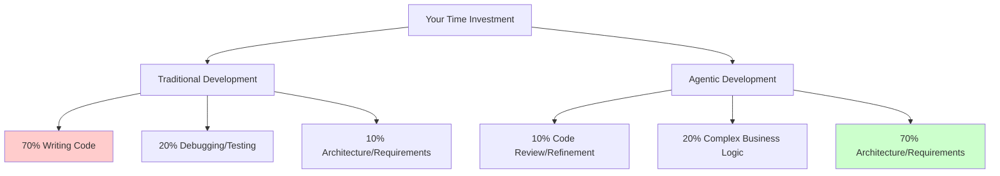

**Agentic Coding** is the practice of using AI agents as active partners in software development, handling tasks ranging from code generation to testing and deployment, while humans focus on product vision, architecture, and strategic judgment.

The term "agentic" emphasizes that these aren't just passive autocomplete tools—they're agents with capabilities to plan, execute multi-step tasks, and make decisions within the guardrails you provide. You're not just getting smarter text completion; you're gaining collaborators that can understand context, follow specifications, and produce working implementations.

### The Core Shift

The fundamental change in agentic coding is this: **you shift from code executor to product orchestrator**.

In traditional development, your day looks like this:

- 70% typing code
- 20% debugging and testing
- 10% thinking about architecture and requirements

In agentic development, the ratios flip:

- 10% reviewing and refining AI-generated code
- 20% implementing complex business logic that requires your expertise
- 70% thinking about what to build, how it should work, and why certain tradeoffs matter

The AI agents handle the mechanical implementation details—the parts where you're following established patterns and converting specifications into code. You handle the parts that require judgment, domain knowledge, and strategic thinking.

This creates a profound shift in where value comes from. As a traditional developer, your value was partly in your ability to quickly and accurately translate requirements into working code. As an agentic developer, your value is almost entirely in your ability to:

- **Define clear requirements** - What should this system do? What are the edge cases?
- **Make architectural decisions** - How should components interact? What are the tradeoffs?
- **Validate implementations** - Does this code actually meet the requirements? Is it secure? Maintainable?
- **Think strategically** - Should we build this feature at all? Is this the right tradeoff for our users?

The speedup is remarkable—development accelerates 5-10x in practice. But this creates new bottlenecks. When coding no longer takes all your time, requirements clarity and product decisions become the critical path. We'll explore these new bottlenecks in depth in Chapter 5: New Bottlenecks (coming soon).

*Figure 2.1: Time allocation shift in agentic coding. The mechanical work (code writing, debugging) shrinks dramatically while strategic work (architecture, requirements) expands to fill your time. Your value shifts from execution speed to thinking quality.*
