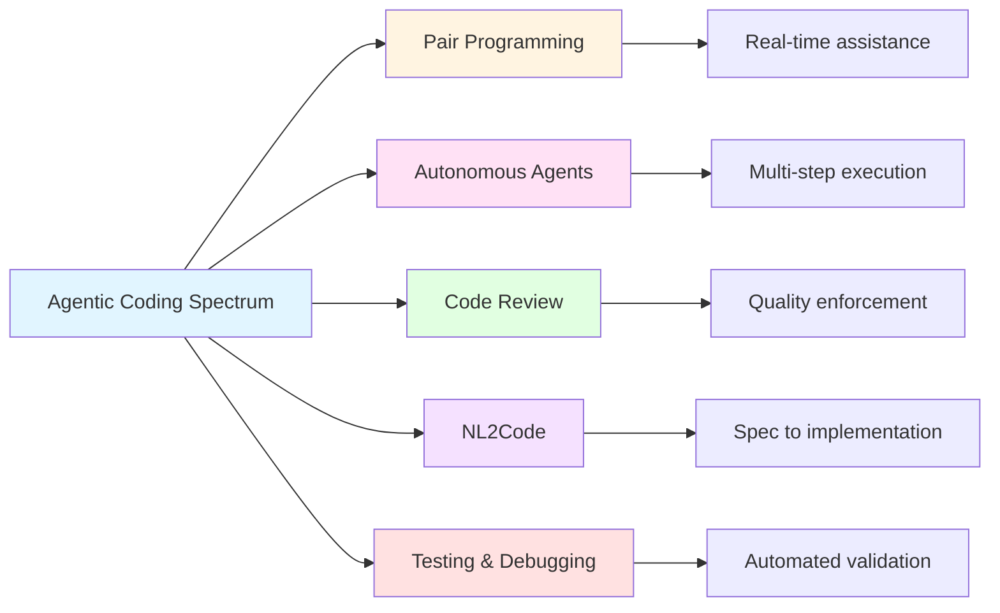

Agentic coding isn't one tool or technique—it's five complementary categories that work together throughout the development lifecycle. Think of them as different tools in your workshop: each excels at specific tasks, and mastery comes from knowing when to reach for which one.

*Figure 2.2: The five categories of agentic coding tools. Each serves a different role in the development workflow, from real-time pair programming assistance to automated testing and quality validation.*

### AI Pair Programming Tools

AI pair programming tools work alongside you in real-time as you write code, like having an exceptionally knowledgeable colleague looking over your shoulder—but one that never gets tired, never judges your questions, and has instant recall of millions of code patterns.

**What they do:**

These tools integrate directly into your development environment (VS Code, JetBrains, Vim, etc.) and provide:

- **Context-aware autocomplete** - They analyze your current file, related files, and even your entire codebase to suggest completions that fit your patterns and style.

- **Function and block generation** - When you start writing a function signature, they can generate the entire implementation based on the function name, parameters, and surrounding context.

- **Code explanation** - Select any code and ask "What does this do?" or "Why would someone write it this way?" Great for understanding unfamiliar codebases.

- **Error diagnosis** - When you hit a compiler error or test failure, they can explain what went wrong and suggest fixes.

- **Technical Q&A** - Ask questions like "How do I handle authentication in Express.js?" or "What's the difference between useEffect and useLayoutEffect?" without leaving your editor.

**Examples** (focusing on capabilities, not specific versions):

- **Claude Code** - The tool used to write this book. Excels at understanding large codebases, following project-specific patterns, and explaining complex concepts.
- **GitHub Copilot** - One of the first mainstream AI pair programming tools, known for strong autocomplete across many languages.
- **Cursor** - An AI-first code editor with deep integration for multi-file edits and codebase understanding.
- **Codeium** - Free alternative with good performance and enterprise features.

The landscape evolves rapidly, with new tools emerging regularly. The key capabilities remain consistent: real-time assistance, context awareness, and integration into your development flow.

**When to use:**

Day-to-day development when you're actively writing or reviewing code. These tools shine when:

- Implementing known patterns (CRUD operations, validation logic, API endpoints)
- Working in unfamiliar languages or frameworks
- Writing tests (they're particularly good at generating test cases)
- Refactoring code (they can suggest improvements while maintaining functionality)

**Strengths:**

The power of pair programming tools comes from their context awareness. They read your entire codebase, understand your naming conventions, recognize your architectural patterns, and adapt suggestions accordingly. They learn your style and follow it. This makes them far more useful than generic code snippets from Stack Overflow—their suggestions actually fit your project.

**Limitations:**

They're conversational partners, not autonomous executors. You're still driving—deciding what to build, how to architect it, and whether their suggestions are correct. They can't understand your product requirements or make strategic technical decisions. They're junior developers with excellent recall but limited judgment.

### Autonomous Agents

Autonomous agents represent a step up in independence. While pair programming tools respond to your immediate actions, autonomous agents can plan and execute multi-step tasks with minimal guidance. Give them a goal and acceptance criteria, and they'll figure out the steps to get there.

**What they do:**

- **Plan and execute complex tasks** - You describe what you want ("Refactor the authentication module to use JWT tokens instead of sessions") and they break it down into steps, execute each one, and handle dependencies between them.

- **Make architectural decisions within guardrails** - They choose between valid implementation approaches based on your codebase patterns and stated preferences.

- **Handle multi-file refactoring** - Changes that touch dozens of files (renaming a core concept, restructuring a module, updating API contracts) happen systematically with tracked dependencies.

- **Implement features from high-level descriptions** - Describe a feature in product terms ("Add pagination to the user list with prev/next buttons and page size selector") and get a complete implementation including UI, API changes, and tests.

- **Run tests and fix failures autonomously** - They can execute your test suite, analyze failures, hypothesize about root causes, apply fixes, and rerun tests until they pass.

**Examples:**

- **ChatGPT with Code Interpreter** - Can write, execute, and debug code in a sandboxed environment, handling multi-step data analysis or script development.
- **AutoGPT and similar frameworks** - Designed specifically for autonomous task completion with planning and execution loops.
- **Agent-based coding platforms** - Emerging tools that orchestrate multiple specialized agents to handle different aspects of a task.
- **Multi-agent systems** - Experimental setups where different agents handle frontend, backend, testing, and documentation in parallel.

**When to use:**

Well-defined tasks where you can specify acceptance criteria clearly:

- Large refactorings with clear before/after states
- Feature implementation where requirements are specific
- Technical debt cleanup (updating dependencies, modernizing patterns)
- Migration tasks (database schema changes, API versioning)

**Strengths:**

Autonomous agents excel at tedious, multi-step work that would take you hours of mechanical effort. They don't get bored, don't cut corners, and handle repetitive tasks with perfect consistency. They're particularly valuable for work where the "what" is clear but the "how" involves many small, interconnected steps.

**Limitations:**

They need clear goals and acceptance criteria. Ambiguous requirements lead to implementations that technically work but miss your intent. They also can't make strategic product decisions—they won't tell you "this feature shouldn't be built" or "here's a better approach to the underlying problem." They execute plans; you must provide the strategy.

### AI-Assisted Code Review

AI code review tools act as tireless reviewers that analyze every line of code for quality, security, and best practices. They catch issues humans miss—especially on that 500th line of a long PR when attention starts to drift.

**What they do:**

- **Review pull requests automatically** - Every PR gets analyzed before human reviewers see it, catching low-level issues so humans can focus on architecture and logic.

- **Identify bugs and security vulnerabilities** - Find SQL injection risks, XSS vulnerabilities, authentication bypasses, race conditions, and other issues through static and dynamic analysis.

- **Suggest improvements and refactorings** - Point out code smells, overly complex functions, duplicated logic, and opportunities for simplification.

- **Check adherence to style guides and patterns** - Enforce team conventions, naming standards, architectural patterns, and project-specific rules.

- **Flag technical debt** - Identify accumulating complexity, growing dependencies, test coverage gaps, and maintenance burdens.

**Examples:**

- **AI-powered GitHub PR reviewers** - Bots that comment on PRs with suggestions, similar to how a colleague would review your code.
- **SonarQube with AI features** - Enterprise-grade code quality and security analysis with machine learning enhancements.
- **CodeClimate with ML** - Automated maintainability scoring and technical debt tracking.
- **Custom review bots** - Teams building their own reviewers tuned to project-specific patterns and requirements.

**When to use:**

- **Before merging code** - Catch issues before they reach production
- **During PR review** - Supplement human review with automated analysis
- **Continuous quality monitoring** - Track code quality trends over time
- **Learning and training** - Help team members learn best practices through automated feedback

**Strengths:**

AI reviewers are consistent, thorough, and never fatigued. They check every line with the same rigor whether it's the first file or the fiftieth. They remember all your project's rules and patterns without fail. They catch subtle security issues that even experienced developers might miss. And they're available instantly—no waiting for reviewers to free up time.

**Limitations:**

They can't judge product fit or strategic technical decisions. They won't tell you "this feature adds unnecessary complexity" or "this abstraction isn't worth the maintenance burden." They enforce rules but don't create wisdom. Human reviewers still own the high-level feedback about architecture, user experience, and strategic direction.

### Natural Language to Code Generation

Natural Language to Code (NL2Code) tools bridge the gap between specifications and implementations. They take structured descriptions of what you want—OpenAPI specs, database schemas, UI mockups, written requirements—and generate working code.

**What they do:**

- **Convert written requirements into implementations** - Take acceptance criteria in plain English and produce code that meets them, including edge cases and error handling.

- **Generate boilerplate from specs** - An OpenAPI specification becomes a complete server implementation with routes, validation, error handling, and request/response serialization.

- **Create tests from acceptance criteria** - Requirements written in EARS notation (see Part 3: EARS Notation (coming soon)) become comprehensive test suites.

- **Build UIs from mockups and descriptions** - Design mockups plus interaction descriptions become working components with proper state management and event handling.

- **Scaffold projects from templates** - High-level project descriptions ("React app with authentication, user profiles, and payment integration") become complete project structures with best practices built in.

**Examples:**

- **Spec-to-code generators** - Tools that consume OpenAPI, AsyncAPI, or GraphQL schemas and generate server or client code.
- **No-code/low-code platforms with AI** - Visual builders that use AI to interpret your intent and generate production-ready code.
- **Documentation-to-implementation tools** - Systems that read API documentation or requirements documents and implement the described functionality.

**When to use:**

- **Starting new features** - Get a working scaffold to build on rather than starting from scratch
- **Generating boilerplate** - CRUD APIs, form validation, authentication flows, and other well-established patterns
- **Implementing well-specified interfaces** - When you have clear contracts (API specs, schemas) that define exactly what you need

**Strengths:**

NL2Code tools excel at bridging specifications and implementations. When you've invested time in clear specs—writing detailed OpenAPI definitions, drawing precise database schemas, documenting exact requirements—these tools turn that specification work into implementation work almost instantly. This creates a powerful incentive for specification-driven development: the better your specs, the more value you get from automation.

**Limitations:**

They require clear, unambiguous specifications. Vague requirements produce vague implementations. They also can't make product decisions disguised as technical choices (like "should this be a separate service or a new module?"). The quality of output directly correlates with the quality of input—garbage in, garbage out is the iron law.

### AI-Driven Testing and Debugging

AI testing and debugging tools handle the mechanical work of creating comprehensive test suites and finding the root causes of failures. They generate test cases you might not think of, achieve high coverage quickly, and help diagnose complex bugs.

**What they do:**

- **Generate unit and integration tests from code** - Analyze your implementation and create tests that exercise all code paths, including edge cases and error conditions.

- **Create test data and edge cases** - Generate realistic test data, boundary conditions, and corner cases that expose bugs.

- **Find bugs through static and dynamic analysis** - Detect issues through code analysis (static) and runtime behavior observation (dynamic), catching problems before they reach production.

- **Suggest root causes of failures** - When tests fail, analyze the failure, trace through execution, and hypothesize about what went wrong.

- **Propose fixes for identified issues** - Not just "here's a bug" but "here's a bug and here's how to fix it, with code."

**Examples:**

- **AI test generation tools** - Systems that analyze your code and automatically create comprehensive test suites
- **Intelligent debuggers with AI** - Debuggers that suggest likely bug locations based on symptoms and execution traces
- **Mutation testing with AI** - Tools that introduce deliberate bugs to verify your tests actually catch issues
- **Anomaly detection in production** - Monitoring systems that learn normal behavior and flag deviations

**When to use:**

- **Writing test suites** - Especially for legacy code that lacks tests
- **Debugging complex issues** - When the root cause isn't obvious from error messages
- **Improving coverage** - Finding gaps in existing test suites and filling them
- **Regression prevention** - Generating tests that prevent bugs from recurring

**Strengths:**

AI testing tools are thorough and creative. They generate test cases you wouldn't think of, including edge cases that only emerge in production. They achieve high code coverage quickly, turning hours of test writing into minutes. For debugging, they can analyze vast execution traces and correlate failures across runs to identify patterns humans would miss.

**Limitations:**

Generated tests can sometimes be shallow—they execute code paths without truly validating correctness. You still need to review tests to ensure they check meaningful invariants, not just "the code runs without crashing." For debugging, AI suggestions are hypotheses, not guarantees. You must validate their reasoning and confirm fixes actually address the root cause.
