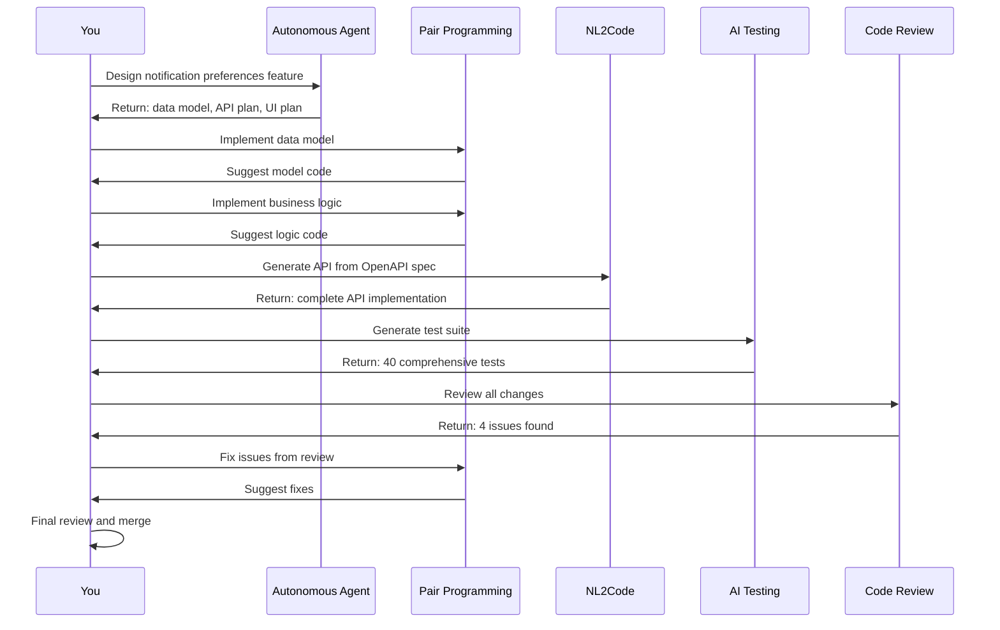

The real power of agentic coding emerges when these five categories work together throughout your development workflow. No single tool handles everything—you orchestrate them like instruments in an ensemble, each playing its part at the right time.

Let's walk through building a new feature end-to-end to see how they combine:

### Feature: User Notification Preferences

Imagine you're adding a feature that lets users customize their notification preferences—email vs SMS, frequency, topic subscriptions. Here's how the categories work together:

**1. Planning Phase** (You + Autonomous Agent)

You start with a high-level product description: "Users need to control how they receive notifications—channel (email/SMS), frequency (immediate/daily digest/weekly), and topics they care about."

You engage an autonomous agent: "Based on our existing user profile system, design the notification preferences feature. Include data model changes, API endpoints needed, and UI components required."

The agent produces a plan:

- Extend user profile schema with preferences table
- Create REST API for CRUD on preferences
- Build settings UI component
- Update notification service to respect preferences

**2. Implementation Phase** (You + Pair Programming)

You start implementing, using a pair programming tool for assistance:

You write: `// Create notification preferences model`

The AI suggests a complete model based on your project's ORM patterns:

```python
class NotificationPreference(models.Model):
    user = models.ForeignKey(User, on_delete=models.CASCADE)
    channel = models.CharField(
        max_length=20,
        choices=[('email', 'Email'), ('sms', 'SMS')]
    )
    frequency = models.CharField(
        max_length=20,
        choices=[
            ('immediate', 'Immediate'),
            ('daily', 'Daily Digest'),
            ('weekly', 'Weekly Summary')
        ]
    )
    topics = models.ManyToManyField('NotificationTopic')
    created_at = models.DateTimeField(auto_now_add=True)
    updated_at = models.DateTimeField(auto_now=True)

```

You review, accept, and continue. The pair programming tool adapts to your decisions and maintains consistency across files.

**3. Specification Phase** (NL2Code)

For the API, you write an OpenAPI spec describing the endpoints:

```yaml
/api/preferences:
  get:
    summary: Get user notification preferences
    responses:
      200:
        content:
          application/json:
            schema:
              $ref: '#/components/schemas/PreferenceList'
  post:
    summary: Create notification preference
    requestBody:
      content:
        application/json:
          schema:
            $ref: '#/components/schemas/PreferenceCreate'

```

You feed this to an NL2Code tool, which generates the complete API implementation with validation, error handling, and database queries. Five minutes versus two hours of manual coding.

**4. Testing Phase** (AI Testing)

You point an AI testing tool at your new code: "Generate comprehensive tests for the notification preferences API."

It produces a test suite covering:

- Happy path: creating, reading, updating, deleting preferences
- Edge cases: invalid channels, conflicting preferences, missing topics
- Authorization: users can only manage their own preferences
- Validation: malformed requests return proper error codes

The tool generates 40 tests in minutes—tests that would take hours to write manually.

**5. Review Phase** (AI Code Review)

Before merging, you run AI code review. It catches:

- Missing index on `user_id` field (performance issue)
- No rate limiting on preference updates (potential abuse)
- Inconsistent error messages between endpoints (UX issue)
- Hardcoded SMS provider credentials (security issue)

You fix these issues. The AI's mechanical vigilance catches what you missed.

**6. Refinement Phase** (You + Pair Programming)

Based on the review feedback, you iterate. The pair programming tool helps you:

- Add the database index with proper migration
- Implement rate limiting following your project's patterns
- Standardize error messages across endpoints
- Move credentials to environment variables

You review the changes, run the full test suite, and merge with confidence.



*Figure 2.3: How agentic coding categories work together in a real feature workflow. Each tool plays its part at the appropriate stage, from planning through implementation to validation and refinement.*

### The Amplification Effect

Notice what happened in this workflow: **the AI handled all the mechanical work**. Writing boilerplate, generating tests, checking for common issues—all automated. Your time went to:

- **Product decisions**: What features do users need? What's the right UX?
- **Architecture choices**: How should this integrate with existing systems? What are the tradeoffs?
- **Validation and judgment**: Is this implementation correct? Secure? Maintainable?

This is the core promise of agentic coding. The tools don't replace you—they amplify you. They handle the mechanical parts where you're applying known patterns, freeing you to focus on the parts that require insight, creativity, and judgment.

The result: what might have taken 2-3 days of focused work in traditional development gets compressed into 4-6 hours in agentic development. You ship 5-10x faster, often with better quality because AI tools are thorough in ways humans aren't.

But—and this is crucial—this only works when you maintain your role as orchestrator. You set the direction, validate the output, and make the decisions that require context the AI doesn't have. Abdicate that responsibility, and you get fast garbage instead of slow quality.
