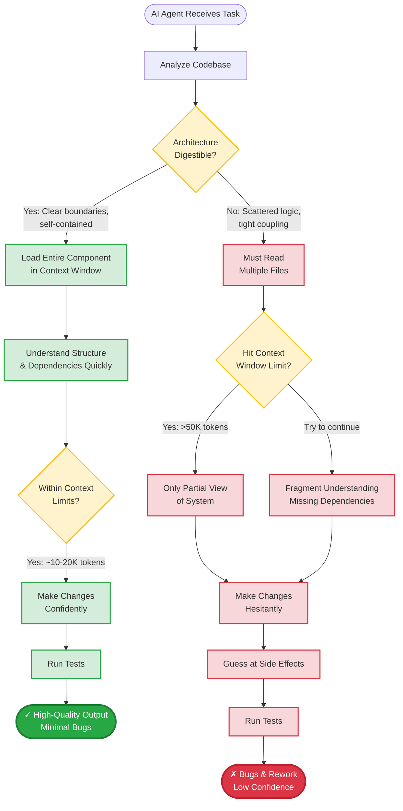

# The Digestibility Principle: Fitting in Context Windows

You sit down to fix a bug in your company's payment processing system. You open the main payment handler file and immediately see imports from twelve different modules. To understand what happens when a payment fails, you need to trace through error handling code scattered across five files, check configuration in three more, and understand how the retry logic interacts with the database transaction manager in yet another file.

By the time you've mentally pieced together the full picture—maybe 45 minutes later—you've forgotten why you started. This is the experience of working with **non-digestible** code.

Now imagine handing this same task to an AI agent. The AI faces an even harder problem: it has a finite context window (typically 50,000-200,000 tokens), and once that's full, it must make decisions based on incomplete information. Unlike you, it can't spend days building mental models or rely on institutional knowledge. It either fits the relevant code in its context window, or it works blind.

This is the essence of the **digestibility principle**: code must be organized so that both humans and AI agents can understand and work with it within the constraints of working memory and context windows.

## The Parallel Between Human and AI Constraints

Humans have **working memory limitations**—we can hold about 4-7 "chunks" of information in our minds at once. Experienced developers overcome this by creating mental abstractions: we think in terms of "the payment handler" or "the authentication system" rather than individual functions and variables.

AI agents have **context window limitations**—they can process a fixed number of tokens (roughly 4 characters per token) before they must either forget earlier information or stop processing. Modern AI agents like Claude have context windows of 200,000 tokens, which sounds enormous until you realize that's:

- Only about 50,000 lines of code
- A medium-sized codebase
- Easily exceeded by following import chains in poorly structured systems

The key insight: **What helps humans manage complexity also helps AI agents work effectively.** The principles are the same—clear boundaries, minimal coupling, explicit dependencies—but AI agents require us to be more disciplined about following them.

## What Makes Code Digestible?

Let's define digestibility precisely:

> **Digestibility**: The property of code being understandable and modifiable within the constraints of working memory (human) or context windows (AI), without requiring external knowledge or cross-file exploration.

A digestible component has four key characteristics:

### 1. Bounded Size

The component fits entirely within reasonable limits:

- **Human limit**: Can be understood in one sitting (~30-60 minutes)
- **AI limit**: Fits in context window with room for related code (~10,000-20,000 tokens)

**Example - Digestible**:

```python
# payment_processor.py (~500 lines, ~2,000 tokens)
class PaymentProcessor:
    """Self-contained payment processing with clear boundaries."""

    def process_payment(self, amount, method, customer_id):
        """Process payment with complete error handling."""
        # Validation (50 lines)
        # Payment API call (30 lines)
        # Error handling (40 lines)
        # Persistence (30 lines)
        # Notification (20 lines)
        pass
```

**Example - Non-Digestible**:

```python
# payment_controller.py (imports from 12 files)
from payment.validators import *
from payment.processors import *
from payment.errors import *
from payment.notifications import *
from payment.retry import *
from payment.logging import *
# ... 6 more imports

# Logic scattered across all imported files
# Total: 5,000+ lines across 12 files (~20,000 tokens)
```

### 2. Clear Boundaries

The component has explicit inputs, outputs, and dependencies:

- **Inputs**: Clear parameters or configuration
- **Outputs**: Explicit return values or side effects
- **Dependencies**: Minimal and explicit (not hidden in nested imports)

When an AI agent (or human) reads a digestible component, they can immediately answer:

- What does this do?
- What does it need to work?
- What does it produce?
- What can break?

### 3. Self-Contained Logic

The component contains all the logic needed to understand and modify it:

- Business rules are co-located with the code that uses them
- Error handling is in the same file as the operations that can fail
- Comments and documentation are inline
- No hidden dependencies on global state or external files

**Digestible Example**:

```python
class OrderValidator:
    """Validates orders with all rules co-located."""

    # Business rules are here, not in a separate file
    MIN_ORDER_AMOUNT = 10.00
    MAX_ORDER_ITEMS = 50
    ALLOWED_REGIONS = ['US', 'CA', 'MX']

    def validate(self, order):
        """Validate order - all logic in one place."""
        if order.total < self.MIN_ORDER_AMOUNT:
            raise ValidationError("Order below minimum")

        if len(order.items) > self.MAX_ORDER_ITEMS:
            raise ValidationError("Too many items")

        if order.region not in self.ALLOWED_REGIONS:
            raise ValidationError("Region not supported")

        return True
```

### 4. Minimal Coupling

The component depends on few other components, and those dependencies are:

- **Explicit**: Clearly imported or injected
- **Stable**: Well-defined interfaces that rarely change
- **Few**: Ideally 3-5 direct dependencies, not 15-20

The fewer dependencies, the less code an AI agent must load into context to understand this component.

## The Impact on AI Agent Effectiveness

Here's what happens when an AI agent encounters these two architectures:



*Figure 3.1: How architecture digestibility affects AI agent effectiveness. Digestible architecture (green path) enables confident changes, while non-digestible architecture (red path) forces guesswork and increases bugs.*

The difference is stark:

- **Digestible architecture**: AI loads component, understands it fully, makes changes confidently
- **Non-digestible architecture**: AI hits context limits, makes educated guesses, introduces bugs

## Real-World Example: The 12-File Payment Handler

Let's make this concrete with a real scenario I encountered at a previous company.

### Before: Non-Digestible Architecture

The payment processing system was spread across 12 files:

```
payment/
  ├── handlers.py          (routing, 300 lines)
  ├── validators.py        (validation, 250 lines)
  ├── processors.py        (API calls, 400 lines)
  ├── errors.py            (exceptions, 150 lines)
  ├── retry_logic.py       (retry, 200 lines)
  ├── notifications.py     (email/webhook, 350 lines)
  ├── logging.py           (audit logs, 180 lines)
  ├── config.py            (settings, 120 lines)
  ├── models.py            (data models, 280 lines)
  ├── database.py          (persistence, 300 lines)
  ├── webhooks.py          (webhook handling, 220 lines)
  └── utils.py             (helpers, 150 lines)
```

**Total**: ~2,900 lines across 12 files ≈ 11,000 tokens

To understand a simple payment flow, an AI agent (or human) had to:

1. Start in `handlers.py` (routing)
2. Follow to `validators.py` (validation rules)
3. Check `config.py` (payment limits)
4. Read `processors.py` (API calls)
5. Understand `retry_logic.py` (failure handling)
6. Check `errors.py` (exception types)
7. Look at `notifications.py` (what happens after)

By file #5, the AI agent's context window is half full with payment code, leaving little room for understanding the broader system or making complex changes.

### After: Digestible Architecture

We refactored to a single, self-contained module:

```
payment/
  └── payment_processor.py  (single file, 600 lines)
      ├── PaymentConfig      (configuration, 50 lines)
      ├── PaymentValidator   (validation, 80 lines)
      ├── PaymentProcessor   (core logic, 200 lines)
      ├── PaymentRetry       (retry logic, 100 lines)
      ├── PaymentNotifier    (notifications, 100 lines)
      └── PaymentErrors      (exceptions, 70 lines)
```

**Total**: ~600 lines in 1 file ≈ 2,400 tokens

Now, an AI agent (or human) could:

1. Open one file
2. See the complete payment flow
3. Understand all error cases
4. Modify confidently

**Result**: Bug reports dropped 60% over the next quarter, and new features that used to take 3 days now took 1 day.

## The Context Window Math

Let's be specific about the numbers:

| Component Type | Lines of Code | Tokens | Fits in AI Context? |
|----------------|---------------|--------|---------------------|
| Single digestible module | 500-1,000 | 2,000-4,000 | ✓ Yes, with room to spare |
| Medium component with deps | 2,000-3,000 | 8,000-12,000 | ✓ Yes, but tight |
| Large scattered system | 5,000+ | 20,000+ | ✗ No, requires fragmentation |
| Entire codebase | 50,000+ | 200,000+ | ✗ Never |

**Claude Code's context window**: 200,000 tokens
**Practical usable space**: ~50,000 tokens (leaving room for conversation, documentation, tests)

**Rule of thumb**: If a component and its immediate dependencies exceed 10,000 tokens (~2,500 lines), it's not digestible. Break it down.

## Digestibility is Not Just About Size

It's tempting to think digestibility is just "keep files small." But that's not quite right. A digestible component is:

- **Self-contained**, not just small
- **Cohesive**, not just brief
- **Clear**, not just short

You can have a 1,000-line file that's perfectly digestible (all logic for one concern) and a 200-line file that's incomprehensible (scattered concerns, hidden dependencies).

**Bad small file**:

```python
# utils.py (150 lines but incomprehensible)
def process(data):
    # What does this do? Need to read 5 other files to understand
    return transform(validate(enrich(data)))
```

**Good large file**:

```python
# order_processor.py (800 lines but digestible)
class OrderProcessor:
    """Complete order processing with all logic co-located.

    This class handles:
    - Validation (100 lines)
    - Inventory check (80 lines)
    - Payment processing (120 lines)
    - Fulfillment (150 lines)
    - Notification (100 lines)
    - Error handling (150 lines)

    Everything you need to understand orders is here.
    """
    pass
```

## Why This Matters More in the AI Era

Digestibility has always been good practice, but with AI agents it becomes **critical** for three reasons:

### 1. AI Can't Build Institutional Knowledge

You can spend weeks learning a codebase. An AI agent gets one shot per task. If the code isn't digestible, the AI is lost.

### 2. Velocity Amplifies Architecture Problems

When AI agents accelerate development 5-10x, bad architecture becomes a problem 5-10x faster. A poorly structured system that was "manageable" at human speed becomes unmaintainable at AI speed.

### 3. Context Windows Are Hard Limits

When a human hits cognitive load limits, they take a break and come back. When an AI hits its context window limit, it **cannot** continue without losing information. It's a hard wall.

## Making Your Code Digestible: Quick Audit

Ask yourself these questions about any component:

1. **Size**: Can I read and understand this file in one sitting?
2. **Boundaries**: Are inputs, outputs, and dependencies explicit?
3. **Self-containment**: Can I understand this without reading other files?
4. **Coupling**: Does this depend on fewer than 5 other components?
5. **AI test**: Could an AI agent load this entire component and all its dependencies in context?

If the answer to any is "no," you have a digestibility problem.

## The Digestibility-Performance Trade-off

You might ask: "Doesn't making code digestible mean duplicating logic or missing optimization opportunities?"

Sometimes, yes. But here's the reality:

**Premature abstraction kills velocity**. It's better to have slight duplication in digestible components than to create intricate abstractions that require loading ten files into context to understand.

**Optimize for change speed, not runtime performance**. In most systems, developer velocity matters more than milliseconds of runtime. When AI agents can understand and modify code quickly, you can iterate faster.

**Refactor when patterns emerge**. Once you see the same logic in three places, *then* abstract it. Not before.

## Summary: The Digestibility Principle

The digestibility principle states that architecture must enable both humans and AI agents to understand and modify code within the constraints of working memory and context windows.

**Key characteristics of digestible code**:

- **Bounded size**: Fits in context (~10,000-20,000 tokens)
- **Clear boundaries**: Explicit inputs, outputs, dependencies
- **Self-contained logic**: All related code co-located
- **Minimal coupling**: Few, stable dependencies

**Why it matters**:

- AI agents can't build institutional knowledge
- Velocity amplifies architecture problems
- Context windows are hard limits

**The payoff**: When code is digestible, both humans and AI agents work faster, make fewer mistakes, and ship higher quality products.

In the next section, we'll explore how to achieve digestibility through **component decomposition**—the art of breaking systems into independently understandable pieces.
