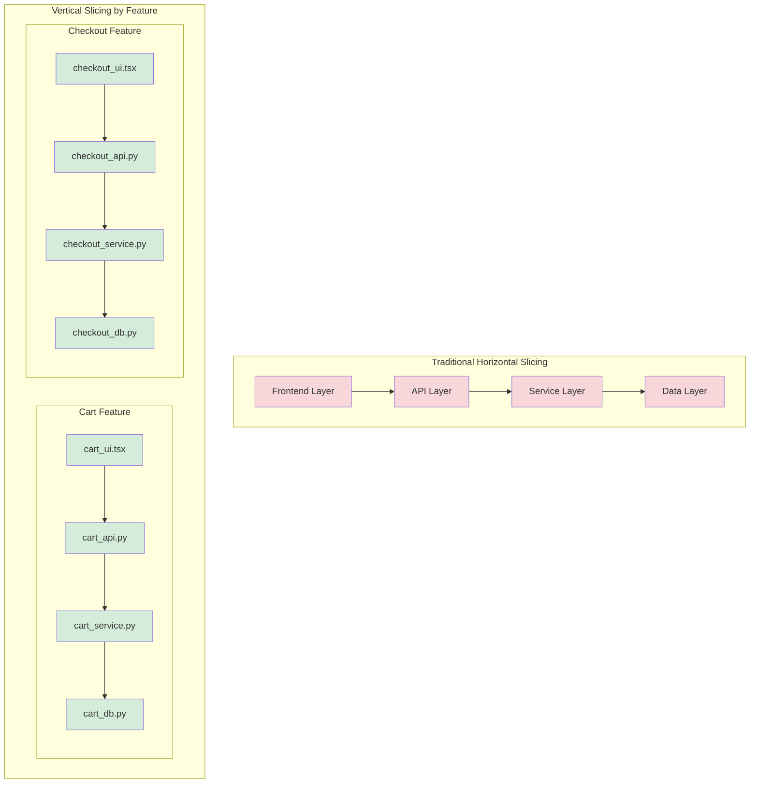

# Component Decomposition: Breaking Down for AI Understanding

You've embraced the digestibility principle—your code should fit in context windows. But how do you actually achieve this? How do you take a complex system and break it into components that both humans and AI agents can work with effectively?

The answer is **component decomposition**: the art of dividing a system into independently understandable pieces. But here's the key insight—traditional decomposition strategies were designed for human teams working on large codebases over years. Agentic development needs a different approach: components optimized for rapid iteration by AI agents working alongside humans.

## The Decomposition Challenge

Let's start with a common scenario. You're building an e-commerce platform. The traditional approach might decompose it like this:

```text
ecommerce/
  ├── backend/
  │   ├── services/
  │   ├── models/
  │   ├── controllers/
  │   └── utils/
  ├── frontend/
  │   ├── components/
  │   ├── pages/
  │   └── styles/
  └── database/
      └── migrations/
```

This is **horizontal decomposition**—organizing by technical layer (database, backend, frontend). It's the traditional MVC or three-tier architecture approach.

The problem? To implement a single feature like "add product to cart," an AI agent must:

1. Create a database migration
2. Add a model in backend/models
3. Add a service in backend/services
4. Add a controller in backend/controllers
5. Create frontend components
6. Update frontend pages

That's six different directories and potentially 10+ files. The AI must keep all these layers in context simultaneously, understand their interactions, and ensure consistency across layers.

Now consider **vertical decomposition**—organizing by feature:

```text
ecommerce/
  ├── cart/
  │   ├── cart_api.py        (API endpoints)
  │   ├── cart_service.py    (business logic)
  │   ├── cart_models.py     (data models)
  │   └── cart_ui.tsx        (UI component)
  ├── checkout/
  │   ├── checkout_api.py
  │   ├── checkout_service.py
  │   ├── checkout_models.py
  │   └── checkout_ui.tsx
  └── products/
      ├── product_api.py
      ├── product_service.py
      ├── product_models.py
      └── product_ui.tsx
```

Now, to implement "add product to cart," an AI agent:

1. Opens the `cart/` directory
2. Reads 4 files
3. Makes changes in one cohesive location

Everything related to cart functionality is co-located. The AI can load the entire cart feature into context and work confidently.

## Why Vertical Decomposition Works for AI

Vertical decomposition—slicing by feature rather than layer—has three critical advantages for agentic development:

### 1. Reduced Context Window Load

When all code for a feature lives together, the AI loads only what's relevant. The entire cart feature might be 1,500 lines across 4 files (~6,000 tokens). Compare that to loading the entire backend layer (20,000+ lines) just to understand one feature.

### 2. Clear Blast Radius

Changes to cart functionality only affect the `cart/` directory. An AI agent can modify cart code with confidence that it won't break checkout or products. The boundaries are explicit.

### 3. Independent Evolution

Different features can evolve at different paces. Cart might use a simple in-memory cache, while checkout needs a distributed transaction. Each component can make appropriate technical choices without forcing consistency across the system.

## The Four Decomposition Strategies

Let's explore four practical strategies for decomposing systems in ways AI agents can understand and modify.

### Strategy 1: Vertical Slicing by Feature

**Principle**: Group all layers of a feature together.

**When to use**: Most features in most systems. This should be your default.

**How it works**:



*Figure 3.2: Horizontal slicing (red) spreads features across layers, while vertical slicing (green) groups all layers of a feature together. Vertical slicing reduces context window requirements and makes features independently modifiable.*

**Example structure**:

```text
features/
  ├── user_auth/
  │   ├── auth_api.py          # API endpoints
  │   ├── auth_service.py      # Business logic (login, signup)
  │   ├── auth_models.py       # User, Session models
  │   ├── auth_validators.py   # Input validation
  │   └── auth_ui.tsx          # Login/signup UI
  ├── notifications/
  │   ├── notify_api.py
  │   ├── notify_service.py    # Email, push, SMS logic
  │   ├── notify_models.py     # Notification templates
  │   └── notify_ui.tsx
  └── shared/
      ├── database.py          # DB connection
      ├── config.py            # Settings
      └── utils.py             # Truly shared utilities
```

**Key rules**:

- Each feature directory contains everything for that feature
- Shared code goes in `shared/` and should be minimal
- Features communicate via explicit APIs, not shared internals
- An AI agent should be able to implement a feature by working in one directory

### Strategy 2: Bounded Contexts and Domain Boundaries

**Principle**: Organize by business domain, not technical function.

**When to use**: Larger systems with distinct business domains (e.g., inventory vs. billing vs. shipping).

**How it works**: This strategy comes from Domain-Driven Design (DDD) but is adapted for AI digestibility. A bounded context is a boundary where a specific business model applies.

**Example**: E-commerce bounded contexts

```text
contexts/
  ├── catalog/              # Product discovery domain
  │   ├── products/
  │   ├── categories/
  │   ├── search/
  │   └── recommendations/
  ├── orders/               # Order management domain
  │   ├── cart/
  │   ├── checkout/
  │   ├── order_tracking/
  │   └── returns/
  └── billing/              # Payment domain
      ├── payments/
      ├── invoices/
      └── subscriptions/
```

Each context has its own data models, business logic, and even its own representation of shared concepts. For example, the "Product" in the catalog context focuses on discovery (images, descriptions, search metadata), while the "Product" in the orders context focuses on fulfillment (SKU, inventory, shipping weight).

**Why this helps AI**:

- Clear boundaries: AI agents know which context a change belongs to
- Domain-specific language: Each context uses consistent terminology
- Independent evolution: Billing can change without affecting catalog
- Smaller context windows: AI loads one domain at a time

### Strategy 3: Interface Segregation for AI Agents

**Principle**: Components depend on minimal, specific interfaces, not large comprehensive ones.

**When to use**: When multiple components share functionality but need different subsets.

**Traditional approach (fat interface)**:

```python
# One large interface that everything depends on
class OrderService:
    def create_order(self, cart): ...
    def update_order(self, order_id, data): ...
    def cancel_order(self, order_id): ...
    def get_order(self, order_id): ...
    def list_orders(self, user_id): ...
    def refund_order(self, order_id): ...
    def ship_order(self, order_id): ...
    def track_order(self, order_id): ...
    # 15 more methods...
```

When an AI agent needs to modify the cart, it must load this entire class (23 methods, 800 lines) into context, even though it only cares about `create_order`.

**Interface segregation approach**:

```python
# Small, focused interfaces
class CartOrderCreator:
    """Handles creating orders from carts."""
    def create_from_cart(self, cart): ...
    def validate_cart(self, cart): ...

class OrderReturnHandler:
    """Handles refunds and returns."""
    def initiate_return(self, order_id, items): ...
    def process_refund(self, order_id): ...

class OrderFulfillment:
    """Handles shipping and tracking."""
    def ship_order(self, order_id, carrier): ...
    def track_shipment(self, order_id): ...
```

Now, to modify cart-to-order creation, an AI agent loads `CartOrderCreator` (2 methods, 80 lines). Context window: minimal. Blast radius: clear.

### Strategy 4: Dependency Minimization

**Principle**: Components should have few, stable dependencies.

**When to use**: Always. This is a universal rule.

**The problem**: Every dependency an AI agent must understand increases context load.

**Example - high dependencies**:

```python
# payment_processor.py
from auth import get_current_user
from inventory import check_stock, reserve_items
from pricing import calculate_tax, apply_discounts
from notifications import send_email, send_sms
from logging import audit_log
from analytics import track_purchase
from fraud import check_fraud_score
from shipping import calculate_shipping
# 8 dependencies - AI must load all to understand this file
```

**Example - minimized dependencies**:

```python
# payment_processor.py
from decimal import Decimal
from typing import Dict, List

# All logic self-contained
class PaymentProcessor:
    """Process payments with minimal external dependencies."""

    def process(self, amount: Decimal, method: str,
                customer_id: str) -> Dict:
        """Process payment - validation, API call, persistence."""
        # Validation logic here (not in separate module)
        # Payment API call here
        # Error handling here
        # Returns result (notifications handled by caller)
        pass
```

**Key patterns for minimizing dependencies**:

- **Inversion of control**: Accept callbacks instead of importing modules
- **Data over dependencies**: Pass data structures, not objects with methods
- **Self-containment**: Include logic inline instead of importing utilities
- **Explicit interfaces**: Accept specific parameters, not entire objects

## Sizing Components Correctly

A common question: How big should a component be?

The answer depends on context, but here are practical guidelines:

### The Goldilocks Zone

**Too small** (under-decomposed):

- Single file over 1,000 lines
- Monolithic classes with 20+ methods
- Everything depends on everything

**Too large** (over-decomposed):

- 50 files, each with 20 lines
- One class per file, even for tiny classes
- Requires tracing through 10+ files to understand one feature

**Just right**:

- Files: 200-600 lines
- Classes: 5-15 methods
- Feature: 3-7 files
- AI can load entire feature in context (~10,000 tokens)

### The "AI Agent Can Work Independently" Test

A well-sized component should allow an AI agent to:

1. **Load the entire component** in context (under 10,000 tokens)
2. **Understand what it does** without reading other files
3. **Make changes confidently** knowing the blast radius
4. **Run tests** that validate the component in isolation

If an AI agent can't do these four things, the component is either too large (can't fit in context), too small (requires reading many files), or poorly decomposed (unclear boundaries).

## Real-World Example: Refactoring for Digestibility

Let me show you a real refactoring I did on a project where AI agents were struggling.

### Before: Monolithic User Service

```text
user_management/
  └── user_service.py      (1,200 lines, 15 methods)
      - User registration
      - Profile management
      - Authentication
      - Password reset
      - Email verification
      - Account deletion
      - User search
      - Admin functions
```

**Problem**: To modify password reset, an AI agent had to load all 1,200 lines, understand interactions between auth, profile, email—then make changes without breaking other features. Success rate: ~60%.

### After: Feature-Based Decomposition

```text
user_management/
  ├── registration/
  │   ├── signup.py         (150 lines)
  │   ├── email_verify.py   (100 lines)
  │   └── onboarding.py     (80 lines)
  ├── authentication/
  │   ├── login.py          (120 lines)
  │   ├── password_reset.py (90 lines)
  │   └── session.py        (110 lines)
  ├── profile/
  │   ├── update.py         (100 lines)
  │   ├── preferences.py    (80 lines)
  │   └── avatar.py         (60 lines)
  └── admin/
      ├── user_search.py    (140 lines)
      └── account_ops.py    (100 lines)
```

**Result**: To modify password reset, an AI agent loads `authentication/password_reset.py` (90 lines). Context is clear. Success rate: ~95%.

## Common Decomposition Mistakes

Here are anti-patterns to avoid:

### Mistake 1: Premature Abstraction

**Bad**:

```text
utils/
  ├── string_utils.py
  ├── date_utils.py
  ├── validation_utils.py
  ├── formatting_utils.py
  └── helpers.py
```

**Problem**: "Utils" are dumping grounds. AI agents can't predict what's in `helpers.py` without reading it.

**Good**: Put utilities near where they're used:

```text
cart/
  ├── cart_service.py
  ├── cart_validators.py   (validation specific to carts)
  └── cart_formatting.py   (formatting specific to carts)
```

### Mistake 2: Shared Mutable State

**Bad**:

```python
# global_state.py
current_user = None  # Shared across modules
cart_items = []      # Shared across modules
```

**Problem**: AI agents can't reason about code that depends on global state modified elsewhere.

**Good**: Pass state explicitly:

```python
def process_cart(user: User, items: List[Item]) -> Order:
    # All state passed as parameters
    pass
```

### Mistake 3: Circular Dependencies

**Bad**:

```text
orders → cart → inventory → orders  (circular!)
```

**Problem**: AI agents must load entire cycle into context.

**Good**: Establish dependency hierarchy:

```text
orders → cart → inventory  (one direction, no cycles)
```

## Decomposition Checklist

Before finalizing your component structure, verify:

- [ ] Each component fits in under 10,000 tokens (AI context budget)
- [ ] Components are organized by feature or domain, not technical layer
- [ ] Dependencies are minimal (ideally under 5 direct imports)
- [ ] No circular dependencies between components
- [ ] Each component has a clear, single responsibility
- [ ] An AI agent could implement a feature in one component directory
- [ ] Shared code is minimal and truly shared (not dumping ground)

## Summary

Component decomposition is about breaking systems into pieces that AI agents (and humans) can work with independently. The key strategies are:

1. **Vertical slicing by feature**: Group all layers of a feature together
2. **Bounded contexts**: Organize by business domain
3. **Interface segregation**: Small, focused interfaces over large ones
4. **Dependency minimization**: Fewer dependencies = smaller context window

**The goal**: Each component should be independently understandable, fit comfortably in an AI agent's context window, and have clear boundaries that limit the blast radius of changes.

When you decompose well, AI agents can work confidently, humans can understand the system quickly, and velocity increases dramatically. When you decompose poorly, AI agents make mistakes, humans get lost, and progress grinds to a halt.

In the next section, we'll explore how to design the **interface boundaries** between these components—the contracts that enable AI agents to work with components they didn't write.
