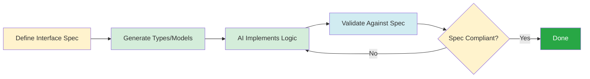

# Interface Boundaries: Clear Contracts for AI and Humans

You've decomposed your system into digestible components. Now comes the critical question: How do these components communicate? What happens when one component needs functionality from another?

The answer lies in **interface boundaries**—explicit contracts that define how components interact. But here's what makes this crucial in agentic development: When a human reads code, they can infer intent, make educated guesses, and ask clarifying questions. When an AI agent reads code, it needs **explicit specifications** or it will guess wrong.

Let me show you why interface boundaries matter more in the age of AI agents.

## The Implicit Interface Problem

Consider this common scenario. You're building a user service that other components will use:

```python
# user_service.py
class UserService:
    def get_user(self, user_id):
        """Get user by ID."""
        # Implementation here
        pass

    def create_user(self, data):
        """Create a new user."""
        # Implementation here
        pass
```

An experienced human developer looks at this and asks:

- What format is `user_id`? String? Integer? UUID?
- What's in the `data` dict? Email? Password? Name?
- What does `get_user` return when the user doesn't exist? None? Exception?
- What validation happens in `create_user`? Email format? Password strength?

The human then goes hunting through the implementation, tests, or other call sites to figure out the answers. It's tedious, but it works.

Now watch an AI agent tackle this same interface. It sees `get_user(user_id)` and might assume:

- `user_id` is a string (because most IDs are strings in examples it's seen)
- It returns None for missing users (common pattern)
- `create_user` needs email and password (reasonable guess)

But if your actual implementation uses integer IDs, throws exceptions for missing users, and requires 12 fields for user creation, the AI-generated code will break.

**The problem**: Implicit interfaces force AI agents to guess. Sometimes they guess right. Often they don't.

## The Explicit Interface Solution

Now consider the same interface with explicit contracts:

```python
# user_service.py
from typing import Optional, Dict
from dataclasses import dataclass

@dataclass
class User:
    """User data model."""
    id: int
    email: str
    name: str
    created_at: str

@dataclass
class CreateUserRequest:
    """Request to create a new user."""
    email: str          # Must be valid email format
    password: str       # Min 8 characters
    name: str          # Max 100 characters
    age: Optional[int] = None

class UserNotFoundError(Exception):
    """Raised when user doesn't exist."""
    pass

class UserService:
    def get_user(self, user_id: int) -> User:
        """Get user by ID.

        Args:
            user_id: Integer user ID

        Returns:
            User object with all fields

        Raises:
            UserNotFoundError: If user doesn't exist
            ValueError: If user_id is negative
        """
        pass

    def create_user(self, request: CreateUserRequest) -> User:
        """Create a new user.

        Args:
            request: CreateUserRequest with validated fields

        Returns:
            Newly created User object

        Raises:
            ValueError: If email format invalid or password too weak
            DuplicateUserError: If email already registered
        """
        pass
```

Now an AI agent sees:

- `user_id` is an `int` (explicit type)
- Returns a `User` object with known fields (dataclass)
- Raises `UserNotFoundError` for missing users (explicit in docstring)
- `create_user` needs a `CreateUserRequest` with email, password, name (explicit type)
- All validation rules documented (email format, password length)

**The result**: The AI agent generates correct code on the first try. No guessing required.

## The Three Levels of Interface Explicitness

Let's establish a hierarchy of interface clarity:

### Level 1: Implicit (Bad for AI)

**Characteristics**:

- Function signatures with generic types (`def process(data): ...`)
- No type hints
- Minimal documentation
- Magic values and assumptions

**Example**:

```python
def calculate_price(items, user, options):
    # What are items? List of what?
    # What fields does user have?
    # What's in options?
    pass
```

**AI agent success rate**: ~40% (lots of trial and error)

### Level 2: Documented (Better)

**Characteristics**:

- Type hints on parameters and return values
- Docstrings explaining behavior
- Error cases documented

**Example**:

```python
def calculate_price(
    items: List[Dict],
    user: Dict,
    options: Dict
) -> Decimal:
    """Calculate total price with discounts and tax.

    Args:
        items: List of cart items with 'id', 'quantity', 'price'
        user: User dict with 'tier' for discount calculation
        options: Pricing options with 'apply_tax', 'coupon_code'

    Returns:
        Final price as Decimal

    Raises:
        ValueError: If items empty or prices invalid
    """
    pass
```

**AI agent success rate**: ~75% (clear intent, but still some ambiguity)

### Level 3: Specification-Driven (Best)

**Characteristics**:

- Formal specifications (OpenAPI, JSON Schema, Protocol Buffers)
- Explicit data models with validation
- Machine-readable contracts
- Auto-generated documentation

**Example with JSON Schema**:

```python
from pydantic import BaseModel, Field
from typing import List
from decimal import Decimal

class CartItem(BaseModel):
    """Item in shopping cart."""
    id: int = Field(gt=0, description="Product ID")
    quantity: int = Field(gt=0, le=100)
    price: Decimal = Field(gt=0, decimal_places=2)

class UserTier(BaseModel):
    """User discount tier."""
    tier: str = Field(pattern="^(basic|premium|vip)$")
    discount_rate: Decimal = Field(ge=0, le=0.5)

class PricingOptions(BaseModel):
    """Options for price calculation."""
    apply_tax: bool = True
    tax_rate: Decimal = Field(default=0.08, ge=0, le=1)
    coupon_code: Optional[str] = Field(max_length=20)

def calculate_price(
    items: List[CartItem],
    user_tier: UserTier,
    options: PricingOptions
) -> Decimal:
    """Calculate total price with discounts and tax.

    The calculation follows this order:
    1. Sum item prices × quantities
    2. Apply user tier discount
    3. Apply coupon if provided
    4. Add tax if enabled

    Returns:
        Final price rounded to 2 decimal places

    Raises:
        ValueError: If items list is empty
    """
    pass
```

**AI agent success rate**: ~95% (complete clarity, validation built-in)

The specification makes everything explicit: field types, validation rules, value constraints, and calculation order. An AI agent can read this and generate a correct implementation without ambiguity.

## Why Specifications Matter for AI Agents

Formal specifications provide four critical benefits for agentic development:

### 1. Unambiguous Contracts

A specification is a machine-readable contract. There's no room for interpretation.

**Human documentation**:

```text
The email field should be a valid email address.
```

What's "valid"? Does it allow `user+tag@example.com`? What about internationalized domains? Humans debate this. AI agents guess.

**Specification**:

```json
{
  "email": {
    "type": "string",
    "format": "email",
    "pattern": "^[a-zA-Z0-9._%+-]+@[a-zA-Z0-9.-]+\\.[a-zA-Z]{2,}$",
    "maxLength": 255
  }
}
```

Now it's unambiguous. Any AI agent can validate against this spec with perfect consistency.

### 2. Validation as Documentation

When you write a specification, you're forced to think through all the edge cases:

```python
class CreateProductRequest(BaseModel):
    name: str = Field(min_length=1, max_length=200)
    price: Decimal = Field(gt=0, decimal_places=2)
    stock: int = Field(ge=0)
    category: str = Field(pattern="^(electronics|clothing|books)$")
    tags: List[str] = Field(max_items=10)
    description: Optional[str] = Field(max_length=5000)
```

This specification documents:

- Name must be 1-200 characters
- Price must be positive with 2 decimal places
- Stock can't be negative
- Category is restricted to 3 values
- Maximum 10 tags
- Description is optional, max 5000 chars

An AI agent implementing this gets all the validation rules for free.

### 3. Auto-Generated Client Code

With a formal specification, AI agents (and humans) can auto-generate client code:

**OpenAPI specification** → **Auto-generated clients**:

```python
# Generated from OpenAPI spec
client = UserServiceClient(base_url="http://api.example.com")

# Type-safe, validated calls
user = client.get_user(user_id=123)  # Returns User object
new_user = client.create_user(
    CreateUserRequest(email="...", password="...", name="...")
)
```

The AI agent doesn't need to guess how to call your API—the specification tells it exactly how, with type safety and validation built-in.

### 4. Contract Testing

Specifications enable automated contract testing:

```python
# Verify implementation matches specification
@pytest.mark.contract
def test_user_service_matches_spec():
    """Ensure UserService implements the specification."""
    spec = load_openapi_spec("user_service_spec.yaml")
    validate_implementation(UserService, spec)
```

If an AI agent modifies the implementation and breaks the contract, tests catch it immediately.

## Practical Specifications for Common Scenarios

Let's explore specifications for three common scenarios in agentic development.

### Scenario 1: REST APIs with OpenAPI

When building REST APIs, OpenAPI (formerly Swagger) is the gold standard.

**Specification** (`user_api.yaml`):

```yaml
openapi: 3.0.0
info:
  title: User API
  version: 1.0.0

paths:
  /users/{userId}:
    get:
      summary: Get user by ID
      parameters:
        - name: userId
          in: path
          required: true
          schema:
            type: integer
            minimum: 1
      responses:
        '200':
          description: User found
          content:
            application/json:
              schema:
                $ref: '#/components/schemas/User'
        '404':
          description: User not found
        '400':
          description: Invalid user ID

components:
  schemas:
    User:
      type: object
      required:
        - id
        - email
        - name
      properties:
        id:
          type: integer
        email:
          type: string
          format: email
        name:
          type: string
          minLength: 1
          maxLength: 100
        created_at:
          type: string
          format: date-time
```

**Benefits**:

- AI agents can read this spec and implement the endpoint correctly
- Auto-generates documentation
- Enables API client generation
- Supports contract testing

See [OpenAPI for REST APIs](../../part3-patterns-tools/specifications/openapi-rest-apis.md) for detailed guidance.

### Scenario 2: Event-Driven Systems with AsyncAPI

For event-driven architectures, AsyncAPI provides similar benefits:

**Specification** (`events.yaml`):

```yaml
asyncapi: 2.6.0
info:
  title: Order Events
  version: 1.0.0

channels:
  order/created:
    publish:
      message:
        payload:
          type: object
          required:
            - order_id
            - user_id
            - total
          properties:
            order_id:
              type: integer
            user_id:
              type: integer
            total:
              type: number
              format: float
            items:
              type: array
              items:
                type: object
```

An AI agent reading this knows exactly what events to publish and consume.

### Scenario 3: Data Validation with JSON Schema

For data structures, JSON Schema (via Pydantic or similar) provides runtime validation:

```python
from pydantic import BaseModel, Field, validator
from typing import List
from datetime import datetime

class OrderItem(BaseModel):
    product_id: int = Field(gt=0)
    quantity: int = Field(gt=0, le=100)
    unit_price: Decimal = Field(gt=0)

    @validator('unit_price')
    def price_must_have_two_decimals(cls, v):
        if v.as_tuple().exponent < -2:
            raise ValueError('Price must have at most 2 decimal places')
        return v

class Order(BaseModel):
    id: int
    user_id: int = Field(gt=0)
    items: List[OrderItem] = Field(min_items=1, max_items=50)
    status: str = Field(pattern="^(pending|confirmed|shipped)$")
    created_at: datetime

    @validator('items')
    def total_quantity_limit(cls, items):
        total_qty = sum(item.quantity for item in items)
        if total_qty > 200:
            raise ValueError('Total order quantity cannot exceed 200')
        return items
```

This specification ensures any AI-generated code validates data correctly.

## The Interface Segregation Principle Revisited

Remember interface segregation from the Component Decomposition section? It becomes even more powerful with explicit specifications.

**Bad: One large interface**:

```python
# Everything uses this massive interface
class OrderService:
    def create_order(...): ...
    def update_order(...): ...
    def cancel_order(...): ...
    def ship_order(...): ...
    def refund_order(...): ...
    # 20 more methods
```

**Good: Segregated interfaces with specifications**:

```python
# Separate specifications for different use cases
class OrderCreation(BaseModel):
    """Specification for creating orders."""
    class Request(BaseModel):
        user_id: int
        items: List[OrderItem]
        shipping_address: Address

    class Response(BaseModel):
        order_id: int
        status: str
        total: Decimal

class OrderFulfillment(BaseModel):
    """Specification for fulfilling orders."""
    class ShipRequest(BaseModel):
        order_id: int
        carrier: str = Field(pattern="^(ups|fedex|usps)$")
        tracking_number: str

    class ShipResponse(BaseModel):
        shipped_at: datetime
        estimated_delivery: datetime
```

Each interface has its own specification. An AI agent working on order creation only loads `OrderCreation`, not the entire OrderService.

## Specification-Driven Development Workflow

Here's how to integrate specifications into your agentic development workflow:

### Step 1: Spec First, Code Second



*Figure 3.3: Specification-driven development workflow. Define the interface contract first, then implement and validate compliance.*

**Workflow**:

1. **Define specification**: Write OpenAPI/AsyncAPI/JSON Schema
2. **Generate code**: Auto-generate types, models, client stubs
3. **AI implements**: AI agent writes business logic against the spec
4. **Validate**: Contract tests ensure compliance
5. **Iterate**: If validation fails, AI fixes and retests

### Step 2: Use Specifications as Prompts

When asking an AI agent to implement an interface:

**Good prompt**:

```text
Implement the UserService according to this OpenAPI specification:
[paste spec]

Ensure all validation rules are enforced and error responses match
the spec exactly.
```

The specification IS the requirement. The AI agent has everything it needs.

### Step 3: Validate Continuously

Add contract tests to your CI pipeline:

```python
def test_api_matches_openapi_spec():
    """Validate implementation matches OpenAPI spec."""
    spec = load_spec("openapi.yaml")
    app = create_test_client()

    # Test each endpoint against spec
    for path, methods in spec.paths.items():
        for method, definition in methods.items():
            validate_endpoint(app, path, method, definition)
```

If an AI agent breaks the contract, the build fails immediately.

## Common Interface Anti-Patterns

Avoid these mistakes:

### Anti-Pattern 1: "Flexible" Interfaces

**Bad**:

```python
def process(data: Dict) -> Dict:
    """Process some data. Returns results."""
    pass
```

"Flexible" means "ambiguous." AI agents will guess the structure wrong.

**Good**:

```python
def process(request: ProcessRequest) -> ProcessResponse:
    """Process request according to specification."""
    pass
```

### Anti-Pattern 2: Implicit Error Handling

**Bad**:

```python
def get_user(user_id):
    """Get user. Returns None if not found."""
    pass
```

Does it return None? Raise an exception? Return an empty dict? AI agents will implement all three approaches.

**Good**:

```python
def get_user(user_id: int) -> User:
    """Get user by ID.

    Raises:
        UserNotFoundError: If user doesn't exist
    """
    pass
```

### Anti-Pattern 3: Magic Values

**Bad**:

```python
def set_user_status(user_id, status):
    """Set user status. Valid values: 0, 1, 2."""
    pass
```

What do 0, 1, 2 mean? Active, inactive, suspended? AI agents will confuse them.

**Good**:

```python
class UserStatus(str, Enum):
    ACTIVE = "active"
    INACTIVE = "inactive"
    SUSPENDED = "suspended"

def set_user_status(user_id: int, status: UserStatus) -> None:
    """Set user account status."""
    pass
```

## Summary: Make Interfaces Explicit

Interface boundaries are where components meet. In traditional development, implicit interfaces work because humans can infer intent. In agentic development, explicit interfaces are essential because AI agents need unambiguous contracts.

**Key principles**:

1. **Use formal specifications**: OpenAPI for REST APIs, AsyncAPI for events, JSON Schema for data
2. **Make everything explicit**: Types, validation rules, error cases, value constraints
3. **Specification-driven development**: Spec first, implementation second
4. **Validate continuously**: Contract tests ensure compliance
5. **Segregate interfaces**: Small, focused contracts over large, comprehensive ones

**The payoff**: When interfaces are explicit, AI agents generate correct code on the first try. When interfaces are implicit, AI agents guess, and you spend time debugging their mistakes.

In the next section, we'll explore **separation of concerns**—how to organize code so AI agents can safely modify one part without breaking others.
