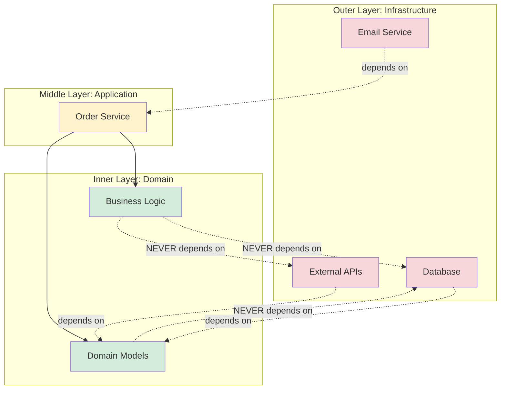

# Separation of Concerns: Making Code Modifiable by AI

You've decomposed your system into digestible components with explicit interfaces. Now the final architecture principle: **separation of concerns**—ensuring that different aspects of your system (business logic, data access, presentation, configuration) don't bleed into each other.

Separation of concerns has always been good practice, but with AI agents it becomes **mission-critical**. Here's why: When an AI agent modifies code, it needs to confidently answer one question: "If I change this, what else might break?"

With proper separation, the answer is clear. Without it, the AI agent is guessing.

## The Tangled Code Problem

Let's start with a real example of tangled concerns that confuses AI agents.

**Tangled implementation**:

```python
# order_handler.py - everything mixed together
class OrderHandler:
    def create_order(self, user_id, cart_items):
        # Presentation logic (formatting)
        formatted_items = ", ".join([
            f"{item['name']} (${item['price']})"
            for item in cart_items
        ])

        # Business logic (price calculation)
        total = sum(item['price'] * item['quantity']
                    for item in cart_items)

        # Data access (database)
        conn = psycopg2.connect("dbname=store user=admin")
        cursor = conn.cursor()

        # Business logic (tax calculation)
        if user_id in self.get_premium_users():  # More data access!
            total = total * 0.9  # 10% discount

        # Business logic (tax)
        tax = total * 0.08

        # Configuration (hard-coded)
        if total > 100:  # Free shipping threshold
            shipping = 0
        else:
            shipping = 10

        # Data access (insert)
        cursor.execute(
            "INSERT INTO orders (user_id, total, items) VALUES (%s, %s, %s)",
            (user_id, total + tax + shipping, formatted_items)
        )

        # Presentation logic (email)
        email_body = f"""
        Order Total: ${total}
        Tax: ${tax}
        Shipping: ${shipping}
        Items: {formatted_items}
        """

        # Infrastructure (email)
        smtp = smtplib.SMTP('smtp.gmail.com', 587)
        smtp.sendmail('noreply@store.com', user_email, email_body)

        conn.commit()
        cursor.close()
        conn.close()

        return order_id
```

This function mixes **six different concerns**:

1. **Business logic**: Price calculation, discounts, tax
2. **Data access**: Database queries
3. **Presentation**: Formatting for display
4. **Configuration**: Hard-coded values (tax rate, free shipping threshold)
5. **Infrastructure**: Email sending, database connections
6. **Orchestration**: Coordinating the flow

**The problem for AI agents**: If an AI needs to change the tax calculation, it must understand:

- Database schema (to know what gets stored)
- Email templates (to update the message)
- Configuration values (to maintain consistency)
- Data formatting (to ensure it's still compatible)

The blast radius is unpredictable. The AI agent might change the tax logic and accidentally break email formatting or database inserts.

## Separated Concerns: Each Layer Independently Modifiable

Now let's see the same functionality with proper separation:

```python
# domain/order.py - Business logic only
from dataclasses import dataclass
from decimal import Decimal
from typing import List

@dataclass
class OrderItem:
    product_id: int
    name: str
    price: Decimal
    quantity: int

@dataclass
class PricingRules:
    tax_rate: Decimal
    free_shipping_threshold: Decimal
    shipping_cost: Decimal

class OrderPricing:
    """Pure business logic - no dependencies."""

    @staticmethod
    def calculate_total(
        items: List[OrderItem],
        is_premium: bool,
        rules: PricingRules
    ) -> Decimal:
        """Calculate order total with discounts, tax, shipping."""
        subtotal = sum(item.price * item.quantity for item in items)

        # Apply premium discount
        if is_premium:
            subtotal = subtotal * Decimal('0.9')

        # Calculate tax
        tax = subtotal * rules.tax_rate

        # Calculate shipping
        shipping = (Decimal('0')
                   if subtotal > rules.free_shipping_threshold
                   else rules.shipping_cost)

        return subtotal + tax + shipping
```

```python
# infrastructure/database.py - Data access only
from typing import List, Optional

class OrderRepository:
    """Data access - no business logic."""

    def __init__(self, db_connection):
        self.db = db_connection

    def save_order(self, user_id: int, total: Decimal,
                   items: List[OrderItem]) -> int:
        """Persist order to database."""
        cursor = self.db.cursor()
        cursor.execute(
            "INSERT INTO orders (user_id, total) VALUES (%s, %s) RETURNING id",
            (user_id, total)
        )
        order_id = cursor.fetchone()[0]

        # Save order items
        for item in items:
            cursor.execute(
                "INSERT INTO order_items (order_id, product_id, quantity, price) "
                "VALUES (%s, %s, %s, %s)",
                (order_id, item.product_id, item.quantity, item.price)
            )

        self.db.commit()
        return order_id

    def is_premium_user(self, user_id: int) -> bool:
        """Check if user has premium status."""
        cursor = self.db.cursor()
        cursor.execute(
            "SELECT is_premium FROM users WHERE id = %s",
            (user_id,)
        )
        result = cursor.fetchone()
        return result[0] if result else False
```

```python
# infrastructure/notifications.py - Infrastructure only
class OrderNotifier:
    """Email notifications - no business logic."""

    def __init__(self, email_client, template_engine):
        self.email = email_client
        self.templates = template_engine

    def send_confirmation(self, user_email: str,
                         order_summary: dict) -> None:
        """Send order confirmation email."""
        email_body = self.templates.render(
            'order_confirmation',
            **order_summary
        )
        self.email.send(
            to=user_email,
            subject="Order Confirmation",
            body=email_body
        )
```

```python
# application/order_service.py - Orchestration
class OrderService:
    """Orchestrates order creation - delegates to specialized components."""

    def __init__(self, repository: OrderRepository,
                 notifier: OrderNotifier,
                 pricing_rules: PricingRules):
        self.repository = repository
        self.notifier = notifier
        self.pricing_rules = pricing_rules

    def create_order(self, user_id: int,
                    items: List[OrderItem]) -> int:
        """Create order by coordinating business logic and infrastructure."""
        # Query data
        is_premium = self.repository.is_premium_user(user_id)

        # Execute business logic
        total = OrderPricing.calculate_total(
            items, is_premium, self.pricing_rules
        )

        # Persist data
        order_id = self.repository.save_order(user_id, total, items)

        # Send notification
        self.notifier.send_confirmation(
            user_email=self._get_user_email(user_id),
            order_summary={
                'order_id': order_id,
                'total': total,
                'items': items
            }
        )

        return order_id
```

Now, if an AI agent needs to modify tax calculation:

1. It opens `domain/order.py`
2. Modifies `OrderPricing.calculate_total()`
3. **Blast radius**: Only pricing logic

The AI doesn't need to touch:

- Database code (`OrderRepository`)
- Email code (`OrderNotifier`)
- Orchestration (`OrderService`)

**The result**: The AI can make changes confidently because concerns are separated.

## The Four Essential Separations

For agentic development, focus on these four critical separations:

### 1. Business Logic from Infrastructure

**Principle**: Business rules should not depend on databases, APIs, file systems, or external services.

**Why**: Business logic changes frequently. Infrastructure rarely does. Mixing them means every business logic change risks breaking infrastructure.

**Bad**:

```python
def apply_discount(user_id):
    # Business logic mixed with database
    conn = get_db_connection()
    user = conn.execute("SELECT * FROM users WHERE id = ?", user_id)
    if user['tier'] == 'premium':
        discount = 0.2
    else:
        discount = 0
    conn.execute("UPDATE users SET discount = ? WHERE id = ?",
                 discount, user_id)
```

**Good**:

```python
def calculate_discount(user_tier: str) -> Decimal:
    """Pure business logic - no infrastructure dependencies."""
    return Decimal('0.2') if user_tier == 'premium' else Decimal('0')

# Infrastructure handled separately
repository.save_user_discount(user_id, discount)
```

### 2. Data Models from API Contracts

**Principle**: Internal data structures should be independent of external API formats.

**Why**: APIs change based on client needs. Internal models change based on business needs. Tying them together creates unnecessary coupling.

**Bad**:

```python
# API returns this, database stores this - tightly coupled
@dataclass
class User:
    id: int
    email: str
    password_hash: str  # Exposed in API? Security risk!
    created_at: str     # String? Or datetime? API and DB confused
```

**Good**:

```python
# Internal domain model
@dataclass
class User:
    id: int
    email: str
    password_hash: str
    created_at: datetime

# API contract (separate)
class UserResponse(BaseModel):
    id: int
    email: str
    member_since: str  # ISO 8601 string for API

# Adapter between them
def user_to_api_response(user: User) -> UserResponse:
    return UserResponse(
        id=user.id,
        email=user.email,
        member_since=user.created_at.isoformat()
    )
```

Now the AI can change the internal model without breaking the API, or vice versa.

### 3. Configuration from Code

**Principle**: Configurable values (tax rates, feature flags, API endpoints) should not be hard-coded in business logic.

**Why**: Configuration changes based on environment (dev, staging, prod). Code should work in any environment without modification.

**Bad**:

```python
def calculate_tax(amount):
    return amount * 0.08  # What if tax rate changes? Redeploy code!
```

**Good**:

```python
@dataclass
class TaxConfig:
    rate: Decimal
    exempt_categories: List[str]

def calculate_tax(amount: Decimal, config: TaxConfig,
                  category: str) -> Decimal:
    if category in config.exempt_categories:
        return Decimal('0')
    return amount * config.rate

# Configuration loaded from environment
config = TaxConfig(
    rate=Decimal(os.getenv('TAX_RATE', '0.08')),
    exempt_categories=os.getenv('TAX_EXEMPT', '').split(',')
)
```

An AI agent can now modify tax logic without touching configuration management.

### 4. Tests from Implementation

**Principle**: Tests should be organized separately from the code they test.

**Why**: Tests describe *what* the code should do. Implementation describes *how*. Mixing them makes it hard to change either independently.

**Structure**:

```
project/
  ├── src/
  │   ├── domain/          # Business logic
  │   ├── infrastructure/  # Data access, external services
  │   └── application/     # Orchestration
  └── tests/
      ├── unit/           # Test business logic in isolation
      ├── integration/    # Test infrastructure components
      └── e2e/            # Test full workflows
```

An AI agent can modify implementation and immediately see which tests need updating, or vice versa.

## The Dependency Rule: Point Inward

To maintain separation, follow this rule: **Dependencies always point toward the core.**



*Figure 3.4: The dependency rule in clean architecture. Infrastructure depends on domain, never the reverse. This enables AI agents to modify business logic without touching infrastructure.*

**Key insight**: Business logic never imports from infrastructure. Infrastructure imports from business logic.

This means an AI agent modifying business logic doesn't need to understand database schemas, API clients, or email services.

## Practical Separation Checklist

For each component, verify:

**Business Logic**:

- [ ] No database imports
- [ ] No API client imports
- [ ] No file system operations
- [ ] No hard-coded configuration
- [ ] Pure functions where possible

**Data Access**:

- [ ] No business logic (just CRUD operations)
- [ ] No presentation logic
- [ ] No direct HTTP calls
- [ ] Returns domain models, not database rows

**API Layer**:

- [ ] No business logic (delegates to service layer)
- [ ] No database access (uses repositories)
- [ ] Converts between API contracts and domain models
- [ ] Handles HTTP-specific concerns only (auth, serialization)

**Configuration**:

- [ ] Separate from code (environment variables, config files)
- [ ] Loaded at startup, injected where needed
- [ ] Never hard-coded in business logic

## Common Separation Violations

### Violation 1: Business Logic in SQL

**Bad**:

```sql
-- Business logic (premium discount) in database query
SELECT product_id,
       CASE
         WHEN user_tier = 'premium' THEN price * 0.8
         ELSE price
       END as final_price
FROM products;
```

**Good**:

```python
# Business logic in code
def get_price_for_user(product: Product, user: User) -> Decimal:
    base_price = product.price
    return base_price * Decimal('0.8') if user.is_premium else base_price
```

### Violation 2: Presentation Logic in Domain

**Bad**:

```python
class Order:
    def total_display(self):
        # Presentation logic in domain model
        return f"${self.total:,.2f}"
```

**Good**:

```python
class Order:
    total: Decimal  # Just data

# Presentation handled separately
def format_currency(amount: Decimal) -> str:
    return f"${amount:,.2f}"
```

### Violation 3: Infrastructure Details Leaking

**Bad**:

```python
def create_user(user_dict: dict):  # Accepts raw DB format
    # Direct database details in business logic
    if user_dict['status_id'] == 1:  # What does 1 mean?
        ...
```

**Good**:

```python
def create_user(user: User):  # Accepts domain model
    if user.status == UserStatus.ACTIVE:  # Clear, type-safe
        ...
```

## Summary: Separation Enables Safe AI Modifications

Separation of concerns ensures that when an AI agent modifies code, the blast radius is predictable and contained. Without separation, every change is risky. With separation, changes are safe and fast.

**The four essential separations**:

1. **Business logic from infrastructure**: Core rules independent of databases and APIs
2. **Data models from API contracts**: Internal and external representations decoupled
3. **Configuration from code**: Environment-specific values externalized
4. **Tests from implementation**: What vs. how kept separate

**The dependency rule**: Always point inward—infrastructure depends on domain, never the reverse.

**The payoff**: When concerns are separated, AI agents can modify one layer without touching others, dramatically increasing velocity and reducing bugs.

Combined with the digestibility principle, component decomposition, and interface boundaries, separation of concerns completes the architecture foundation for effective agentic development. These four principles work together to create systems that both humans and AI agents can understand, modify, and evolve with confidence.

In the next sections, we'll explore how to apply these principles practically, common pitfalls to avoid, and how testability emerges naturally from well-separated architecture.
