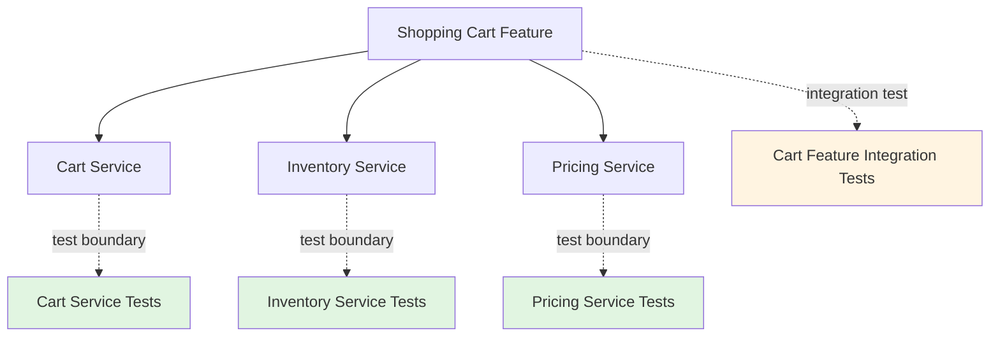

# Testability: Validating AI-Generated Code

When AI generates code 10x faster than humans, what becomes the bottleneck? Testing. You can ask Claude Code to build an entire REST API in 30 minutes, but how do you know it works correctly? How do you validate that the AI understood your requirements and implemented them faithfully?

The answer isn't "test less." It's **architect for testability from the start**. When your system is designed to be easily tested, you can iterate with AI agents at high velocity while maintaining confidence that the code does what it's supposed to do.

## Why Testability is Critical for Agentic Development

In traditional development, you write code slowly and carefully, testing as you go. You intimately understand every line because you wrote it. With AI-generated code, you're reviewing hundreds or thousands of lines you didn't write. You need a different validation strategy.

Consider this scenario: You prompt Claude Code to implement user authentication. Five minutes later, you have a complete implementation with password hashing, session management, JWT tokens, and email verification. It looks sophisticated. But does it work? Are there security vulnerabilities? Does it handle edge cases?

Without good tests, you're forced to:
- **Manually test every scenario** (slow and error-prone)
- **Read and understand all the generated code** (defeats the velocity gains)
- **Hope the AI got it right** (dangerous)

With a testable architecture, you can:
- **Run automated tests in seconds** and know if it works
- **Trust the AI-generated code** if tests pass
- **Iterate quickly** by regenerating implementations and re-running tests

Testability transforms AI code generation from "risky and slow to validate" to "fast and verifiable."

## The Four Pillars of Testable Architecture

### 1. Dependency Injection: Control Your Collaborators

The most powerful testability pattern is **dependency injection**—providing dependencies from outside rather than creating them inside your code. This lets you swap real implementations with test doubles (mocks, stubs, fakes).

**Untestable approach:**

```python
class UserService:
    def create_user(self, email, password):
        # Hard-coded dependency - can't test without real DB
        db = PostgresDatabase("production-db-url")
        hashed = bcrypt.hash(password)
        user_id = db.insert("users", {
            "email": email,
            "password_hash": hashed
        })

        # Hard-coded email service - sends real emails in tests!
        email_service = SendGridEmailService()
        email_service.send_welcome_email(email)

        return user_id
```

This code is **impossible to test** without:
- A real PostgreSQL database running
- SendGrid credentials configured
- Actually sending emails during tests

**Testable approach with dependency injection:**

```python
class UserService:
    def __init__(self, database, email_service, hasher):
        self.database = database
        self.email_service = email_service
        self.hasher = hasher

    def create_user(self, email, password):
        hashed = self.hasher.hash(password)
        user_id = self.database.insert("users", {
            "email": email,
            "password_hash": hashed
        })
        self.email_service.send_welcome_email(email)
        return user_id
```

Now in tests, you can inject test doubles:

```python
def test_create_user():
    # Arrange: Create test doubles
    fake_db = InMemoryDatabase()
    mock_email = MockEmailService()
    fake_hasher = FakeHasher()

    service = UserService(fake_db, mock_email, fake_hasher)

    # Act: Call the method
    user_id = service.create_user("test@example.com", "pass123")

    # Assert: Verify behavior
    assert fake_db.contains("users", user_id)
    assert mock_email.was_called_with("test@example.com")
    assert fake_hasher.hash_called_once()
```

The test runs in **milliseconds**, requires **no infrastructure**, and **verifies the logic** completely.

When you prompt an AI agent to implement a feature, you can specify: "Use dependency injection for all external services." The AI will generate testable code, and you can validate it immediately with tests.

### 2. Pure Functions: Predictable and Easy to Test

A **pure function** is one that:
- **Always returns the same output for the same inputs** (deterministic)
- **Has no side effects** (doesn't modify external state, doesn't do I/O)

Pure functions are the easiest code to test because you just call them with inputs and check outputs. No setup, no mocking, no cleanup.

**Impure function (hard to test):**

```python
def calculate_total_price(cart_id):
    # Reaches into global state
    cart = GLOBAL_CART_STORE[cart_id]

    # Makes database call
    tax_rate = database.get_tax_rate(cart.shipping_address)

    # Uses current time (non-deterministic)
    if datetime.now().hour >= 18:
        # Evening discount
        discount = 0.1
    else:
        discount = 0.0

    total = sum(item.price for item in cart.items)
    return total * (1 + tax_rate) * (1 - discount)
```

This function is **painful to test**:
- Need to set up global cart store
- Need a database with tax rates
- Behavior changes based on time of day
- Hard to test edge cases

**Pure function (easy to test):**

```python
def calculate_total_price(items, tax_rate, discount_rate):
    """Calculate total price with tax and discount.

    Args:
        items: List of items with prices
        tax_rate: Tax rate as decimal (e.g., 0.08 for 8%)
        discount_rate: Discount as decimal (e.g., 0.1 for 10%)

    Returns:
        Total price with tax and discount applied
    """
    subtotal = sum(item.price for item in items)
    with_tax = subtotal * (1 + tax_rate)
    with_discount = with_tax * (1 - discount_rate)
    return round(with_discount, 2)
```

Now the test is trivial:

```python
def test_calculate_total_price():
    items = [
        Item(price=10.00),
        Item(price=20.00)
    ]

    total = calculate_total_price(
        items=items,
        tax_rate=0.08,
        discount_rate=0.1
    )

    # 30.00 + 8% tax = 32.40, - 10% discount = 29.16
    assert total == 29.16
```

No setup, no mocking, just inputs and outputs. You can test dozens of scenarios in seconds.

**Architectural principle**: Push impure operations (I/O, state mutation, time) to the edges of your system. Keep the core logic pure. This makes the bulk of your code trivially testable.

### 3. Test Boundaries Aligned with Component Boundaries

Remember component decomposition from earlier sections? Well-designed component boundaries make natural test boundaries. Each component should be testable independently.



*Figure 3.6: Component boundaries define test boundaries. Each component has focused unit tests, while integration tests verify components work together.*

When components have:
- **Clear interfaces**: Easy to mock for testing
- **Single responsibility**: Tests focus on one thing
- **Explicit dependencies**: Easy to inject test doubles

Then you can:
- **Test each component in isolation** (fast unit tests)
- **Test integrations between components** (targeted integration tests)
- **Know exactly what broke** when tests fail (precise test boundaries)

### 4. Fast Feedback Loops

The final pillar is **speed**. Tests must be fast enough to run constantly during development. If tests take 10 minutes to run, you won't run them frequently. If they take 10 seconds, you'll run them after every change.

**Slow tests kill agentic development velocity.** You iterate with AI, generate code, run tests, iterate again. This cycle needs to be measured in seconds, not minutes.

**Architecture for fast tests:**

```python
# Bad: Slow integration test for every function
def test_user_creation_full_stack():
    # Starts entire application (10 seconds)
    app = start_full_application()

    # Makes real HTTP request (1 second)
    response = requests.post("http://localhost/api/users",
                            json={"email": "test@example.com"})

    # Queries real database (1 second)
    user = database.query("SELECT * FROM users WHERE email=?",
                         "test@example.com")

    assert user.email == "test@example.com"

    # Total: ~12 seconds per test


# Good: Fast unit test with mocks
def test_user_creation_logic():
    # Creates lightweight objects (< 1ms)
    mock_db = MockDatabase()
    service = UserService(mock_db)

    # Calls function directly (< 1ms)
    service.create_user("test@example.com", "password")

    # Verifies mock was called correctly (< 1ms)
    assert mock_db.insert_was_called()

    # Total: < 10ms per test
```

With fast unit tests, you can run hundreds of tests in seconds. This enables:
- **Continuous testing** while developing with AI
- **Immediate feedback** when something breaks
- **Confidence to iterate rapidly** knowing tests will catch regressions

## Testability Checklist for Agentic Development

When architecting a new system or feature, verify:

- [ ] **Dependencies are injected**, not hard-coded
- [ ] **Core logic is pure functions** where possible
- [ ] **I/O and state changes** are pushed to boundaries
- [ ] **Components are independently testable**
- [ ] **Interfaces are mockable** for testing
- [ ] **Tests run in milliseconds**, not seconds or minutes
- [ ] **Test coverage includes edge cases** and error conditions
- [ ] **AI agents can generate tests** from specifications

When prompting AI to implement features, include testability requirements:

> "Implement user authentication with dependency injection for database and email services. Write pure functions for password hashing and validation. Include unit tests for all logic."

The AI will generate testable code, and you can validate it immediately.

## The Testability-Velocity Feedback Loop

Here's the beautiful thing about testable architecture: it creates a positive feedback loop with AI development velocity.

1. **Testable code → Fast test execution** (seconds, not minutes)
2. **Fast tests → Frequent testing** (after every AI iteration)
3. **Frequent testing → Quick error detection** (catch problems immediately)
4. **Quick detection → Rapid iteration** (fix and regenerate quickly)
5. **Rapid iteration → Higher velocity** (more features shipped)
6. **Higher velocity → More need for testing** (more code to validate)
7. **More testing → More testability needed** (architecture improves)

This loop accelerates over time. The more you optimize for testability, the faster you can safely iterate with AI agents.

## Common Testability Mistakes

**Mistake 1: Testing implementation details instead of behavior**

Don't test *how* the code works internally. Test *what* it does from the outside.

```python
# Bad: Brittle test of implementation details
def test_password_hashing_uses_bcrypt():
    service = UserService()
    # This breaks if you switch from bcrypt to argon2
    assert isinstance(service.hasher, BcryptHasher)

# Good: Tests the behavior contract
def test_password_hashing_is_secure():
    service = UserService()
    password = "mysecret123"

    # Hash is different from plaintext
    hashed = service.hash_password(password)
    assert hashed != password

    # Same password verifies successfully
    assert service.verify_password(password, hashed)

    # Different password fails
    assert not service.verify_password("wrong", hashed)
```

**Mistake 2: Skipping tests because "AI code is usually correct"**

AI code is usually *plausible*, not necessarily correct. It can have subtle bugs, security issues, or misunderstand requirements. Tests catch these.

**Mistake 3: Over-mocking to the point of meaningless tests**

```python
# Bad: Mocks so much that test is meaningless
def test_create_user():
    mock_service = Mock()
    mock_service.create_user.return_value = 123

    # This always passes - you're testing the mock!
    result = mock_service.create_user("email", "pass")
    assert result == 123
```

Only mock external dependencies (databases, APIs, etc.). Test your own logic for real.

## What's Next

You now understand how to architect for testability—dependency injection, pure functions, aligned boundaries, and fast feedback. But testability alone isn't enough. You need to apply these principles systematically across your entire system.

In the next section, [Practical Application](./07-practical-application.md), we'll walk through architecting a complete system using all the principles from this chapter: digestibility, decomposition, interfaces, separation of concerns, and testability. You'll see how these principles work together in practice.
