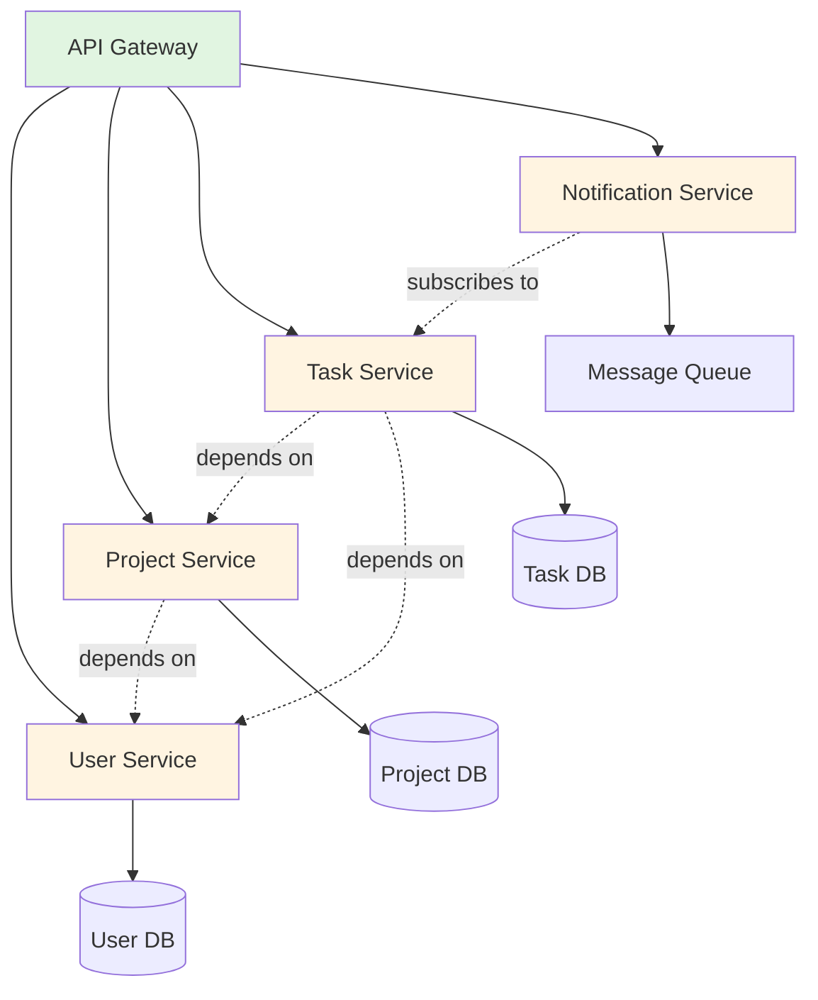
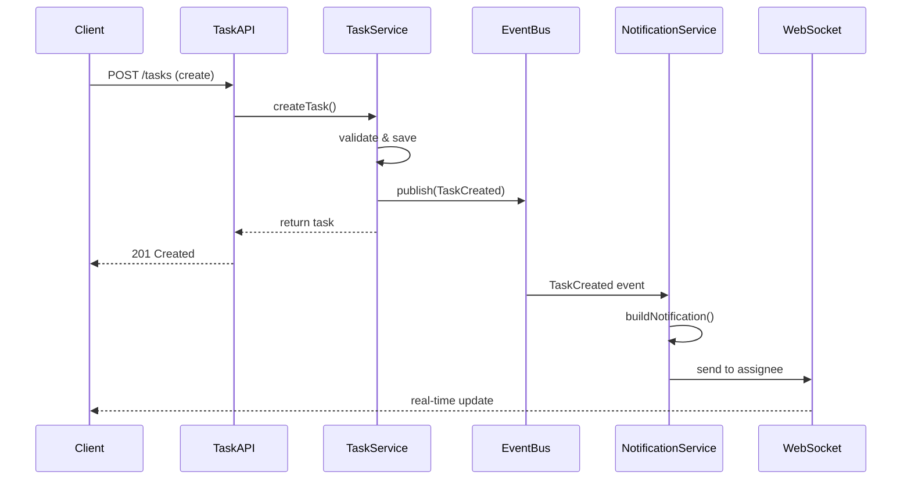

# Practical Application: Architecting a Real System

You've learned five core principles: digestibility, component decomposition, interface boundaries, separation of concerns, and testability. But how do these principles work together in practice? How do you actually apply them when sitting down with Claude Code to architect a new system?

Let's walk through a complete example: **designing a task management API** that supports teams collaborating on projects. We'll make real architectural decisions, see how the principles guide those decisions, and show how to collaborate with AI agents throughout the process.

## The Requirements

Imagine we're building a REST API for a task management system with these key requirements:

**Core Features**:
- Users can create projects and add tasks
- Tasks have assignees, due dates, status, and comments
- Teams can collaborate on shared projects
- Real-time notifications when tasks are updated
- Search and filtering across tasks

**Non-Functional Requirements**:
- Must handle 1,000 concurrent users
- API response time < 200ms (p95)
- Easy for frontend developers to integrate
- Testable in isolation without external services

**Constraints**:
- 6-week timeline to MVP
- Small team (1-2 developers + AI agents)
- Standard tech stack (Node.js, PostgreSQL, REST)

Now let's architect this system using our principles.

## Architecture Decision 1: Component Decomposition

**Question**: How do we break this system into components?

**Applying the principles**:

Looking at the requirements, we can identify natural boundaries based on **business capabilities** and **data ownership**:



*Figure 3.7: Component decomposition for task management API. Each service owns its data and exposes a clear interface. The API gateway routes requests to appropriate services.*

**Why this decomposition?**

1. **Digestibility**: Each service is 500-1,000 lines—fits in Claude's context window with room for tests
2. **Single responsibility**: User Service only handles users, Task Service only handles tasks
3. **Independent development**: AI agents can work on each service in isolation
4. **Testable boundaries**: Each service can be tested without the others

**Working with Claude Code**:

```
Prompt: "Design the Task Service for our task management API.
Requirements:
- Manage CRUD operations for tasks
- Tasks belong to projects (external)
- Tasks have assignees from User Service (external)
- Provide search/filter capabilities
- Use dependency injection for external services
Keep it under 800 lines for digestibility."
```

Claude will generate a focused service that respects boundaries.

## Architecture Decision 2: Interface Boundaries

**Question**: How do services communicate? What contracts do we define?

**Applying the principles**:

We'll use **OpenAPI specifications** to define explicit contracts between services. This makes interfaces digestible for both humans and AI agents.

**Task Service API Contract** (excerpt):

```yaml
openapi: 3.0.0
info:
  title: Task Service API
  version: 1.0.0

paths:
  /tasks:
    post:
      summary: Create a new task
      requestBody:
        required: true
        content:
          application/json:
            schema:
              type: object
              required: [title, project_id]
              properties:
                title:
                  type: string
                  maxLength: 200
                description:
                  type: string
                  maxLength: 2000
                project_id:
                  type: string
                  format: uuid
                assignee_id:
                  type: string
                  format: uuid
                due_date:
                  type: string
                  format: date-time
      responses:
        '201':
          description: Task created successfully
          content:
            application/json:
              schema:
                $ref: '#/components/schemas/Task'
        '400':
          description: Invalid request
        '404':
          description: Project not found
```

**Why OpenAPI?**

1. **Explicit contract**: No ambiguity about request/response shapes
2. **AI-readable**: Claude Code can read the spec and generate conformant implementations
3. **Auto-validation**: Tools can validate requests/responses against the spec
4. **Documentation**: Automatically generates API docs

**Working with Claude Code**:

```
Prompt: "Implement the POST /tasks endpoint according to the
OpenAPI spec. Use dependency injection for ProjectService and
UserService. Include input validation and error handling."
```

Claude generates code that exactly matches the specification.

## Architecture Decision 3: Separation of Concerns

**Question**: How do we organize code within each service?

**Applying the principles**:

We'll use a **layered architecture** that separates:
- **API layer**: HTTP handling, request validation
- **Business logic layer**: Task rules and workflows
- **Data access layer**: Database queries
- **Infrastructure layer**: External service clients

**Task Service Structure**:

```
task-service/
├── src/
│   ├── api/
│   │   └── task.routes.ts        # Express routes (HTTP)
│   ├── domain/
│   │   ├── task.service.ts       # Business logic (pure)
│   │   └── task.validator.ts    # Validation rules
│   ├── data/
│   │   └── task.repository.ts   # Database access
│   ├── clients/
│   │   ├── project.client.ts    # Project Service client
│   │   └── user.client.ts       # User Service client
│   └── app.ts                    # Dependency wiring
└── tests/
    ├── unit/                     # Pure logic tests
    ├── integration/              # DB tests
    └── contract/                 # API contract tests
```

**Why this separation?**

1. **Testability**: Business logic in `domain/` is pure—easy to test
2. **Clarity**: Each file has one job
3. **AI-friendly**: Clear file naming tells Claude what goes where
4. **Maintainability**: Changes localized to single layer

**Example - Pure Business Logic**:

```typescript
// domain/task.service.ts - Pure business logic
export class TaskService {
  calculateStatus(task: Task, now: Date): TaskStatus {
    // Pure function - no side effects, easy to test
    if (task.completed_at) return 'completed';
    if (!task.due_date) return 'active';

    const dueDate = new Date(task.due_date);
    const hoursUntilDue =
      (dueDate.getTime() - now.getTime()) / (1000 * 60 * 60);

    if (hoursUntilDue < 0) return 'overdue';
    if (hoursUntilDue < 24) return 'urgent';
    return 'active';
  }
}
```

## Architecture Decision 4: Testability

**Question**: How do we make this system testable?

**Applying the principles**:

We'll use **dependency injection** throughout and design for **fast unit tests**.

**Dependency Injection Setup**:

```typescript
// src/app.ts - Wire dependencies at startup
export function createApp(dependencies: Dependencies) {
  const {
    taskRepository,
    projectClient,
    userClient,
    eventBus
  } = dependencies;

  // Inject all dependencies
  const taskService = new TaskService(
    taskRepository,
    projectClient,
    userClient
  );

  const taskController = new TaskController(
    taskService,
    eventBus
  );

  const app = express();
  app.use('/tasks', taskController.router);

  return app;
}
```

**Testing in Isolation**:

```typescript
// tests/unit/task.service.test.ts
describe('TaskService', () => {
  it('creates task with valid project', async () => {
    // Arrange: Create test doubles
    const mockRepo = createMockRepository();
    const mockProjectClient = {
      exists: jest.fn().mockResolvedValue(true)
    };
    const mockUserClient = {
      exists: jest.fn().mockResolvedValue(true)
    };

    const service = new TaskService(
      mockRepo,
      mockProjectClient,
      mockUserClient
    );

    // Act
    const task = await service.createTask({
      title: 'Test Task',
      project_id: 'proj-123',
      assignee_id: 'user-456'
    });

    // Assert
    expect(task.id).toBeDefined();
    expect(mockProjectClient.exists)
      .toHaveBeenCalledWith('proj-123');
    expect(mockRepo.save).toHaveBeenCalledWith(
      expect.objectContaining({ title: 'Test Task' })
    );
  });
});
```

**Test runs in < 5ms** because there's no database, no HTTP calls, no external dependencies.

## Architecture Decision 5: Real-Time Notifications

**Question**: How do we handle real-time notifications without coupling services?

**Applying the principles**:

We'll use an **event-driven architecture** with a message queue to decouple services.



*Figure 3.8: Event-driven notification flow. Task Service publishes events after state changes. Notification Service subscribes and handles delivery independently. Services remain decoupled.*

**Why events?**

1. **Separation**: Task Service doesn't know about notifications
2. **Digestibility**: Each service handles its own concern
3. **Testability**: Can test Task Service without Notification Service
4. **Scalability**: Can add more event subscribers without changing Task Service

## Putting It All Together

Here's our final architecture applying all five principles:

**✓ Digestibility**: Each service 500-1,000 lines, fits in context window
**✓ Component Decomposition**: Clear service boundaries based on business capabilities
**✓ Interface Boundaries**: OpenAPI specs define explicit contracts
**✓ Separation of Concerns**: Layered architecture (API/domain/data/infrastructure)
**✓ Testability**: Dependency injection enables fast unit tests

**Working with Claude Code on This Architecture**:

```
Session 1 - Design Phase:
Prompt: "Review this architecture diagram and OpenAPI specs.
Identify any missing error cases or edge conditions."

Session 2 - Implementation:
Prompt: "Implement Task Service according to the architecture.
Use the layered structure (api/domain/data/clients).
Include dependency injection and unit tests."

Session 3 - Review:
Prompt: "Review task.service.ts for:
1. Adherence to single responsibility
2. Testability (pure functions where possible)
3. Error handling completeness
4. Edge cases (null/undefined handling)"
```

Claude Code generates implementations that follow your architectural principles because you've made them **explicit and digestible**.

## The Architecture-Velocity Feedback Loop

Notice what this architecture enables:

1. **Parallel development**: Different services can be built simultaneously
2. **Fast testing**: Unit tests run in milliseconds
3. **Easy integration**: OpenAPI specs guide implementation
4. **Clear ownership**: Each service has a defined purpose
5. **AI-friendly**: Digestible components fit in context windows

This isn't over-engineering—this is **engineering for velocity with AI agents**. The clearer your architecture, the faster Claude Code can help you build it.

## Key Takeaways

When architecting systems for agentic development:

1. **Start with boundaries** - Identify natural component divisions based on business capabilities
2. **Define contracts first** - Write OpenAPI specs before implementation
3. **Layer within components** - Separate API, domain, data, and infrastructure concerns
4. **Inject dependencies** - Enable testing and flexibility
5. **Use events for decoupling** - Keep services independent

In the next section, [Common Pitfalls](./08-common-pitfalls.md), we'll explore the mistakes developers make when applying these principles—and how to avoid them.
