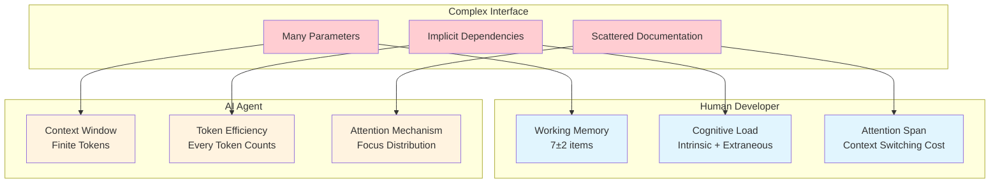

# Introduction: The Interface Problem

You're staring at an API documentation page. Forty-seven parameters. Six different authentication modes. Return types that vary based on which combination of optional flags you pass. You've been reading for twenty minutes and still aren't sure how to make a simple request.

This isn't a hypothetical scenario. It's Tuesday.

Complex interfaces are everywhere in software development. Configuration files that require constant cross-referencing. Functions that accept a dozen arguments with no obvious order. APIs where understanding one endpoint requires reading documentation for ten others. We've normalized this complexity as "just how software is."

But there's a cost we rarely acknowledge. Every time you encounter a complex interface, your brain performs a small miracle: juggling variable names, tracking state across files, holding multiple possible code paths in working memory simultaneously. Developers do this so often that we forget how cognitively demanding it is.

Now introduce an AI agent into this picture. You ask Claude Code to integrate with that 47-parameter API. The agent reads the same documentation, tries to understand the same relationships, attempts to hold the same context. But unlike you, it can't take a coffee break when overwhelmed. It can't draw diagrams on a whiteboard to externalize complexity. It has a finite context window, and every confusing parameter consumes precious tokens.

Here's the insight that will shape this chapter: **the constraints that make interfaces hard for humans are remarkably similar to the constraints that make them hard for AI agents.**

*Figure 4.1: Complex interfaces strain parallel constraints in humans and AI agents. Working memory limits map to context window limits. Cognitive load maps to token efficiency. Attention limits map to attention mechanisms.*

This parallel isn't coincidental. Both humans and AI agents are bounded information processors. We each have limits on how much we can hold in active consideration at once. We each perform better when information is well-organized, explicit, and appropriately scoped.

This means you don't need separate design philosophies for "human-friendly" and "AI-friendly" interfaces. You need one unified approach: **digestible interfaces**.

## What This Chapter Covers

In this chapter, we'll explore what makes an interface digestible and why it matters more than ever in the age of agentic coding.

**In this chapter, we'll explore**:

- What makes an interface "digestible" for humans and AI agents
- The surprising parallels between working memory and context windows
- Why good interfaces serve both audiences simultaneously
- Practical principles for designing digestible interfaces
- Real-world examples of digestible vs. complex interfaces
- How to measure and assess interface quality

## Why This Matters Now

You might wonder: developers have dealt with complex interfaces for decades. Why is this suddenly urgent?

The answer lies in velocity. When you code with AI agents, development speed can increase 5-10x. That's not hyperbole—it's what happens when an AI can generate hundreds of lines of code in seconds. But this acceleration creates a new problem: the interfaces your AI agents must work with become the bottleneck.

A human developer might tolerate a complex API because they'll only integrate with it once, spending a day to figure it out. But an AI agent might encounter that same API across dozens of tasks. Every time it struggles with ambiguous parameters or implicit dependencies, it slows down. Every time it guesses wrong about undocumented behavior, you debug its mistakes.

Interface digestibility isn't just about developer experience anymore. It's about operational efficiency in agentic systems. The better your interfaces, the more effectively your AI agents work. The worse your interfaces, the more you're held back by the very tools meant to accelerate you.

Let's begin by defining exactly what we mean by "digestible."
