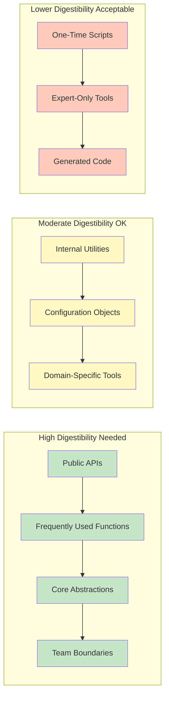

# Defining Digestibility

What exactly makes an interface "digestible"? It's not about being simple. Some domains are inherently complex, and oversimplifying them creates worse problems than the complexity itself. A digestible interface isn't dumbed down—it's appropriately scoped and well-structured.

Here's a working definition:

> **A digestible interface can be fully understood and used correctly without exceeding the cognitive or computational limits of the user—whether that user is a human developer or an AI agent.**

This definition has three important parts. Let's unpack each.

## Fully Understood

A digestible interface reveals its complete behavior from its signature, documentation, and immediate context. You shouldn't need to trace through implementation details, consult external resources, or run experiments to understand what it does.

Consider two functions that check user permissions:

```python
# Hard to understand fully
def check(u, p, r):
    # What's u? What's p? What's r?
    # What does this return?
    # What happens if something fails?
    pass

# Fully understandable
def can_user_perform_action(
    user: User,
    permission: Permission,
    resource: Resource
) -> PermissionResult:
    """Check if user has permission to act on resource.

    Args:
        user: The authenticated user to check
        permission: The permission required (e.g., READ, WRITE)
        resource: The resource being accessed

    Returns:
        PermissionResult with allowed=True/False and reason

    Raises:
        UserNotFoundError: If user doesn't exist
        ResourceNotFoundError: If resource doesn't exist
    """
    pass
```

The second version leaves nothing to the imagination. Types, purpose, return value, and error cases are all explicit. A human developer can use it correctly after one reading. An AI agent can generate correct calling code without guessing.

## Used Correctly

Understanding an interface isn't enough—you need to be able to use it without mistakes. This means the interface design prevents common errors and makes correct usage the path of least resistance.

A digestible interface:

- **Makes invalid states unrepresentable**: Use types to prevent impossible combinations
- **Fails fast with clear errors**: Validate inputs immediately and explain what's wrong
- **Has sensible defaults**: Common cases work without extensive configuration
- **Follows conventions**: Behavior matches what users expect from similar interfaces

Consider date handling:

```python
# Easy to use incorrectly
def schedule_event(start, end, timezone):
    """Schedule an event.

    Args:
        start: Start time (string? datetime? timestamp?)
        end: End time (what format?)
        timezone: Timezone (string name? offset? what if invalid?)
    """
    pass

# Hard to use incorrectly
def schedule_event(
    time_range: TimeRange,
    timezone: ZoneInfo = ZoneInfo("UTC")
) -> ScheduledEvent:
    """Schedule an event within a time range.

    Args:
        time_range: TimeRange with validated start < end
        timezone: Python ZoneInfo (defaults to UTC)

    Returns:
        ScheduledEvent with confirmed times

    Raises:
        InvalidTimeRangeError: If start >= end
    """
    pass

@dataclass
class TimeRange:
    """A valid time range where start is before end."""
    start: datetime
    end: datetime

    def __post_init__(self):
        if self.start >= self.end:
            raise InvalidTimeRangeError(
                f"Start ({self.start}) must be before end ({self.end})"
            )
```

The `TimeRange` dataclass makes it impossible to create an invalid range. The timezone parameter uses Python's built-in `ZoneInfo` type, eliminating string parsing issues. The interface design prevents mistakes rather than merely documenting how to avoid them.

## Within Limits

Here's the crucial part: even a clear, well-designed interface can be indigestible if it's too large to fit within cognitive or computational constraints.

Human working memory holds approximately 7±2 items at once (Miller's Law). This isn't arbitrary—it's a fundamental limit of human cognition. When an interface requires tracking more than about seven things simultaneously, accuracy drops and errors increase.

AI context windows are similarly constrained. While 200K tokens sounds enormous, complex interfaces can consume thousands of tokens in documentation, type definitions, and examples. The more context an interface requires, the less room remains for the actual task.

A digestible interface fits comfortably within these limits:

- **Limited parameters**: Five or fewer parameters per function is a good target
- **Bounded scope**: Does one thing completely rather than many things partially
- **Self-contained**: Can be understood without loading extensive external context
- **Hierarchical**: Complexity is organized into layers that can be understood independently

## The Digestibility Spectrum

Not every interface needs maximum digestibility. The appropriate level depends on how the interface will be used.



*Figure 4.2: The digestibility spectrum. Public APIs and frequently-used functions need the highest digestibility. Internal utilities can tolerate more complexity. One-time scripts and expert tools have the most flexibility.*

**High digestibility** is essential for:

- **Public APIs**: External users can't ask clarifying questions
- **Frequently used functions**: Small cognitive costs compound over many calls
- **Core abstractions**: Foundation code affects everything built on top
- **Team boundaries**: Interfaces between teams need clarity

**Moderate digestibility** is acceptable for:

- **Internal utilities**: Team members share context and can ask questions
- **Configuration objects**: Complex by nature but used infrequently
- **Domain-specific tools**: Users already have specialized knowledge

**Lower digestibility** can be tolerated for:

- **One-time scripts**: Used once then discarded
- **Expert-only tools**: Users are deeply familiar with the domain
- **Generated code**: Humans rarely read it directly

The key is matching interface complexity to its usage pattern. Don't over-engineer a throwaway script, but don't under-design a public API.

## Why "Digestible" Instead of "Simple"

The word "simple" carries baggage. It often implies "lacking features" or "suitable only for beginners." Interface design discussions can devolve into debates about whether simplicity means sacrificing power.

"Digestible" sidesteps this trap. A digestible interface can be sophisticated and powerful—it just structures that power appropriately. Consider the difference:

**Simple** (sometimes too simple):

```python
def process_data(data):
    """Process data."""
    # What data? What processing? What result?
    pass
```

**Complex** (hard to digest):

```python
def process_data(
    data, format, mode, options, filters, transforms,
    validators, callbacks, config, context, metadata
):
    """Process data with full control over every aspect."""
    pass
```

**Digestible** (sophisticated but manageable):

```python
def process_data(
    data: DataFrame,
    pipeline: ProcessingPipeline
) -> ProcessedResult:
    """Process data through a configured pipeline.

    Args:
        data: Input DataFrame to process
        pipeline: ProcessingPipeline with transforms,
                  validators, and output configuration

    Returns:
        ProcessedResult with output data and metadata
    """
    pass
```

The digestible version is just as powerful as the complex version—all those options live inside `ProcessingPipeline`. But the interface itself is manageable. You can understand the function signature, then dive into pipeline configuration as needed.

This is the core principle: **push complexity into well-organized structures rather than spreading it across function signatures**.

## The Five Characteristics of Digestible Interfaces

Based on this definition, we can identify five core characteristics that make an interface digestible:

1. **Bounded Complexity**: Limited number of parameters, options, or concepts to track simultaneously. Target five or fewer parameters.

2. **Clear Purpose**: Single, well-defined responsibility. The function name should tell you what it does.

3. **Self-Contained**: Can be understood without consulting extensive external documentation. Types and names carry meaning.

4. **Predictable**: Behavior follows intuitive patterns. Similar inputs produce similar outputs. No surprises.

5. **Composable**: Can be combined with other interfaces without cognitive overload. Inputs and outputs align cleanly.

In the following sections, we'll explore why these characteristics matter for both human developers and AI agents, and how to achieve them in practice.
