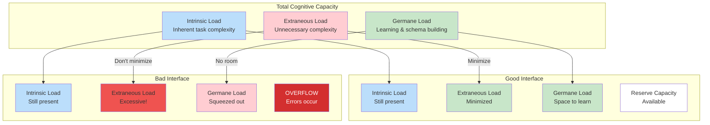

# Human Constraints: Working Memory Limits

Before we can design interfaces for humans, we need to understand human limitations. Not in a pejorative sense—these are simply facts about how our brains process information. Understanding them lets us design interfaces that work *with* our cognition rather than against it.

## The 7±2 Rule

In 1956, cognitive psychologist George Miller published "The Magical Number Seven, Plus or Minus Two," one of the most cited papers in psychology. His finding: human working memory can hold approximately seven items simultaneously, with individual variation between five and nine.

Working memory is your brain's mental scratchpad. It's where you hold information while you're actively using it—the variables you're tracking while debugging, the parameters you need to remember when calling a function, the state of the system you're reasoning about.

Seven items isn't much. And when you're programming, those items fill up fast:

- The function you're writing
- The function you're calling
- The parameters it needs
- The return value you expect
- The error case you need to handle
- The state that changes as a result
- The next thing you need to do after this

That's seven items just for a simple function call. Add any complexity—nested calls, conditional logic, shared state—and you've blown past the limit.

## What Happens When We Exceed the Limit

When working memory overflows, we don't get an error message. Instead, things just start to go wrong:

**Forgetting**: You lose track of something. You forget to handle an error case. You misremember a parameter order. You overlook a side effect.

**Swapping**: Your brain pages information in and out. You re-read the same documentation. You jump back and forth between files. You rebuild context repeatedly.

**Simplification**: You create mental shortcuts that may not be accurate. "This probably works like the other API." "I'll assume this never fails." These shortcuts become bugs.

**Errors**: You make mistakes. Wrong parameter types. Missing null checks. Logic that works in your head but not in reality.

Every developer has experienced these. The frustration of tracing through code for the fifth time because you keep losing the thread. The bug that came from an incorrect assumption you didn't realize you were making. The documentation you've read three times and still can't quite remember.

These aren't personal failures. They're predictable outcomes of interfaces that exceed human cognitive limits.

## Cognitive Load Theory

Cognitive load theory, developed by John Sweller in the 1980s, provides a useful framework. It identifies three types of cognitive load:

**Intrinsic Load**: The inherent complexity of the task itself. Sorting a list has lower intrinsic load than implementing a distributed consensus algorithm. You can't eliminate intrinsic load without changing the problem.

**Extraneous Load**: Complexity added by how information is presented. A poorly documented API, confusing parameter names, inconsistent conventions—these add load without adding value. This is the load we can and should minimize.

**Germane Load**: The effort of learning and building mental models. This is productive load that leads to understanding. We want to support this load, not eliminate it.



*Figure 4.3: Cognitive load distribution. Good interfaces minimize extraneous load, leaving room for intrinsic complexity and learning. Bad interfaces waste capacity on unnecessary complexity, leading to overflow.*

The key insight: **digestible interfaces minimize extraneous load**. They present necessary complexity without adding unnecessary cognitive overhead.

## How Complexity Manifests in Code

Let's look at specific ways interface complexity exceeds working memory:

### Too Many Parameters

```python
# This exceeds working memory
def create_order(
    customer_id,      # 1
    items,            # 2
    shipping_address, # 3
    billing_address,  # 4
    payment_method,   # 5
    discount_code,    # 6
    gift_wrap,        # 7
    gift_message,     # 8
    delivery_date,    # 9
    special_instructions,  # 10
    insurance_option,      # 11
    signature_required     # 12
):
    pass
```

Twelve parameters. A developer calling this function needs to remember all twelve, their order, and their types. This is physically impossible to hold in working memory. They'll inevitably need to keep referencing documentation, leading to constant context switching.

### Deep Nesting

```python
# Each level adds to working memory
def process_order(order):
    if order.is_valid():                              # tracking: validity
        if order.customer.has_payment_method():       # + payment method
            if order.items_in_stock():                # + stock status
                if order.shipping_address.is_valid(): # + address validity
                    if not order.is_duplicate():      # + duplicate status
                        # By here, you're tracking 5+ conditions
                        # What were the first conditions again?
                        process_payment(order)
```

Each nested condition adds another item to track. By the time you reach the inner code, you've lost track of the outer conditions. This is why early returns and guard clauses work better—they let you forget conditions once they're handled.

### Scattered State

```python
# State spread across multiple places
class OrderProcessor:
    def __init__(self):
        self.current_order = None
        self.processing_stage = "init"
        self.retry_count = 0
        self.last_error = None
        self.config = load_config()

    def process(self, order):
        self.current_order = order
        self._validate()  # Modifies self.processing_stage
        self._check_inventory()  # Might modify self.last_error
        self._process_payment()  # Uses self.config, modifies stage
        self._send_notification()  # Depends on all of the above
```

To understand `process()`, you need to track instance state across multiple method calls. Each method might modify shared state that affects others. This scattered state forces you to hold the entire object's mental model in working memory simultaneously.

### Implicit Dependencies

```python
# What does this function actually need?
def generate_report():
    # Silently depends on:
    # - DATABASE_URL environment variable
    # - Global config object
    # - Current working directory
    # - Timezone settings
    # - Logging configuration
    # None of which appear in the signature
    pass
```

Implicit dependencies are especially insidious because they're not visible. You call the function, it fails mysteriously, and you spend time hunting for the hidden requirement.

## How Developers Cope

Developers have evolved strategies to work around cognitive limits. These strategies work, but they're workarounds for bad interfaces, not solutions:

**External Memory**: Notes, comments, diagrams, open documentation tabs. You offload information from working memory to external artifacts. This works but slows you down.

**Chunking**: Experts group related items into single concepts. "Authentication flow" becomes one chunk instead of seven steps. This is why experienced developers handle complexity better—but it requires investment.

**Patterns and Conventions**: When interfaces follow familiar patterns, you can apply existing mental models instead of building new ones. This is why consistency matters so much.

**Simplification**: You build an approximate mental model that's good enough for your immediate task. This works until the approximation diverges from reality.

**Trial and Error**: You just try things and see what works. This is the least efficient strategy but sometimes the only option with poorly designed interfaces.

## The Cost of Exceeding Limits

Interface complexity isn't just annoying—it has measurable costs:

**Bugs**: Complexity causes mistakes. Studies consistently show that code complexity correlates with defect rates. Functions with more parameters have more bugs.

**Velocity**: Context switching and re-reading documentation takes time. A complex interface might save 10 lines of code but cost hours in debugging and maintenance.

**Onboarding**: New team members struggle with complex interfaces. What takes an expert 5 minutes might take a newcomer 2 hours.

**Maintenance**: Code is read more than it's written. Every time someone reads a complex interface, they pay the cognitive tax.

The goal of digestible interfaces isn't to make code "easy" in a condescending sense. It's to spend cognitive resources on solving problems rather than wrestling with tools.

## Designing for Human Cognition

Given these constraints, how do we design interfaces that work with human cognition?

**Limit parameters**: Five or fewer parameters per function. If you need more, create a parameter object.

**Make names meaningful**: Good names reduce the need to remember documentation. `calculate_shipping_cost(order)` tells you what it does.

**Follow conventions**: Familiar patterns require less working memory. Don't be creative where consistency serves better.

**Fail fast with clear errors**: When mistakes happen (and they will), clear errors help recovery without requiring re-understanding the entire interface.

**Organize complexity hierarchically**: Break complex operations into levels that can be understood independently. You can understand the top level without knowing the details.

These aren't just nice-to-haves. They're accommodations for fundamental constraints of human cognition. Interfaces that ignore these constraints don't just feel harder—they produce worse outcomes.

In the next section, we'll see how AI agents face remarkably similar constraints, and why designing for one audience automatically serves the other.
