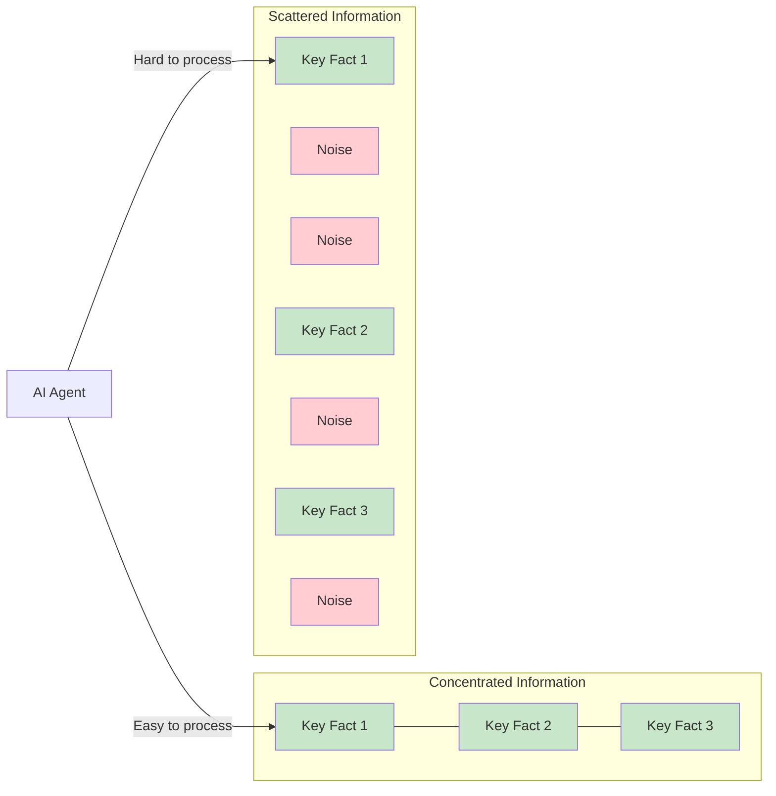

# AI Constraints: Context Window Limits

AI agents like Claude Code don't have human brains, but they face analogous constraints. Understanding these constraints—and their parallel to human limitations—reveals why digestible interfaces benefit both audiences.

## The Context Window

Every AI agent operates within a context window—a fixed amount of text it can consider at once. For current large language models, this ranges from 8K to 200K tokens. A token is roughly 3-4 characters, so 200K tokens is approximately 150,000 words or 500 pages of text.

That sounds enormous. It's not.

Consider what happens when you ask Claude Code to modify a complex codebase:

- **System prompt**: Instructions, capabilities, constraints (~5K tokens)
- **Conversation history**: Previous messages and responses (~10K tokens)
- **File contents**: Code being read and modified (~20K+ tokens)
- **Documentation**: API specs, configuration, related files (~10K+ tokens)
- **Generated output**: The code being written (~5K+ tokens)

A single moderate-complexity task can consume 50K tokens before you've done anything challenging. Add complexity—multiple files, external APIs, intricate business logic—and you're pressing against limits even with 200K token windows.

This is the AI equivalent of working memory. The context window is everything the agent can hold in active consideration. Information outside the window might as well not exist.

## Token Efficiency Matters

Every token counts. Not just for cost (though that matters too), but for effectiveness. When an interface requires verbose explanation, documentation, or examples, it consumes tokens that could be used for actual problem-solving.

Consider two ways to present the same API:

**Verbose interface** (consumes ~300 tokens to explain):

```python
def process_user_data(
    user_data,           # dict with user information
    operation_mode,      # string: 'create', 'update', 'delete'
    validation_level,    # int: 0=none, 1=basic, 2=strict
    output_format,       # string: 'json', 'xml', 'csv'
    include_metadata,    # bool: whether to include meta fields
    timestamp_format,    # string: strftime format for dates
    null_handling,       # string: 'omit', 'empty', 'null'
    error_behavior       # string: 'raise', 'log', 'ignore'
):
    """Process user data with specified options.

    The operation_mode determines whether we're creating new,
    updating existing, or deleting user records. The validation_level
    controls how strictly we check inputs (0 = no validation,
    1 = basic type checking, 2 = full schema validation)...
    [documentation continues for 200 more tokens]
    """
    pass
```

**Efficient interface** (consumes ~80 tokens to explain):

```python
def process_user(
    user: User,
    operation: UserOperation,
    config: ProcessingConfig = ProcessingConfig()
) -> ProcessedUser:
    """Process a user record according to configuration.

    Raises:
        ValidationError: If user data is invalid
        OperationError: If operation fails
    """
    pass
```

The efficient version conveys the same capability in a quarter of the tokens. The type hints carry meaning. The config object encapsulates options. An AI agent can understand and use this interface faster and with more context remaining for the actual task.

## Attention Mechanisms

Transformer models (which power current AI agents) use attention mechanisms to determine which parts of the context to focus on. This is analogous to human selective attention—the ability to focus on relevant information while filtering out noise.

But attention isn't free. The more scattered the relevant information, the harder it is to attend to correctly. When key details are buried in verbose documentation, surrounded by irrelevant examples, or spread across multiple locations, attention must work harder to find and connect them.



*Figure 4.4: Concentrated vs. scattered information. When key facts are grouped together, AI agents process them efficiently. When facts are scattered among noise, attention must work harder and may miss connections.*

This is why self-documenting interfaces work better than interfaces with extensive external documentation. When the type hint `user: User` tells you everything you need to know, no additional attention allocation is required. When you need to read three paragraphs of documentation to understand what `user` should be, attention must span a larger context.

## What AI Agents Struggle With

Certain interface patterns are particularly problematic for AI agents:

### Implicit Knowledge Requirements

```python
# This requires knowledge not in the immediate context
def connect_to_service():
    """Connect to the service.

    Note: Requires SERVICE_URL environment variable and valid
    credentials in ~/.service/config.yaml. The service must be
    running on port 8080 unless overridden by SERVICE_PORT.
    """
    pass
```

An AI agent reading this code doesn't have access to your environment variables or config files. It can read the documentation, but it can't verify the actual values. This often leads to generated code that assumes defaults or makes incorrect guesses about configuration.

### Magic Behavior

```python
# What does this actually do?
def process(data, mode="auto"):
    """Process data.

    In 'auto' mode, behavior depends on data type and content:
    - If data looks like JSON, parse and validate
    - If data looks like CSV, use pandas
    - If data looks like XML, use lxml
    - If data starts with 'http', fetch URL first
    - If data is a file path, read file
    - Otherwise, treat as raw string
    """
    pass
```

"Magic" behavior that depends on content inspection is hard to reason about. An AI agent can't reliably predict which code path will execute without actually running the code. This leads to generated code that may work for test cases but fail in production.

### Inconsistent Patterns

```python
# Three ways to do the same thing
users_api.get_user(user_id)      # Returns User or None
orders_api.fetch_order(order_id) # Returns Order or raises NotFound
products_api.find_product(sku)    # Returns Optional[Product]
```

When similar operations have different names and behaviors, AI agents must track these inconsistencies explicitly. Every variation consumes context that could be used for actual problem-solving.

### Deep Dependency Chains

```python
# Understanding this requires understanding 5 other things
def create_invoice(order: Order) -> Invoice:
    """Create invoice from order.

    The order must have:
    - A valid customer (see CustomerService.validate())
    - Approved payment (see PaymentService.approve())
    - Fulfilled items (see InventoryService.fulfill())
    - Calculated tax (see TaxService.calculate())
    - Applied discounts (see DiscountService.apply())
    """
    pass
```

To use this function correctly, an AI agent needs to understand five other services. Each dependency adds to context requirements. Deep dependency chains can exceed context limits before the main task even begins.

## The Surprising Parallels

Here's the key insight: the constraints that make interfaces hard for AI agents closely mirror those that make them hard for humans.

| Human Constraint | AI Constraint | Design Implication |
|-----------------|---------------|-------------------|
| Working memory (7±2 items) | Context window (finite tokens) | Limit parameters, scope interfaces |
| Cognitive load | Token consumption | Make interfaces self-documenting |
| Selective attention | Attention mechanism | Concentrate key information |
| Forgetting under load | Information outside window | Keep related info together |
| Context switching cost | Re-reading files costs tokens | Design cohesive components |

This parallel isn't coincidence. Both humans and AI agents are bounded information processors. We both work best when information is:

- **Concentrated**: Key facts grouped together
- **Explicit**: No hidden dependencies or magic behavior
- **Consistent**: Similar operations work similarly
- **Appropriately scoped**: Complexity bounded to digestible chunks

## Where AI Differs from Humans

Despite the parallels, AI agents have distinct characteristics:

**Perfect recall within context**: Unlike humans who forget, AI agents have perfect access to everything in their context window. If information is present, they can use it. This means organizing information well matters even more—it's available but may be hard to find.

**No fatigue**: AI agents don't get tired or lose focus over long sessions. They can process the same complex interface repeatedly without degradation. This is an advantage, but it doesn't eliminate context limits.

**Struggle with ambiguity**: Humans can often infer intent from context, experience, and intuition. AI agents tend to take things literally. "Process the data appropriately" is fine for a human who can ask clarifying questions; it's problematic for an AI agent that will make its best guess.

**Pattern matching strength**: AI agents excel at recognizing and applying patterns they've seen. Consistent interfaces that follow common conventions benefit AI agents more than creative, custom approaches.

## Designing for AI Context Limits

Given these constraints, how do we design interfaces that work well for AI agents?

**Be explicit**: Don't assume background knowledge. State types, constraints, and behaviors clearly.

**Be concise**: Every token matters. Self-documenting code beats verbose documentation.

**Be consistent**: Follow conventions. Similar operations should work similarly.

**Be cohesive**: Keep related code together. Minimize the files an agent needs to load.

**Be predictable**: Avoid magic behavior. Inputs should determine outputs without hidden factors.

Sound familiar? These are essentially the same principles we derived for human cognition. The constraints are parallel, so the solutions are unified.

In the next section, we'll synthesize these insights into a single set of principles that serve both audiences.
