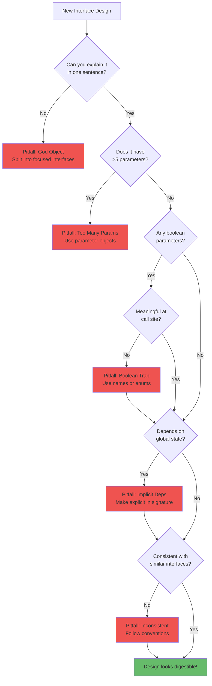

# Common Pitfalls in Interface Design

Knowing the principles of digestible design isn't enough—you need to recognize when you're violating them. These pitfalls are common because they feel reasonable when you're writing code. It's only later, when someone (human or AI) tries to use the interface, that the problems become apparent.

## Pitfall 1: Over-Engineering for Flexibility

**The Mistake**: Creating highly configurable interfaces with dozens of options "in case someone needs it someday."

### What It Looks Like

```python
def create_report(
    data_source,
    output_format="pdf",
    template=None,
    custom_styles=None,
    page_size="A4",
    orientation="portrait",
    margins=None,
    header_enabled=True,
    header_text=None,
    header_logo=None,
    footer_enabled=True,
    footer_text=None,
    page_numbers=True,
    page_number_format="Page {current} of {total}",
    toc_enabled=False,
    toc_depth=3,
    toc_title="Table of Contents",
    watermark=None,
    watermark_opacity=0.3,
    encryption_enabled=False,
    encryption_password=None,
    compression_level=6,
    metadata=None,
    locale="en_US",
    date_format="%Y-%m-%d",
    number_format="1,234.56",
    debug_mode=False
):
    """Generate a report with extensive customization options."""
    pass
```

### Why It Hurts

**For humans**:

- Analysis paralysis: "Which options do I actually need?"
- Documentation overload: Every option requires explanation
- Testing burden: Combinations explode exponentially
- Maintenance cost: Every option must be maintained forever

**For AI agents**:

- Massive context consumption explaining each option
- Difficulty determining which options matter for the current task
- Higher probability of selecting wrong option combinations
- Generated code becomes verbose and hard to review

### The Fix

Start simple and extend only when need is proven.

```python
def create_report(
    data_source: DataSource,
    config: ReportConfig = ReportConfig()
) -> Report:
    """Generate a report from data source.

    Args:
        data_source: Source of data for the report
        config: Report configuration (defaults to standard format)

    Returns:
        Generated Report ready for export
    """
    pass

@dataclass
class ReportConfig:
    """Report configuration with sensible defaults."""
    format: ReportFormat = ReportFormat.PDF
    template: str = "default"
    locale: str = "en_US"

# If advanced options are truly needed, add them incrementally
@dataclass
class AdvancedReportConfig(ReportConfig):
    """Extended configuration for complex reports."""
    page_settings: PageSettings = field(default_factory=PageSettings)
    header: Optional[HeaderConfig] = None
    footer: Optional[FooterConfig] = None
```

**Guideline**: Add options when users ask for them, not when you imagine they might want them.

## Pitfall 2: Boolean Traps

**The Mistake**: Using boolean parameters that are meaningless without context.

### What It Looks Like

```python
# At the call site, what do these mean?
process_file("data.csv", True, False, True, False)
user.update(True, False, True)
send_notification(user_id, message, True, True, False)
```

### Why It Hurts

**For humans**:

- `True, False, True` conveys zero information at the call site
- Must consult the function signature to understand meaning
- Easy to swap parameters: is it `(active, admin)` or `(admin, active)`?

**For AI agents**:

- No semantic meaning to reason about
- High probability of reversing boolean order
- Generated code is impossible to verify at a glance

### The Fix

Replace booleans with named parameters or enums.

```python
# Bad: What does True mean?
send_notification(user_id, message, True, True, False)

# Better: Named parameters
send_notification(
    user_id=user_id,
    message=message,
    send_email=True,
    send_push=True,
    send_sms=False
)

# Best: Configuration object
send_notification(
    user_id=user_id,
    message=message,
    channels=NotificationChannels(email=True, push=True)
)

# Or: Explicit methods for different behaviors
notification_service.send_via_email(user_id, message)
notification_service.send_via_push(user_id, message)
```

**Guideline**: If a boolean parameter doesn't have an obvious meaning at the call site, it needs a better design.

## Pitfall 3: Implicit Dependencies

**The Mistake**: Functions that depend on external state not visible in their signatures.

### What It Looks Like

```python
def process_order():
    """Process the current order."""
    # Depends on global current_user
    user = current_user

    # Depends on environment variable
    api_key = os.environ.get("PAYMENT_API_KEY")

    # Depends on global configuration
    config = GlobalConfig.instance()

    # Depends on thread-local request context
    request_id = flask.g.request_id

    # None of these appear in the function signature
    pass
```

### Why It Hurts

**For humans**:

- Mysterious failures when dependencies aren't set up
- Can't test in isolation without mocking globals
- Hard to trace data flow through the application
- Violates principle of least surprise

**For AI agents**:

- Can't infer required setup from function signature
- Generated code may miss critical configuration
- No way to validate that dependencies are satisfied
- May generate code that works in tests but fails in production

### The Fix

Make dependencies explicit in function signatures.

```python
def process_order(
    order: Order,
    user: User,
    payment_client: PaymentClient,
    config: OrderConfig
) -> ProcessedOrder:
    """Process an order for a user.

    Args:
        order: The order to process
        user: The user placing the order
        payment_client: Client for payment processing
        config: Order processing configuration

    Returns:
        ProcessedOrder with status and details
    """
    pass

# Dependency injection at composition root
def create_order_processor(
    payment_api_key: str,
    config: OrderConfig
) -> OrderProcessor:
    """Factory for order processor with configured dependencies."""
    payment_client = PaymentClient(api_key=payment_api_key)
    return OrderProcessor(payment_client=payment_client, config=config)
```

**Guideline**: If a function needs something to work, that something should appear in its signature.

## Pitfall 4: Inconsistent Naming

**The Mistake**: Using different names for the same concept across the codebase.

### What It Looks Like

```python
# Same concept, different names
class UsersService:
    def get_user(self, user_id): pass
    def fetch_user_by_email(self, email): pass

class OrdersService:
    def retrieve_order(self, order_id): pass
    def find_order_by_number(self, number): pass

class ProductsService:
    def load_product(self, product_id): pass
    def query_product_by_sku(self, sku): pass

# Similar concepts, inconsistent patterns
user_service.create_user(data)        # create
order_service.add_order(data)         # add
product_service.new_product(data)     # new

user_service.delete_user(id)          # delete
order_service.remove_order(id)        # remove
product_service.destroy_product(id)   # destroy
```

### Why It Hurts

**For humans**:

- Must remember which verb goes with which service
- Cognitive overhead for every API interaction
- Inconsistency compounds across a large codebase

**For AI agents**:

- Can't apply patterns learned from one service to another
- Must explicitly track vocabulary per service
- More likely to use wrong verb, causing errors

### The Fix

Establish and enforce naming conventions.

```python
# Consistent naming across all services
class UsersService:
    def get(self, user_id: int) -> User: pass
    def get_by_email(self, email: str) -> User: pass
    def create(self, data: CreateUserRequest) -> User: pass
    def update(self, user_id: int, data: UpdateUserRequest) -> User: pass
    def delete(self, user_id: int) -> None: pass
    def list(self, filters: UserFilters = None) -> List[User]: pass

class OrdersService:
    def get(self, order_id: int) -> Order: pass
    def get_by_number(self, number: str) -> Order: pass
    def create(self, data: CreateOrderRequest) -> Order: pass
    def update(self, order_id: int, data: UpdateOrderRequest) -> Order: pass
    def delete(self, order_id: int) -> None: pass
    def list(self, filters: OrderFilters = None) -> List[Order]: pass

# Same pattern everywhere: get, create, update, delete, list
```

**Guideline**: Pick one word for each concept and use it everywhere. Document the conventions.

## Pitfall 5: God Objects and Swiss Army Knives

**The Mistake**: One interface that does everything.

### What It Looks Like

```python
class ApplicationManager:
    """Manages everything in the application."""

    def create_user(self, ...): pass
    def update_user(self, ...): pass
    def delete_user(self, ...): pass
    def authenticate_user(self, ...): pass
    def reset_password(self, ...): pass

    def create_order(self, ...): pass
    def process_order(self, ...): pass
    def cancel_order(self, ...): pass
    def refund_order(self, ...): pass

    def send_email(self, ...): pass
    def send_sms(self, ...): pass
    def send_push_notification(self, ...): pass

    def generate_report(self, ...): pass
    def export_data(self, ...): pass
    def import_data(self, ...): pass

    def update_configuration(self, ...): pass
    def clear_cache(self, ...): pass
    def run_maintenance(self, ...): pass

    # ... 50 more methods
```

### Why It Hurts

**For humans**:

- Violates single responsibility principle
- Hard to understand what the class actually does
- Changes to one feature risk breaking others
- Testing requires mocking many dependencies

**For AI agents**:

- Entire class must be loaded to understand any method
- Massive context consumption
- Difficult to reason about side effects
- Generated code may inadvertently use wrong methods

### The Fix

Split into focused, composable services.

```python
class UserService:
    """Manages user accounts."""
    def get(self, user_id: int) -> User: pass
    def create(self, data: CreateUserRequest) -> User: pass
    def update(self, user_id: int, data: UpdateUserRequest) -> User: pass
    def delete(self, user_id: int) -> None: pass

class AuthenticationService:
    """Handles user authentication."""
    def authenticate(self, credentials: Credentials) -> AuthResult: pass
    def reset_password(self, email: str) -> None: pass
    def verify_token(self, token: str) -> User: pass

class OrderService:
    """Manages orders."""
    def create(self, data: CreateOrderRequest) -> Order: pass
    def process(self, order_id: int) -> ProcessedOrder: pass
    def cancel(self, order_id: int, reason: str) -> None: pass

class NotificationService:
    """Sends notifications through various channels."""
    def send(self, notification: Notification) -> SendResult: pass

# Each service is focused, testable, and digestible
```

**Guideline**: If you can't describe what a class does in one sentence, it's doing too much.

## Pitfall 6: Leaky Abstractions

**The Mistake**: Exposing implementation details that callers shouldn't need to know.

### What It Looks Like

```python
class DatabaseUserRepository:
    def get_user_with_connection_pooling_and_retry(
        self,
        user_id: int,
        pool_size: int = 10,
        max_retries: int = 3,
        retry_delay_ms: int = 100,
        use_read_replica: bool = False
    ) -> User:
        """Get user with database-specific options."""
        pass

    def create_user_with_transaction_isolation(
        self,
        data: dict,
        isolation_level: str = "READ_COMMITTED"
    ) -> User:
        """Create user with specific transaction isolation."""
        pass
```

### Why It Hurts

**For humans**:

- Callers must understand database internals to use the API
- Coupling to implementation makes it hard to change databases
- Complexity leaks upward through the application

**For AI agents**:

- Must understand database concepts to use a user service
- May generate incorrect database-specific configurations
- Abstraction provides no simplification

### The Fix

Hide implementation details behind clean abstractions.

```python
class UserRepository:
    """Repository for user data persistence."""

    def get(self, user_id: int) -> User:
        """Get user by ID.

        Raises:
            UserNotFoundError: If user doesn't exist
        """
        pass

    def create(self, data: CreateUserRequest) -> User:
        """Create a new user.

        Raises:
            DuplicateUserError: If email already exists
        """
        pass

# Implementation details are internal
class PostgresUserRepository(UserRepository):
    """PostgreSQL implementation of UserRepository."""

    def __init__(
        self,
        connection_pool: ConnectionPool,
        retry_config: RetryConfig
    ):
        # Configuration happens at construction, not at each call
        self._pool = connection_pool
        self._retry = retry_config

    def get(self, user_id: int) -> User:
        # Pooling, retries, replicas handled internally
        pass
```

**Guideline**: Callers should only need to understand the domain concept, not the storage mechanism.

## Recognizing Pitfalls in Practice



*Figure 4.6: Decision tree for recognizing interface design pitfalls. Each checkpoint identifies a common mistake and its remedy.*

## Summary

These pitfalls share a common theme: they add complexity that serves the implementer's convenience rather than the user's needs. Avoiding them requires discipline:

- **Resist premature flexibility**: Add options when needed, not "just in case"
- **Make meaning visible**: No magic parameters, no hidden state
- **Stay consistent**: One word, one pattern, everywhere
- **Keep focus**: Small interfaces that do one thing well
- **Hide internals**: Clean abstractions over leaky implementations

Both humans and AI agents benefit when you avoid these traps. The code becomes easier to understand, easier to use correctly, and easier to maintain.
