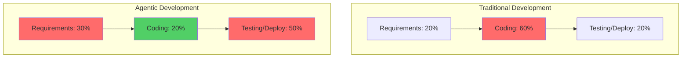

# Introduction: The Acceleration Paradox

Your AI agent just generated 500 lines of perfectly functional code in 3 minutes. The implementation is clean, the tests pass, and the code follows best practices. You're elated—until you realize you're not entirely sure if it's building the right thing. You spend the next 2 hours rewriting requirements and explaining what you actually meant, then ask the AI to regenerate everything. Welcome to the acceleration paradox.

This scenario plays out thousands of times every day in teams adopting agentic coding. The promise is real: AI agents can implement features 5-10x faster than manual coding. But this acceleration doesn't eliminate bottlenecks—it shifts them to unexpected places, exposing constraints that were previously hidden behind slow implementation cycles.

## The Central Insight

When coding becomes radically faster through AI agents, the bottlenecks don't disappear—they move. What was once the slow part (writing and debugging code) becomes fast, instantly exposing everything upstream and downstream as the new limiting factors. It's like upgrading from a two-lane highway to an eight-lane expressway, only to discover that the on-ramps and off-ramps are now hopelessly congested.

In traditional software development, coding is slow enough to provide a buffer. Requirements can evolve during implementation. Architecture decisions can be refined as you build. Product choices can be reconsidered mid-sprint. Code review happens at a manageable pace. Testing keeps up with development velocity.

Agentic coding eliminates this buffer. When AI can scaffold an entire API in 15 minutes instead of 2 days, every ambiguity in your requirements becomes immediately visible. When features can be implemented in hours instead of weeks, every unclear product decision creates exponential waste. When code review volume increases 5x, your review process becomes the bottleneck to shipping.

## The Five New Bottlenecks

This chapter explores the five major bottlenecks that emerge when implementation accelerates:

1. **Requirements and Business Vision**: Unclear specifications and product direction become catastrophically expensive when AI can implement the wrong thing quickly
2. **Product Decision-Making**: Product managers and stakeholders can't make decisions fast enough to keep pace with implementation velocity
3. **Architecture and Design Clarity**: Poorly defined system boundaries and interfaces lead to rapid accumulation of technical debt
4. **Code Review at Scale**: Traditional review processes collapse under 5-10x code volume
5. **Testing and Quality Assurance**: QA practices designed for slow development can't validate features arriving daily

Each bottleneck represents a fundamental shift in how software development works. What were minor inefficiencies at traditional velocity become critical path blockers at agentic velocity.

## Why Traditional Practices Break Down

Traditional software development practices evolved for a world where coding is the slowest step. Agile methodologies, sprint planning, and review processes all assume implementation is the constraint. These practices break down when coding accelerates:

- **Sprint planning** designed for 2-week implementation cycles becomes too coarse-grained when features ship in days
- **Requirements refinement** during implementation no longer works when the AI builds exactly what you specified, ambiguities and all
- **Code review** as a quality gate fails when reviewers receive 5x more code than they can meaningfully evaluate
- **QA cycles** planned around 2-week development windows can't keep pace with daily feature releases

The paradox is complete: The practices that worked for decades now actively slow you down, turning your newly efficient implementation process into a bottleneck-riddled workflow.

## The Opportunity

Understanding these new bottlenecks isn't just about identifying problems—it's about unlocking sustainable velocity. Teams that master these constraints achieve the full promise of agentic coding: 5-10x faster delivery from idea to production, not just 5-10x faster coding.

The solutions aren't about working harder or moving faster. They're about working differently:

- **Invest upstream**: Spend more time on requirements and architecture upfront, knowing it has exponentially higher ROI
- **Shift left**: Move quality, security, and validation earlier in the process where AI can help
- **Automate validation**: Replace manual review bottlenecks with automated checks and AI-assisted verification
- **Redesign workflows**: Build new processes optimized for high-velocity development, not retrofitted from traditional methods
- **Embrace specifications**: Treat formal specs as first-class artifacts that guide AI implementation

*Figure 5.1: Time allocation shift from traditional to agentic development. Red indicates bottleneck areas. Notice how the coding bottleneck (red, 60%) shrinks to green (20%), while upstream requirements and downstream validation become the new constraints.*

## What This Chapter Covers

In the sections ahead, we'll explore each bottleneck in depth:

- **Understanding the 5-10x multiplier**: Where the speed gains come from and what they mean for your workflow
- **Bottleneck deep dives**: Detailed analysis of each new constraint with real-world scenarios
- **Solutions and strategies**: Practical approaches for addressing each bottleneck
- **Sustainable velocity**: How to maintain momentum throughout the entire product lifecycle

By the end of this chapter, you'll understand not just what changes when coding accelerates, but how to adapt your entire development practice to thrive in this new reality. The goal isn't to slow down your AI-assisted implementation—it's to speed up everything else to match.

The acceleration paradox is real, but it's also solvable. Let's explore how.
