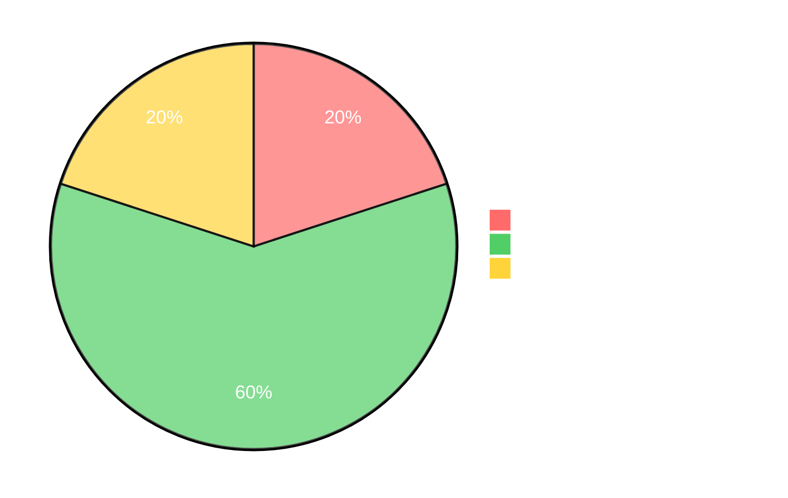
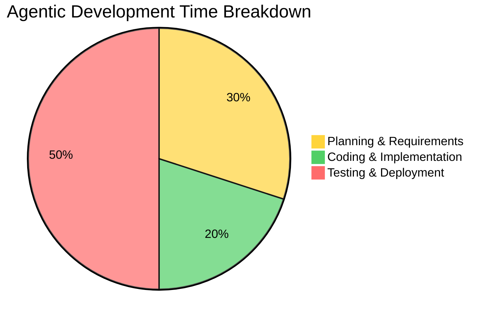

# Understanding the 5-10x Multiplier

The claim that AI agents accelerate coding by 5-10x sounds extraordinary, perhaps even implausible. But this isn't marketing hyperbole—it's a measurable reality backed by data from teams using agentic coding in production. Understanding where this acceleration comes from, what it applies to, and what it doesn't affect is crucial for adapting your workflow effectively.

## Where the Speed Gains Come From

The 5-10x multiplier emerges from AI's ability to generate large volumes of correct, conventional code almost instantaneously. The acceleration varies dramatically based on the type of work:

### Boilerplate and Scaffolding: 10-20x Faster

Code that follows established patterns accelerates the most. Creating a new REST API endpoint with standard CRUD operations, database models, validation, and error handling—work that might take 2-3 hours manually—can be generated by an AI agent in 8-12 minutes. The AI knows the patterns, handles the repetitive structure, and produces code that's often more complete than a rushed human implementation.

**Example**: Scaffolding a complete Express.js API with authentication middleware, request validation, database integration, error handling, and logging. Manual implementation: 4-5 hours. AI-assisted: 20-30 minutes.

### CRUD Implementations: 5-8x Faster

Standard create, read, update, delete operations follow predictable patterns. Once you specify the data model and business rules, AI can generate the full implementation stack—database schema, API endpoints, input validation, error handling, and basic tests—in a fraction of the time it takes to write manually.

**Example**: Building a complete user management system with profile CRUD, password reset flow, and email notifications. Manual implementation: 2 days. AI-assisted: 4-5 hours.

### Test Scaffolding: 8-12x Faster

Writing comprehensive test suites is time-consuming and repetitive. AI agents excel at generating test cases, test fixtures, mocks, and assertions based on your code structure and requirements. What might take an afternoon to write manually can be generated in 15-20 minutes.

**Example**: Creating a full test suite for an API module with unit tests, integration tests, edge cases, and error condition testing. Manual implementation: 3-4 hours. AI-assisted: 20-25 minutes.

### Configuration and Infrastructure: 5-10x Faster

Setting up Docker configurations, CI/CD pipelines, environment configs, and deployment scripts involves lots of boilerplate with subtle variations. AI can generate complete, working configurations based on your stack description and requirements.

**Example**: Creating Docker compose files, GitHub Actions workflows, environment configuration for dev/staging/prod, and deployment scripts. Manual implementation: 4-6 hours. AI-assisted: 30-45 minutes.

## Real-World Time Comparisons

Let's look at concrete before-and-after scenarios from actual development work:

| Task | Manual Time | AI-Assisted Time | Multiplier |
|------|-------------|------------------|------------|
| REST API endpoint (auth, validation, DB, tests) | 2 hours | 15 minutes | 8x |
| React component (state, props, styling, tests) | 1 hour | 8 minutes | 7.5x |
| Database migration with validation | 45 minutes | 5 minutes | 9x |
| Complete test suite for module | 3 hours | 25 minutes | 7x |
| CI/CD pipeline configuration | 4 hours | 30 minutes | 8x |
| API client library with error handling | 6 hours | 45 minutes | 8x |
| OpenAPI specification for service | 3 hours | 20 minutes | 9x |

These aren't cherry-picked best cases—they represent typical implementation tasks. The pattern is clear: work that's well-defined, follows conventions, and requires careful attention to detail accelerates dramatically.

## What This Means in Aggregate

When you aggregate these micro-accelerations across an entire development workflow, the compound effect is transformative:

### Sprint-Level Impact

A typical 2-week sprint with 8-10 implementation tasks that would consume 60-70 hours of coding time can now be completed in 8-12 hours of AI-assisted development. This compression doesn't mean you ship a 2-week sprint in 1.5 days—it means coding is no longer the limiting factor in your sprint velocity.

### Project-Level Impact

A 6-month MVP project where implementation consumed 4 months and planning/testing consumed 2 months becomes a 6-8 week project. But critically, implementation now takes 2-3 weeks while planning and validation take 4-5 weeks. The bottleneck has completely flipped.

### Day-to-Day Development

The most immediate impact is on daily feature work. Tasks that consumed a full day now take 1-2 hours. This creates a psychological shift—developers move from "I can implement 1-2 features per day" to "I can implement 4-8 features per day." This shift, while exciting, creates the bottleneck problems we'll explore.

## The Critical Caveat

Here's what the 5-10x multiplier does NOT apply to:

### Activities That Remain Slow

- **Requirements gathering and refinement**: Understanding what to build takes human judgment and iteration
- **Architecture decisions**: Choosing system boundaries, data models, and integration patterns requires experience and strategic thinking
- **Product prioritization**: Deciding what features matter and in what order is still a human-driven process
- **Code review**: Evaluating correctness, maintainability, and architectural fit can't be rushed
- **QA and validation**: Ensuring the system works correctly and meets requirements takes time
- **Deployment planning**: Production rollout strategies require careful consideration
- **Business alignment**: Ensuring technical implementation matches business objectives needs stakeholder communication

These activities haven't accelerated. In fact, because they're now bottlenecks, they often feel slower because you're more aware of their duration.

## The Time Allocation Shift

This creates a dramatic shift in how developers spend their time:

*Figure 5.2a: Traditional development time allocation. Implementation dominates the timeline.*

*Figure 5.2b: Agentic development time allocation. Implementation shrinks while validation expands to fill the time.*

In traditional development, 60% of time goes to coding. In agentic development, coding drops to 20% while planning increases to 30% and testing/deployment/iteration balloons to 50%. The paradox: Coding becomes so fast it's no longer the bottleneck, exposing every other process as painfully slow by comparison.

## Understanding the Multiplier Variability

Not all coding tasks accelerate equally. The multiplier varies based on task characteristics:

### High Acceleration (8-15x)

- Well-established patterns and conventions
- Clear specifications with minimal ambiguity
- Repetitive structure with variations
- Standard technologies and frameworks
- Comprehensive documentation and examples available

**Example**: CRUD APIs, database migrations, test suites, configuration files

### Medium Acceleration (4-7x)

- Some novel logic or business rules
- Moderate specification clarity
- Mix of conventional and custom code
- Established technologies with some customization
- Requires some trial and refinement

**Example**: Custom business logic, integration code, specialized components

### Low Acceleration (2-4x)

- Novel algorithms or complex logic
- Unclear or evolving requirements
- Heavy customization or unique patterns
- Cutting-edge or poorly documented technologies
- Significant debugging and iteration needed

**Example**: Complex data processing, novel UI interactions, performance optimization

### Negative Acceleration (< 1x)

Yes, AI can actually slow you down in certain scenarios:

- Requirements are so unclear that AI generates wrong implementations repeatedly
- Domain is so specialized that AI has limited training data
- Debugging AI-generated code takes longer than writing it correctly yourself
- Code review burden exceeds time saved in implementation

The key insight: The multiplier is highest when work is well-defined and conventional, lowest when work is ambiguous or novel. This means the acceleration paradox hits hardest when you're working on standard implementations—precisely the work that consumed most of your time previously.

## The Compound Effect

The real power emerges when you chain accelerated tasks together. Building a complete feature that previously required:

1. Database schema (1 hour) → 8 minutes
2. API endpoints (3 hours) → 25 minutes
3. Input validation (45 minutes) → 5 minutes
4. Error handling (1 hour) → 8 minutes
5. Tests (2.5 hours) → 20 minutes
6. Documentation (1 hour) → 10 minutes

Total: 9.25 hours manual → 76 minutes AI-assisted (7.3x multiplier)

This compounds across features, sprints, and entire projects, fundamentally changing what's possible in a given timeframe.

## What It Means for Your Workflow

Understanding this multiplier reveals three critical insights:

1. **Coding is no longer the bottleneck**: Your workflow must adapt to the new reality where implementation is fast and everything else determines velocity

2. **Front-loading matters more**: Time invested in clear requirements and architecture now has 5-10x ROI because it prevents wasted AI implementation cycles

3. **Validation becomes critical**: With features implemented in hours instead of weeks, your ability to test, review, and validate at speed determines overall throughput

The 5-10x claim is real and measurable, but it applies to implementation, not the entire software development lifecycle. The teams that thrive with agentic coding aren't those who code 10x faster—they're those who rearchitect their entire development process to match implementation velocity.

In the next sections, we'll explore exactly where this creates bottlenecks and how to address them systematically.
