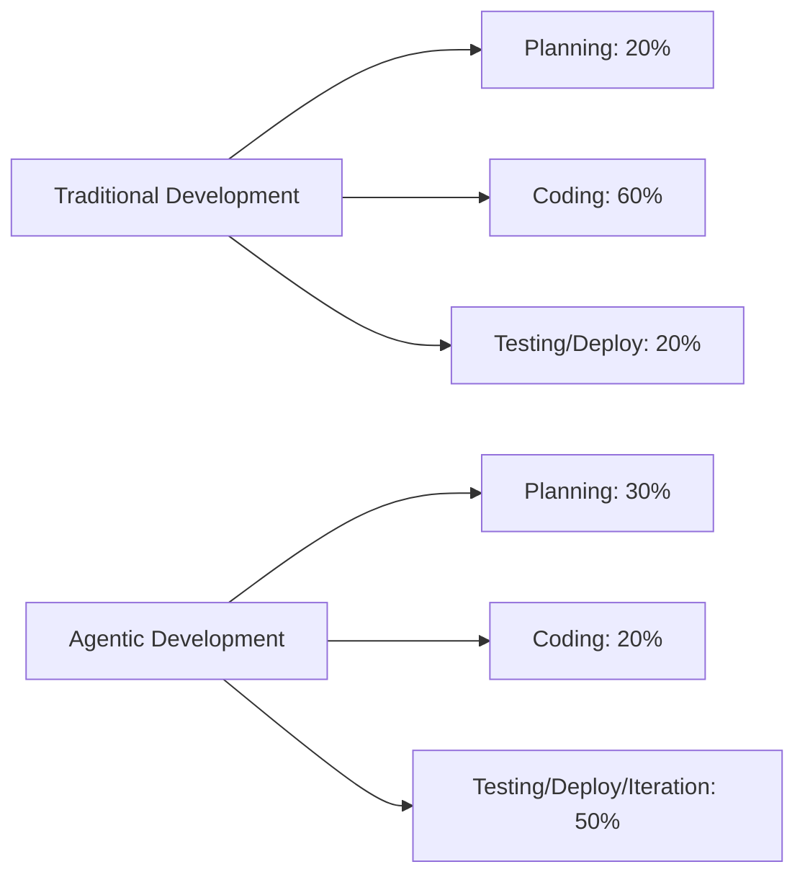

# Understanding the 5-10x Multiplier

[Placeholder: Establish the credibility of the 5-10x claim with data and examples.

**What gets faster**:

- Boilerplate code generation: 10-20x faster (near-instant)
- CRUD implementations: 5-8x faster
- API endpoint creation: 6-10x faster
- Test scaffolding: 8-12x faster
- Configuration setup: 5-10x faster

**Real-world examples**:
Show concrete before/after comparisons:

- A REST API endpoint: 2 hours manually → 15 minutes with AI
- A React component: 1 hour manually → 8 minutes with AI
- Database migrations: 45 minutes manually → 5 minutes with AI
- Test suite for a module: 3 hours manually → 25 minutes with AI

**What this means in aggregate**:

- A 2-week implementation sprint → 2-4 days with AI
- A 6-month MVP → 6-8 weeks with AI
- Day-to-day feature work: What took a day now takes 1-2 hours

**The caveat**: This acceleration applies to implementation, not to the entire software development
lifecycle. The multiplier doesn't apply to requirements gathering, architecture design, product
decisions, code review, testing strategy, or deployment planning.

Use a diagram showing:

- Traditional time breakdown: 20% planning, 60% coding, 20% testing/deployment
- Agentic time breakdown: 30% planning, 20% coding, 50% testing/deployment/iteration

The paradox: Coding becomes so fast it's no longer the bottleneck.]

**Figure 5.1:** Time allocation shift in agentic vs traditional development
