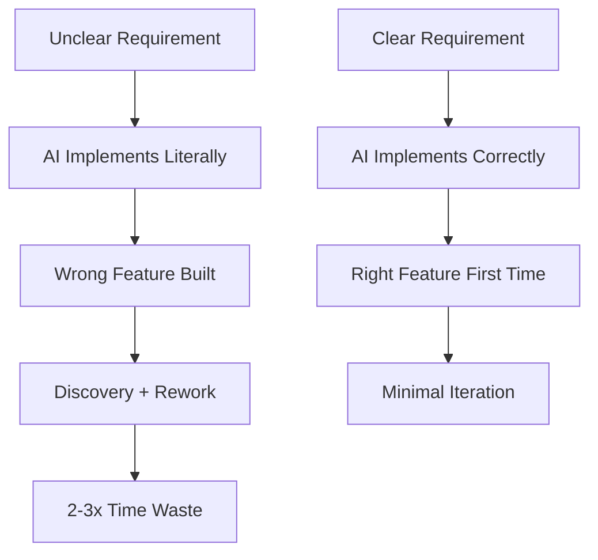

# Bottleneck #1: Requirements and Business Vision

[Placeholder: Deep dive into the first and most critical bottleneck.

**The Problem**:
When AI can implement features in hours instead of weeks, the cost of unclear requirements skyrockets.
In traditional development, you might spend 2 days clarifying requirements for a 2-week implementation—
a 10% overhead. With agentic coding, spending 2 days clarifying for a 2-day implementation is 50% overhead.

**Why it emerges**:

- Implementation no longer gives you time to think through requirements
- Ambiguities that would surface during coding now result in complete rework
- AI agents are literal executors—they build exactly what you specify, not what you meant
- The feedback loop from "build wrong thing" to "realize it's wrong" tightens dramatically

**Real-world scenario**:
Tell a story of a developer who asked Claude to "add user authentication" without specifying:

- OAuth vs username/password vs magic links
- Session management approach
- Password reset flow
- Multi-factor authentication requirements
- User profile data model

Claude generates a complete OAuth implementation with Google/GitHub integration. Beautiful code,
perfect tests, but completely wrong for a B2B SaaS that needs username/password with MFA.
Result: 3 hours of AI work needs to be completely rewritten because of 10 minutes of unclear requirements.

**Symptoms you're hitting this bottleneck**:

- Frequently asking AI to regenerate large chunks of code
- Discovering midway through implementation that requirements conflict
- Stakeholders saying "that's not what I meant" after seeing working code
- Spending more time correcting AI output than reviewing human-written code would take

**Why this is THE bottleneck**:
In traditional development, coding is slow enough that requirements evolve during implementation.
Developers ask clarifying questions, make assumptions, and surface ambiguities naturally.
AI agents don't do this—they execute precisely based on what you specified, exposing every ambiguity instantly.

**The solution preview**:
(Link to Part 2 chapters on requirements writing, EARS notation, and spec-driven development)

- Write specifications BEFORE implementation
- Use formal notation (EARS, OpenAPI) that forces precision
- Invest in requirements upfront—it now has the highest ROI
- Treat requirements as the primary artifact, code as secondary]

**Figure 5.2:** Impact of requirements clarity on agentic development cycles
