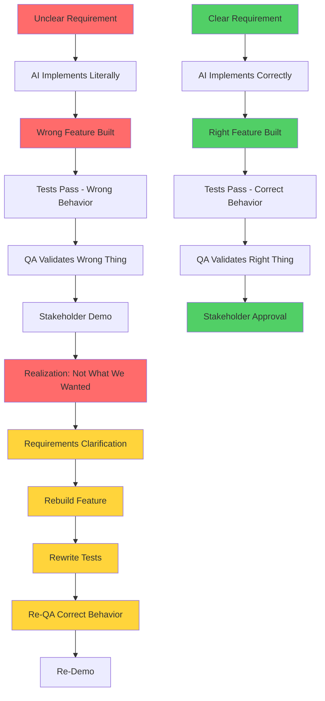

# Bottleneck #1: Requirements and Business Vision

When AI can implement features in hours instead of weeks, the cost of unclear requirements doesn't just increase—it becomes catastrophic. This is the first and most impactful bottleneck that emerges in agentic coding, and it fundamentally changes how you must approach product development.

## The Economics of Ambiguity

In traditional software development, you might spend 2 days clarifying requirements before starting a 2-week implementation. That's roughly 10% overhead—annoying but manageable. The slow pace of implementation provides a buffer: as developers write code, they naturally surface ambiguities, ask clarifying questions, and refine understanding. Requirements evolve during the build process.

With agentic coding, this buffer disappears. Spending 2 days clarifying requirements for a 2-day AI-assisted implementation is 50% overhead. But worse, if you skip that clarification and charge ahead with vague requirements, the AI will build exactly what you specified—ambiguities and all—in those same 2 days. Now you've spent 2 days implementing the wrong thing and need another 2 days to rebuild it correctly.

The math is brutal: unclear requirements turn a 4-day project (2 days clarification + 2 days implementation) into a 6-day nightmare (2 days wrong implementation + 2 days clarification + 2 days correct implementation). You've tripled the cost of ambiguity.

## Why This Bottleneck Emerges

### AI Agents Are Literal Executors

Unlike human developers who ask "What did you really mean?" when requirements seem odd, AI agents implement exactly what you specify. If you ask for "user authentication" without elaborating, Claude Code will make reasonable assumptions and build something. Those assumptions might be entirely wrong for your use case, but the code will be clean, tested, and complete.

Human developers provide an implicit ambiguity-detection layer. They've built enough systems to recognize when requirements don't quite make sense, when edge cases aren't covered, or when business logic conflicts with technical constraints. They ask questions before coding. AI agents don't—they execute with precision based on what you wrote.

### Implementation No Longer Provides Thinking Time

In traditional development, the act of coding surfaces requirement gaps. As a developer implements the login flow, they realize you haven't specified password complexity rules. As they build the user profile, they notice you didn't define which fields are required. The slow, methodical nature of manual coding creates natural checkpoints for validation.

AI-powered implementation is too fast for this. By the time you realize the authentication spec was incomplete, the AI has already generated OAuth integration, database schemas, API endpoints, and tests. The momentum of rapid implementation bypasses the natural quality gates that slow coding provided.

### The Feedback Loop Tightens Dangerously

The traditional feedback cycle looks like this: Unclear requirement → 2 weeks of coding → Demo to stakeholders → "That's not what I meant" → 2 weeks of rework. That's 1 month to discover the error, giving you time to course-correct other features.

The agentic feedback cycle: Unclear requirement → 2 days of AI coding → Demo to stakeholders → "That's not what I meant" → 2 days of rework. You discover the error in 4 days, but you've also shipped 5 other features in that time—potentially with similar misalignments. The tighter loop amplifies the cost of systematic requirement failures.

## A Real-World Scenario

Let me tell you about Sarah, a solo founder building a B2B SaaS product. She's working with Claude Code and making incredible progress—implementing features daily instead of weekly. One morning, she asks Claude to "add user authentication to the app."

Claude asks clarifying questions:

- "What authentication method would you like to use?"
- "Should this support social login providers?"
- "Do you need multi-factor authentication?"

Sarah, eager to move fast, provides quick answers: "Just make it work with Google and GitHub OAuth. We can add MFA later if needed."

Claude Code generates beautiful, production-ready code in 3 hours:

- Complete OAuth integration with Google and GitHub
- User profile management with social provider data
- Session handling with JWTs
- Comprehensive test suite
- API documentation

Sarah is thrilled—her app now has authentication! She demos it to her first potential customer, a healthcare company.

Customer: "This looks great, but we need username and password login. Our compliance requirements don't allow third-party OAuth providers."

Sarah's heart sinks. She just spent 3 hours (plus Claude's time) building the wrong thing. The OAuth implementation is complete and polished, but entirely unusable for her target market. She needs to rebuild authentication from scratch with username/password, password hashing, password reset flows, email verification, and MFA—all of which should have been specified from the start.

**Time wasted: 6 hours** (3 building wrong thing + 3 rebuilding correctly)
**Time that should have been spent: 4.5 hours** (1 hour clarifying requirements + 3.5 hours building right thing)

That's a 33% time penalty for insufficient requirements clarity—and this was a relatively simple case.

## Symptoms You're Hitting This Bottleneck

How do you know if requirements ambiguity is killing your velocity? Watch for these patterns:

### Frequent Complete Rewrites

If you're regularly asking AI to "discard that implementation and start over," you have a requirements problem. Iterative refinement is normal; wholesale replacement indicates the original spec was fundamentally wrong.

### Mid-Implementation Requirement Conflicts

Discovering that Feature A and Feature B have conflicting requirements after both are implemented is a classic sign. Clear upfront requirements would have surfaced this conflict before any code was written.

### Stakeholder Surprises

If demonstrations frequently elicit "That's not what we wanted" or "Why did you build it that way?" you're not spending enough time aligning on requirements before implementation.

### Excessive AI Correction Cycles

Spending more time explaining to the AI what you actually meant than a human developer would have spent implementing it suggests your requirements are too vague for the AI to work with effectively.

### Feature Creep During Implementation

Constantly adding "Oh, and it should also..." while AI is generating code means you're using implementation as requirements discovery—an expensive approach when implementation is fast.

## Why This Is THE Bottleneck

Requirements ambiguity isn't just one bottleneck among many—it's the foundational bottleneck that compounds everything else. Here's why:

### Exponential Waste

One vague requirement early in the project might trigger 10 wrong implementations. Those wrong implementations require 10 rewrites, which consume time and create technical debt. The initial ambiguity multiplies through the system.

### Architecture Misalignment

Unclear requirements about system boundaries, data ownership, or integration patterns lead to architectural choices that seem fine in isolation but create fundamental mismatches. Fixing these requires rewriting not just features but the structure tying them together.

### Downstream Quality Issues

Tests written against wrong requirements pass successfully but validate the wrong behavior. QA cycles waste time finding bugs in features that shouldn't exist. Documentation describes systems that don't match user needs.

*Figure 5.3: The cascade of waste from unclear requirements (red path) vs. the efficiency of clear specifications (green path). Notice how unclear requirements create 2-3x rework cycles while clear requirements achieve the goal in one pass.*

## The Psychology of Fast Implementation

There's a psychological trap that makes this bottleneck worse: When implementation is fast, there's tremendous pressure to "just start coding and figure it out." The temptation to skip requirements work and jump straight to implementation is overwhelming because you can see progress immediately.

This is exactly backwards. Fast implementation means requirements ambiguity is more expensive, not less. The correct response to 10x faster coding is to invest MORE in upfront clarity, not less.

Teams that thrive with agentic coding flip their mindset: They treat requirements as the primary deliverable and code as the artifact that follows automatically. They spend 40% of project time on requirements and architecture, knowing that it will save 200% on implementation and rework.

## The Solution Preview

We'll explore the complete solution in [Part 2: The Playbook](../../part2-playbook/README.md) (specifically the requirements writing chapter), but here's the core insight: **Formal specifications aren't optional overhead—they're the critical path to velocity**.

The antidote to requirements ambiguity is specification-driven development:

1. **Write requirements in EARS notation**: Forces precision and testability
2. **Use OpenAPI for API contracts**: Defines interfaces unambiguously before implementation
3. **Specify data schemas with JSON Schema**: Eliminates ambiguity about data structures
4. **Define workflows with clear steps**: Removes interpretation gaps

When specifications are precise enough that an AI agent knows exactly what to build, they're precise enough that you won't waste time on rework. The overhead of writing formal specs is dwarfed by the cost of rebuilding wrong implementations.

### Practical Starting Point

Before asking an AI agent to implement anything, answer these questions:

- **What problem does this solve?** Be specific about user needs
- **What are the acceptance criteria?** How will you know it's correct?
- **What are the edge cases?** Error conditions, boundary cases, unusual inputs
- **What should NOT happen?** Be explicit about out-of-scope behavior
- **How does this integrate?** API contracts, data dependencies, system boundaries

If you can't answer these clearly, you're not ready to implement. Spend the time to get clarity first—it's the highest-ROI work you can do in agentic development.

## Key Takeaways

Requirements and business vision clarity is the most critical bottleneck in agentic coding because:

1. **AI agents execute literally** - They build exactly what you specify, not what you meant
2. **The cost of ambiguity compounds** - One vague requirement triggers multiple wasted implementations
3. **Implementation speed eliminates thinking time** - Fast coding removes the natural quality gates slow development provided
4. **Rework is expensive at scale** - When you can implement 5 features in the time it took for 1, getting them wrong costs 5x more

The solution isn't to slow down implementation—it's to accelerate requirements clarity through formal specifications and specification-driven development. Teams that invest upfront in requirements precision unlock the full promise of agentic coding: fast, correct implementations that align with business needs.

In the next section, we'll explore the second major bottleneck: product decision-making velocity that can't keep pace with implementation speed.
