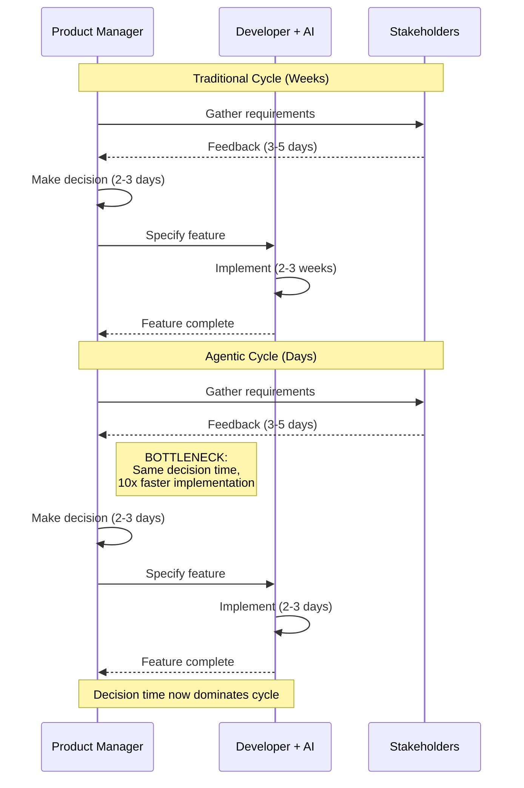

# Bottleneck #2: Product Decision Making

Your AI agent just implemented three new features in a single morning. By lunch, you've deployed all three to your staging environment. By 2pm, you're staring at your screen wondering: which feature should I work on next? Your product backlog has 47 items, all suddenly achievable. The agent is ready to go. And you're paralyzed by choice.

Welcome to the product decision bottleneck—where the velocity of implementation exposes the friction in your decision-making process.

## The Traditional Product Cadence

In traditional software development, product decisions happen at a comfortable pace. You might spend a week defining a feature because implementation would take three weeks anyway. Product managers hold weekly planning sessions, debate priorities for hours, and carefully weigh options—all while implementation grinds forward at its characteristic slow pace.

This works because the decision cycle and implementation cycle are matched. By the time development finishes one feature, product has decided what's next. There's a natural buffer where slow decisions don't create visible bottlenecks.

The typical traditional product cycle looks like this:

1. **Decide** (1-2 weeks): Research, debate, specify the feature
2. **Build** (2-4 weeks): Implementation and iteration
3. **Test** (1 week): QA and validation
4. **Learn** (1 week): Gather feedback, analyze results
5. **Repeat**: Back to step 1 for the next feature

Total cycle time: 5-8 weeks per feature. Decision-making takes 20-25% of the cycle, but it's fine because implementation dominates the timeline.

## The Agentic Product Paradox

When AI agents accelerate implementation 5-10x, this comfortable cadence collapses. The cycle now looks like this:

1. **Decide** (1-2 weeks): Research, debate, specify the feature—*same as before*
2. **Build** (2-4 *days*): Implementation and iteration—*10x faster*
3. **Test** (1-2 days): QA and validation—*faster with AI-assisted testing*
4. **Learn** (2-3 days): Gather feedback, analyze results
5. **Repeat**: Back to step 1

Total cycle time: 2-3 weeks, but decision-making now dominates the timeline. What was 20-25% of the cycle is now 50-60% of the cycle. The constraint has flipped.

Suddenly, your decision velocity becomes the rate limiter. Can you decide on 5-10x more features in the same time period? Can you maintain product coherence with 10x decision throughput? Can your stakeholder alignment processes handle daily instead of monthly decisions?

## When Product Managers Become Bottlenecks

Consider this real-world scenario from a startup founder working with Claude Code:

**Monday morning**: Decides to build a user dashboard feature. Spends an hour writing requirements. Claude implements the entire dashboard by Tuesday morning—routing, API endpoints, React components, tests, everything.

**Tuesday afternoon**: Realizes the dashboard needs different metrics based on user feedback. Spends 30 minutes refining the spec. Claude updates the implementation by end of day.

**Tuesday evening**: Stakeholder suggests a completely different approach during a dinner conversation—maybe the dashboard should be real-time instead of static snapshots.

**Wednesday**: Founder has back-to-back meetings all day. Can't make a decision on the new direction.

**Thursday morning**: Finally decides on real-time approach. Writes new requirements in 45 minutes. Claude implements by Thursday afternoon.

**Friday**: Discovers this real-time feature conflicts with product decisions made last month about minimizing server costs.

**Outcome**: The actual implementation took about 4 hours of AI time across two days. The decision-making, meetings, stakeholder alignment, and conflict resolution took 4 days of calendar time. Implementation was **40x faster** than decision-making.

This is the product decision bottleneck in action. The AI isn't waiting because it's slow—it's waiting because you haven't told it what to build next.

## The Multiplication Effect

The bottleneck becomes more severe the more you accelerate. With 5-10x implementation speed, you can potentially ship 5-10x more features in the same time frame. But this assumes you can also:

- **Make 5-10x more product decisions**: Choose what to build, prioritize features, define requirements
- **Maintain product coherence at 10x scale**: Ensure features work together, don't contradict each other
- **Align stakeholders 10x faster**: Get buy-in, resolve conflicts, communicate changes
- **Learn 10x faster**: Gather feedback, analyze results, adjust direction

Most organizations can't scale decision-making linearly with implementation. They certainly can't scale it 5-10x. The result is a pile-up: features get implemented quickly but sit waiting for decisions, or worse, get implemented based on stale decisions that have since changed.

## Why This Happens: The Cognitive vs. Mechanical Split

The core issue is that AI agents excel at **mechanical work** (coding, following specifications, generating variations) but struggle with **cognitive work** (understanding user needs, making trade-offs, envisioning product direction). These are fundamentally different types of work.

**Mechanical work scales with compute**: Add more AI capacity, get more code. Linear relationship.

**Cognitive work doesn't scale easily**: Decision-making requires context, judgment, trade-off analysis, stakeholder management. Adding more decision-makers often slows things down due to coordination overhead.

When you accelerate the mechanical work 10x, you expose just how slow and unscalable the cognitive work is. Product decisions become your constraint.

*Figure 5.4: Product decision-making becomes the critical path when implementation accelerates. Note how stakeholder feedback and decision-making time stays constant while implementation shrinks to days.*

## Symptoms You're Hitting This Bottleneck

How do you know if product decision-making is your constraint? Watch for these patterns:

**1. AI agents sitting idle**: You finish implementing a feature and then spend days figuring out what to work on next. The agent could be coding, but you haven't decided what to build.

**2. Implementing then immediately pivoting**: You build a feature, stakeholders see it, and immediately request changes because they hadn't really thought through what they wanted. The feature gets rebuilt 2-3 times not due to technical issues but due to evolving product vision.

**3. Analysis paralysis**: You can build so many things quickly that you become paralyzed choosing. Should you build feature A, B, C, D, or E? All are achievable this week, so the decision feels higher stakes.

**4. Meeting overload**: Stakeholder alignment meetings become your critical path. You spend more time in meetings deciding what to build than actually building.

**5. Feature conflicts**: You implement features quickly without coordinating decisions, resulting in features that contradict each other or create confusing user experiences. User settings that don't apply consistently, features that solve the same problem different ways, conflicting mental models.

**6. Thrashing**: Rapid implementation enables rapid pivots, which feels empowering until you realize you've built and abandoned four different approaches in two weeks without learning anything because you changed direction before gathering feedback.

If three or more of these sound familiar, product decision velocity is likely your bottleneck.

## Why Product Management Must Evolve

The role of product management fundamentally changes in an agentic development environment. Traditional PM practices evolved for a world where implementation is the slow step. When implementation accelerates, PM practices must accelerate too.

**From quarterly roadmaps to weekly roadmaps**: When features took months, quarterly planning made sense. When features take days, you need decision-making at weekly or even daily cadence.

**From feature specs to outcome specs**: Instead of specifying exactly what to build ("add a button here that does X"), specify the outcome you want ("users should be able to export their data"). Let the AI figure out implementation details. Focus PM time on the "why" and "what outcome," not the "how."

**From detailed mockups to design principles**: Instead of pixel-perfect mockups that take a week to create, establish design principles and let AI generate variations. Review outcomes, not plans.

**From reviewing code to reviewing results**: Product managers shouldn't review pull requests—that's an engineering concern. Review deployed features, user feedback, and metrics. Focus on whether the outcome matches the intent.

## The Renaissance Developer Advantage

This bottleneck reveals a key advantage of the Renaissance Developer model. If you are both the product decision-maker and the implementer, you eliminate the coordination overhead entirely.

As a solo Renaissance Developer:

- No stakeholder alignment needed—you ARE the stakeholder
- No handoff delays between product and engineering
- Immediate feedback loop—build something, see if it works, decide next step
- Product vision and technical execution tightly coupled

This is why individual Renaissance Developers can often outpace entire teams. It's not just about AI-accelerated coding—it's about AI-accelerated coding **without decision coordination overhead**.

However, even solo developers face a version of this bottleneck: your own decision-making. If you can code 10x faster but your product thinking doesn't accelerate, you'll spend most of your time thinking about what to build, not building it.

## Solutions and Mitigation Strategies

How do you address the product decision bottleneck? The answer isn't to make faster decisions (though that helps)—it's to make **fewer, better-leverage decisions**.

**1. Establish clear product principles upfront**: Instead of deciding each feature individually, establish principles that guide decisions. "We optimize for simplicity over power," "We default to real-time over batch," "We prioritize privacy over convenience." Principles guide AI agents and reduce decision points.

**2. Define aggressive MVP scope**: Focus increases decision speed. When you're building an MVP with 5 core features instead of a full product with 50 features, you eliminate 90% of prioritization decisions. Most of the backlog becomes "not now, maybe later."

**3. Use outcome-based specifications**: Specify desired outcomes, not implementation details. "Users should be able to export their data in common formats" is better than "Add a CSV export button in the top-right of the dashboard." The first gives the AI room to explore solutions; the second requires you to decide implementation.

**4. Build decision-making velocity into your process**: Time-box decisions. Use decision frameworks (RICE scoring, ICE prioritization). Establish who can make which decisions without meetings. Create "fast lanes" for small decisions.

**5. Accept that product vision is your job now**: In traditional development, you could partially rely on the long implementation cycle to refine vision. "Let's start building and see what we learn." In agentic development, you need clearer vision upfront because you'll build it before learning occurs. Invest in product vision work.

**6. Batch decisions when possible**: Instead of deciding feature-by-feature, make batch decisions. "This week we focus on the onboarding flow. Next week we focus on the core workflow." Reduces context switching and decision frequency.

These strategies won't eliminate the bottleneck—product decision-making will always take human judgment and time. But they reduce the severity and prevent decisions from becoming the dominant constraint.

## The Paradigm Shift

The product decision bottleneck represents a fundamental paradigm shift. For decades, we optimized software development around the constraint of slow implementation. Agile, sprints, continuous delivery—all designed to make implementation faster.

Now implementation is fast. The constraint has moved. We need new processes, new practices, and new skills optimized for a world where **product vision, not coding, is the bottleneck**.

This is simultaneously liberating and terrifying. Liberating because anything you can clearly envision can be built quickly. Terrifying because vague vision now has immediate, visible costs.

The teams and individuals who thrive in agentic development are those who can think clearly about product direction, make confident decisions with incomplete information, and maintain coherent vision across rapid iterations. These are the skills that now matter most.

Part 2 of this book provides concrete workflows for requirements writing, brief development, and MVP scoping specifically designed to accelerate product decision-making. These aren't just about documentation—they're about structured thinking that enables fast, confident decisions that guide AI implementation effectively.

But first, let's examine the third bottleneck: architecture and design clarity.
