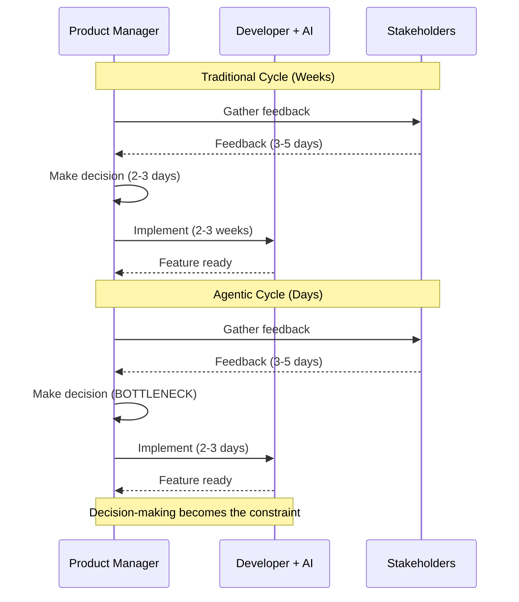

# Bottleneck #2: Product Decision Making

[Placeholder: Examine the second major bottleneck—product decisions.

**The Problem**:
Product decisions (what to build, how it should work, which features to prioritize) traditionally
happened at the pace of implementation. You could spend a week debating a feature because implementation
would take 3 weeks anyway. When implementation takes 3 days, week-long debates become unacceptable overhead.

**Why it emerges**:

- Traditional product cycle: decide → build → test → learn → decide (each step takes weeks)
- Agentic product cycle: decide → build → test → learn → decide (each step takes days)
- The cadence of "decide" must match the cadence of "build" or you bottleneck
- Product managers accustomed to monthly decision cycles struggle with daily decision velocity

**Real-world scenario**:
A startup founder working with an AI agent:

- Monday: Decides to build a feature, AI implements it by Tuesday morning
- Tuesday: Realizes feature needs adjustment, explains changes, AI updates by Tuesday afternoon
- Tuesday evening: Stakeholder feedback suggests different approach entirely
- Wednesday: Needs to decide new direction, but founder is in meetings all day
- Thursday: Finally makes decision, AI implements by Thursday afternoon
- Friday: Discovers feature conflicts with other product decisions made last month

The implementation (3 half-days of AI work) took 3 hours total. The decision-making (meetings,
debates, stakeholder alignment, thinking time) took 4 days. Implementation is 40x faster than
decision-making.

**Symptoms you're hitting this bottleneck**:

- AI agents waiting idle because you haven't decided what to build next
- Implementing features that get immediately deprioritized
- Analysis paralysis because you CAN build so many things quickly
- Stakeholder alignment meetings becoming the critical path
- Building features that contradict each other because decisions weren't coordinated

**The multiplication effect**:
With 5-10x implementation speed, you can potentially ship 5-10x more features in the same time.
But can your organization DECIDE on 5-10x more features? Can you maintain product coherence
with 10x more decision throughput?

**Why product management changes**:

- From quarterly roadmaps → weekly/daily roadmaps
- From feature specs → outcome specs (let AI figure out HOW)
- From detailed mockups → design principles (let AI generate variations)
- From reviewing code → reviewing outcomes and user experience

**The Renaissance Developer advantage**:
Solo developers with product sense don't have this bottleneck—they ARE the product decision maker.
This is why individual Renaissance Developers can outpace larger teams: no decision coordination overhead.

**The solution preview**:
(Link to Part 2 chapters on MVP prioritization, brief writing, iterative development)

- Establish clear product principles upfront
- Define MVP scope aggressively—focus increases decision speed
- Use outcome-based specs instead of feature-based specs
- Build decision-making velocity into your process
- Accept that product vision, not implementation, is now the rate limiter]

**Figure 5.3:** Product decision-making as the new critical path
