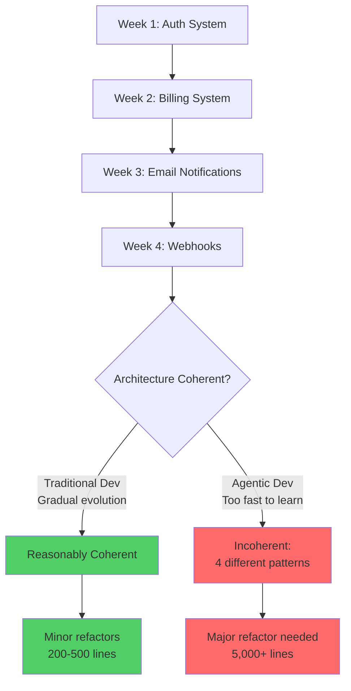
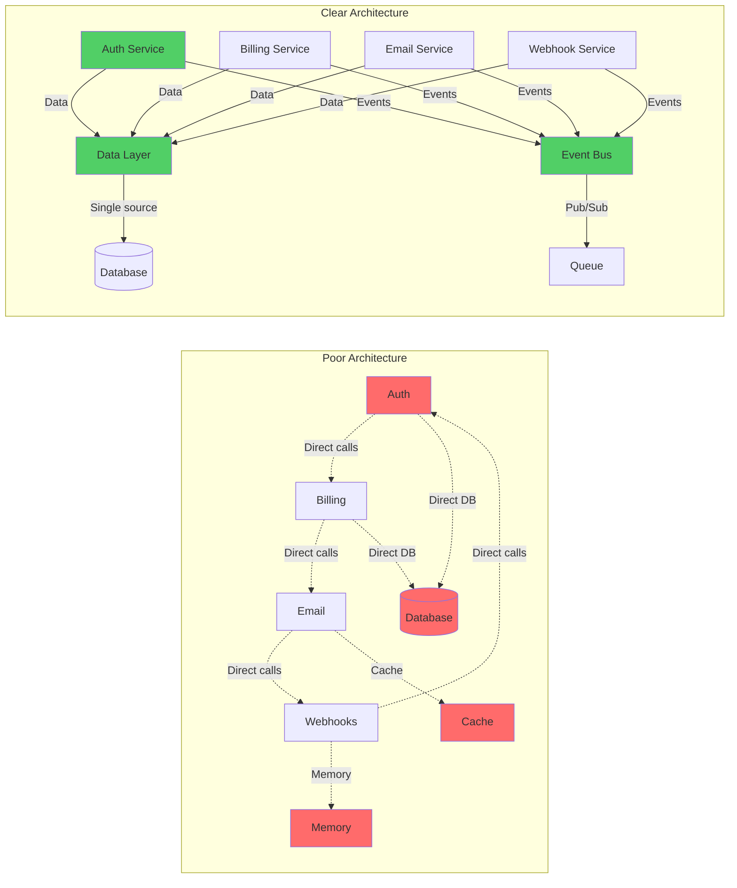

# Bottleneck #3: Architecture and Design Clarity

You're four weeks into building your SaaS product with Claude Code. Each week, you've implemented a major feature: user authentication, subscription billing, email notifications, and now a webhooks system for integrations. Everything works beautifully in isolation. Each component is well-written, thoroughly tested, and properly documented.

Then you try to add a simple feature: letting users export their data. And you discover your architecture is a tangled mess. The auth system stores user state in sessions. The billing system queries the database directly. The email service caches aggressively with no clear invalidation strategy. The webhooks system expects real-time user state but the cache doesn't update correctly. A "simple" export feature requires touching all four systems and reconciling four different approaches to data flow.

Welcome to the architecture bottleneck—where rapid implementation solidifies poor design decisions before you realize they're problems.

## The Traditional Emergence of Architecture

In traditional development, architecture emerges gradually through a process of discovery and iteration. You start coding, encounter limitations, refactor as you learn, and slowly converge on a coherent design. This evolutionary approach works because:

1. **Slow implementation creates natural checkpoints**: It takes weeks to build enough code to see architectural problems
2. **Refactoring is proportional to progress**: After building 1,000 lines over two weeks, refactoring 200 lines over two days feels reasonable
3. **Learning happens during implementation**: You discover patterns, identify problems, and adjust architecture as you code
4. **Human developers maintain unconscious coherence**: Experienced developers subconsciously keep the system architecture in mind as they write each line of code

The traditional flow looks like:

- **Week 1**: Build feature A, establish basic patterns
- **Week 2**: Build feature B, notice some patterns don't quite fit, refactor
- **Week 3**: Build feature C, realize auth needs restructuring, refactor
- **Week 4**: Build feature D with improved patterns from weeks 1-3

By week 4, you have a reasonably coherent architecture that evolved through continuous refinement. The learning curve matched the implementation curve.

## The Agentic Architecture Trap

When AI agents implement features 5-10x faster, this evolutionary process breaks down catastrophically. The flow now looks like:

- **Day 1-2**: Build feature A, establish patterns
- **Day 3-4**: Build feature B, no time to notice pattern mismatches
- **Day 5-6**: Build feature C, auth already solidified with 2,000 lines of code
- **Day 7-8**: Build feature D, now have architectural incoherence across four major components

By day 8, you're in the same situation that would have taken 4-6 weeks traditionally, but you've had **far less time to learn and adjust**. The code volume is the same, but the learning time compressed 5-10x.

Worse, by the time you notice architectural problems, you have 10,000 lines of code to refactor instead of 1,000. The cost of fixing architecture grows exponentially with code volume, and AI agents give you exponentially more code in the same time period.

*Figure 5.5: Architecture coherence degrades when implementation outpaces learning. Traditional development allows refactoring at manageable scale; agentic development solidifies inconsistencies too quickly.*

## Why AI Agents Compound the Problem

AI agents don't just implement faster—they implement in ways that make architectural incoherence worse:

**1. Agents optimize locally, not globally**: When you ask Claude to "add a billing system," it creates a beautifully designed billing component. But it doesn't naturally consider how billing integrates with authentication, data access patterns, caching strategies, or error handling across your entire system. Each component is locally optimal but globally incoherent.

**2. Agents implement exactly what you specify**: Human developers might say, "This auth approach doesn't match how we do data access elsewhere, let me adjust." AI agents implement precisely what you specify, assumptions and all, without questioning architectural fit.

**3. More code means more incoherence**: When you can generate 500 lines per day instead of 100, you accumulate 5x more inconsistency in the same time period. Incoherence scales with code volume.

**4. Refactoring AI code requires regeneration**: Refactoring manually-written code means editing existing lines. Refactoring AI-generated code often means regenerating with updated context and specifications—a more expensive operation.

**5. Context windows hide system complexity**: Even with large context windows, AI agents have limited ability to maintain perfect coherence across 50 files, 20 APIs, and complex state management. They excel at local implementation but struggle with global consistency.

The result: AI agents are perfect tools for rapidly implementing a poorly-designed system.

## Real-World Scenario: The SaaS Architecture Crisis

Consider this actual scenario from a developer building a project management SaaS:

**Week 1 - Authentication**:

- Implements JWT-based authentication
- Stores user sessions in Redis
- Returns user objects with full profile data in every auth check
- Works perfectly for auth use case

**Week 2 - Project Management**:

- Implements project CRUD operations
- Queries database directly for project data
- Implements rich permission model checking user roles
- Works perfectly for project management

**Week 3 - Real-Time Collaboration**:

- Implements WebSocket connections for real-time updates
- Maintains connection state in memory
- Pushes updates to all connected clients
- Works perfectly for collaboration

**Week 4 - File Attachments**:

- Implements file upload/download with S3
- Creates file metadata in separate database
- Implements access control by querying user permissions
- Works perfectly for file operations

**Week 5 - Try to Add Activity Feed**:

Now needs to show user activities across projects, files, and collaboration events:

- Auth returns full user objects (redundant, expensive)
- Projects use direct database queries (can't easily aggregate)
- Real-time system has state in memory (can't query for feed)
- Files have separate database (need to join across stores)

The activity feed requires 8 different data sources, 3 different permission models, 2 different caching strategies, and reconciling 4 weeks of architectural decisions made in isolation. What should be a 2-day feature becomes a 2-week refactoring project.

**The core issue**: Each week's implementation was well-designed for its own domain, but nobody designed the **system-level architecture** that ties everything together. By the time this became visible, 15,000 lines of code had already been generated.

## Symptoms You're Hitting This Bottleneck

How do you know if architecture clarity is your constraint?

**1. Simple features touch many files**: Adding a straightforward feature requires editing 8-10 files across the codebase. The implementation leaks across modules because boundaries are unclear.

**2. Circular dependencies**: Module A depends on Module B, which depends on Module C, which depends on Module A. Your build or import system complains about cycles.

**3. Inconsistent patterns everywhere**: Some code uses async/await, some uses callbacks, some uses promises. Some APIs return rich objects, some return IDs. Some errors throw exceptions, some return error objects. Every file seems to make different choices.

**4. Data flows mysteriously**: You're not sure where data comes from or goes to. "Where does user state get updated?" could have 5 different answers depending on the code path.

**5. Every feature needs architectural exceptions**: "This feature doesn't quite fit our architecture, we'll just add this one special case." After 10 features, you have 10 special cases and no consistent architecture.

**6. Refactoring feels overwhelming**: You want to improve the architecture but don't know where to start. Everything is coupled to everything else, so changing one thing requires changing everything.

**7. New team members are confused**: If you're working with others, new developers (or even AI agents) struggle to understand where code should go because there are no clear patterns.

If four or more of these sound familiar, architecture coherence is your bottleneck.

## The Compound Effect of Poor Architecture

Bad architecture doesn't stay bad—it gets exponentially worse over time. Here's why this is particularly acute with agentic development:

**Week 1**: Poor architectural choice affects 1,000 lines of code. Refactoring would take 1 day.

**Week 2**: Build on top of week 1's poor architecture. Now 3,000 lines are affected. Refactoring would take 2-3 days.

**Week 3**: Week 2's workarounds require their own workarounds. Now 6,000 lines affected. Refactoring would take a week.

**Week 4**: You've built so much on the poor foundation that refactoring seems impossible. 12,000 lines affected. Refactoring would take 2-3 weeks—nearly the entire project duration so far.

At this point, you face a terrible choice: continue building on a broken foundation (technical debt), or spend weeks refactoring (losing momentum). Either choice is painful.

With traditional development velocity, you'd notice architectural problems when refactoring still costs days, not weeks. With agentic velocity, you notice when refactoring costs weeks, not days. The cost multiplier is brutal.

## Why This Demands Upfront Design

The solution to the architecture bottleneck is stark: **design your architecture before implementation begins, not during**.

This is a fundamental shift. Traditional agile development often advocates "emergent design"—let architecture evolve as you learn. This worked when implementation was slow enough to allow continuous refactoring. With agentic development, emergent design becomes emergent chaos.

You need upfront architectural clarity:

**1. Define system boundaries**: What are your major components? What does each one do? How do they interact?

**2. Establish data flow patterns**: Where is data stored? How does it move through the system? What are the sources of truth?

**3. Choose consistency patterns**: Will you use the same patterns for async operations? Error handling? State management? Caching?

**4. Design clear interfaces**: What are the contracts between components? What data crosses boundaries? How are dependencies managed?

**5. Document principles**: What architectural principles guide decisions? How should AI agents implement new features to maintain coherence?

This doesn't mean waterfall design with months of planning. It means spending **days on architecture before weeks on implementation**, not trying to fix architecture after weeks of incoherent implementation.

## The Link to Digestible Interfaces

Remember the concept of digestible interfaces from Chapter 4? This is where it becomes critical. When your system has clear, digestible interfaces between components, AI agents can implement features without creating architectural mess.

**Poor architecture with AI**:

- "Add a billing feature"
- AI generates code that reaches across boundaries, couples tightly to existing code, creates new patterns
- Result: Works but incoherent

**Good architecture with AI**:

- "Add a billing feature that implements the PaymentService interface"
- AI generates code within clear boundaries, follows established patterns, maintains coherence
- Result: Works and coherent

Digestible interfaces aren't just for AI comprehension—they're guardrails that keep rapid implementation on track.

*Figure 5.6: Poor architecture creates tightly-coupled spaghetti (left) while clear architecture establishes clean boundaries and consistent patterns (right). AI agents can maintain coherence only when architecture is explicit.*

## Solutions and Mitigation Strategies

How do you avoid the architecture bottleneck?

**1. Design architecture upfront**: Before implementing the first feature, spend 1-2 days designing your system architecture. Identify major components, define boundaries, establish patterns. This small upfront investment saves weeks later.

**2. Document architectural principles**: Write down the principles that guide design decisions. "All data access goes through the repository layer." "All components communicate via events." "Errors propagate as typed exceptions." Give AI agents (and humans) clear guidelines.

**3. Establish and enforce interfaces**: Define the interfaces between components before implementing them. Use TypeScript interfaces, API specifications, or clear documentation. Make the contracts explicit.

**4. Review architecture regularly**: After each major feature, spend 30 minutes reviewing whether architecture still makes sense. Refactor proactively when you notice drift, before it solidifies.

**5. Limit AI agent scope**: Don't ask AI to "build the whole system." Ask it to "implement this component that satisfies this interface." Constrain the scope so agents optimize locally within a globally-coherent design.

**6. Use the Renaissance Developer advantage**: As a solo developer, you can maintain architectural coherence in your head and course-correct quickly. But you still need to externalize the architecture so AI agents can follow it.

Part 1 Chapter 3 covered architecture principles for agentic development in detail. Part 3 will provide specific architecture patterns and interface design templates. The key insight here: architecture clarity is no longer optional. It's the foundation that enables sustainable agentic velocity.

## The Paradigm Shift: Architecture as Foundation

Traditional software development treats architecture as emergent—something that evolves as you build. Agentic development demands architecture as foundation—something you establish before you build.

This isn't about rigid waterfall planning. It's about clarity before velocity. An hour of architectural thinking saves days of refactoring. A day of interface design saves weeks of integration hell.

The teams that succeed with agentic development are those that embrace this shift. They design systems, not just features. They establish coherence upfront, not through painful refactoring later. They treat architecture as the leverage point that makes rapid implementation sustainable.

And when architectural clarity is in place, the speed of AI implementation becomes an advantage, not a liability. You can build features rapidly because you're building on a solid foundation, not a growing pile of technical debt.

Next, we'll examine the fourth bottleneck: code review velocity and how review processes collapse under the volume of AI-generated code.
