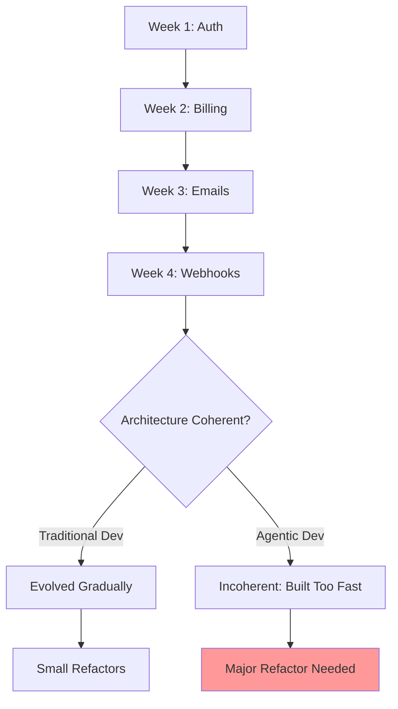

# Bottleneck #3: Architecture and Design Clarity

[Placeholder: Explore the third bottleneck—architecture and system design.

**The Problem**:
In traditional development, you can evolve architecture as you code. Discovery happens during implementation:
"Oh, this component is getting too large, let's refactor." With AI agents implementing quickly, poor
architectural decisions solidify before you realize they're problems. By the time you notice, you have
10,000 lines of code to refactor instead of 1,000.

**Why it emerges**:

- Traditional: Code slowly, refactor as you learn, architecture emerges
- Agentic: Code quickly, learning happens AFTER implementation, too late to adjust architecture cheaply
- AI agents excel at local optimization (implement this feature) but struggle with global optimization
  (maintain coherent system architecture across 50 files)
- Technical debt accumulates 5-10x faster when implementation is 5-10x faster

**Real-world scenario**:
A developer building a SaaS product with Claude:

- Week 1: Builds user authentication system. Claude generates comprehensive auth code.
- Week 2: Adds subscription billing. Claude integrates with Stripe, generates billing code.
- Week 3: Adds email notifications. Claude creates email service.
- Week 4: Adds webhooks for integrations. Claude implements webhook system.

Each feature implemented beautifully in isolation. But:

- Auth system stores user state in sessions
- Billing system queries database directly for user data
- Email service calls both auth and billing APIs but caches aggressively
- Webhooks need real-time user state but cache doesn't invalidate correctly

Result: 4 weeks in, the architecture is incoherent. Each component was well-designed locally but the
system as a whole has no clear data flow, no consistent state management, no unified error handling.
Refactoring would take 2 weeks (nearly 50% of total implementation time).

**Why this is worse with AI**:

- Human developers subconsciously maintain system coherence as they code
- AI agents implement exactly what you specify without considering broader system implications
- You can generate MORE code faster, so incoherence scales faster
- Refactoring AI-generated code requires regenerating with updated context (expensive)

**Symptoms you're hitting this bottleneck**:

- Features that should be simple require touching 8-10 files
- Circular dependencies between modules
- Inconsistent patterns across components (some use async/await, some use callbacks, some use promises)
- Data flowing through the system in unclear ways
- Every new feature seems to require "just one more exception" to the architecture

**The compound effect**:
Bad architecture in week 1 affects week 2 implementation. Week 2's workarounds affect week 3.
By week 4, you're building on top of 3 layers of architectural compromises. At 5-10x implementation
speed, you reach architectural crisis in weeks instead of months.

**The solution preview**:
(Link to Part 1 architecture chapters and Part 3 architecture patterns)

- Design system architecture BEFORE implementation starts
- Define clear component boundaries and interfaces upfront
- Use digestible interfaces that AI agents can understand
- Establish architectural principles that guide all implementations
- Review architecture after each major feature, refactor proactively
- Think in systems, not features]

**Figure 5.4:** Architecture coherence degradation with rapid implementation
