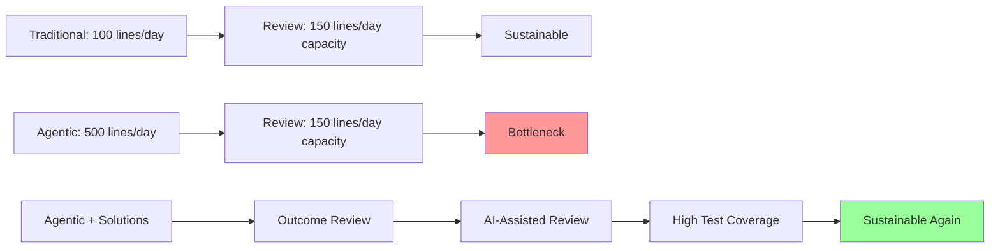

# Bottleneck #4: Code Review at Scale

[Placeholder: Investigate the code review bottleneck—sometimes critical, sometimes not.

**The Problem** (for teams):
When one developer can produce 500 lines of AI-generated code per day instead of 100 lines manually,
code review queues explode. Reviewers who could handle 2-3 PRs per day are suddenly faced with 10-15 PRs.
The review backlog grows faster than the implementation backlog shrinks.

**Why it emerges**:

- Traditional: 1 developer writes 100 lines/day, 1 reviewer reviews 150 lines/day → sustainable
- Agentic: 1 developer generates 500 lines/day, 1 reviewer reviews 150 lines/day → unsustainable
- Code volume increases 5x but reviewer capacity doesn't scale
- Review becomes the critical path: features are "done" but stuck in review for days

**Real-world scenario** (team context):
A 5-person engineering team adopts AI pair programming:

- Before AI: Team produces 5 PRs per day, each PR reviewed within 4 hours
- After AI: Team produces 25 PRs per day, reviews take 2-3 days
- Features that took 2 days to implement take 4 days to merge
- Team velocity increases for implementation but decreases for delivery

**The nuance—when this ISN'T a bottleneck**:

- **Solo developers**: No code review needed, or self-review is sufficient
- **High-trust teams**: Async review, trust-based merging, post-merge review
- **Good architecture**: Well-defined interfaces make reviews faster (review contracts, not implementations)
- **Strong testing**: Comprehensive tests reduce review burden (trust tests, spot-check code)

**Why this might be a non-issue**:
Many successful agentic developers operate solo or with minimal code review. If you're a Renaissance
Developer building your own product, you don't have this bottleneck. This chapter acknowledges that
code review at scale is primarily a TEAM bottleneck, not a universal bottleneck.

**Symptoms you're hitting this bottleneck** (if in a team):

- PRs sitting in "ready for review" for days
- Reviewers becoming burned out or falling behind
- Developers batching PRs to reduce review load (anti-pattern)
- Quality issues slipping through because reviewers rush
- Tension between developers (want speed) and reviewers (want quality)

**The paradox**:
AI makes code generation faster, but code READING doesn't get faster. Human cognition can only parse
and understand code at a certain rate. You can generate 500 lines in 10 minutes, but reviewing those
500 lines still takes 30-60 minutes.

**The solution preview** (for teams):
(Link to Part 3 code review patterns)

- Shift from code review to outcome review (does it work? does it meet requirements?)
- Increase test coverage to reduce review burden
- Use AI for first-pass review (linting, security checks, pattern compliance)
- Smaller, more frequent PRs even if AI can generate large changes
- Pair programming with AI (review as you generate, not after)
- Async review with post-merge fixups

**The solution preview** (for solo developers):

- Self-review with AI assistance
- Strong test coverage as safety net
- Incremental iterations with validation at each step]

**Figure 5.5:** Code review capacity vs implementation speed
