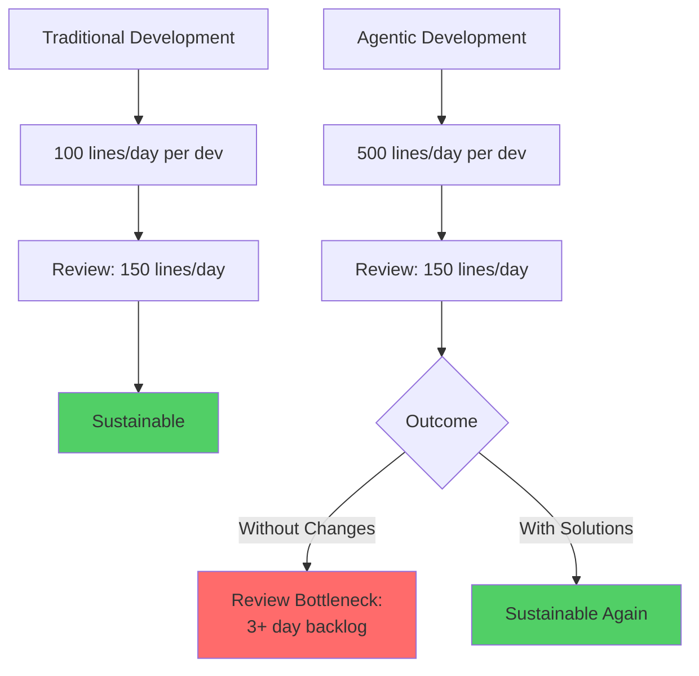
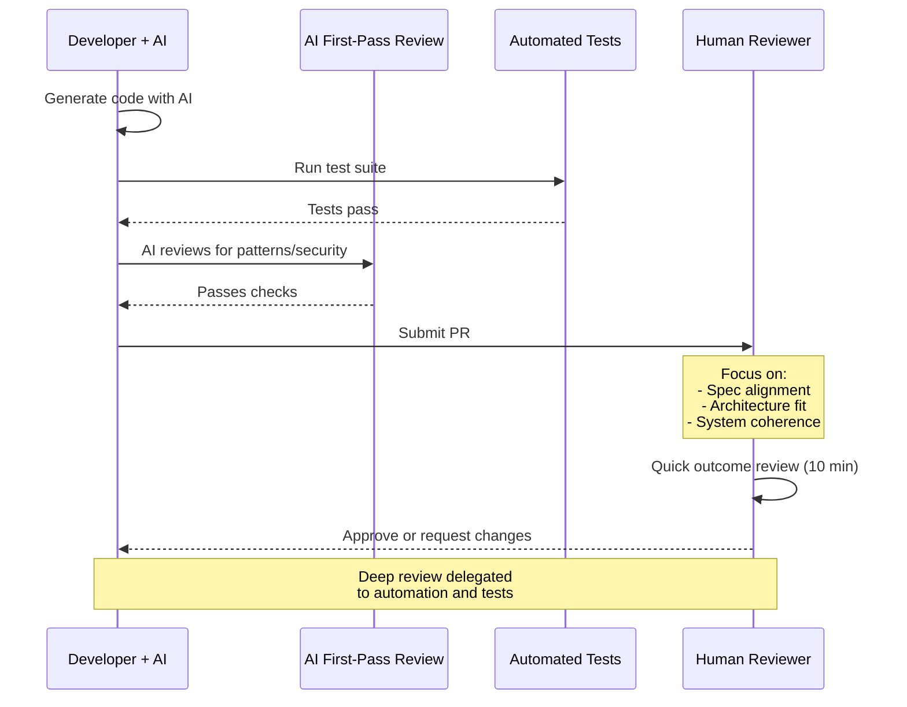

# Bottleneck #4: Code Review at Scale

Your five-person engineering team just adopted Claude Code. Within a week, something strange happens: features are being implemented faster than ever, but nothing is shipping. The problem isn't the code—it's the review queue. Pull requests pile up faster than reviewers can evaluate them. What used to be a 4-hour review cycle has become a 3-day backlog.

Code review at scale is the fourth bottleneck—but with an important caveat: **this bottleneck primarily affects teams, not individuals**. If you're a solo Renaissance Developer building your own product, you likely won't hit this constraint. But for any team larger than 2-3 people, code review velocity can become a critical blocker when AI accelerates implementation.

## The Traditional Review Equilibrium

In traditional development, code review exists in a natural equilibrium. Most developers can review code slightly faster than they write it, creating a sustainable balance:

- **Developer A** writes 100 lines per day → submits 1 PR
- **Developer B** reviews 150 lines per day → handles 1-2 PRs
- **Team of 5** produces 5 PRs per day → reviews complete in 4-6 hours

The system works because review capacity exceeds write capacity. Even during busy periods, the backlog clears within a day or two. Reviews happen quickly enough that they don't block delivery.

This equilibrium depends on a fundamental assumption: human developers write code at roughly the speed humans can read and understand code. Both activities are constrained by human cognition, so they naturally balance.

## The Agentic Review Collapse

When AI agents accelerate writing 5-10x but reading speed stays constant, the equilibrium shatters:

- **Developer A + AI** generates 500 lines per day → submits 5 PRs
- **Developer B** still reviews 150 lines per day → handles 1 PR with detailed review, or 2-3 with rushed review
- **Team of 5** now produces 25 PRs per day → review backlog grows by 15+ PRs daily

The math is brutal. Writing accelerated 5x, but reviewing didn't accelerate at all. Human cognition still takes the same time to parse, understand, and evaluate code. You can generate 500 lines in 10 minutes, but reviewing those 500 lines still takes 30-60 minutes.

Within days, the review queue becomes untenable. Pull requests sit "ready for review" for 2-3 days. Features that took 2 days to implement take 5 days to merge. Implementation velocity increased, but delivery velocity decreased.

*Figure 5.7: Code review capacity crisis when implementation accelerates. Review throughput must match implementation throughput or the system becomes unsustainable.*

## When This ISN'T a Bottleneck

Before diving deeper, let's acknowledge when code review at scale is NOT a constraint:

**1. Solo developers**: If you're building alone, you're both the author and reviewer. Self-review with AI assistance is often sufficient, especially with strong test coverage.

**2. High-trust teams**: Small teams (2-3 people) that trust each other deeply can do async review, post-merge review, or trust-based merging where code ships immediately and is reviewed retrospectively.

**3. Excellent architecture with strong tests**: When your architecture has clear interfaces and comprehensive test coverage, reviews can be much faster. Reviewers trust that tests validate correctness and focus on checking that contracts are honored.

**4. Pair programming with AI**: When you review as you generate (essentially pairing with the AI agent), there's no separate review step. The code is reviewed during creation.

Many successful agentic developers operate in one of these modes and never experience the code review bottleneck. This chapter acknowledges that code review at scale is primarily a **team coordination problem**, not a universal constraint of agentic development.

## Real-World Scenario: The Review Backlog Crisis

Consider a 5-person startup team's experience:

**Before AI adoption**:

- Team produces 5 PRs per day
- Each PR: 100-200 lines, reviewed within 4 hours
- Steady flow: write Monday, review Monday afternoon, merge Tuesday
- Team ships 5 features per week

**Week 1 with AI**:

- Team produces 20 PRs per day (4x increase)
- Each PR: 200-500 lines, reviews take 1-2 hours each
- Reviewers can handle 3-4 PRs per day with quality
- Review backlog: 16 PRs/day piling up

**Week 2**:

- Developers keep producing 20 PRs/day
- Review backlog grows to 50+ PRs
- Reviewers start rushing, quality declines
- Bugs slip through rushed reviews
- Team morale drops—developers frustrated by merge delays, reviewers overwhelmed

**Week 3**:

- Team tries to solve it by batching: submit fewer, larger PRs
- Now each PR is 1,000-2,000 lines
- Reviews take 3-4 hours but are superficial—nobody can carefully review 2,000 lines
- More bugs slip through, technical debt accumulates
- Review has become a checkbox, not a quality gate

**The core issue**: Implementation velocity increased 4x, but the team didn't adapt their review process. They tried to maintain the same review rigor at 4x scale, which proved impossible.

## The Review Paradox: Reading Doesn't Scale

Here's the fundamental constraint: **AI makes writing faster, but reading doesn't get faster**. Human cognition can only parse and understand code at a certain rate. This creates an asymmetry:

**Writing scales with AI assistance**:

- Specify what you want → AI generates code → 5-10x faster
- The bottleneck is specification clarity, not typing speed

**Reading doesn't scale**:

- Must comprehend logic, understand context, identify edge cases
- Even with AI assistance for linting or pattern checking, the cognitive work of evaluation remains human
- No matter how fast the AI writes, you still read at human speed

This asymmetry is the root cause of the review bottleneck. When writing accelerates but reading doesn't, reviews become the constraint.

## Symptoms You're Hitting This Bottleneck

How do you know if code review velocity is your problem?

**1. Growing PR backlog**: The number of PRs waiting for review increases daily. What should be hours becomes days.

**2. Review is the critical path**: Features are "done" from an implementation perspective but stuck in review. Delivery timelines are blocked by review, not development.

**3. Reviewer burnout**: Team members assigned to review are overwhelmed. They fall behind, work extra hours trying to catch up, and eventually burn out or start rushing.

**4. Quality declines**: To keep up with volume, reviewers skim code rather than deeply evaluating it. Bugs and architectural issues slip through that would have been caught with thorough review.

**5. Developers batch PRs**: Developers create larger, less frequent PRs to reduce review load. This makes reviews even harder (reviewing 2,000 lines is worse than reviewing 5x 400 lines).

**6. Review becomes perfunctory**: Teams give up on meaningful review and treat it as a checkbox. "LGTM" becomes a rubber stamp, not a quality signal.

**7. Team tension**: Developers want to move fast, reviewers want to maintain quality. The mismatch creates friction and frustration.

If three or more of these sound familiar and you're working in a team context, code review velocity is constraining you.

## Why Teams Experience This More Than Individuals

The code review bottleneck is fundamentally about coordination:

**Solo developers**:

- No handoff delay between author and reviewer
- Context is fresh in your mind during self-review
- Can make review/fix decisions instantly
- No coordination overhead

**Small teams (2-3)**:

- High trust enables lighter-weight review
- Easy to communicate synchronously
- Can establish "review as we go" practices
- Coordination overhead is manageable

**Larger teams (5+)**:

- Formal review processes required for quality
- Reviewer context switching (reviewing code from unfamiliar domains)
- Scheduling delays (finding time to review)
- Coordination overhead grows nonlinearly

As team size increases, the coordination cost of code review grows while the implementation speed multiplies through AI. The gap becomes untenable.

## The Shift from Code Review to Outcome Review

The solution isn't to review faster—it's to review differently. Traditional code review optimized for catching bugs in manually-written code. Agentic code review should optimize for validating that AI-generated code meets requirements and fits architecture.

**Traditional code review questions**:

- Are there bugs in this logic?
- Is this code efficient?
- Does it handle edge cases?
- Is the error handling correct?

**Agentic code review questions**:

- Does this implementation match the specification?
- Does it fit our architectural patterns?
- Do the tests cover the requirements?
- Does it maintain system coherence?

The shift is from **reviewing implementation details** to **reviewing alignment and architecture**. Let tests catch bugs. Let linters catch style issues. Let AI do first-pass code review for common problems. Focus human review on what matters: does this solve the right problem in the right way?

*Figure 5.8: Shift from deep code review to outcome review. Automation handles implementation details, humans focus on alignment and architecture.*

## Solutions and Mitigation Strategies

How do teams address the code review bottleneck?

**1. Shift to outcome-based review**: Instead of reviewing every line, review whether the code achieves the stated outcome. Does it pass tests? Does it meet requirements? Does it fit architecture? If yes, approve.

**2. Increase automated checking**: Use linters, security scanners, complexity analyzers, and pattern checkers to automate first-pass review. Only surface issues that need human judgment.

**3. Pair programming with AI**: Review as you generate. Have a second person or the AI act as a "reviewer" during code generation. This eliminates the separate review phase.

**4. Trust tests more than code**: If test coverage is high and tests are well-written, trust that tests validate correctness. Review tests thoroughly, review implementation less thoroughly.

**5. AI-assisted review**: Use AI to do first-pass review. Ask Claude to review the PR for common issues, suggest improvements, or identify risks. Human reviewers focus on what AI missed.

**6. Smaller, more frequent PRs**: Even though AI can generate large changes, break them into small, focused PRs. A 200-line PR is much faster to review than a 2,000-line PR, even if you submit 10 of them.

**7. Async review with post-merge fixes**: For trusted contributors, allow merging before review completes. Review happens asynchronously and issues are fixed in follow-up PRs. Requires strong rollback mechanisms.

**8. Establish clear review SLAs**: Set expectations that PRs will be reviewed within 4 hours (for urgent) or 24 hours (for normal). This forces the team to either streamline review or reduce PR volume.

**9. Rotate review responsibilities**: Don't let review pile up on 1-2 people. Rotate who reviews to distribute load and reduce burnout.

For solo developers, the solution is simpler:

**1. Self-review with AI assistance**: Ask Claude to review your code before committing. Look for issues, improvements, edge cases.

**2. Strong test coverage**: Let tests be your primary quality gate. If tests pass, ship.

**3. Incremental validation**: Review and validate as you generate, not in a separate phase.

## When to Skip Formal Review Entirely

For some contexts, formal code review may not be necessary at all:

**Solo projects**: Self-review is sufficient
**Rapid prototypes/MVPs**: Speed matters more than review rigor
**High-trust teams**: Post-merge review or no review
**Experimental features**: Ship fast, iterate based on results
**Well-tested code**: Tests provide sufficient validation

Code review is a tool for managing risk and maintaining quality. When other mechanisms (tests, architecture, small scope) manage those concerns, formal review may be optional. Don't review out of habit—review when it adds value.

## The Paradigm Shift: Review What Matters

Code review at scale forces a reckoning: **what is review actually for?**

Traditional answer: Catch bugs, ensure quality, teach best practices, maintain consistency.

Agentic answer: Validate alignment with requirements and architecture. Bugs are caught by tests. Quality is ensured by clear specifications. Consistency is maintained by architectural guardrails.

The paradigm shift is from comprehensive code review to targeted review of what AI can't validate: does this solve the right problem in the right way?

Teams that succeed with agentic development are those that adapt their review practices to the new reality. They use automation for what can be automated, reserve human judgment for what matters most, and measure review effectiveness by delivery velocity, not review thoroughness.

And for solo Renaissance Developers, this bottleneck simply doesn't exist. You are the author, reviewer, and decision-maker. The feedback loop is instant. This is yet another way the Renaissance Developer model thrives in an agentic environment.

Next, we'll examine the fifth and final bottleneck: testing and quality assurance at scale.
