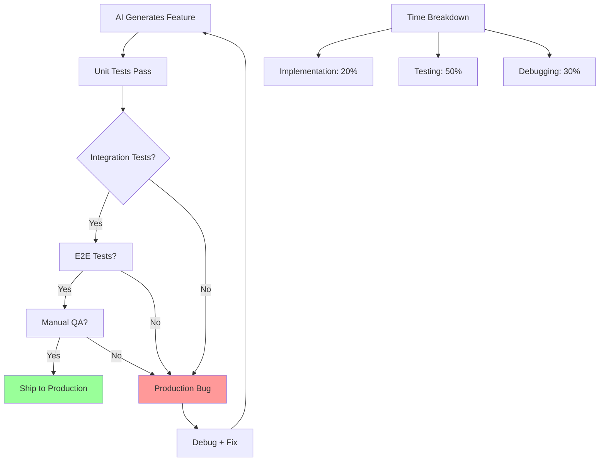

# Bottleneck #5: Testing and Quality Assurance

[Placeholder: Examine the testing bottleneck—validation can't keep pace with implementation.

**The Problem**:
AI agents can generate code AND unit tests quickly. But they can't generate:

- Integration tests that validate system-wide behavior
- End-to-end tests that validate user workflows
- Manual QA testing for edge cases and user experience
- Performance testing under realistic load
- Security audits and penetration testing

These activities still take human time, often MORE time than writing the code manually would have taken.

**Why it emerges**:

- AI generates features faster than you can validate they work correctly
- Unit tests pass, but integration issues emerge at runtime
- Edge cases that a human developer would consider aren't handled
- Features ship with subtle bugs because validation was rushed
- Technical debt accumulates in the form of undertested code

**Real-world scenario**:
A developer building an API with Claude:

- Monday AM: Claude generates 3 new endpoints with unit tests (2 hours)
- Monday PM: Developer writes integration tests for endpoints (4 hours)
- Tuesday: Developer discovers endpoint 1 has race condition, endpoint 2 has validation bug, endpoint 3 works
- Tuesday-Wednesday: Fix issues, regenerate with Claude, retest (8 hours)

Total time: 14 hours for 3 endpoints. If written manually: 12 hours for 3 endpoints with fewer bugs.
The AI saved implementation time but created a validation bottleneck that eliminated the savings.

**Why AI-generated code needs MORE testing, not less**:

- Human developers build intuition about edge cases while coding
- AI agents implement specifications literally without considering unstated assumptions
- Copy-paste errors humans avoid (like incrementing variable names) can appear in AI code
- AI may generate valid syntax that doesn't match business logic intent
- Integration issues between AI-generated modules aren't caught by unit tests

**The velocity paradox**:

- Traditional dev: 60% coding, 20% testing → 3:1 ratio
- Naive agentic dev: 20% coding, 20% testing → 1:1 ratio (GOOD!)
- Reality check: 20% coding, 50% testing → 0.4:1 ratio (testing dominates)

You're not testing MORE code; you're discovering MORE bugs faster because implementation outpaces
your testing strategy.

**Symptoms you're hitting this bottleneck**:

- Production bugs increasing despite more features shipping
- "It worked in dev" becomes your most common phrase
- Backlog of features awaiting validation
- Spending more time debugging than implementing new features
- Stakeholders losing confidence in quality

**Types of testing that become bottlenecks**:

1. **Integration testing**: Does new code work with existing systems?
2. **End-to-end testing**: Do full user workflows work?
3. **Performance testing**: Does it scale?
4. **Security testing**: Are there vulnerabilities?
5. **UX testing**: Is it actually usable?
6. **Regression testing**: Did we break anything that used to work?

**The critical insight**:
AI is EXCELLENT at generating test CODE (unit tests, test fixtures, mocks).
AI is POOR at generating test STRATEGY (what to test, how to test, when to test).

Testing strategy must be defined by humans BEFORE AI generates code. Otherwise, you get comprehensive
unit tests for code that doesn't meet requirements.

**The solution preview**:
(Link to Part 2 testing strategies and Part 3 testing patterns)

- Define test strategy BEFORE implementation (requirement-driven testing)
- Use AI to generate test code from test strategy
- Automate everything that can be automated
- Prioritize tests by risk, not coverage
- Invest in test infrastructure early
- Acceptance tests derived from EARS requirements
- Shift testing left: validate requirements before code
- Continuous testing in CI/CD pipeline]

**Figure 5.6:** Testing and validation as the dominant activity in agentic development
