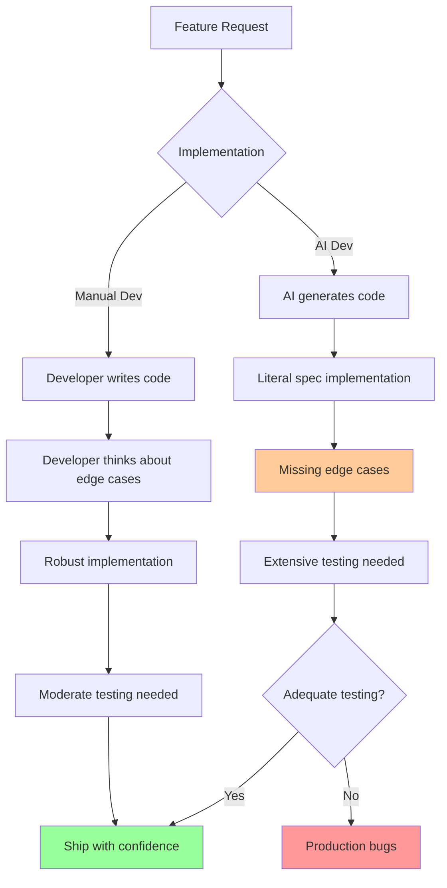
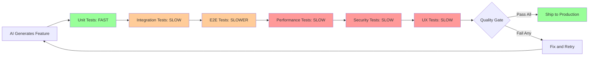

# Bottleneck #5: Testing and Quality Assurance

You wake up Monday morning excited to ship your new feature. Claude helped you build three API endpoints over the weekend—clean code, comprehensive unit tests, everything passes. You merge to production and celebrate. Tuesday morning, your inbox fills with bug reports: race conditions, validation failures, edge cases that break entire workflows. You spend the next three days fixing issues that should have been caught before shipping. Sound familiar?

This is the testing bottleneck, and it's perhaps the most insidious of the five new constraints. Unlike the others that slow you down, this one creates the illusion of speed while accumulating technical debt that crashes down later.

## The Testing Velocity Paradox

Here's what makes the testing bottleneck particularly dangerous: AI agents are excellent at generating test *code*, but terrible at generating test *strategy*. Claude can write perfect unit tests in seconds. It can scaffold integration tests, create test fixtures, generate mock data, and produce comprehensive test suites. But it cannot tell you *what* to test, *how thoroughly* to test it, or *when* you've tested enough.

The result is a dangerous mismatch: you have 5-10x more code to validate, comprehensive unit test coverage giving you false confidence, and a testing strategy designed for traditional development velocity. Features ship with passing tests but hidden bugs, creating a quality crisis that erodes stakeholder trust.

Consider this timeline from a real project:

**Monday AM**: Claude generates 3 new REST endpoints with complete CRUD operations (2 hours)
**Monday PM**: Developer writes integration tests to validate endpoints (4 hours)
**Tuesday**: Developer discovers endpoint #1 has a race condition in concurrent requests
**Tuesday**: Developer finds endpoint #2 fails validation for edge case inputs
**Tuesday**: Endpoint #3 works perfectly
**Tuesday-Wednesday**: Fix issues, regenerate code with Claude, write additional tests, revalidate (8 hours)

**Total time**: 14 hours for 3 endpoints. **Manual development time**: 12 hours for 3 endpoints with fewer post-deployment bugs.

The AI saved implementation time but created a validation bottleneck that eliminated the savings and introduced quality issues.

## Why AI-Generated Code Needs MORE Testing

This seems counterintuitive, but AI-generated code often requires more rigorous testing than manually written code:

**Human developers build intuition while coding**: When you write code manually, you're constantly thinking about edge cases, error conditions, and integration points. You mentally simulate execution paths. You remember similar bugs from past projects. This tacit knowledge gets encoded into more robust implementations.

**AI agents implement specifications literally**: Claude builds exactly what you asked for, with no consideration for unstated assumptions. If your specification says "validate email format," it validates email format—but doesn't consider what happens when the email is already in use, or when the database is unavailable, or when the input is empty.

**Copy-paste patterns compound**: AI agents sometimes generate similar code patterns across multiple locations. A validation bug in one endpoint might exist identically in five other endpoints. Humans naturally vary their implementations, creating diversity that limits blast radius.

**Integration boundaries are invisible**: Unit tests for AI-generated components pass perfectly because each component works in isolation. But the handoff points between components—where data formats differ, where timing assumptions break, where resource contention occurs—require integration testing that AI cannot generate without explicit guidance.

*Figure 5.7: Testing requirements diverge between manual and AI-generated code. AI's literal implementation of specifications requires more comprehensive testing to achieve equivalent quality.*

## The Time Allocation Shift

Traditional development has a roughly 3:1 ratio of coding to testing time:

- **Coding**: 60% of development time
- **Testing**: 20% of development time
- **Other activities**: 20%

With naive agentic development, you might expect this ratio to improve to 1:1:

- **Coding**: 20% (5x faster with AI)
- **Testing**: 20% (unchanged)
- **Other activities**: 60% (more time for design, planning, review)

But reality delivers a different ratio—approximately 0.4:1 or worse:

- **Coding**: 10-15% (very fast with AI)
- **Testing and validation**: 50-60% (testing dominates)
- **Debugging and fixing**: 20-30% (finding issues AI didn't anticipate)
- **Other activities**: 10% (squeezed out by quality issues)

You're not testing more code—you're discovering more bugs faster because implementation velocity vastly exceeds testing strategy maturity.

## Symptoms You're Hitting This Bottleneck

How do you know the testing bottleneck is constraining your velocity?

**Production bugs increase despite more features shipping**: Your deployment frequency doubles, but so does your bug rate. Stakeholders notice quality declining even as features accelerate.

**"It worked in dev" becomes your most common phrase**: Features pass all tests in development but fail in production under real user load, with real data, and real integration complexity.

**Backlog of features awaiting validation**: You have 10 completed features sitting in a testing queue, waiting for QA validation you don't have capacity to perform.

**Spending more time debugging than implementing**: Your daily standup reveals that most team time goes to investigating production issues, not building new capabilities.

**Stakeholders lose confidence in quality**: Product managers start asking "did you really test this?" before every release. CTOs implement release freezes. Users complain about reliability.

## Types of Testing That Become Bottlenecks

Not all testing creates equal constraints. Some types of validation scale well with AI assistance; others become critical path blockers:

**1. Integration Testing**: Does new code work with existing systems? AI can generate integration tests, but only if you specify all integration points, data contracts, and failure modes. Discovering these through testing is slow.

**2. End-to-End Testing**: Do full user workflows function correctly? E2E tests require understanding complete user journeys, something AI cannot infer from individual feature specifications.

**3. Performance Testing**: Does the implementation scale to production load? AI generates functionally correct code that might have O(n²) complexity, N+1 query problems, or memory leaks invisible in unit tests.

**4. Security Testing**: Are there vulnerabilities? AI might generate code patterns vulnerable to injection attacks, authentication bypasses, or data exposure—issues that require specialized security testing to detect.

**5. UX Testing**: Is it actually usable? AI builds the feature you specified, but cannot evaluate whether the user experience is confusing, frustrating, or error-prone.

**6. Regression Testing**: Did we break anything that used to work? With 5-10x more code being generated, the surface area for regression expands proportionally, but regression test coverage often doesn't keep pace.

*Figure 5.8: The testing pipeline shows where bottlenecks emerge. AI accelerates unit test generation (green), but higher-level validation types (orange/red) become constraints that dominate the delivery cycle.*

## The Critical Insight: Strategy vs. Code

This is the key to understanding and solving the testing bottleneck:

**AI is excellent at generating test CODE**: Given clear instructions, Claude can write unit tests, create test fixtures, generate mock objects, scaffold integration tests, and produce comprehensive test suites with near-perfect coverage.

**AI is poor at generating test STRATEGY**: Claude cannot determine what to test, how thoroughly to test it, which tests matter most, when you've tested enough, or where the highest-risk areas are. These require human judgment based on domain knowledge, user understanding, and system architecture.

The solution isn't to stop using AI for testing—it's to separate strategy from implementation:

**You define the test strategy**: What needs to be tested? What are the critical paths? What edge cases matter? What failure modes exist? What quality standards apply?

**AI generates the test code**: Given your strategy, Claude writes the actual test implementations, fixtures, and validation logic.

This division of labor matches capabilities to strengths. But it requires investing time upfront in test strategy development—time that many teams skip in their rush to ship features quickly.

## The Solution Preview

The testing bottleneck is solvable, but it requires fundamental workflow changes we'll explore in depth in Part 2 and Part 3:

**Define test strategy BEFORE implementation**: Derive acceptance tests from requirements (EARS notation makes this systematic). Know what "done and tested" means before writing any code.

**Use AI to generate test code from test strategy**: Once you know *what* to test, Claude can generate comprehensive test implementations in minutes.

**Automate everything that can be automated**: Invest heavily in CI/CD infrastructure, automated test execution, and fast feedback loops. Manual testing should be rare and targeted.

**Prioritize tests by risk, not coverage**: 100% code coverage with low-value tests provides false confidence. Focus testing effort on high-impact, high-risk areas.

**Shift testing left**: Validate requirements and specifications before code. Catch issues when they're cheap to fix (in specs) rather than expensive (in production).

**Acceptance tests from requirements**: EARS requirements naturally generate acceptance test cases. "WHEN user submits invalid email THEN system shall return 400 error" becomes a test case directly.

The teams that solve the testing bottleneck achieve something remarkable: they maintain quality while shipping 5-10x faster. Those who don't find their velocity gains evaporate in debugging cycles and stakeholder friction.

See Part 2 (Testing Strategies) for detailed workflows and Part 3 (Testing AI-Generated Code) for specific patterns and techniques.
