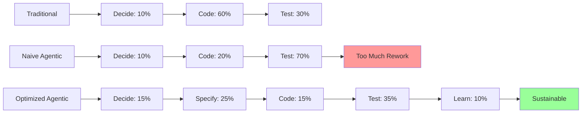

# Solutions and Mitigation Strategies

[Placeholder: Provide actionable solutions for each bottleneck identified.

**Overview**:
The bottlenecks are real, but they're not insurmountable. Each has proven solutions that shift your
workflow to match the new reality of 5-10x faster implementation. The key insight: **move validation
LEFT in the development process**.

Traditional workflow: Decide → Implement → Test → Learn
Agentic workflow: Decide → Specify → Validate Spec → Implement → Test → Learn

**Strategy 1: Specification-Driven Development**
**Addresses**: Requirements bottleneck, Architecture bottleneck

**The approach**:

- Write detailed specifications BEFORE asking AI to implement
- Use formal specification languages (EARS, OpenAPI, AsyncAPI)
- Validate specifications with stakeholders before coding
- Treat specs as the primary artifact, code as secondary

**Why it works**:

- Catches ambiguities before they become wrong implementations
- Forces architectural thinking upfront
- Gives AI agents clear, unambiguous instructions
- Makes requirements reviews faster than code reviews

**Time investment**:

- Traditional: 10% spec, 60% code, 30% test
- Agentic: 30% spec, 20% code, 50% test (better outcomes)

**Concrete tactics**:

- Use EARS notation for all requirements
- Create OpenAPI specs before implementing REST APIs
- Define data schemas with JSON Schema before coding data models
- Review specs in 30-minute meetings instead of code in 2-hour reviews
- Get stakeholder sign-off on specs, not on code

(Link to Part 2 requirements and design chapters, Part 3 specification patterns)

---

**Strategy 2: Outcome-Based Product Management**
**Addresses**: Product decision bottleneck

**The approach**:

- Define OUTCOMES, not features ("increase user retention" not "add email notifications")
- Establish product principles that guide implementation decisions
- Empower developers to make implementation decisions within outcome constraints
- Measure results, not outputs

**Why it works**:

- Reduces decision coordination overhead
- Enables autonomous implementation
- Aligns team without constant check-ins
- AI agents can explore solution space within outcome boundaries

**Concrete tactics**:

- Write product briefs focused on outcomes and success metrics
- Define MVP scope aggressively—fewer outcomes, clearer focus
- Establish design principles that answer common questions
- Use hypothesis-driven development (we believe X will achieve Y)
- Weekly outcome reviews, not daily feature approvals

(Link to Part 2 brief writing and MVP prioritization)

---

**Strategy 3: Architecture-First Design**
**Addresses**: Architecture bottleneck

**The approach**:

- Design system architecture BEFORE implementing first feature
- Define component boundaries and interfaces explicitly
- Establish architectural principles as decision-making rules
- Refactor proactively, not reactively

**Why it works**:

- Prevents architectural drift
- Makes each feature implementation predictable
- Enables parallel work on components
- Reduces cognitive load (fewer decisions per feature)

**Concrete tactics**:

- Document architecture in design.md with diagrams
- Define digestible interfaces for all components
- Use bounded contexts to manage complexity
- Review architecture after each major feature
- Budget 10% of time for architectural refactoring

(Link to Part 1 architecture principles, Part 3 architecture patterns)

---

**Strategy 4: Test Strategy Before Test Code**
**Addresses**: Testing bottleneck

**The approach**:

- Define what to test before generating test code
- Derive acceptance tests from requirements
- Automate ruthlessly
- Prioritize tests by risk, not coverage percentage

**Why it works**:

- AI generates test code from test strategy
- Validation happens continuously, not in batches
- Catches issues earlier in the cycle
- Builds confidence in rapid shipping

**Concrete tactics**:

- Write acceptance criteria in EARS requirements
- Generate test cases from requirements before implementation
- Use AI to generate unit tests from acceptance criteria
- Invest in test infrastructure (CI/CD, test environments)
- Run tests on every commit, not just before merge
- Focus on integration tests over unit tests (test interfaces, not implementations)

(Link to Part 2 testing strategies, Part 3 testing patterns)

---

**Strategy 5: Async and Autonomous Code Review** (for teams)
**Addresses**: Code review bottleneck

**The approach**:

- Review outcomes and contracts, not implementations
- Use AI for first-pass code review
- Trust strong test coverage
- Post-merge review for non-critical paths

**Why it works** (when appropriate):

- Matches review velocity to implementation velocity
- Focuses human attention on high-value review (architecture, requirements)
- AI catches mechanical issues (linting, security, patterns)

**Concrete tactics**:

- Define interface contracts explicitly—review contracts, not implementations
- Use automated tools for style, security, basic correctness
- Merge based on test passage + cursory review
- Deep review post-merge with ability to quickly fix issues
- Pair programming with AI (review as you generate)

**Note**: This is controversial and may not fit all team cultures. Solo developers don't have this bottleneck.

(Link to Part 3 code review patterns)

---

**Strategy 6: The Renaissance Developer Advantage**
**Addresses**: ALL bottlenecks

**The key insight**:
Solo Renaissance Developers sidestep many bottlenecks entirely:

- No product decision coordination (you ARE the product owner)
- No code review delays (self-review or trust+test)
- Direct architecture authority (no consensus building)
- Tight feedback loops (implement → test → learn in hours)

**Why teams struggle more**:

- Communication overhead scales with team size
- Consensus building slows decision-making
- Handoffs between roles create delays
- Coordination costs increase with velocity

**The implication**:
Small teams (1-3 people) with Renaissance Developer skills can outpace larger specialized teams
in the age of agentic coding. The optimal team structure shifts from specialized roles to generalist
polymaths.

(Link back to Chapter 1: Renaissance Developer)

---

**Synthesis:** The New Workflow*

Traditional:

1. Gather requirements (slow)
2. Implement (VERY slow)
3. Test (slow)

Agentic:

1. Gather requirements (invest time)
2. Write specifications (invest time)
3. Validate specifications (invest time)
4. Implement (FAST)
5. Test (invest time)
6. Learn and iterate (fast cycles)

**The mindset shift**: Move validation LEFT. Catch issues in specifications, not in code.]

**Figure 5.7:** Time allocation across development workflows
