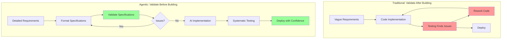

# Solutions and Mitigation Strategies

The five bottlenecks are real, but they're not insurmountable. Each has proven solutions that shift your workflow to match the new reality of 5-10x faster implementation. The key insight that connects all these solutions is simple yet profound: **move validation LEFT in the development process**.

Traditional development validates after building. You write code, then test it. You implement features, then see if they meet requirements. You build the product, then discover if it's what users wanted. This works when implementation is slow enough to provide a buffer for iteration and correction.

Agentic development requires validating before building. You validate requirements before coding, validate specifications before generating implementations, validate architecture before building features, and validate test strategy before writing tests. This inversion feels uncomfortable at first—it requires more upfront investment—but it unlocks sustainable velocity that compounds over time.

Let's explore the specific strategies that address each bottleneck.

## Strategy 1: Specification-Driven Development

**Addresses**: Requirements bottleneck, Architecture bottleneck

The most powerful strategy for agentic development is shifting from code-first to specification-first workflows. Instead of writing code and refining it through iteration, you write detailed specifications and let AI generate code from unambiguous instructions.

### The Approach

Write detailed specifications BEFORE asking AI to implement anything:

- Use formal specification languages (EARS for requirements, OpenAPI for REST APIs, AsyncAPI for event-driven systems, JSON Schema for data models)
- Validate specifications with stakeholders before any code exists
- Treat specifications as the primary artifacts; code becomes secondary (and disposable)
- Review and refine specifications, not implementations

### Why It Works

Specification-driven development addresses the core acceleration paradox. When AI can implement features in hours instead of weeks, every ambiguity in your requirements becomes immediately and expensively visible. A vague requirement that would have been clarified during manual implementation now becomes wrong code generated at high velocity.

Specifications catch these ambiguities before they become code:

- **Faster reviews**: A 30-minute specification review with stakeholders prevents a 2-hour code review plus debugging cycle
- **Clear AI instructions**: Formal specs give AI agents unambiguous direction, reducing implementation errors
- **Forced architectural thinking**: Writing specs makes you think through system boundaries, data flows, and integration points before committing to implementations
- **Disposable code**: When specifications are authoritative, regenerating code is cheap if requirements change

### Time Investment Reallocation

Traditional development:

- 10% specifications
- 60% coding
- 30% testing and debugging

Agentic development:

- 30% specifications (3x increase)
- 20% coding (from 60% to 20%)
- 50% testing (higher quality bar, but better outcomes)

You invest more upfront but save massively on implementation and rework.

### Concrete Tactics

**Use EARS notation for all functional requirements**: Every requirement follows one of five forms (ubiquitous, event-driven, state-driven, optional, conditional). This forces precision and eliminates ambiguity.

Example:

```text
Bad: "The system should validate user input"
Good: "WHEN user submits registration form THEN system shall validate email format using RFC 5322 regex AND return 400 error with specific field errors IF validation fails"
```

**Create OpenAPI specs before implementing REST APIs**: Define every endpoint, parameter, response code, and error format in OpenAPI 3.0 before writing any backend code. Review the specification with frontend developers and product managers. Then let Claude generate the implementation.

**Define data schemas with JSON Schema**: Model your data structures formally before building database tables or API payloads. JSON Schema forces you to specify types, constraints, required fields, and validation rules explicitly.

**Get stakeholder sign-off on specs, not code**: Product managers and designers can read and validate OpenAPI specs or EARS requirements. They cannot effectively review code. Shift approval gates left to specifications.

**Review specs in focused sessions**: 30-minute specification reviews catch issues that would take 3 hours to fix in code. Make spec reviews a regular practice, not an afterthought.

See Part 2 (Brief to Requirements) for EARS workflows and Part 3 (OpenAPI for REST APIs) for practical specification patterns.

## Strategy 2: Outcome-Based Product Management

**Addresses**: Product decision bottleneck

Traditional feature-based product management becomes a velocity killer in agentic development. Product managers become decision bottlenecks when implementation moves faster than they can provide detailed feature specifications. The solution is shifting from feature-based to outcome-based product management.

### The Approach

Define OUTCOMES (the results you want to achieve) rather than FEATURES (the specific implementations):

- Focus on measurable outcomes: "increase user retention by 20%" not "add email notifications"
- Establish product principles that guide implementation decisions without constant coordination
- Empower developers to make implementation choices within outcome constraints
- Measure results (did we achieve the outcome?) not outputs (did we ship the feature?)

### Why It Works

Outcome-based product management matches decision velocity to implementation velocity. Instead of waiting for product managers to specify every detail, developers (working with AI agents) explore the solution space autonomously within outcome boundaries.

This reduces coordination overhead dramatically:

- Fewer approval gates (validate outcomes, not implementations)
- Faster iteration (try approaches, measure results, adjust)
- Better solutions (people closest to implementation make informed trade-offs)
- Clearer success criteria (outcomes are measurable; feature completeness is subjective)

AI agents excel at exploring solution spaces when given clear constraints. Tell Claude "build a feature that reduces signup abandonment" with specific success metrics, and it can propose and implement multiple approaches for experimentation.

### Concrete Tactics

**Write outcome-focused product briefs**: Instead of listing features, describe the problem, the desired outcome, success metrics, and constraints. Let implementation details emerge through iterative development.

**Establish design principles**: Create a small set of principles that answer common questions. Example: "When in doubt, choose simplicity over features" or "Always prefer standard authentication patterns over custom implementations." These principles enable autonomous decisions.

**Use hypothesis-driven development**: Frame work as "We believe [implementing X] will achieve [outcome Y] measured by [metric Z]." Test hypotheses quickly, measure results, and iterate. This maintains product discipline while enabling velocity.

**Define MVP scope aggressively**: Fewer outcomes with clearer focus is better than comprehensive feature lists. Pick the 2-3 outcomes that matter most for MVP and defer everything else.

**Weekly outcome reviews, not daily feature approvals**: Review progress on outcomes weekly. Did we move the metrics? If yes, continue. If no, adjust. Avoid daily micro-decisions on implementation details.

See Part 2 (Brainstorm to Brief) for outcome-based brief writing.

## Strategy 3: Architecture-First Design

**Addresses**: Architecture bottleneck

The fastest way to accumulate technical debt is to skip architectural design and dive straight into feature implementation with AI. Code generation is so fast that poor architectural decisions compound before you notice them. The solution is architecture-first design that establishes system structure before building features.

### The Approach

Design your system architecture BEFORE implementing your first feature:

- Define component boundaries and interfaces explicitly
- Document architecture with diagrams and decision records
- Establish architectural principles as rules for AI-generated code
- Review architecture after each major feature to prevent drift
- Budget time for proactive refactoring (don't wait for crises)

### Why It Works

Architecture-first design prevents the chaos that emerges when AI generates code without coherent system structure. When each feature adds components in ad-hoc ways, you end up with tangled dependencies, unclear responsibilities, and mounting complexity.

Good architecture provides:

- **Predictable feature implementation**: Each new feature fits into existing structure
- **Parallel development**: Clear boundaries enable working on multiple components simultaneously
- **Reduced cognitive load**: Fewer decisions per feature (the architecture decided them already)
- **Better AI instructions**: You can tell Claude "implement this feature following the established pattern in component X"

### Concrete Tactics

**Document architecture in design.md with diagrams**: Create clear visual representations of your system structure. Use component diagrams, data flow diagrams, and sequence diagrams. Make architecture visible and reviewable.

**Define digestible interfaces for all components**: Apply the digestibility principles from [Chapter 4](../04-digestible-interfaces/02-defining-digestibility.md) to component boundaries. Each interface should be understandable in a single context window.

**Use bounded contexts to manage complexity**: Decompose your system into distinct contexts with clear boundaries. Each context has its own models, language, and responsibilities. This prevents the "everything depends on everything" trap.

**Review architecture after major features**: Dedicate time after shipping significant features to review architectural decisions. Did the component boundaries work? Are there emerging patterns? Should anything be refactored?

**Budget 10% of time for refactoring**: Don't wait for architectural issues to become crises. Allocate regular time for proactive refactoring to keep the architecture clean as the codebase grows.

See [Architecture Principles](../03-architecture-principles/01-introduction.md) for foundational concepts and Part 3 (Component Decomposition) for practical patterns.

## Strategy 4: Test Strategy Before Test Code

**Addresses**: Testing bottleneck

As we explored in the previous section, AI is excellent at generating test code but poor at generating test strategy. The solution is defining what to test before generating any test implementations.

### The Approach

Separate test strategy (what to test) from test code (how to test it):

- Define test strategy upfront based on requirements and risk analysis
- Derive acceptance tests directly from EARS requirements
- Use AI to generate test code from your test strategy
- Automate ruthlessly—manual testing should be rare and targeted
- Prioritize tests by risk and impact, not coverage percentages

### Why It Works

When you define test strategy before implementation, testing becomes a guided process rather than a reactive scramble. You know what "adequately tested" means before writing code, allowing you to:

- Generate comprehensive test suites from specifications
- Focus testing effort on high-value areas
- Catch issues early when they're cheap to fix
- Build stakeholder confidence through systematic validation

AI agents can generate excellent test code when given clear strategy. Claude can write unit tests, integration tests, and even end-to-end tests if you specify what needs validation.

### Concrete Tactics

**Write acceptance criteria in EARS requirements**: Structure requirements so they naturally generate test cases.

Example:

```text
Requirement: "WHEN user submits login form with valid credentials
             THEN system shall authenticate user AND return session token"

Test cases:
- Valid credentials → successful auth + token
- Invalid password → 401 error
- Nonexistent email → 401 error
- Missing credentials → 400 error
- Database unavailable → 503 error
```

**Generate test cases from requirements BEFORE implementation**: For each requirement, enumerate test cases covering success paths, failure modes, and edge cases. Review test cases with stakeholders. Then implement both code and tests.

**Use AI to generate test code from test cases**: Once you know what to test, ask Claude to generate test implementations. Provide clear instructions about test frameworks, assertion styles, and mock strategies.

**Invest in test infrastructure**: Allocate significant time to CI/CD setup, test environment automation, and fast feedback loops. Good infrastructure makes comprehensive testing practical.

**Focus on integration tests over unit tests**: Test interfaces and contracts, not implementations. Integration tests validate behavior; unit tests validate code structure. Behavior matters more in AI-generated code.

**Run tests on every commit**: Make testing continuous, not batched. Fast feedback prevents issues from compounding.

See Part 2 (Testing Strategies) for detailed workflows.

## Strategy 5: Async Code Review (For Teams)

**Addresses**: Code review bottleneck (for team environments)

Note: Solo developers often skip this bottleneck entirely—you're your own reviewer, or you trust comprehensive testing. This strategy applies primarily to team environments where code review is a coordination point.

### The Approach

Shift from pre-merge approval reviews to outcome-focused and async review patterns:

- Review outcomes and interface contracts, not implementation details
- Use AI for first-pass code review (linting, security, basic patterns)
- Trust strong test coverage to catch functional issues
- Consider post-merge review for non-critical paths
- Pair with AI during generation (review as you create)

### Why It Works (When Appropriate)

Traditional code review assumes implementation is slow and review capacity scales with team size. Neither holds true in agentic development. AI generates code faster than humans can review it, creating a coordination bottleneck.

Async and outcome-focused review patterns match review velocity to implementation velocity by:

- **Focusing human attention on high-value review**: Architecture, requirements alignment, security—not formatting or style
- **Automating mechanical review**: AI catches syntax issues, style violations, basic security patterns, and common mistakes
- **Trusting process over inspection**: Strong specifications + comprehensive tests provide confidence without line-by-line review

### Concrete Tactics

**Define interface contracts explicitly**: If contracts are clear and tested, implementations can vary. Review contracts (APIs, data schemas, component boundaries), not every implementation detail.

**Use automated tools for first-pass review**: Set up linters, security scanners, and AI-assisted code review tools. Let automation catch mechanical issues.

**Merge based on test passage + cursory review**: For non-critical paths, green tests + basic sanity check is enough. Deep review can happen post-merge with ability to quickly fix issues.

**Pair with AI during generation**: The best review happens during code generation. Discuss approaches with Claude, iterate on implementations in real-time, review outputs together. This is review as collaboration, not inspection.

**Post-merge review with fast fixes**: For features with good test coverage, merge and deploy quickly. Review asynchronously. If issues emerge, they're typically fast to fix.

**Caution**: This strategy is controversial and may not fit all team cultures, industries (especially regulated ones), or risk profiles. Use judgment. The core insight—focus review on outcomes and contracts—applies universally.

## Strategy 6: The Renaissance Developer Advantage

**Addresses**: ALL bottlenecks (for solo developers and small teams)

The final strategy isn't a process change—it's a perspective shift. The Renaissance Developer model introduced in [Chapter 1](../01-renaissance-developer/02-the-renaissance-developer-model.md) offers a fundamental advantage in agentic development: generalists sidestep coordination bottlenecks entirely.

### Why Solo Renaissance Developers Avoid Bottlenecks

When you embody all roles—product owner, designer, architect, implementer, tester—coordination overhead evaporates:

**No product decision delays**: You are the product owner. Decisions happen instantly. No waiting for approval, no explaining context, no alignment meetings. See a user need, decide to address it, implement immediately.

**No code review delays**: You review your own work (or rely on strong testing). No waiting for reviewer capacity. No back-and-forth on style preferences. Trust your judgment and test coverage.

**Direct architecture authority**: No consensus building on architectural decisions. You design the system, you understand the trade-offs, you make calls immediately.

**Tight feedback loops**: Idea to production can happen in hours, not weeks. No handoffs, no context loss, no coordination tax. Just continuous flow.

### Why Teams Struggle More

As team size grows, coordination costs increase non-linearly:

- Communication overhead scales with n² (every person must coordinate with every other person)
- Consensus building slows decision-making (more stakeholders = more alignment required)
- Handoffs between roles create delays (product to design to engineering to QA)
- Specialization reduces individual agency (you can't decide outside your domain)

At traditional development velocity, these costs were acceptable overhead. At agentic velocity, they become dominant constraints.

### The Implication

Small teams (1-3 people) of Renaissance Developers with broad skills can outpace larger specialized teams using agentic coding. The optimal team structure shifts from specialized roles (frontend dev, backend dev, designer, product manager, QA) to generalist polymaths who can navigate the full stack with AI assistance.

This doesn't mean everyone must be expert at everything. It means being "good enough at everything" to avoid coordination overhead—the exact principle from Chapter 1.

## Synthesis: The New Workflow

Putting all these strategies together creates a fundamentally different development workflow:

### Traditional Workflow

1. Gather requirements (slow, often vague)
2. Implement features (very slow, where most time goes)
3. Test implementations (slow, often catching requirement issues late)
4. Deploy and learn (slow feedback cycles)

### Naive Agentic Workflow (Don't Do This)

1. Gather vague requirements (still vague)
2. Implement with AI (fast, but often wrong)
3. Extensive testing reveals requirement issues (bottleneck)
4. Rework implementations (wasted velocity)

### Optimized Agentic Workflow (Do This)

1. Gather requirements and refine ruthlessly (invest time)
2. Write formal specifications (invest time)
3. Validate specifications with stakeholders (invest time, catch issues early)
4. Implement from specifications with AI (fast, confident)
5. Test against acceptance criteria (systematic, risk-based)
6. Deploy and measure outcomes (fast feedback, clear metrics)
7. Learn and iterate (tight loops, specification updates drive changes)

The mindset shift is profound: move validation LEFT. Catch issues in specifications (cheap to fix) rather than in code (expensive to fix) or in production (catastrophically expensive).



*Figure 5.9: Workflow comparison showing validation timing. Traditional development (top) validates after building, leading to expensive rework. Optimized agentic development (bottom) validates before building, making implementation confident and systematic.*

## Time Reallocation Across the Workflow

Let's make the time investment explicit with concrete numbers for a typical feature:

**Traditional Development** (40 hours total):

- Requirements gathering: 4 hours (10%)
- Specification: 0 hours (skipped)
- Implementation: 24 hours (60%)
- Testing and debugging: 12 hours (30%)

**Naive Agentic** (30 hours, but with quality issues):

- Requirements: 3 hours (10%, still vague)
- Implementation with AI: 6 hours (20%, fast but wrong)
- Testing finds major issues: 15 hours (50%, bottleneck)
- Rework and debugging: 6 hours (20%)

**Optimized Agentic** (25 hours, higher quality):

- Requirements and specifications: 9 hours (36%, upfront investment)
- Specification validation: 2 hours (8%, stakeholder review)
- AI implementation from specs: 4 hours (16%, confident)
- Systematic testing: 8 hours (32%, against acceptance criteria)
- Refinement and deployment: 2 hours (8%, minimal rework)

The optimized approach saves 15 hours compared to traditional (37.5% faster) and 5 hours compared to naive agentic (17% faster), while delivering higher quality and stakeholder confidence.

## The Path Forward

These strategies aren't theoretical—they're battle-tested patterns from teams successfully shipping products with agentic coding. Part 2 of this book provides complete playbooks for implementing each strategy. Part 3 offers detailed patterns and toolchain recommendations.

The bottlenecks are real, but so are the solutions. Teams that invest in specification-driven workflows, outcome-based product management, architecture-first design, and strategic testing achieve the full promise of agentic coding: 5-10x faster delivery from idea to production, not just 5-10x faster coding.

Those who treat AI as a faster typist while maintaining traditional workflows will find that acceleration creates chaos instead of velocity. The choice is yours.
