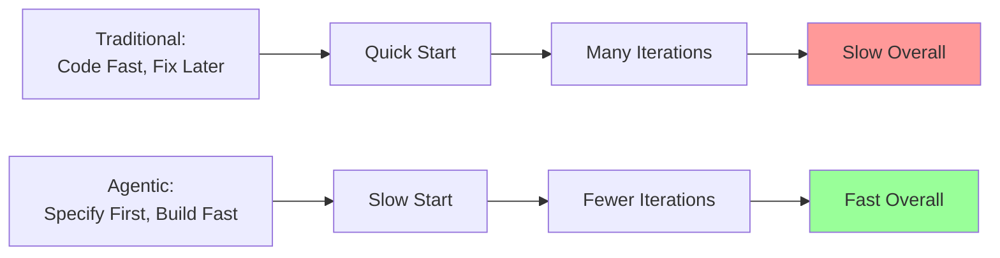

# Summary

When coding accelerates 5-10x through AI agents, the bottlenecks don't disappear—they shift. This chapter explored the acceleration paradox: what was once slow (implementation) becomes fast, instantly exposing everything upstream and downstream as the new constraints that determine your actual velocity.

## The Core Insight

The fundamental insight that connects all five bottlenecks is this: **traditional software development practices evolved for a world where coding is the slowest step**. Agile methodologies, sprint planning, review processes, and testing strategies all assume implementation is the constraint. These practices break catastrophically when AI makes coding faster than decision-making, specification, or validation.

The solution isn't to slow down AI-assisted implementation. It's to speed up everything else—and fundamentally redesign workflows to match the new reality.

## The Five New Bottlenecks

Let's recap each bottleneck and its core solution:

### 1. Requirements and Business Vision

**The Problem**: Unclear requirements lead to wrong implementations at high velocity. When AI can build the wrong thing in hours instead of weeks, the cost of ambiguity skyrockets exponentially.

**Why It Emerges**: Traditional requirements tolerate ambiguity because manual implementation provides a clarification buffer. AI implements specifications literally, turning every ambiguity into wrong code.

**The Solution**: Specification-driven development with formal notation. Invest 3x more time in requirements and specifications upfront. Use EARS notation, OpenAPI specs, and JSON Schema to eliminate ambiguity before implementation begins.

**Key Metric**: Time to implement wrong feature: 2 days traditional, 2 hours agentic. Cost of unclear requirements: 10x higher in agentic development.

### 2. Product Decision-Making

**The Problem**: Decision velocity must match implementation velocity. Product managers and stakeholders become the critical path when they can't make decisions fast enough to keep pace with AI-assisted development.

**Why It Emerges**: Product approval processes designed for 2-week sprints create gridlock when features can ship in 2 days. Coordination overhead becomes the dominant time sink.

**The Solution**: Outcome-based product management with clear principles. Define OUTCOMES (increase retention 20%) rather than FEATURES (add email notifications). Empower autonomous decision-making within outcome boundaries.

**Key Insight**: The fastest teams shift from "ask permission" to "seek forgiveness within guardrails." Product principles enable autonomous execution.

### 3. Architecture and Design Clarity

**The Problem**: Poor architecture compounds rapidly when building fast. Technical debt accumulates 5-10x faster with AI generation, creating mounting complexity that eventually halts progress.

**Why It Emerges**: Ad-hoc feature implementation without architectural coherence leads to tangled dependencies. What takes weeks to create manually (giving time to notice problems) emerges in hours with AI (problems compound before detection).

**The Solution**: Architecture-first design with explicit boundaries. Document system structure before building first feature. Define digestible interfaces. Review architecture regularly. Budget 10% time for proactive refactoring.

**Key Principle**: Architecture isn't overhead—it's the foundation that enables sustained high velocity. Skip it at your peril.

### 4. Code Review at Scale

**The Problem**: Human review capacity doesn't scale with AI generation. Traditional review processes collapse under 5-10x code volume, creating delivery bottlenecks.

**Why It Emerges**: Pre-merge approval review assumes implementation velocity matches review capacity. With AI generation, review becomes the critical path to deployment.

**The Solution**: Outcome review, AI-assisted review, strong testing infrastructure. Review contracts and specifications, not implementation details. Trust automated validation and comprehensive test coverage. Consider async post-merge review for non-critical paths.

**Important Note**: Solo Renaissance Developers often skip this bottleneck entirely—you're your own reviewer, or you rely on specifications + tests. This bottleneck primarily affects teams.

### 5. Testing and Quality Assurance

**The Problem**: Validation can't keep pace with implementation. AI generates code faster than you can properly test it, creating a quality crisis if testing strategy doesn't evolve.

**Why It Emerges**: AI generates test CODE excellently but cannot generate test STRATEGY. Without systematic test strategy, you get comprehensive unit tests for code that doesn't meet requirements.

**The Solution**: Test strategy before test code. Define WHAT to test before generating test implementations. Derive acceptance tests from EARS requirements. Automate ruthlessly. Prioritize tests by risk, not coverage metrics.

**Critical Distinction**: AI's strength (test code generation) vs. AI's weakness (determining what to test). Separate strategy from implementation.

## The Fundamental Mindset Shift

All five solutions share a common pattern: **move validation LEFT in the development process**.

**Traditional Development**: Validate AFTER building

- Write code → Test it → Fix bugs → Deploy → Discover if it's right

**Agentic Development**: Validate BEFORE building

- Specify completely → Validate specs → Generate code → Systematic testing → Deploy with confidence

This inversion feels uncomfortable. It requires more upfront investment before you see working code. But it unlocks sustainable velocity by catching issues when they're cheap to fix (specifications) rather than expensive (code) or catastrophic (production).

*Figure 5.10: Time allocation comparison. Traditional development starts fast but iterates extensively (red). Optimized agentic development invests upfront but achieves faster overall delivery (green).*

## Time Reallocation: The New Equation

Let's make this concrete with percentages for a typical project:

**Traditional Development**:

- Requirements & Specs: 10% (minimal upfront work)
- Implementation: 60% (where most time goes)
- Testing & Debugging: 30% (reactive validation)

**Naive Agentic** (Don't Do This):

- Requirements: 10% (unchanged, still vague)
- Implementation: 20% (fast with AI!)
- Testing & Rework: 70% (bottleneck kills velocity)

**Optimized Agentic** (Do This):

- Requirements & Specs: 35% (intentional investment)
- Implementation: 15% (confident, fast generation)
- Systematic Testing: 40% (risk-based, comprehensive)
- Learning & Iteration: 10% (tight feedback loops)

The math is compelling: optimized agentic delivers 30-40% faster than traditional while maintaining higher quality and stakeholder confidence.

## The Renaissance Developer Advantage

One critical insight deserves emphasis: **solo developers with broad skills sidestep most coordination bottlenecks entirely**.

When you embody all roles—product owner, architect, designer, implementer, QA—the coordination overhead evaporates:

**Bottlenecks you avoid**:

- No product decision delays (you decide immediately)
- No code review delays (self-review or trust+test)
- No architecture consensus building (direct authority)
- No stakeholder alignment friction (you are the stakeholder)

**Result**: Tight feedback loops where idea-to-production happens in days or hours, not weeks or months.

**The implication**: Small teams (1-3 people) of Renaissance Developers with broad competency can outpace larger specialized teams at agentic velocity. The optimal team structure shifts from specialized roles to generalist polymaths.

This doesn't mean becoming expert at everything—it means being "good enough at everything" to avoid handoffs and coordination taxes. The exact principle from [Chapter 1](../01-renaissance-developer/02-the-renaissance-developer-model.md).

## The Path Forward

Understanding these bottlenecks is only the beginning. The real work is adapting your workflow to thrive within these new constraints.

**Part 2** of this book provides the complete playbook:

- Specification-driven workflows that catch issues early
- Architectural patterns that scale with velocity
- Testing strategies that match implementation speed
- Iterative processes that maintain momentum
- Working effectively with AI agents as implementation partners

**Part 3** offers detailed patterns and tools:

- EARS requirements deep dive
- OpenAPI and AsyncAPI specifications
- Testing patterns for AI-generated code
- Architecture patterns for digestibility
- Toolchain recommendations for automation

**Part 4** shows it all in action:

- A complete product built using these principles
- Real decisions, trade-offs, and learnings
- Timeline validation (6 weeks idea-to-production)
- Honest assessment of what works and what struggles

## Key Takeaways

If you remember nothing else from this chapter, remember these six principles:

1. **Acceleration paradox**: Faster implementation exposes slower upstream/downstream processes. Your true velocity is determined by your slowest bottleneck, not your fastest capability.

2. **Validation left**: Catch issues in specifications, not in code. Moving validation earlier in the process feels slower initially but compounds to massive time savings.

3. **Time reallocation**: Invest heavily upfront in requirements and architecture. The 3x investment in specifications pays back 10x in implementation and testing efficiency.

4. **Test strategy ≠ test code**: AI can generate comprehensive test CODE but cannot determine test STRATEGY. Define what to test before generating how to test it.

5. **Renaissance advantage**: Generalists with broad skills avoid coordination overhead that dominates specialized teams at high velocity. Being "good enough at everything" becomes a competitive advantage.

6. **Workflow transformation**: Traditional processes break at 5-10x speed. New workflows optimized for agentic development are required—not incremental adjustments, fundamental redesigns.

## The Opportunity

These bottlenecks aren't limitations—they're opportunities. Teams and individuals who master the new constraints will ship products 5-10x faster than traditional development, maintaining quality while achieving unprecedented velocity.

Those who treat AI as merely a faster typist while clinging to traditional workflows will discover that acceleration creates chaos, not velocity. The technical debt accumulates faster, quality degrades more quickly, and stakeholder confidence erodes more completely.

The choice is stark: adapt your entire workflow to match agentic velocity, or watch AI acceleration amplify all your existing inefficiencies until progress grinds to a halt.

The good news? The solutions are proven, the patterns are documented, and the path is clear. You're now equipped to navigate the five bottlenecks and unlock sustainable velocity with agentic coding.

Let's move from theory to practice in Part 2.
