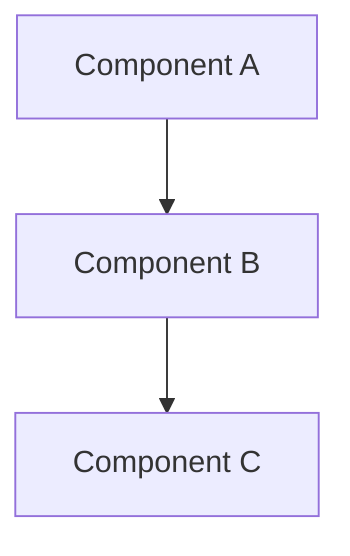

## Overview

[Placeholder: One-paragraph summary of this pattern/tool]

**Pattern Category**: Specification

## The Problem

[Placeholder: What problem does this pattern solve?
When do you encounter this issue in agentic coding?]

### Symptoms

[Placeholder: How do you know you need this pattern?]

- [Symptom 1]
- [Symptom 2]
- [Symptom 3]

## The Solution

[Placeholder: Detailed explanation of the pattern/tool]

### How It Works

[Placeholder: Mechanics and principles]

### Implementation

[Placeholder: Step-by-step guide to implementing this pattern]

**Step 1**: [Action]
**Step 2**: [Action]
**Step 3**: [Action]

## Example

[Placeholder: Concrete example with code/diagrams]

```markdown
[Code example demonstrating the pattern]
```

[Placeholder: Mermaid diagram showing the pattern visually]



*Figure X.X: [Diagram description]*

## When to Use

[Placeholder: Situations where this pattern is appropriate]

**Use this pattern when**:
- [Scenario 1]
- [Scenario 2]
- [Scenario 3]

## When NOT to Use

[Placeholder: Situations where this pattern is inappropriate or overkill]

**Avoid this pattern when**:
- [Scenario 1]
- [Scenario 2]
- [Scenario 3]

## Related Patterns

[Placeholder: Cross-references to complementary or alternative patterns]

- **[Pattern Name 1]**: [Relationship]
- **[Pattern Name 2]**: [Relationship]
- **[Pattern Name 3]**: [Relationship]

## Checklist

[Placeholder: Quick reference for implementing this pattern]

- [ ] [Implementation step 1]
- [ ] [Implementation step 2]
- [ ] [Implementation step 3]
- [ ] [Validation step 1]
- [ ] [Validation step 2]

## Further Reading

[Placeholder: External resources, official docs, related chapters]

- [Resource 1]
- [Resource 2]
