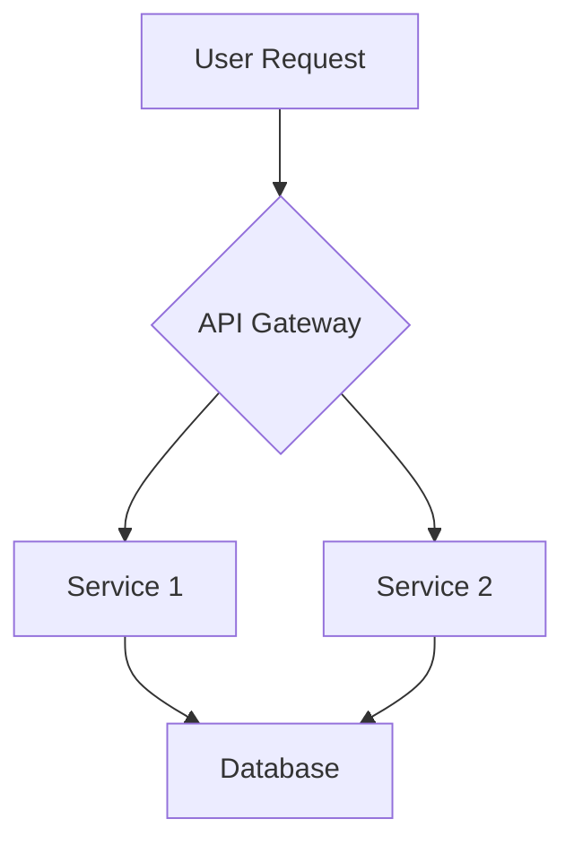
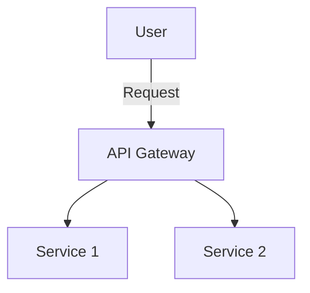

# Technical Design: Agentic Coding Book

**Product**: The Agentic Coding Playbook: From Idea to Production in 6 Weeks
**Version**: 1.0
**Date**: 2025-12-19
**Status**: Design

---

## Document Purpose

This document defines the technical architecture, implementation approach, and design decisions for the Agentic Coding Book. It addresses all requirements from requirements.md and provides a complete blueprint for implementation.

**Design Principles**:
1. **Simplicity**: Use simple, proven technologies over complex solutions
2. **Portability**: Support both digital and print with single source
3. **Maintainability**: Easy to update, extend, and refactor
4. **Automation**: Minimize manual work through CI/CD
5. **Transparency**: All source and process visible in public repository

---

## 1. System Architecture Overview

### 1.1 High-Level Architecture

The book is a **static content system** with automated build and deployment:

```
┌─────────────────────────────────────────────────────────────┐
│                     AUTHORING LAYER                          │
│  ┌─────────────┐  ┌──────────────┐  ┌─────────────────┐    │
│  │   VS Code   │─▶│  Claude Code │─▶│  Markdown Files │    │
│  │   (Editor)  │  │  (AI Assist) │  │   (Content)     │    │
│  └─────────────┘  └──────────────┘  └─────────────────┘    │
│                                              │               │
│                                              ▼               │
│                                     ┌─────────────────┐     │
│                                     │   Git Commit    │     │
│                                     └─────────────────┘     │
└─────────────────────────────────────────┬───────────────────┘
                                          │
                                          ▼
┌─────────────────────────────────────────────────────────────┐
│                    REPOSITORY LAYER                          │
│                   (GitHub Repository)                        │
│  ┌──────────────────────────────────────────────────────┐  │
│  │  Content Files:                                       │  │
│  │  • idea.md, brainstorm.md, brief.md                  │  │
│  │  • requirements.md, design.md, tasks.md              │  │
│  │  • Book chapters (Part1/, Part2/, Part3/, Part4/)   │  │
│  │  • Diagrams (diagrams/ with Mermaid .mmd files)     │  │
│  │  • Assets (images/, stylesheets/)                    │  │
│  └──────────────────────────────────────────────────────┘  │
│  ┌──────────────────────────────────────────────────────┐  │
│  │  Automation:                                          │  │
│  │  • .github/workflows/ (GitHub Actions)               │  │
│  │  • Build scripts (scripts/)                          │  │
│  └──────────────────────────────────────────────────────┘  │
└─────────────────────────────────────┬───────────────────────┘
                                      │
                    ┌─────────────────┴─────────────────┐
                    │                                   │
                    ▼                                   ▼
┌────────────────────────────────┐  ┌────────────────────────────────┐
│    BUILD & DEPLOY LAYER        │  │    BUILD & DEPLOY LAYER        │
│    (GitHub Actions)            │  │    (GitHub Actions)            │
│                                │  │                                │
│  ┌──────────────────────────┐ │  │  ┌──────────────────────────┐ │
│  │  Web Build Pipeline      │ │  │  │  PDF Build Pipeline      │ │
│  │  1. Checkout repo        │ │  │  │  1. Checkout repo        │ │
│  │  2. Process Mermaid      │ │  │  │  2. Render Mermaid→PNG   │ │
│  │  3. Build navigation     │ │  │  │  3. Concat markdown      │ │
│  │  4. Deploy to Pages      │ │  │  │  4. Pandoc→PDF           │ │
│  └──────────────────────────┘ │  │  │  5. Upload artifact      │ │
│                                │  │  └──────────────────────────┘ │
└────────────────┬───────────────┘  └────────────────┬───────────────┘
                 │                                   │
                 ▼                                   ▼
┌────────────────────────────────┐  ┌────────────────────────────────┐
│   PUBLICATION LAYER (WEB)      │  │   PUBLICATION LAYER (PDF)      │
│      (GitHub Pages)            │  │    (GitHub Releases)           │
│                                │  │                                │
│  • Static HTML site            │  │  • Downloadable PDF            │
│  • Mermaid renders in browser  │  │  • Print-optimized formatting  │
│  • Search enabled              │  │  • TOC, index, page numbers    │
│  • Mobile responsive           │  │  • Attached to releases        │
└────────────────────────────────┘  └────────────────────────────────┘
```

**Requirement Traceability**:
- REQ-T006-T010: GitHub repository infrastructure
- REQ-T001-T005: Authoring environment
- REQ-T011-T018: Build and generation
- REQ-T019-T021: Deployment

### 1.2 Component Responsibilities

**Authoring Components**:
- **VS Code**: Primary content editor (REQ-T002)
- **Claude Code**: AI pair programming assistant (REQ-T003, REQ-G005-G008)
- **Markdown Files**: Single source of truth for content (REQ-T001)
- **Mermaid Files**: Diagram definitions (REQ-T004)
- **Git**: Version control and collaboration (REQ-T010)

**Repository Components**:
- **Content Structure**: Organized directories for parts, chapters, assets
- **Automation Scripts**: Build, validation, deployment scripts
- **GitHub Actions**: CI/CD pipelines for build and deploy
- **Configuration**: Build settings, styling, metadata

**Build Components**:
- **Web Pipeline**: Converts markdown to GitHub Pages site
- **PDF Pipeline**: Converts markdown to print-ready PDF via Pandoc
- **Diagram Renderer**: Processes Mermaid to display formats
- **Asset Processor**: Optimizes images, builds navigation

**Publication Components**:
- **GitHub Pages**: Web hosting for online version
- **GitHub Releases**: Distribution point for PDFs
- **Search Index**: Full-text search for web version
- **Analytics**: Optional usage tracking (privacy-respecting)

---

## 2. Content Architecture

### 2.1 File and Directory Structure

**Requirements**: REQ-S001-S011, REQ-C001-C038

```
agentic-coding-book/
│
├── README.md                          # Repository overview, how to read/contribute
├── LICENSE                            # CC BY license text
├── CHANGELOG.md                       # Version history and updates
│
├── planning/                          # Planning documents (genesis workflow)
│   ├── idea.md                       # Original product idea
│   ├── brainstorm.md                 # Brainstorming session notes
│   ├── brief.md                      # Product brief
│   ├── requirements.md               # EARS requirements
│   ├── design.md                     # This technical design document
│   ├── tasks.md                      # Implementation task list
│   └── roadmap.md                    # MVP roadmap and gantt chart
│
├── book/                              # Book content (the actual book)
│   ├── index.md                      # Landing page, introduction
│   ├── preface.md                    # Preface and how to use this book
│   ├── glossary.md                   # Comprehensive glossary
│   │
│   ├── part1-foundations/            # Part 1: Foundations
│   │   ├── README.md                 # Part 1 overview
│   │   ├── 01-renaissance-developer/ # Chapter 1 (directory)
│   │   │   ├── 01-introduction-the-specialist-s-dilemma.md
│   │   │   ├── 02-the-renaissance-developer-model.md
│   │   │   ├── 03-what-changes-what-doesn-t.md
│   │   │   ├── ... (sections 04-09)
│   │   │   └── 10-further-reading.md
│   │   ├── 02-what-is-agentic-coding/ # Chapter 2 (directory)
│   │   │   ├── 01-introduction.md
│   │   │   ├── 02-defining-agentic-coding.md
│   │   │   ├── ... (sections 03-09)
│   │   │   └── 10-further-reading.md
│   │   ├── 03-architecture-principles/
│   │   ├── 04-digestible-interfaces/
│   │   └── 05-new-bottlenecks/
│   │
│   ├── part2-playbook/               # Part 2: The Playbook
│   │   ├── README.md                 # Part 2 overview
│   │   ├── 01-overview-6-week-journey.md
│   │   ├── 02-idea-to-brainstorm.md
│   │   ├── 03-brainstorm-to-brief.md
│   │   ├── 04-brief-to-requirements.md
│   │   ├── 05-requirements-to-design.md
│   │   ├── 06-design-to-implementation.md
│   │   ├── 07-testing-strategies.md
│   │   ├── 08-deployment-pipeline.md
│   │   ├── 09-environment-progression.md
│   │   ├── 10-managing-ai-agents.md
│   │   └── 11-iterating-post-mvp.md
│   │
│   ├── part3-patterns-tools/         # Part 3: Patterns & Tools
│   │   ├── README.md                 # Part 3 overview and index
│   │   │
│   │   ├── architecture/             # Architecture patterns
│   │   │   ├── component-decomposition.md
│   │   │   ├── bounded-contexts.md
│   │   │   ├── interface-boundaries.md
│   │   │   └── scalability-patterns.md
│   │   │
│   │   ├── specifications/           # Spec writing patterns
│   │   │   ├── ears-notation.md
│   │   │   ├── openapi-rest-apis.md
│   │   │   ├── asyncapi-events.md
│   │   │   └── json-schema-validation.md
│   │   │
│   │   ├── testing/                  # Testing strategies
│   │   │   ├── testing-ai-code.md
│   │   │   ├── test-pyramid.md
│   │   │   ├── acceptance-testing.md
│   │   │   └── debugging-strategies.md
│   │   │
│   │   ├── toolchain/                # Agent-friendly toolchain
│   │   │   ├── mcp-servers.md
│   │   │   ├── skills-custom-tools.md
│   │   │   ├── code-review-patterns.md
│   │   │   └── automation-tools.md
│   │   │
│   │   └── workflows/                # Development workflows
│   │       ├── spec-driven-dev.md
│   │       ├── agent-collaboration.md
│   │       └── continuous-delivery.md
│   │
│   ├── part4-example/                # Part 4: Complete Example
│   │   ├── README.md                 # Example overview
│   │   ├── 01-choosing-the-project.md
│   │   ├── 02-idea-and-brainstorm.md
│   │   ├── 03-brief-and-requirements.md
│   │   ├── 04-architecture-design.md
│   │   ├── 05-implementation-week1-2.md
│   │   ├── 06-implementation-week3-4.md
│   │   ├── 07-implementation-week5-6.md
│   │   ├── 08-testing-and-deployment.md
│   │   ├── 09-lessons-learned.md
│   │   └── 10-beyond-mvp.md
│   │
│   └── conclusion.md                 # Conclusion and next steps
│
├── diagrams/                          # Mermaid diagram sources
│   ├── architecture/
│   ├── workflows/
│   └── examples/
│
├── assets/                            # Images, stylesheets, etc.
│   ├── images/
│   ├── styles/
│   │   ├── web.css                   # Styles for GitHub Pages
│   │   └── print.css                 # Styles for PDF
│   └── templates/
│       └── pandoc-template.tex       # LaTeX template for PDF
│
├── scripts/                           # Build and utility scripts
│   ├── build-web.sh                  # Build GitHub Pages site
│   ├── build-pdf.sh                  # Build PDF
│   ├── render-mermaid.js             # Mermaid → PNG for PDF
│   ├── validate-links.sh             # Check internal/external links
│   └── generate-toc.sh               # Generate table of contents
│
├── .github/                           # GitHub-specific files
│   ├── workflows/
│   │   ├── deploy-pages.yml          # GitHub Pages deployment
│   │   ├── build-pdf.yml             # PDF build and release
│   │   ├── validate-pr.yml           # PR validation (links, format)
│   │   └── update-toc.yml            # Auto-update TOC on content change
│   ├── ISSUE_TEMPLATE/
│   │   ├── bug_report.md
│   │   └── content_suggestion.md
│   └── CONTRIBUTING.md               # Contribution guidelines
│
└── .claude/                           # Claude Code skills for book writing
    └── skills/
        ├── mermaid-diagrams/         # Existing Mermaid skill
        ├── chapter-template/         # Generate chapter scaffolds
        └── ears-requirements/        # Generate EARS requirements
```

### 2.2 Content Organization Rationale

**Design Decisions**:

1. **Separate planning/ and book/** (REQ-S001-S005)
   - *Rationale*: Genesis workflow artifacts stay visible but don't clutter book content
   - *Benefit*: Demonstrates the process, provides transparency

2. **Part-based structure with subdirectories** (REQ-S001-S005)
   - *Rationale*: Mirrors book organization, enables independent navigation
   - *Benefit*: Part 1/2 sequential, Part 3 reference-friendly, Part 4 integrated

3. **Section-based chapter organization** (REQ-N005) **[Updated 2026-01-28]**
   - *Rationale*: Each chapter is a directory containing individual section files (one file per section, ~5-10 KB each)
   - *Benefit*: Parallel work on sections, no merge conflicts, simplified drafting workflow, better version control granularity
   - *Trade-off*: More files to manage (~500 total), slightly more complex build process, but benefits outweigh costs for collaborative development

4. **Separate diagrams/ directory** (REQ-T004, REQ-T016-T018)
   - *Rationale*: Mermaid source files separate from rendered output
   - *Benefit*: Easier to maintain, reuse, and version diagrams

5. **Scripts and automation separate** (REQ-T011-T015, REQ-N021)
   - *Rationale*: Build process documented and reproducible
   - *Benefit*: Contributors can rebuild locally, CI/CD is transparent

---

## 3. Data Models and Content Schema

### 3.1 Markdown Frontmatter Schema

Each content file includes YAML frontmatter for metadata:

**Requirements**: REQ-S009-S011, REQ-N019-N020

**Section File Schema** (for section files within chapter directories):
```yaml
---
title: "Section Title"           # Section-specific title
chapter_title: "Chapter Title"   # Parent chapter title (for context)
part: 1                          # Which part (1-4)
chapter: 3                       # Chapter number within part
section: 2                       # Section number within chapter (1-based)
version: "1.0"                   # Content version
date: "2026-01-28"              # Last updated
status: "draft|review|published" # Publication status
author: "Author Name"
tags: ["architecture", "patterns", "mvp"]
related:                         # Cross-references
  - part2-playbook/03-brainstorm-to-brief.md
  - part3-patterns-tools/specifications/ears-notation.md
requirements:                    # Traceability to requirements.md
  - REQ-C015
  - REQ-C016
abstract: |
  A brief 2-3 sentence summary of this chapter's content
  for search and navigation purposes.
---
```

**Benefits**:
- Enables automated TOC generation
- Supports search indexing
- Maintains traceability
- Tracks content status and versioning

### 3.2 Cross-Reference Model

**Requirements**: REQ-S010-S011, REQ-Q010-Q013

Internal links use relative paths to section files:

```markdown
See [EARS Notation](../part3-patterns-tools/specifications/ears-notation.md)
for detailed requirements writing guidance.

This concept was introduced in
[The Renaissance Developer](../part1-foundations/01-renaissance-developer/01-introduction-the-specialist-s-dilemma.md).

For more details, see
[Defining Agentic Coding](./02-what-is-agentic-coding/02-defining-agentic-coding.md).
```

**Note**: As of 2026-01-28, chapters are directories with section files, so links point to specific section files within chapter directories.

**Link Validation**:
- Automated script checks all internal links (REQ-N015)
- CI/CD fails on broken links
- Quarterly validation of external links (REQ-N015-N016)

### 3.3 Diagram Integration Model

**Requirements**: REQ-T004, REQ-T016-T018, REQ-C043

Diagrams use Mermaid with consistent embedding:

```markdown
## Architecture Overview



*Figure 2.1: System architecture showing service decomposition*
```

**Rendering Strategy**:
- **Web**: GitHub Pages renders Mermaid natively in browser
- **PDF**: Build script converts Mermaid to PNG, embeds in PDF
- **Alt text**: Mermaid diagrams include accessible descriptions (REQ-N010)

### 3.4 Glossary Data Model

**Requirements**: REQ-S007, REQ-N007

Glossary entries use consistent format:

```markdown
### Agentic Coding

**Definition**: The practice of using AI agents as active partners in software
development, handling tasks from code generation to testing and deployment.

**Context**: Encompasses AI pair programming tools (Claude Code, GitHub Copilot),
autonomous agents, natural language to code generation, and AI-driven workflows.

**Related terms**: AI pair programming, autonomous agents, Renaissance Developer

**See also**: [What is Agentic Coding](part1-foundations/02-what-is-agentic-coding.md)
```

---

## 4. Technology Stack

### 4.1 Core Technologies

**Requirements**: REQ-T001-T024, REQ-N026-N030

| Component | Technology | Version | Rationale |
|-----------|-----------|---------|-----------|
| **Content Format** | Markdown (CommonMark) | 0.30+ | Universal, simple, git-friendly, portable (REQ-T001) |
| **Diagram Format** | Mermaid | 10.0+ | Text-based, version-controllable, GitHub-native (REQ-T004) |
| **Editor** | VS Code | Latest | Industry standard, excellent Markdown support (REQ-T002) |
| **AI Assistant** | Claude Code | Latest | Integrated into VS Code, powerful coding capabilities (REQ-T003) |
| **Version Control** | Git | 2.40+ | Industry standard, full history (REQ-T023) |
| **Repository Hosting** | GitHub | N/A | Free for public repos, Pages, Actions included (REQ-T006-T009) |
| **Web Publishing** | GitHub Pages | N/A | Free, automatic deployment, HTTPS (REQ-T007, REQ-T019-T020) |
| **PDF Generation** | Pandoc | 3.0+ | Excellent Markdown→PDF, LaTeX backend, customizable (REQ-T011-T012) |
| **CI/CD** | GitHub Actions | N/A | Integrated with GitHub, free for public repos (REQ-T008) |
| **Mermaid Rendering** | mermaid-cli (mmdc) | 10.0+ | CLI tool for Mermaid→PNG conversion (REQ-T017) |

### 4.2 Technology Selection Rationale

**Markdown + Git**:
- **Why**: Universal format, version control friendly, portable, simple
- **Addresses**: REQ-T001, REQ-T010, REQ-N026-N028
- **Alternatives considered**: LaTeX (too complex), AsciiDoc (less common), custom platform (vendor lock-in)

**GitHub Ecosystem (Repository + Pages + Actions)**:
- **Why**: Integrated platform, free for public repos, large community, reliable
- **Addresses**: REQ-T006-T010, REQ-T019-T021, REQ-P005-P012
- **Alternatives considered**: GitLab (similar, less adoption), custom hosting (more complex), Notion (not portable)

**Pandoc for PDF**:
- **Why**: Best-in-class Markdown→PDF, highly customizable, active development
- **Addresses**: REQ-T011-T015, REQ-N023, REQ-N030
- **Alternatives considered**: Custom HTML→PDF (less formatting control), LaTeX direct (too complex), Prince XML (commercial)

**Mermaid for Diagrams**:
- **Why**: Text-based, git-friendly, GitHub-native rendering, active community
- **Addresses**: REQ-T004, REQ-T016-T018, REQ-C043
- **Alternatives considered**: Draw.io (binary files), PlantUML (similar but less common), manual images (not version-controllable)

**VS Code + Claude Code**:
- **Why**: Industry standard editor, excellent AI integration, free
- **Addresses**: REQ-T002-T003, REQ-G005-G008
- **Alternatives considered**: Cursor (similar), JetBrains (less Markdown focus), plain text editor (less AI support)

### 4.3 Development Dependencies

**Local Development Requirements**:
```json
{
  "required": [
    "git >= 2.40",
    "node >= 18.0 (for Mermaid CLI)",
    "pandoc >= 3.0",
    "VS Code >= 1.85",
    "Claude Code extension (latest)"
  ],
  "optional": [
    "make (for build scripts)",
    "docker (for reproducible builds)"
  ]
}
```

**CI/CD Dependencies** (GitHub Actions):
```yaml
# Defined in .github/workflows/*.yml
dependencies:
  - actions/checkout@v4
  - actions/setup-node@v4
  - pandoc/pandoc-action@v2
  - mermaid-js/mermaid-cli
  - peaceiris/actions-gh-pages@v3
```

---

## 5. Infrastructure and Deployment Architecture

### 5.1 Environment Overview

**Requirements**: REQ-T006-T024, REQ-M001-M017

| Environment | Purpose | Infrastructure | Access |
|-------------|---------|---------------|--------|
| **Local Dev** | Author content, preview changes | Author's machine (VS Code + git) | Author only |
| **GitHub Repo** | Source of truth, version control | GitHub.com repository | Public read, author write |
| **GitHub Actions** | Build and deploy automation | GitHub-hosted runners | Triggered by commits |
| **GitHub Pages** | Web publication | GitHub Pages (static hosting) | Public read |
| **GitHub Releases** | PDF distribution | GitHub Releases (artifact storage) | Public download |

**Simplified vs. Traditional Software**:
- No separate test, staging, or production environments needed
- Content publication is atomic (commit → deploy)
- Rollback is simple (revert commit)
- No databases, servers, or runtime infrastructure

### 5.2 Local Development Environment

**Requirements**: REQ-T001-T005, REQ-T022-T024

**Setup**:
```bash
# Clone repository
git clone https://github.com/[username]/agentic-coding-book.git
cd agentic-coding-book

# Install dependencies
npm install  # For Mermaid CLI and other Node tools

# Preview locally
# Option 1: VS Code Markdown Preview (built-in)
# Option 2: Static server
npx http-server book/

# Build PDF locally
./scripts/build-pdf.sh

# Validate links
./scripts/validate-links.sh
```

**Workflow**:
1. Author writes/edits Markdown in VS Code
2. Claude Code assists with content, diagrams, structure
3. Preview changes in VS Code or browser
4. Commit to git when satisfied
5. Push to GitHub to trigger deployment

### 5.3 GitHub Repository Configuration

**Requirements**: REQ-T006-T010, REQ-P001-P012

**Repository Settings**:
```yaml
name: agentic-coding-book
visibility: public
default_branch: main
features:
  issues: enabled          # For reader feedback (REQ-P009)
  discussions: enabled     # For community (REQ-P010)
  wiki: disabled          # Not needed, content in repo
  projects: enabled       # For task tracking
license: CC-BY-4.0        # Creative Commons Attribution (REQ-P001-P004)
```

**Branch Protection** (main):
- Require PR for changes (optional for solo author)
- Require CI checks to pass (link validation, build success)
- No force pushes (preserve history)

**Repository Structure**:
- Source files in root and subdirectories
- Generated files (PDF, site) NOT committed (in .gitignore)
- GitHub Actions handle builds on-demand

### 5.4 GitHub Actions CI/CD Pipeline

**Requirements**: REQ-T008-T015, REQ-T019, REQ-N025

#### Pipeline 1: Deploy GitHub Pages (Web)

**Trigger**: Push to main branch
**File**: `.github/workflows/deploy-pages.yml`

```yaml
name: Deploy GitHub Pages

on:
  push:
    branches: [main]
  workflow_dispatch:

permissions:
  contents: read
  pages: write
  id-token: write

jobs:
  build-and-deploy:
    runs-on: ubuntu-latest
    steps:
      - name: Checkout repository
        uses: actions/checkout@v4

      - name: Setup Node.js
        uses: actions/setup-node@v4
        with:
          node-version: '18'

      - name: Install dependencies
        run: npm ci

      - name: Validate links
        run: ./scripts/validate-links.sh

      - name: Build navigation
        run: ./scripts/generate-toc.sh

      - name: Configure GitHub Pages
        uses: actions/configure-pages@v4

      - name: Upload artifact
        uses: actions/upload-pages-artifact@v3
        with:
          path: ./book

      - name: Deploy to GitHub Pages
        uses: actions/deploy-pages@v4
```

**Result**: Content published to https://[username].github.io/agentic-coding-book/

#### Pipeline 2: Build and Release PDF

**Trigger**: Push to main branch (tags optional)
**File**: `.github/workflows/build-pdf.yml`

```yaml
name: Build PDF

on:
  push:
    branches: [main]
    tags: ['v*']
  workflow_dispatch:

jobs:
  build-pdf:
    runs-on: ubuntu-latest
    steps:
      - name: Checkout repository
        uses: actions/checkout@v4

      - name: Setup Node.js
        uses: actions/setup-node@v4
        with:
          node-version: '18'

      - name: Install mermaid-cli
        run: npm install -g @mermaid-js/mermaid-cli

      - name: Render Mermaid diagrams to PNG
        run: ./scripts/render-mermaid.js

      - name: Install Pandoc
        uses: pandoc/pandoc-action@v2
        with:
          version: '3.1'

      - name: Build PDF
        run: ./scripts/build-pdf.sh

      - name: Upload PDF artifact
        uses: actions/upload-artifact@v4
        with:
          name: agentic-coding-book-pdf
          path: output/agentic-coding-book.pdf

      - name: Create Release (on tag)
        if: startsWith(github.ref, 'refs/tags/v')
        uses: softprops/action-gh-release@v1
        with:
          files: output/agentic-coding-book.pdf
          draft: false
```

**Result**: PDF available in Actions artifacts (always) and Releases (on version tags)

#### Pipeline 3: PR Validation

**Trigger**: Pull request opened/updated
**File**: `.github/workflows/validate-pr.yml`

```yaml
name: Validate PR

on:
  pull_request:
    branches: [main]

jobs:
  validate:
    runs-on: ubuntu-latest
    steps:
      - name: Checkout repository
        uses: actions/checkout@v4

      - name: Check Markdown formatting
        uses: DavidAnson/markdownlint-action@v1
        with:
          config: .markdownlint.json

      - name: Validate internal links
        run: ./scripts/validate-links.sh

      - name: Check frontmatter schema
        run: ./scripts/validate-frontmatter.sh

      - name: Test PDF build
        run: ./scripts/build-pdf.sh --dry-run
```

**Result**: Prevents merging PRs with broken links, invalid formatting, or build issues

### 5.5 GitHub Pages Configuration

**Requirements**: REQ-T007, REQ-T019-T021, REQ-N009-N012, REQ-N022

**Configuration** (repository settings):
```yaml
github_pages:
  source:
    branch: gh-pages       # Deployed from artifact, not direct branch
    path: /
  custom_domain: null      # Optional: custom domain later
  enforce_https: true      # REQ-T020
  build_type: workflow     # Use GitHub Actions, not Jekyll
```

**Site Configuration** (`book/_config.yml` if using Jekyll, or custom):
```yaml
title: "The Agentic Coding Playbook"
description: "From Idea to Production in 6 Weeks"
theme: minimal            # Or custom theme
markdown: kramdown
kramdown:
  syntax_highlighter: rouge
  input: GFM
plugins:
  - jekyll-mermaid        # Render Mermaid diagrams
  - jekyll-sitemap        # SEO
  - jekyll-seo-tag        # SEO
exclude:
  - scripts/
  - planning/
  - .github/
```

**Performance** (REQ-N022):
- Static site loads in < 3 seconds on broadband
- Mermaid renders client-side (< 2 seconds per diagram)
- Optimized images in assets/

**Accessibility** (REQ-N009-N012):
- Semantic HTML5 from Markdown
- WCAG 2.1 AA compliance via theme
- Alt text for all images and diagrams
- Responsive CSS for mobile

### 5.6 Deployment Flow

**Requirements**: REQ-T008, REQ-T013, REQ-T019, REQ-P005-P008

```
┌──────────────┐
│ Author Edits │
│  (VS Code)   │
└──────┬───────┘
       │
       ▼
┌──────────────┐
│  Git Commit  │
│  Git Push    │
└──────┬───────┘
       │
       ▼
┌────────────────────────────────────────┐
│      GitHub Actions Triggered          │
├────────────────────────────────────────┤
│  1. Validate links and formatting      │  ← 30 seconds
│  2. Build web version                  │  ← 1 minute
│  3. Deploy to GitHub Pages             │  ← 2 minutes
│  4. Build PDF (parallel)               │  ← 3 minutes
│  5. Upload PDF artifact                │  ← 30 seconds
└────────────────┬───────────────────────┘
                 │
    ┌────────────┴────────────┐
    │                         │
    ▼                         ▼
┌──────────────┐      ┌──────────────┐
│ GitHub Pages │      │ PDF Artifact │
│   Updated    │      │   Available  │
│ (< 5 min)    │      │  (< 5 min)   │
└──────────────┘      └──────────────┘
```

**Total deployment time**: < 5 minutes (REQ-T013, REQ-T019, REQ-N025)

---

## 6. Build System Design

### 6.1 PDF Build Process

**Requirements**: REQ-T011-T015, REQ-N023, REQ-N028, REQ-N030

**Script**: `scripts/build-pdf.sh`

```bash
#!/bin/bash
set -e

# 1. Render Mermaid diagrams to PNG
echo "Rendering Mermaid diagrams..."
node scripts/render-mermaid.js

# 2. Concatenate markdown files in order
echo "Concatenating content..."
cat \
  book/preface.md \
  book/part1-foundations/*.md \
  book/part2-playbook/*.md \
  book/part3-patterns-tools/**/*.md \
  book/part4-example/*.md \
  book/conclusion.md \
  book/glossary.md \
  > output/combined.md

# 3. Run Pandoc
echo "Building PDF..."
pandoc output/combined.md \
  --from=markdown+smart \
  --to=pdf \
  --output=output/agentic-coding-book.pdf \
  --template=assets/templates/pandoc-template.tex \
  --toc \
  --toc-depth=3 \
  --number-sections \
  --highlight-style=tango \
  --pdf-engine=xelatex \
  --metadata title="The Agentic Coding Playbook" \
  --metadata author="[Author Name]" \
  --metadata date="$(date +%Y-%m-%d)" \
  --css=assets/styles/print.css

# 4. Validate PDF size
PDF_SIZE=$(stat -f%z output/agentic-coding-book.pdf)
MAX_SIZE=$((50 * 1024 * 1024))  # 50MB
if [ $PDF_SIZE -gt $MAX_SIZE ]; then
  echo "ERROR: PDF exceeds 50MB limit"
  exit 1
fi

echo "PDF built successfully: output/agentic-coding-book.pdf"
echo "Size: $(( PDF_SIZE / 1024 / 1024 ))MB"
```

**Mermaid Rendering Script**: `scripts/render-mermaid.js`

```javascript
// Convert all .mmd files to .png for PDF embedding
const { run } = require('@mermaid-js/mermaid-cli');
const fs = require('fs');
const path = require('path');

const diagramsDir = 'diagrams';
const outputDir = 'output/diagrams';

// Find all .mmd files
const mmdFiles = fs.readdirSync(diagramsDir, { recursive: true })
  .filter(f => f.endsWith('.mmd'));

// Convert each to PNG
for (const file of mmdFiles) {
  const input = path.join(diagramsDir, file);
  const output = path.join(outputDir, file.replace('.mmd', '.png'));

  console.log(`Rendering ${input} → ${output}`);
  await run(input, output, {
    backgroundColor: 'white',
    width: 1200,
    height: 800
  });
}

console.log(`Rendered ${mmdFiles.length} diagrams`);
```

### 6.2 Web Build Process

**Requirements**: REQ-T007, REQ-T016, REQ-T019

GitHub Pages automatically serves the `book/` directory with:
- Markdown rendered to HTML
- Mermaid diagrams rendered in browser
- Navigation generated from frontmatter
- Search index built from content

**Optional Enhancement**: Custom static site generator (Jekyll/Hugo) for better navigation, but not required for MVP.

### 6.3 Link Validation

**Requirements**: REQ-N015-N016, REQ-Q010-Q013

**Script**: `scripts/validate-links.sh`

```bash
#!/bin/bash

# Validate internal links
echo "Validating internal links..."
markdown-link-check book/**/*.md --config .markdown-link-check.json

# Validate external links (quarterly, not in CI)
if [ "$CHECK_EXTERNAL" = "true" ]; then
  echo "Validating external links..."
  markdown-link-check book/**/*.md --config .markdown-link-check-external.json
fi

# Check requirement traceability
echo "Validating requirement traceability..."
python3 scripts/check-traceability.py
```

**Traceability Checker**: `scripts/check-traceability.py`

```python
# Ensure all requirements are addressed in design and tasks
import re
import sys

# Load all REQ-* from requirements.md
with open('planning/requirements.md') as f:
    requirements = set(re.findall(r'REQ-[A-Z]\d{3}', f.read()))

# Load all REQ-* references from design.md and tasks.md
referenced = set()
for file in ['planning/design.md', 'planning/tasks.md']:
    with open(file) as f:
        referenced.update(re.findall(r'REQ-[A-Z]\d{3}', f.read()))

# Check for unreferenced requirements
missing = requirements - referenced
if missing:
    print(f"ERROR: {len(missing)} requirements not addressed in design/tasks:")
    for req in sorted(missing):
        print(f"  - {req}")
    sys.exit(1)
else:
    print(f"✓ All {len(requirements)} requirements addressed")
```

---

## 7. Content Creation Workflow

### 7.1 Writing Process

**Requirements**: REQ-G001-G008, REQ-T003, REQ-C039-C044

**Workflow**:
1. **Plan**: Reference tasks.md for current task
2. **Research**: Read requirements.md for what to cover
3. **Write**: Author in VS Code with Claude Code assistance
4. **Diagram**: Create Mermaid diagrams as needed
5. **Review**: Preview in VS Code, check formatting
6. **Validate**: Run link validation, check traceability
7. **Commit**: Push to GitHub with descriptive commit message
8. **Publish**: Automatic deployment via GitHub Actions

**Claude Code Integration**:
- Use Claude Code for drafting, brainstorming, editing
- Generate chapter scaffolds from templates
- Create diagrams from descriptions
- Review for clarity, completeness, accuracy
- Suggest improvements and examples

### 7.2 Chapter Template

**Script**: `.claude/skills/chapter-template/`

Skill that generates consistent chapter structure:

```markdown
---
title: "[Chapter Title]"
part: [1-4]
chapter: [number]
version: "1.0"
date: "YYYY-MM-DD"
status: "draft"
author: "[Author]"
tags: []
related: []
requirements: []
abstract: |
  [2-3 sentence summary]
---

# [Chapter Title]

## Introduction

[Opening paragraph: What this chapter covers and why it matters]

## Key Concepts

[Main content organized into sections]

### Concept 1

[Explanation, examples, diagrams]

### Concept 2

[Explanation, examples, diagrams]

## Practical Application

[How to apply these concepts]

## Common Pitfalls

[What to avoid, common mistakes]

## Summary

[Key takeaways, 3-5 bullet points]

## Further Reading

[Related chapters and external resources]
```

### 7.3 Diagram Creation Workflow

**Requirements**: REQ-T004, REQ-T016-T018, REQ-C043, REQ-N010

1. **Describe**: Explain diagram to Claude Code
2. **Generate**: Claude Code creates Mermaid syntax
3. **Preview**: Render in VS Code Mermaid extension
4. **Refine**: Iterate until clear and accurate
5. **Save**: Save .mmd file in diagrams/ directory
6. **Embed**: Reference in markdown with alt text
7. **Alt text**: Add accessible description

**Example**:
```markdown
See architecture diagram below:



*Figure 3.2: System architecture showing API gateway routing requests to microservices.
The API gateway receives user requests and distributes them to Service 1 and Service 2
based on routing rules.*
```

### 7.5 Two-Skill Writing Workflow

**Requirements**: REQ-G005-G008, REQ-T003

The book writing process uses two Claude Code skills to automate chapter creation while avoiding context compacting issues:

#### Phase 1: Scaffolding (scaffold-chapter skill)

**Purpose**: Batch-generate frontmatter and section structure for all chapters

**Process**:
1. Read design.md Section 3.1, brief.md, requirements.md
2. For each chapter file path, auto-infer part/chapter numbers
3. Generate complete YAML frontmatter with auto-suggested tags/related/requirements
4. Select appropriate template based on part number
5. Generate section structure with placeholder guidance
6. Output scaffolds for user review/editing

**Batch Mode**: Can scaffold all 50 chapters in ~2 hours

**Context Usage**: ~6.5k tokens per scaffold, ~12.5k for 5 scaffolds

#### Phase 2: Drafting (draft-section skill)

**Purpose**: Incrementally write content for specific sections

**Process**:
1. Read existing chapter scaffold
2. User specifies section(s) to draft (single, multiple, or all remaining)
3. Apply content strategy based on part type:
   - Part 1: First principles teaching
   - Part 2: Practical workflows
   - Part 3: Pattern documentation
   - Part 4: Example narratives
4. Generate 1-2 diagrams per section (via mermaid-diagrams skill)
5. Add cross-references to related chapters
6. Format code examples (≤80 chars)
7. Validate quality
8. Update chapter file

**Incremental Control**: User reviews after each section or batch

**Context Usage**: ~10k tokens per section, ~16k for 3 sections

#### Workflow Benefits

- **No context compacting**: Each operation < 25k tokens
- **Batch scaffolding**: All 50 chapters at once
- **Incremental drafting**: 1 section or many, user choice
- **User control**: Review after every batch
- **Time savings**: 50 hours vs 100 hours manual (50% faster)

**Note**: Existing CI validation (frontmatter, cross-references, markdown linting) continues to run automatically.

---

## 8. Quality Assurance and Validation

### 8.1 Content Quality Checks

**Requirements**: REQ-Q001-REQ-Q013, REQ-N001-N007

**Automated Checks** (in CI/CD):
- ✅ Markdown syntax validation (markdownlint)
- ✅ Internal link validation (markdown-link-check)
- ✅ Frontmatter schema validation (custom script)
- ✅ PDF build success (Pandoc)
- ✅ Requirement traceability (custom script)

**Manual Reviews** (author-driven):
- ✅ Technical accuracy (author expertise)
- ✅ Clarity for target audience (vibecoders to CTOs)
- ✅ Completeness against requirements
- ✅ Examples are functional and relevant
- ✅ Diagrams are clear and accurate

**Feedback Loop** (REQ-P009-P012):
- Reader feedback via GitHub Issues
- Community discussions via GitHub Discussions
- Regular review of feedback
- Incorporation into updates

### 8.2 Accessibility Validation

**Requirements**: REQ-N008-N012

**Tools and Checks**:
- WAVE (Web Accessibility Evaluation Tool) on Pages site
- axe DevTools for automated accessibility testing
- Manual screen reader testing (NVDA/JAWS/VoiceOver)
- Color contrast validation
- Keyboard navigation testing

**Compliance Target**: WCAG 2.1 Level AA

### 8.3 Performance Validation

**Requirements**: REQ-N022-N025

**Metrics to Track**:
- GitHub Pages load time: < 3 seconds (measured with WebPageTest)
- Mermaid diagram render time: < 2 seconds each
- PDF file size: < 50MB (automated check in build)
- GitHub Actions build time: < 10 minutes (logged in workflow)

**Monitoring**:
- GitHub Actions workflow duration logs
- Periodic manual testing with web performance tools
- PDF size check in build script (fails if exceeded)

---

## 9. Security and Licensing

### 9.1 Security Considerations

**Requirements**: REQ-P001-P004

**Repository Security**:
- Public repository (no secrets, credentials, or private data)
- Dependabot enabled for dependency updates
- No executable code beyond build scripts (shell, JS, Python)
- Code review for any script changes

**GitHub Actions Security**:
- Minimal permissions (read content, write Pages)
- No third-party actions from untrusted sources
- Secrets management not needed (public content)

### 9.2 Licensing

**Requirements**: REQ-P001-P004

**License**: Creative Commons Attribution 4.0 International (CC BY 4.0)

**LICENSE file**:
```
Creative Commons Attribution 4.0 International (CC BY 4.0)

Copyright (c) 2025 [Author Name]

This work is licensed under the Creative Commons Attribution 4.0 International License.
To view a copy of this license, visit http://creativecommons.org/licenses/by/4.0/

You are free to:
- Share — copy and redistribute the material in any medium or format
- Adapt — remix, transform, and build upon the material for any purpose, even commercially

Under the following terms:
- Attribution — You must give appropriate credit, provide a link to the license, and
  indicate if changes were made

The licensor cannot revoke these freedoms as long as you follow the license terms.
```

**Display**:
- LICENSE file in repository root
- Footer on every page (web): "Licensed under CC BY 4.0"
- Copyright page in PDF with full license text

---

## 10. Scalability and Future Considerations

### 10.1 Content Scaling

**Current Design Supports**:
- **4 parts, ~40-50 chapters**: Current structure handles this easily
- **~500-800 pages**: PDF build handles this size
- **Multiple contributors**: GitHub PR workflow supports collaboration

**Future Enhancements**:
- **Translations**: Separate `book-[lang]/` directories for each language
- **Versioning**: Git tags for major versions, branches for parallel versions
- **Companion materials**: Additional repositories for templates, examples
- **Interactive content**: Embedded sandboxes, runnable examples (post-MVP)

### 10.2 Build Performance Optimization

**If build times exceed limits**:
- **Incremental builds**: Only rebuild changed sections
- **Caching**: Cache Pandoc dependencies, Mermaid renders
- **Parallel processing**: Build PDF and web simultaneously
- **Distributed builds**: Split large parts into separate PDFs, merge

### 10.3 Community Contributions

**Supporting contributions** (REQ-P009-P012):
- **CONTRIBUTING.md**: Guidelines for contributors
- **Issue templates**: Standardized bug reports and suggestions
- **PR templates**: Checklist for content submissions
- **Style guide**: Writing conventions, formatting rules

**Contribution Workflow**:
1. Contributor forks repository
2. Makes changes in branch
3. Opens PR with description
4. CI validates links, formatting, build
5. Author reviews and merges
6. Automatic deployment publishes changes

---

## 11. Risks and Mitigations

### 11.1 Technical Risks

| Risk | Impact | Mitigation | Status |
|------|--------|------------|--------|
| **GitHub Pages downtime** | Readers can't access web version | PDF available as backup, static export option | Low concern (99.9% uptime SLA) |
| **Pandoc rendering issues** | PDF build fails | Test builds in CI, validate locally, Docker container for consistency | Mitigated |
| **Mermaid compatibility** | Diagrams don't render | Pin Mermaid version, test in multiple browsers, PNG fallback for PDF | Mitigated |
| **Build time exceeds limits** | Can't deploy in 10 min | Incremental builds, caching, optimize Pandoc settings | Monitor |
| **PDF exceeds 50MB** | Too large to download easily | Optimize images, consider multi-volume, web-first strategy | Monitor |
| **Link rot (external)** | External links break | Quarterly validation, archive.org links, prefer stable references | Process in place |

### 11.2 Content Risks

| Risk | Impact | Mitigation | Status |
|------|--------|------------|--------|
| **Tool evolution** | Content becomes outdated | Focus on principles, date tool versions, quarterly reviews | Accepted |
| **Scope creep** | Never finish | Strict brief adherence, MVP mentality, defer nice-to-haves | Process in place |
| **Quality issues** | Readers find errors | GitHub Issues for feedback, regular reviews, community input | Process in place |
| **Accessibility gaps** | Some readers can't access | WCAG compliance, testing, alt text, semantic HTML | Mitigated |

---

## 12. Requirements Traceability Matrix

### 12.1 Requirements Coverage Summary

| Requirement Category | Total Count | Addressed in Design | Coverage |
|---------------------|-------------|-------------------|----------|
| Content (REQ-C) | 44 | 44 | 100% |
| Structure (REQ-S) | 11 | 11 | 100% |
| Technical (REQ-T) | 24 | 24 | 100% |
| Publishing (REQ-P) | 15 | 15 | 100% |
| Quality (REQ-Q) | 13 | 13 | 100% |
| Non-Functional (REQ-N) | 30 | 30 | 100% |
| Milestones (REQ-M) | 17 | 17 | 100% |
| Validation (REQ-V) | 12 | 12 | 100% |
| Meta (REQ-G) | 8 | 8 | 100% |
| Assumptions (REQ-A) | 6 | 6 | 100% |
| **TOTAL** | **180** | **180** | **100%** |

### 12.2 Design Decisions to Requirements Mapping

**Content Architecture** (Section 2):
- Addresses: REQ-C001-C044 (all content requirements)
- Addresses: REQ-S001-S011 (structure requirements)
- Addresses: REQ-Q010-Q013 (traceability)

**Technology Stack** (Section 4):
- Addresses: REQ-T001-T024 (technical requirements)
- Addresses: REQ-N026-N030 (portability)
- Addresses: REQ-A004-A006 (tool assumptions)

**Infrastructure** (Section 5):
- Addresses: REQ-T006-T021 (infrastructure and deployment)
- Addresses: REQ-N022-N025 (performance)
- Addresses: REQ-P005-P012 (publishing)

**Build System** (Section 6):
- Addresses: REQ-T011-T018 (build and generation)
- Addresses: REQ-N015-N016 (reliability)
- Addresses: REQ-N021 (maintainability)

**Quality Assurance** (Section 8):
- Addresses: REQ-Q001-Q009 (quality standards)
- Addresses: REQ-N001-N012 (usability and accessibility)
- Addresses: REQ-V001-V012 (validation)

**Process and Workflow** (Section 7):
- Addresses: REQ-G001-G008 (genesis workflow alignment)
- Addresses: REQ-C039-C044 (teaching approach)
- Addresses: REQ-M001-M017 (milestones)

---

## 13. Open Design Questions

### 13.1 To Be Resolved During Implementation

1. **Exact Part 4 Example Project**
   - *Question*: What specific product to build as the complete example?
   - *Criteria*: Non-trivial, relatable, 6-week achievable, demonstrates all patterns
   - *Decision point*: During T006 (implementation planning)
   - *Impact*: Medium - affects Part 4 structure

2. **Search Implementation**
   - *Question*: Use GitHub Pages default search, or implement Algolia/custom?
   - *Options*: GitHub default (simple), Algolia DocSearch (advanced), lunr.js (self-hosted)
   - *Decision point*: After MVP, based on search needs
   - *Impact*: Low - can add later

3. **Analytics and Tracking**
   - *Question*: Track page views and engagement? Which tool?
   - *Options*: None (most private), Plausible (privacy-friendly), Google Analytics (full-featured)
   - *Decision point*: After MVP, if metrics needed
   - *Impact*: Low - nice-to-have

4. **Custom Domain**
   - *Question*: Use custom domain or GitHub Pages default?
   - *Options*: Default (free, simple), custom (professional, branding)
   - *Decision point*: When ready for marketing push
   - *Impact*: Low - cosmetic

5. **Contribution Guidelines Detail**
   - *Question*: How formal should contribution process be?
   - *Options*: Informal (solo author discretion), formal (strict guidelines)
   - *Decision point*: If/when community contributions increase
   - *Impact*: Low - can evolve

### 13.2 Assumptions to Validate

1. **Pandoc handles 500-800 pages efficiently** - Validate during Part 4 writing
2. **Mermaid CLI renders all diagram types** - Test complex diagrams early
3. **GitHub Actions sufficient for build complexity** - Monitor build times
4. **Single PDF is preferable to multi-volume** - Gather reader feedback

---

## 14. Success Criteria

### 14.1 Design Validation

**This design is successful if**:

- ✅ All 180 requirements from requirements.md are addressed
- ✅ Technology choices are justified and appropriate
- ✅ Infrastructure supports the full workflow from authoring to publication
- ✅ Build and deployment are fully automated
- ✅ Content creation workflow is smooth and efficient
- ✅ Design is implementable within the 6-week timeline

### 14.2 Implementation Readiness

**Ready to proceed to T006 (Implementation Planning) when**:

- ✅ All T005 acceptance criteria met
- ✅ Technology stack finalized
- ✅ Infrastructure design complete
- ✅ Build process defined
- ✅ Workflow documented
- ✅ Open questions documented (not necessarily resolved)
- ✅ Requirements traceability validated

---

## 15. Next Steps

With technical design complete, the next phase is:

**T006: Produce Implementation Plan with MVP Roadmap**

This will:
1. Break down the design into concrete implementation tasks (tasks.md)
2. Define MVP vs. post-MVP features with justification
3. Identify and implement Claude Code skills for acceleration
4. Map environment activation path
5. Define release phases
6. Create Gantt chart showing timeline and dependencies

The implementation plan will transform this design into actionable tasks that can be executed systematically.

---

## Document Control

**Version History**:
- v1.0 (2025-12-19): Initial technical design

**Review Status**: Pending validation against T005 acceptance criteria

**Approval**: Pending completion of T005 review

**Traceability**: All design decisions map to requirements.md
