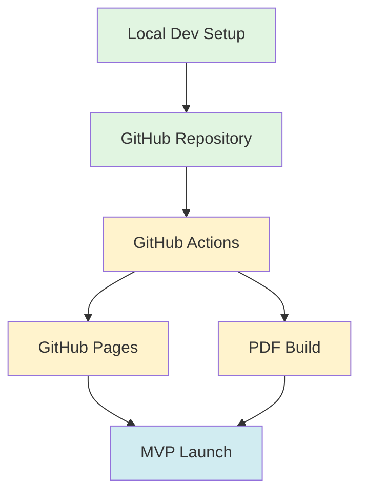
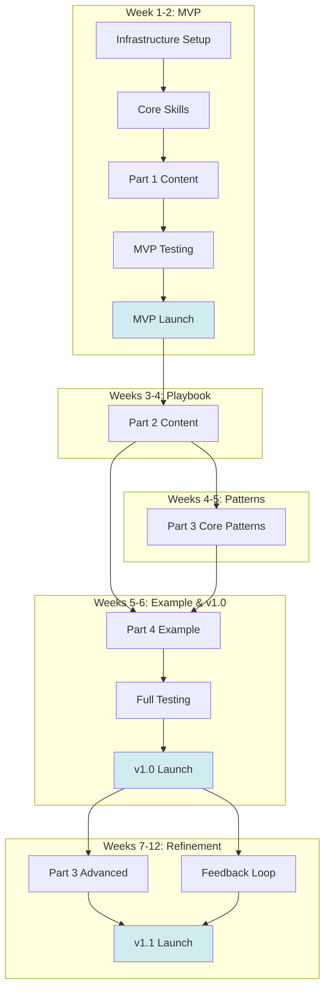

# Implementation Roadmap and MVP Plan

**Product**: The Agentic Coding Playbook: From Idea to Production in 6 Weeks
**Version**: 1.0
**Date**: 2025-12-19
**Purpose**: MVP roadmap, environment activation path, release phases, and timeline visualization

---

## Executive Summary

This plan defines the path from design completion to published book, with clear milestones for MVP (2 weeks), v1.0 (6 weeks), and v1.1+ (12 weeks). The book itself demonstrates the 6-week MVP process it teaches.

**Key Milestones**:
- **Week 2**: MVP - Part 1 complete, infrastructure live, initial publication
- **Week 6**: v1.0 - All 4 parts complete, full workflow demonstrated
- **Week 12**: v1.1 - Refinements, additional patterns, physical print ready

---

## MVP Scope Definition

### What is MVP? (2-Week Target)

**MVP Goal**: Demonstrate the agentic coding workflow with enough content to be valuable and publishable.

**MVP Includes**:
1. **Infrastructure (100%)**
   - GitHub repository with all structure
   - GitHub Pages live and accessible
   - GitHub Actions pipelines working (web + PDF)
   - Build scripts functional
   - Core Claude Code skills (chapter-template, mermaid-diagrams)

2. **Part 1: Foundations (100%)**
   - All 5 chapters complete and published
   - Renaissance Developer concept
   - Agentic coding definition
   - Architecture principles
   - Digestible interfaces
   - New bottlenecks

3. **Supporting Content (Minimum)**
   - Preface and introduction
   - README with navigation
   - Initial glossary (terms from Part 1)
   - Basic diagrams for Part 1

4. **Quality (Core)**
   - Link validation passing
   - PDF builds successfully
   - GitHub Pages accessible
   - Basic accessibility compliance

**MVP Deliberately Excludes** (deferred to v1.0):
- Parts 2, 3, 4 (playbook, patterns, example)
- Comprehensive glossary
- Advanced skills (EARS, glossary-entry)
- User testing
- Comprehensive accessibility testing

### Why This MVP Scope?

**Strategic Rationale**:
1. **Proves the concept**: Part 1 establishes the foundation and mindset
2. **Demonstrates infrastructure**: Shows the build/publish workflow works
3. **Builds accountability**: Public commitment with visible progress
4. **Enables feedback**: Early readers can validate approach
5. **Creates momentum**: Quick win motivates continued work
6. **Achievable in 2 weeks**: Realistic scope for solo author with AI assistance

**Value Proposition**:
- Readers get actionable foundation knowledge immediately
- Demonstrates agentic writing process in action
- Infrastructure proves the technical approach works
- Sets stage for rapid iteration to v1.0

---

## v1.0 Scope Definition

### What is v1.0? (6-Week Target)

**v1.0 Goal**: Complete the entire playbook from idea to production with all essential patterns.

**v1.0 Adds to MVP**:
1. **Part 2: Playbook (100%)**
   - All 11 chapters complete
   - Complete 6-week workflow documented
   - Spec-driven development explained
   - Environment progression defined
   - Agent management strategies

2. **Part 3: Patterns & Tools (Core 80%)**
   - Architecture patterns (component decomposition, bounded contexts, interfaces)
   - Specification patterns (EARS, OpenAPI, AsyncAPI, JSON Schema)
   - Testing patterns (testing AI code, test pyramid)
   - Toolchain (MCP servers, skills, code review, debugging)
   - **Deferred**: Advanced patterns (scalability, security, monitoring)

3. **Part 4: Complete Example (100%)**
   - Real 6-week project documented end-to-end
   - All phases shown: idea → brainstorm → brief → requirements → design → implementation → deployment
   - Validates 6-week timeline achievable
   - Demonstrates all key patterns

4. **Quality (Comprehensive)**
   - Full editorial review
   - User testing (vibecoders + CTOs)
   - Accessibility testing (WCAG AA)
   - Comprehensive link validation
   - Complete glossary
   - All diagrams polished

**v1.0 Target Metrics**:
- ~500-800 pages (PDF)
- ~75% of total planned content
- All MVP requirements (REQ-M007 through REQ-M012) met
- Ready for wide distribution and marketing

---

## v1.1+ Scope Definition

### What is v1.1? (12-Week Target)

**v1.1 Goal**: Refine based on feedback, add advanced patterns, prepare for physical print.

**v1.1 Adds to v1.0**:
1. **Part 3: Advanced Patterns (Remaining 20%)**
   - Scalability patterns
   - Security patterns for AI code
   - Performance optimization
   - Monitoring and observability
   - Documentation generation
   - Continuous delivery advanced patterns

2. **Additional Skills**
   - EARS requirements generator
   - Glossary entry generator
   - Additional diagram templates

3. **Community Refinements**
   - Incorporate v1.0 reader feedback
   - Clarify ambiguous sections
   - Add requested examples
   - Expand explanations where needed

4. **Physical Print**
   - Print-optimized formatting
   - Cover design
   - Print-on-demand setup
   - ISBN registration
   - Distribution channels

**v1.1 Target Metrics**:
- ~600-1000 pages (PDF)
- 100% of planned content
- Physical print available
- Strong community engagement
- Testimonials and case studies

---

## Environment Activation Path

### Environment Overview

Unlike traditional software with separate dev/test/staging/prod environments, this book project has a simplified environment progression:

| Environment | Purpose | Activation | Dependencies |
|-------------|---------|------------|--------------|
| **Local Dev** | Author writes content, previews locally | Immediate (Week 1) | VS Code, Claude Code, Pandoc, git |
| **GitHub Repo** | Source of truth, version control | Week 1, Day 1 | GitHub account, local dev working |
| **GitHub Actions** | Automated build and validation | Week 1, Day 2-3 | Repo exists, workflows committed |
| **GitHub Pages** | Web publication (staging + prod) | Week 1, Day 3-4 | Actions working, content exists |
| **GitHub Releases** | PDF distribution | Week 2, Day 5-7 | PDF build working, v0.1 tag |

### Activation Sequence

```
Week 1, Day 1: Local Dev → GitHub Repo
    ↓
Week 1, Day 2-3: GitHub Actions (CI/CD)
    ↓
Week 1, Day 3-4: GitHub Pages (Web Publishing)
    ↓
Week 2, Day 5-7: GitHub Releases (PDF Distribution)
    ↓
Week 2, Day 7: MVP LAUNCH 🚀
```

### Environment Milestones

**Milestone 1: Local Development Ready** (Day 1)
- [ ] Repository created
- [ ] Directory structure in place
- [ ] Local tools installed (VS Code, Claude Code, Pandoc, Node)
- [ ] Can write and preview Markdown locally

**Milestone 2: GitHub Infrastructure Live** (Day 1)
- [ ] Repository pushed to GitHub
- [ ] Issues and Discussions enabled
- [ ] Initial README and LICENSE committed
- [ ] Source of truth established

**Milestone 3: CI/CD Operational** (Day 2-3)
- [ ] All GitHub Actions workflows created
- [ ] Build scripts working
- [ ] Validation passing
- [ ] Automated deployment functioning

**Milestone 4: Web Publication Live** (Day 3-4)
- [ ] GitHub Pages configured
- [ ] First content deployed
- [ ] Website accessible
- [ ] Navigation working

**Milestone 5: PDF Distribution Ready** (Day 5-7)
- [ ] PDF build successful
- [ ] PDF < 50MB
- [ ] Quality acceptable
- [ ] Attached to releases

**Milestone 6: MVP Published** (Day 7)
- [ ] v0.1 release created
- [ ] Web and PDF both available
- [ ] Announcement posted
- [ ] Community engaged

### Environment Dependencies



---

## Release Phases and Feature Grouping

### Phase 1: Infrastructure Foundation (Week 1, Days 1-4)

**Goal**: Establish all technical infrastructure, automation, and high-impact skills.

**Tasks** (from tasks.md):
- INFRA-001: Repository structure
- INFRA-002: GitHub configuration
- INFRA-003: Local development
- INFRA-004: Build scripts
- INFRA-005: GitHub Actions
- INFRA-006: Styling and templates
- SKILL-001: Chapter template skill
- SKILL-002: Mermaid diagram skill (enhanced)
- SKILL-005: Frontmatter generator skill ⭐ (NEW - saves 6 hours)
- SKILL-006: Section scaffolder skill ⭐ (NEW - saves 4 hours)
- SKILL-007: Code formatter skill ⭐ (NEW - saves 10 hours)

**Deliverables**:
- ✅ Fully functional build and deployment pipeline
- ✅ Automated PDF and web generation
- ✅ 5 core Claude Code skills operational
- ✅ Skills provide 20+ hours of time savings for MVP

**Success Criteria**:
- Can commit → see deployed to Pages in < 5 minutes
- Can generate PDF locally and in CI
- Can create chapter scaffolds with skills
- Can auto-generate frontmatter for all chapters
- Can auto-format all code examples
- Skills tested and working end-to-end

**Time Investment**: ~6 hours to build new skills
**Time Saved**: ~20 hours during MVP content creation
**Net Gain**: ~14 hours

---

### Phase 2: Part 1 Content (Week 1 Day 5 - Week 2 Day 4)

**Goal**: Write and publish all Part 1: Foundations content.

**Tasks** (from tasks.md):
- P1-001: Preface and introduction
- P1-002: Renaissance Developer
- P1-003: What is Agentic Coding
- P1-004: Architecture Principles
- P1-005: Digestible Interfaces
- P1-006: New Bottlenecks
- P1-007: Part 1 review and polish
- SUPPORT-003: Part 1 diagrams
- SUPPORT-001: Glossary (Part 1 terms)

**Deliverables**:
- ✅ 5 complete chapters (Part 1)
- ✅ Preface and introduction
- ✅ All Part 1 diagrams
- ✅ Initial glossary

**Success Criteria**:
- Part 1 teaches foundations clearly
- Accessible to vibecoders
- Valuable to CTOs
- All diagrams render correctly

---

### Phase 3: MVP Testing and Launch (Week 2, Days 5-7)

**Goal**: Test, validate, and launch MVP to public.

**Tasks** (from tasks.md):
- TEST-001: Link validation
- TEST-002: Frontmatter validation
- TEST-003: Build and deployment testing
- SUPPORT-004: Generate TOC
- PUB-001: MVP release preparation
- PUB-002: Launch MVP

**Deliverables**:
- ✅ v0.1 release with Part 1 complete
- ✅ Web and PDF both available
- ✅ All validation passing
- ✅ Public announcement

**Success Criteria**:
- No broken links
- PDF builds and loads correctly
- GitHub Pages accessible
- Community channels active
- **2-WEEK MVP MILESTONE ACHIEVED** 🎉

---

### Phase 4: Part 2 Playbook (Weeks 3-4)

**Goal**: Complete the 6-week workflow playbook.

**Tasks** (from tasks.md):
- P2-001 through P2-011: All 11 playbook chapters
- P2-012: Part 2 review and polish
- SUPPORT-003: Part 2 diagrams

**Deliverables**:
- ✅ Complete Part 2: Playbook (11 chapters)
- ✅ Workflow diagrams
- ✅ Process templates and frameworks

**Success Criteria**:
- 6-week workflow completely documented
- Each phase actionable
- Examples from this book's planning/
- Links to Part 3 patterns established

---

### Phase 5: Part 3 Core Patterns (Weeks 4-5)

**Goal**: Document essential patterns and tools for agentic development.

**Tasks** (from tasks.md):
- P3-001 through P3-013: Core patterns (architecture, specs, testing, toolchain)
- P3-015: Part 3 core review
- SUPPORT-003: Part 3 diagrams

**Deliverables**:
- ✅ Architecture patterns (3 chapters)
- ✅ Specification patterns (4 chapters)
- ✅ Testing patterns (2 chapters)
- ✅ Toolchain patterns (4 chapters)
- ✅ Core pattern diagrams

**Success Criteria**:
- Patterns actionable and tested
- Examples clear
- Can serve as reference material
- Links back to Parts 1-2

---

### Phase 6: Part 4 Complete Example (Week 5-6)

**Goal**: Build and document real 6-week project example.

**Tasks** (from tasks.md):
- P4-001 through P4-010: Complete example documentation
- P4-011: Part 4 review and integration
- SUPPORT-003: Part 4 diagrams

**Deliverables**:
- ✅ Complete 6-week project documented
- ✅ All phases shown with artifacts
- ✅ Timeline validated
- ✅ Lessons learned captured

**Success Criteria**:
- 6-week achievability proven
- All patterns from Parts 1-3 demonstrated
- Real code and artifacts shown
- Integrated with other parts

---

### Phase 7: v1.0 Polish and Launch (Week 6)

**Goal**: Complete testing, refinement, and launch v1.0.

**Tasks** (from tasks.md):
- TEST-004: Accessibility testing
- TEST-005: User testing
- SUPPORT-001: Complete glossary
- SUPPORT-002: Conclusion
- SUPPORT-004: Final TOC generation
- PUB-003: Iteration planning
- PUB-004: v1.0 launch

**Deliverables**:
- ✅ v1.0 release with all 4 parts
- ✅ Complete glossary
- ✅ Conclusion chapter
- ✅ User testing feedback incorporated

**Success Criteria**:
- All v1.0 requirements met
- Accessibility validated
- User feedback positive
- **6-WEEK v1.0 MILESTONE ACHIEVED** 🎉

---

### Phase 8: v1.1 Refinement (Weeks 7-12)

**Goal**: Incorporate feedback, add advanced patterns, prepare print.

**Tasks** (from tasks.md):
- P3-016 through P3-025: Advanced Part 3 patterns
- SKILL-003: EARS requirements generator
- SKILL-004: Glossary entry generator
- SKILL-008: Pattern document template
- SKILL-009: Spec template generator (OpenAPI, AsyncAPI, JSON Schema)
- SKILL-010: Cross-reference suggester
- Community feedback incorporation
- PUB-005: Physical print preparation

**Deliverables**:
- ✅ v1.1 release with all patterns
- ✅ 5 additional advanced skills
- ✅ Feedback incorporated
- ✅ Physical print ready
- ✅ Complete skill suite (10 total skills)

**Success Criteria**:
- 100% of content complete
- Community engaged and satisfied
- Physical print available
- **12-WEEK v1.1 MILESTONE ACHIEVED** 🎉

---

## Gantt Chart: 12-Week Timeline

### Week-by-Week View

```
Phase/Task                                      | W1  | W2  | W3  | W4  | W5  | W6  | W7-12 |
================================================|=====|=====|=====|=====|=====|=====|=======|
PHASE 1: Infrastructure Foundation              |█████|     |     |     |     |     |       |
  INFRA-001 to INFRA-006                        |███  |     |     |     |     |     |       |
  SKILL-001, 002, 005, 006, 007 (5 skills)      |  ███|     |     |     |     |     |       |
                                                |     |     |     |     |     |     |       |
PHASE 2: Part 1 Content                         |  ███|█████|     |     |     |     |       |
  P1-001 to P1-007                              |  ███|████ |     |     |     |     |       |
  SUPPORT-003 (Part 1 diagrams)                 |     |  ██ |     |     |     |     |       |
  SUPPORT-001 (Glossary Part 1)                 |     |   █ |     |     |     |     |       |
                                                |     |     |     |     |     |     |       |
PHASE 3: MVP Testing and Launch                 |     |  ███|     |     |     |     |       |
  TEST-001 to TEST-003                          |     |  ██ |     |     |     |     |       |
  PUB-001, PUB-002 (MVP Launch)                 |     |   █ |     |     |     |     |       |
                                                |     |     |     |     |     |     |       |
MILESTONE: MVP LAUNCH 🚀                        |     | [v0.1]    |     |     |     |       |
================================================|=====|=====|=====|=====|=====|=====|=======|
PHASE 4: Part 2 Playbook                        |     |     |█████|█████|     |     |       |
  P2-001 to P2-012                              |     |     |█████|████ |     |     |       |
  SUPPORT-003 (Part 2 diagrams)                 |     |     |     |  ██ |     |     |       |
                                                |     |     |     |     |     |     |       |
PHASE 5: Part 3 Core Patterns                   |     |     |     |  ███|█████|     |       |
  P3-001 to P3-013, P3-015                      |     |     |     |  ███|████ |     |       |
  SUPPORT-003 (Part 3 diagrams)                 |     |     |     |     |  ██ |     |       |
                                                |     |     |     |     |     |     |       |
PHASE 6: Part 4 Complete Example                |     |     |     |     |  ███|█████|       |
  P4-001 to P4-011                              |     |     |     |     |  ███|████ |       |
  SUPPORT-003 (Part 4 diagrams)                 |     |     |     |     |     |  ██ |       |
                                                |     |     |     |     |     |     |       |
PHASE 7: v1.0 Polish and Launch                 |     |     |     |     |     |  ███|       |
  TEST-004, TEST-005                            |     |     |     |     |     |  ██ |       |
  SUPPORT-001, SUPPORT-002, SUPPORT-004         |     |     |     |     |     |   █ |       |
  PUB-003, PUB-004 (v1.0 Launch)                |     |     |     |     |     |   █ |       |
                                                |     |     |     |     |     |     |       |
MILESTONE: v1.0 COMPLETE 🎉                     |     |     |     |     |     | [v1.0]      |
================================================|=====|=====|=====|=====|=====|=====|=======|
PHASE 8: v1.1 Refinement                        |     |     |     |     |     |     |███████|
  P3-016 to P3-025 (Advanced patterns)          |     |     |     |     |     |     |█████  |
  SKILL-003, 004, 008, 009, 010 (5 skills)      |     |     |     |     |     |     |███    |
  Community feedback incorporation              |     |     |     |     |     |     |  ████ |
  PUB-005 (Physical print)                      |     |     |     |     |     |     |    ███|
                                                |     |     |     |     |     |     |       |
MILESTONE: v1.1 COMPLETE 🎉                     |     |     |     |     |     |     |  [v1.1]|
================================================|=====|=====|=====|=====|=====|=====|=======|

Legend:
█ = Active work
v0.1 = MVP release
v1.0 = Complete first pass
v1.1 = Refined with advanced content
```

### Critical Path

The **critical path** (tasks that directly impact final delivery date):

```
INFRA → Part 1 → MVP → Part 2 → Part 3 Core → Part 4 → v1.0 → v1.1
```

**Parallelization Opportunities**:
- Diagram creation can happen alongside writing
- Skills can be built as needed (just-in-time)
- Testing can start early and run continuously
- Community engagement can run throughout

**Bottleneck Identification**:
- **Content writing** is the primary bottleneck (author capacity)
- **AI assistance** (Claude Code) mitigates this significantly
- **Review and polish** can become bottleneck if perfectionism creeps in
  - *Mitigation*: MVP mindset, ship and iterate

---

## Dependency Map

### Task Dependencies (High-Level)



### Detailed Dependency Chain (First 6 Weeks)

1. **INFRA-001** (Repo setup) → Everything else depends on this
2. **INFRA-002, INFRA-003** (Config, Local dev) → Parallel after INFRA-001
3. **INFRA-004** (Build scripts) → After INFRA-003
4. **INFRA-005** (GitHub Actions) → After INFRA-004
5. **INFRA-006** (Styling) → After INFRA-001, parallel with others
6. **SKILL-001, SKILL-002** → After INFRA-003, parallel
7. **P1-001** (Preface) → After SKILL-001
8. **P1-002 through P1-006** → After P1-001, can be parallel
9. **P1-007** (Review) → After P1-002 through P1-006 complete
10. **TEST-001, TEST-002, TEST-003** → After P1-007
11. **PUB-001, PUB-002** (MVP launch) → After TEST-003
12. **P2-*** → After MVP launch (can start immediately)
13. **P3-*** → After P2 in progress (can overlap)
14. **P4-*** → After P2, P3 in progress (needs patterns to reference)
15. **TEST-004, TEST-005** → After all content complete
16. **PUB-004** (v1.0) → After all testing complete

---

## Risk Management and Contingencies

### Identified Risks

| Risk | Probability | Impact | Mitigation |
|------|-------------|--------|------------|
| **Scope creep** | High | High | Strict MVP boundaries, defer to v1.1 |
| **Time underestimation** | Medium | High | Buffer in each phase, adjust scope if needed |
| **Writer's block** | Medium | Medium | Claude Code assistance, chapter templates |
| **Technical issues (build)** | Low | Medium | Early infrastructure focus, test continuously |
| **Part 4 example too complex** | Medium | Medium | Select carefully in P4-001, adjust scope |
| **Quality concerns** | Medium | Medium | User testing, multiple review passes |

### Contingency Plans

**If Week 2 MVP at Risk**:
- **Reduce Part 1 scope**: Cut to 3 chapters instead of 5 (Renaissance Developer, Agentic Coding, one pattern)
- **Defer diagrams**: Ship without diagrams, add in v0.2
- **Accept imperfection**: MVP is about momentum, not perfection

**If Week 6 v1.0 at Risk**:
- **Reduce Part 3**: Cut to 5 core patterns instead of 13
- **Simplify Part 4**: Use simpler example project
- **Extend timeline**: Move to 8-week v1.0, but communicate clearly

**If Quality Issues**:
- **Additional review week**: Add Week 7 as polish week before v1.0
- **Community review**: Leverage early readers for feedback
- **Iterate in v1.1**: Accept v1.0 won't be perfect, improve in v1.1

---

## Success Metrics and Monitoring

### Leading Indicators (Weekly Tracking)

**Week 1-2 (MVP)**:
- [ ] Tasks completed (target: 20 tasks)
- [ ] Chapters written (target: 5 chapters Part 1)
- [ ] Infrastructure green (all builds passing)
- [ ] Daily commits (target: 5-7 days/week)

**Week 3-6 (v1.0)**:
- [ ] Tasks completed (target: 45 additional tasks)
- [ ] Chapters written (target: 30+ additional chapters)
- [ ] Test coverage (all validation passing)
- [ ] Weekly progress visible in tasks.md

**Week 7-12 (v1.1)**:
- [ ] Feedback response rate (< 7 days acknowledgment)
- [ ] Pattern completeness (all Part 3 patterns done)
- [ ] Community engagement (discussions, issues)
- [ ] Print preparation progress

### Lagging Indicators (Milestone Tracking)

**MVP (Week 2)**:
- [ ] v0.1 release published
- [ ] GitHub Pages live with Part 1
- [ ] PDF downloadable
- [ ] Announcement made, community active

**v1.0 (Week 6)**:
- [ ] v1.0 release published
- [ ] All 4 parts complete (40+ chapters)
- [ ] User testing completed
- [ ] Testimonials collected

**v1.1 (Week 12)**:
- [ ] v1.1 release published
- [ ] 100% planned content complete
- [ ] Physical print available
- [ ] Community thriving

### Real-Time Monitoring

**Dashboard** (tasks.md Progress Summary):
- Total tasks: ~81
- Completed: X
- In progress: Y
- Blocked: Z
- % Complete: X/81

**Velocity Tracking**:
- Tasks/week average
- Chapters/week average
- Trend analysis (accelerating/decelerating)

---

## Adjustment Process

### Weekly Review (Every Sunday)

1. **Review progress**: What got done, what didn't?
2. **Update tasks.md**: Mark completed tasks, adjust statuses
3. **Assess timeline**: On track for next milestone?
4. **Adjust scope**: If behind, what can be deferred?
5. **Communicate**: Update community on progress and changes

### Milestone Reviews (Week 2, 6, 12)

1. **Achievement validation**: Did we meet milestone criteria?
2. **Retrospective**: What worked well? What didn't?
3. **Lessons learned**: Document for future phases
4. **Next phase planning**: Confirm or adjust next phase scope
5. **Community communication**: Share results and next steps

### Scope Adjustment Authority

**Author has authority to**:
- Defer v1.1 content to v1.2
- Simplify examples or patterns
- Adjust timeline by +/- 1 week per phase
- Reprioritize tasks within phase

**Requires community communication**:
- Major scope cuts (entire parts)
- Timeline extensions > 2 weeks
- Quality compromises
- Changes to core value proposition

---

## Communication Plan

### Internal (Author)

- **Daily**: Commit to GitHub with descriptive messages
- **Weekly**: Update tasks.md Progress Summary
- **Milestones**: Update CHANGELOG.md with release notes

### External (Community)

- **Week 2 (MVP)**: Launch announcement (social media, relevant communities)
- **Weekly**: Progress updates in GitHub Discussions
- **Week 6 (v1.0)**: Launch announcement, marketing push
- **Week 12 (v1.1)**: Final announcement, case studies, testimonials

### Feedback Channels

- **GitHub Issues**: Bug reports, content suggestions
- **GitHub Discussions**: General conversation, questions
- **Surveys**: Post-read surveys for user testing
- **Direct**: Email or DM for sensitive feedback

---

## Conclusion

This MVP plan provides a clear roadmap from design to published book in 6 weeks, demonstrating the very workflow it teaches. The plan balances ambition with pragmatism, ensuring achievable milestones while maintaining quality.

**Key Success Factors**:
1. **Start immediately**: INFRA-001 is ready to go
2. **Ship early**: MVP at 2 weeks builds momentum
3. **Use the tools**: Claude Code and agentic coding throughout
4. **Iterate ruthlessly**: MVP → v1.0 → v1.1, each improving
5. **Stay accountable**: Public progress in tasks.md
6. **Engage community**: Build audience as you build book

**Next Action**: Begin implementation with INFRA-001 (Setup Repository Structure)

**The book demonstrates its own teaching by being built using the workflow it describes.** This is the ultimate validation of the agentic coding approach.

---

## Appendix: Quick Reference

### Key Dates

| Milestone | Target Date | Deliverable |
|-----------|-------------|-------------|
| Infrastructure Complete | Week 1, Day 3 | All build/deploy working |
| MVP Launch | Week 2, Day 7 | v0.1 with Part 1 |
| Part 2 Complete | Week 4, Day 7 | Playbook done |
| Part 3 Core Complete | Week 5, Day 7 | Essential patterns done |
| Part 4 Complete | Week 6, Day 5 | Example documented |
| v1.0 Launch | Week 6, Day 7 | Complete first pass |
| v1.1 Launch | Week 12, Day 7 | Refined, print-ready |

### Resource Links

- **Genesis Workflow**: genesis.md
- **Task List**: tasks.md
- **Requirements**: requirements.md
- **Design**: design.md
- **Product Brief**: brief.md

### Contact and Support

- **Repository**: [GitHub URL]
- **Issues**: [GitHub Issues URL]
- **Discussions**: [GitHub Discussions URL]
- **Author**: [Author contact]
